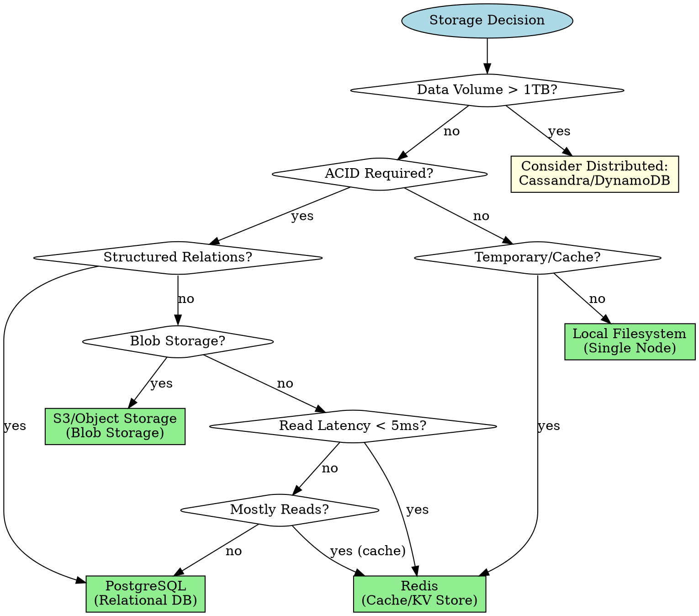
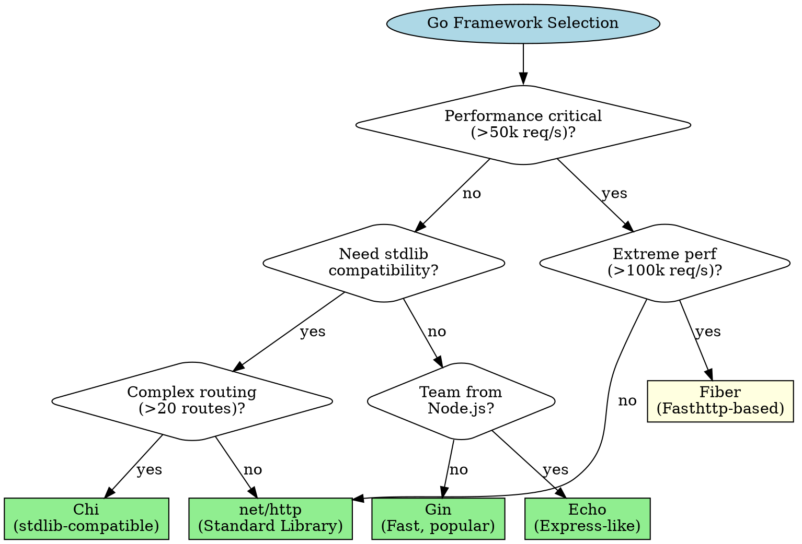
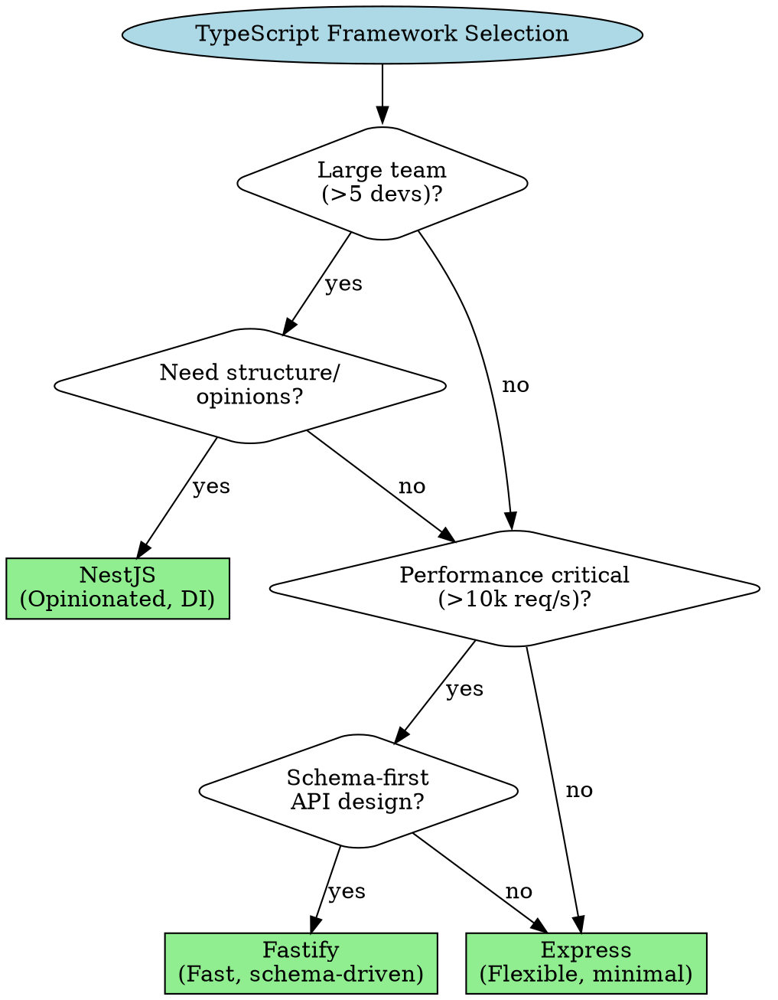
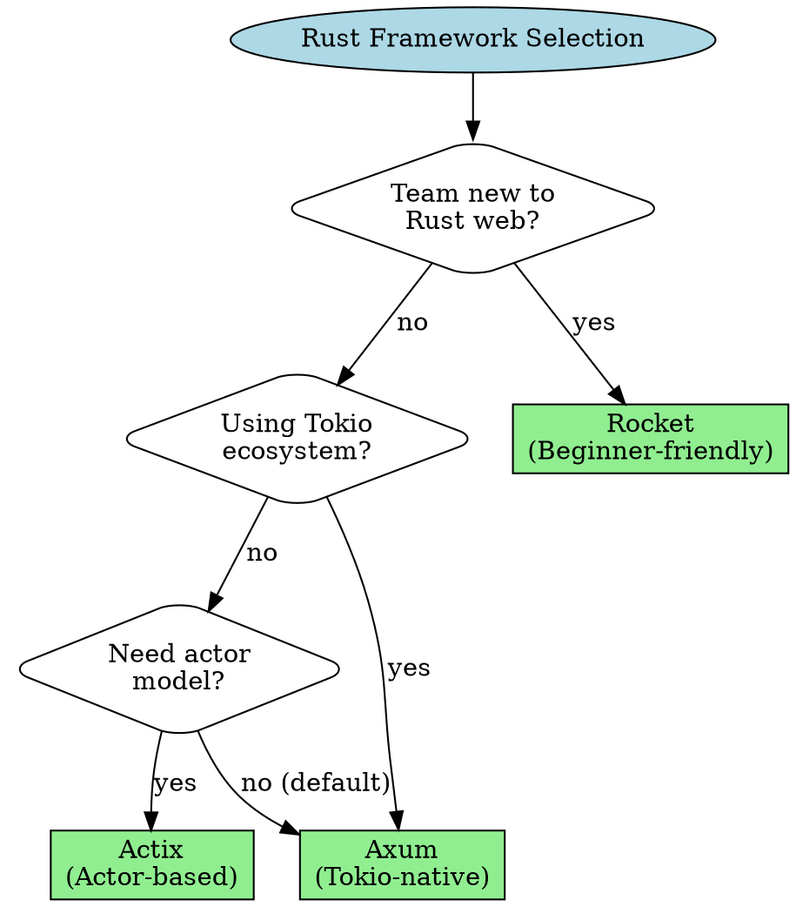
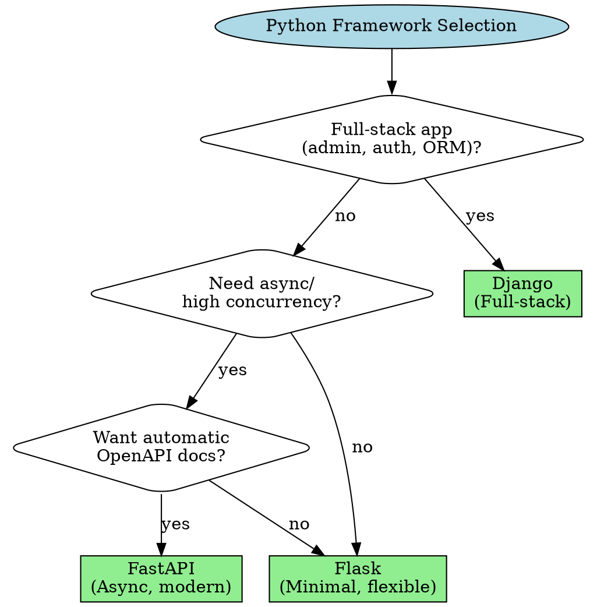
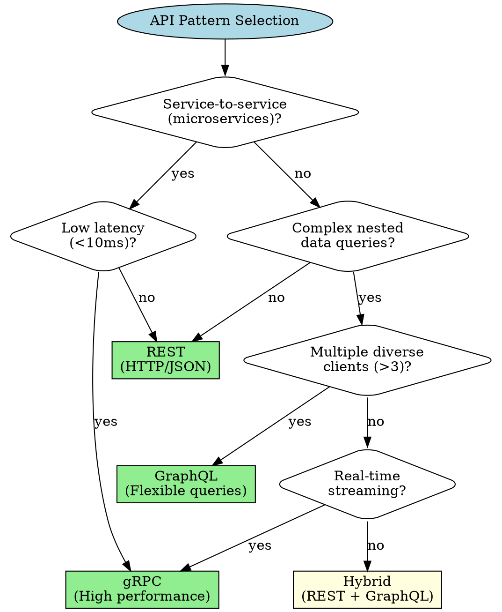

# Architect Decision Frameworks

**Purpose:** Technology and framework selection guidance for Systems Architect agent
**Last Updated:** 2026-02-14
**Maintainer:** Architect agent

## Overview

This library provides structured decision frameworks for technology selection, covering:
- Storage decisions (databases, caching, filesystems, cloud storage)
- Framework/library selection by language
- API design patterns (REST, GraphQL, gRPC)
- Data modeling approaches
- Integration patterns

Each decision framework includes:
- **Decision Criteria:** Weighted factors for evaluation
- **Decision Tree:** Visual flowchart with yes/no branches
- **Options Matrix:** Comparison table with trade-offs
- **Example Scenarios:** Concrete recommendations with reasoning

## Table of Contents

1. [Storage Decisions](#storage-decisions)
   - [Relational Databases](#relational-databases)
   - [Caching Solutions](#caching-solutions)
   - [Object Storage](#object-storage)
   - [Local Filesystem](#local-filesystem)
2. [Framework Selection](#framework-selection)
   - [Go Frameworks](#go-frameworks)
   - [TypeScript Frameworks](#typescript-frameworks)
   - [Rust Frameworks](#rust-frameworks)
   - [Python Frameworks](#python-frameworks)

---

## Storage Decisions

### Decision Framework

Use the following weighted criteria to evaluate storage options:

| Criterion | Weight | Definition | Thresholds |
|-----------|--------|------------|------------|
| **Data Volume** | High | Total size of data at rest | <10GB: Local/Embedded; 10GB-1TB: Single-node DB; >1TB: Distributed |
| **Consistency Requirements** | High | ACID vs eventual consistency | ACID: PostgreSQL/SQLite; Eventual: Redis/S3 |
| **Query Patterns** | High | How data is accessed | Key-value: Redis; Relations: PostgreSQL; Range: S3 |
| **Write Volume** | Medium | Writes per second | <100/s: Single-node; 100-10k/s: Replicated; >10k/s: Sharded |
| **Read Volume** | Medium | Reads per second | <1k/s: Direct DB; 1k-10k/s: Cache layer; >10k/s: CDN/Distributed |
| **Latency Requirements** | High | P99 response time | <5ms: In-memory; <50ms: Local DB; <500ms: Network DB; >500ms: Batch |
| **Durability Requirements** | Medium | Data loss tolerance | Critical: Multi-region replication; Important: Daily backups; Ephemeral: No backup |
| **Scalability Direction** | Medium | Vertical vs horizontal | Vertical: PostgreSQL; Horizontal: Redis Cluster, S3 |
| **Operational Complexity** | Low | Maintenance burden | Low: Managed services (RDS, ElastiCache); High: Self-hosted clusters |
| **Cost Sensitivity** | Low | Budget constraints | High: Postgres on EC2; Medium: RDS; Low: Aurora/DynamoDB |

**Decision Process:**
1. Identify primary access pattern (key-value, relational, blob)
2. Check data volume and consistency requirements (eliminates categories)
3. Evaluate latency and throughput needs (narrows options)
4. Consider operational constraints (selects specific implementation)

### Decision Tree



### Options Matrix

| Option | Best For | Pros | Cons | Languages | When to Avoid |
|--------|----------|------|------|-----------|---------------|
| **PostgreSQL** | Relational data, ACID, complex queries | Strong consistency, mature tooling, SQL standard, good performance <100k rows | Vertical scaling limits, complex replication, schema migrations | All (libpq bindings) | NoSQL patterns, >1TB unsharded, <5ms latency |
| **Redis** | Caching, session store, pub/sub, leaderboards | In-memory speed (<1ms), rich data structures, atomic ops, pub/sub | Memory-bound, no ACID (single-key), data loss on crash | All (RESP protocol) | Persistent storage, >100GB single instance, complex queries |
| **S3/Object Storage** | Files, backups, logs, static assets | Unlimited scale, durable (99.999999999%), cheap, CDN integration | High latency (50-200ms), eventual consistency, no indexing | All (HTTP API) | Low-latency access, transactional updates, frequent small writes |
| **Local Filesystem** | Logs, temp files, single-node apps, config | Simple, no network, portable, POSIX tools | Single node only, manual backup, no concurrency control | All (native APIs) | Distributed systems, data durability critical, concurrent writes |
| **SQLite** | Embedded apps, mobile, edge devices, testing | Zero-config, single file, ACID, lightweight | Single-writer limit, no network, limited concurrency | All (C library) | Multi-user apps, high write concurrency, >100GB databases |
| **MongoDB** | Document storage, flexible schema, nested data | Schema flexibility, horizontal scaling, aggregation pipeline | Weak consistency (default), complex sharding, large index overhead | All (BSON protocol) | ACID requirements, join-heavy queries, strong typing needed |

### Relational Databases

#### Decision Criteria (Relational)

Choose a relational database when:
- ✅ Data has structured relationships (foreign keys, joins)
- ✅ ACID transactions required (financial, inventory, user accounts)
- ✅ Complex query patterns (aggregations, analytics)
- ✅ Schema stability (well-defined entities)
- ✅ Data integrity critical (constraints, referential integrity)

Avoid when:
- ❌ Schema changes frequently (rapid prototyping)
- ❌ Horizontal scaling required (>1TB, >10k writes/sec)
- ❌ Key-value access only (no joins needed)
- ❌ Latency <5ms required (in-memory cache better)

#### PostgreSQL Implementation

**Strengths:**
- ACID compliance with MVCC (Multi-Version Concurrency Control)
- Advanced features: CTEs, window functions, full-text search, JSON support
- Strong type system with custom types
- Mature replication (streaming, logical)
- Excellent query optimizer

**Limitations:**
- Vertical scaling (single-writer primary)
- Complex sharding (requires application-level or extensions like Citus)
- Write-heavy workloads >10k/s require tuning or sharding

**Configuration Guidance:**

| Setting | Default | Recommended | Reasoning |
|---------|---------|-------------|-----------|
| `shared_buffers` | 128MB | 25% of RAM | Cache frequently accessed blocks |
| `work_mem` | 4MB | 64MB | Allow larger sort/hash operations |
| `maintenance_work_mem` | 64MB | 512MB | Speed up VACUUM, CREATE INDEX |
| `max_connections` | 100 | 200 | Handle connection pooling at app layer |
| `checkpoint_timeout` | 5min | 15min | Reduce checkpoint frequency |
| `effective_cache_size` | 4GB | 75% of RAM | Inform query planner of OS cache |

**Connection Pooling:**
- **Go:** `pgxpool` (native Go, best performance)
- **TypeScript:** `pg` + `pg-pool` (mature, widely used)
- **Rust:** `sqlx` + `deadpool` (async, compile-time SQL checking)
- **Python:** `psycopg3` + `psycopg_pool` (async support)

**Migration Tools:**
- **Go:** `golang-migrate/migrate` (CLI + library, version control)
- **TypeScript:** `node-pg-migrate` (pure JS, no ORM required)
- **Rust:** `sqlx-cli` (integrates with sqlx compile-time checks)
- **Python:** `alembic` (SQLAlchemy integration, autogenerate)

#### Example Scenarios (Relational)

**Scenario 1: E-commerce Order System**

**Context:**
- Data: Users, Products, Orders, OrderItems (relational)
- Volume: 10M users, 100M orders/year (275k/day, ~3 orders/sec peak)
- Queries: "Show user's orders", "Calculate daily revenue", "Find orders by product"
- Consistency: ACID required (payment processing)
- Latency: <100ms acceptable

**Recommendation:** PostgreSQL (single-node with read replicas)

**Reasoning:**
- Data volume (<1TB) fits single-node
- ACID critical for order/payment consistency
- Complex joins (orders → order_items → products)
- Write rate (3/s) well within PostgreSQL capacity
- Reads can scale with replicas (read-heavy pattern)

**Implementation:**
```sql
-- Schema design
CREATE TABLE users (
    id BIGSERIAL PRIMARY KEY,
    email VARCHAR(255) UNIQUE NOT NULL,
    created_at TIMESTAMPTZ DEFAULT NOW()
);

CREATE TABLE orders (
    id BIGSERIAL PRIMARY KEY,
    user_id BIGINT NOT NULL REFERENCES users(id),
    status VARCHAR(20) NOT NULL,
    total_cents BIGINT NOT NULL,
    created_at TIMESTAMPTZ DEFAULT NOW(),
    CONSTRAINT positive_total CHECK (total_cents > 0)
);

CREATE INDEX idx_orders_user_created ON orders(user_id, created_at DESC);

-- Transaction example (Go)
tx, err := db.BeginTx(ctx, nil)
if err != nil {
    return err
}
defer tx.Rollback()

// Create order
orderID, err := createOrder(ctx, tx, userID, totalCents)
if err != nil {
    return err
}

// Create order items
for _, item := range items {
    if err := createOrderItem(ctx, tx, orderID, item); err != nil {
        return err
    }
}

return tx.Commit()
```

**Scaling Path:**
1. Start: Single PostgreSQL instance
2. 10k orders/day: Add read replicas for analytics queries
3. 100k orders/day: Partition orders table by date (`created_at`)
4. 1M orders/day: Shard by `user_id` (application-level or Citus)

---

**Scenario 2: Analytics Dashboard (Read-Heavy)**

**Context:**
- Data: Time-series metrics, aggregated by day/hour
- Volume: 10M rows/day (~100 writes/sec), 10B rows total (2TB)
- Queries: "Revenue by day", "Top products", "User cohort analysis"
- Consistency: Eventual OK (analytics lag acceptable)
- Latency: <1s acceptable for dashboards

**Recommendation:** PostgreSQL with TimescaleDB extension + Redis cache

**Reasoning:**
- Time-series data benefits from TimescaleDB (automatic partitioning)
- Aggregation queries complex (need SQL)
- Read-heavy pattern (100:1 read:write) → cache layer
- 2TB fits TimescaleDB with compression
- Redis cache hot queries (<1s → <50ms)

**Implementation:**
```sql
-- TimescaleDB hypertable
CREATE TABLE metrics (
    time TIMESTAMPTZ NOT NULL,
    metric_name TEXT NOT NULL,
    value DOUBLE PRECISION NOT NULL,
    tags JSONB
);

SELECT create_hypertable('metrics', 'time');

-- Continuous aggregate (materialized view)
CREATE MATERIALIZED VIEW daily_revenue
WITH (timescaledb.continuous) AS
SELECT
    time_bucket('1 day', time) AS day,
    SUM(value) AS total_revenue
FROM metrics
WHERE metric_name = 'order_revenue'
GROUP BY day;

-- Refresh policy (automatic)
SELECT add_continuous_aggregate_policy('daily_revenue',
    start_offset => INTERVAL '1 month',
    end_offset => INTERVAL '1 hour',
    schedule_interval => INTERVAL '1 hour'
);
```

**Caching Strategy (Go):**
```go
// Cache-Aside pattern
func GetDailyRevenue(ctx context.Context, date time.Time) (float64, error) {
    cacheKey := fmt.Sprintf("revenue:%s", date.Format("2006-01-02"))

    // Try cache first
    cached, err := redisClient.Get(ctx, cacheKey).Float64()
    if err == nil {
        return cached, nil
    }

    // Cache miss, query database
    var revenue float64
    err = db.QueryRowContext(ctx, `
        SELECT total_revenue FROM daily_revenue WHERE day = $1
    `, date).Scan(&revenue)
    if err != nil {
        return 0, err
    }

    // Populate cache (TTL 1 hour)
    _ = redisClient.Set(ctx, cacheKey, revenue, time.Hour)

    return revenue, nil
}
```

**Scaling Path:**
1. Start: PostgreSQL + TimescaleDB
2. Slow queries: Add Redis cache for hot data (last 7 days)
3. High query load: Add PostgreSQL read replicas
4. Very large dataset (>10TB): Consider ClickHouse (columnar, faster aggregations)

---

### Caching Solutions

#### Decision Criteria (Caching)

Choose a caching solution when:
- ✅ Read-heavy workload (10:1 or higher read:write ratio)
- ✅ Latency requirements <10ms
- ✅ Data access follows 80/20 rule (hot data subset)
- ✅ Tolerance for cache misses (can regenerate from source)
- ✅ Data size fits in memory (or can be tiered)

Avoid when:
- ❌ Strong consistency required (cache invalidation is hard)
- ❌ Write-heavy workload (cache thrashing)
- ❌ Uniform data access (no hot subset)
- ❌ Data too large for memory (>100GB per node without sharding)

#### Redis Implementation

**Strengths:**
- In-memory performance (<1ms latency)
- Rich data structures (strings, hashes, lists, sets, sorted sets, streams)
- Atomic operations (INCR, GETSET, etc.)
- Pub/Sub messaging
- Lua scripting for complex operations
- Persistence options (RDB snapshots, AOF log)

**Limitations:**
- Memory-bound (cost scales with data size)
- Single-threaded (CPU bound for compute-heavy operations)
- No ACID across multiple keys
- Replication is asynchronous (potential data loss)

**Data Structures Guide:**

| Structure | Use Case | Example | Commands |
|-----------|----------|---------|----------|
| **String** | Simple values, counters, flags | Session tokens, feature flags | GET, SET, INCR, EXPIRE |
| **Hash** | Objects, entities | User profile, product details | HGET, HSET, HMGET, HINCRBY |
| **List** | Queues, recent items, activity feeds | Job queue, chat messages | LPUSH, RPOP, LRANGE, LTRIM |
| **Set** | Unique items, membership | Tags, user interests | SADD, SISMEMBER, SINTER, SUNION |
| **Sorted Set** | Leaderboards, priority queues | Game scores, trending posts | ZADD, ZRANGE, ZRANK, ZINCRBY |
| **Stream** | Event log, time-series | Audit log, sensor data | XADD, XREAD, XGROUP |

**Cache Patterns:**

**1. Cache-Aside (Lazy Loading)**

Application checks cache first, loads from DB on miss, populates cache.

```go
// Go implementation
func GetUser(ctx context.Context, userID int64) (*User, error) {
    cacheKey := fmt.Sprintf("user:%d", userID)

    // Try cache
    var user User
    cached, err := redis.Get(ctx, cacheKey).Result()
    if err == nil {
        if err := json.Unmarshal([]byte(cached), &user); err == nil {
            return &user, nil
        }
    }

    // Cache miss, load from DB
    err = db.QueryRowContext(ctx, "SELECT * FROM users WHERE id = $1", userID).Scan(&user)
    if err != nil {
        return nil, err
    }

    // Populate cache (TTL 5 minutes)
    userJSON, _ := json.Marshal(user)
    _ = redis.Set(ctx, cacheKey, userJSON, 5*time.Minute)

    return &user, nil
}
```

**Pros:** Simple, cache only what's accessed, handles failures gracefully
**Cons:** Cache miss penalty, stale data possible, thundering herd on cold start

**2. Write-Through**

Application writes to cache and DB together (synchronously).

```typescript
// TypeScript implementation
async function updateUser(userId: number, updates: Partial<User>): Promise<void> {
    const cacheKey = `user:${userId}`;

    // Update DB
    await db.query('UPDATE users SET name = $1 WHERE id = $2', [updates.name, userId]);

    // Update cache
    const user = await db.query('SELECT * FROM users WHERE id = $1', [userId]);
    await redis.set(cacheKey, JSON.stringify(user.rows[0]), 'EX', 300);
}
```

**Pros:** Cache always consistent with DB, no cache misses on reads
**Cons:** Write latency increased, wasted cache space (may not be read)

**3. Write-Behind (Write-Back)**

Application writes to cache immediately, asynchronously writes to DB.

```go
// Go implementation with buffered channel
type WriteBackCache struct {
    redis *redis.Client
    db    *sql.DB
    queue chan *Update
}

func (c *WriteBackCache) UpdateUser(ctx context.Context, userID int64, name string) error {
    cacheKey := fmt.Sprintf("user:%d", userID)

    // Update cache immediately
    user := &User{ID: userID, Name: name}
    userJSON, _ := json.Marshal(user)
    if err := c.redis.Set(ctx, cacheKey, userJSON, 5*time.Minute).Err(); err != nil {
        return err
    }

    // Queue DB write
    c.queue <- &Update{UserID: userID, Name: name}

    return nil
}

func (c *WriteBackCache) flushWorker(ctx context.Context) {
    for update := range c.queue {
        _, _ = c.db.ExecContext(ctx, "UPDATE users SET name = $1 WHERE id = $2",
            update.Name, update.UserID)
    }
}
```

**Pros:** Low write latency, can batch DB writes
**Cons:** Data loss risk if cache fails before DB write, complex error handling

**Cache Invalidation Strategies:**

| Strategy | Trigger | Pros | Cons | Best For |
|----------|---------|------|------|----------|
| **TTL** | Time expires | Simple, automatic | Stale data before expiry, arbitrary timeout | Acceptable staleness |
| **Event-driven** | Write event | Fresh data, precise | Complex, distributed coordination | Strong consistency needed |
| **Version-based** | Version mismatch | Granular, handles races | Extra metadata, comparison overhead | Concurrent writes |
| **Cache warming** | Proactive load | No cold start | Wasted effort if not accessed | Predictable access patterns |

#### Example Scenarios (Caching)

**Scenario 1: API Rate Limiting**

**Context:**
- Requirement: 1000 requests/hour per API key
- Volume: 10k API keys, 100k requests/sec total
- Latency: <1ms overhead acceptable
- Consistency: Strict (no over-limit allowed)

**Recommendation:** Redis with sliding window counter

**Reasoning:**
- Extremely low latency required (<1ms) → in-memory
- Atomic operations needed → Redis INCR, EXPIRE
- Simple key-value access pattern
- Ephemeral data (1-hour window)

**Implementation (Rust):**
```rust
use redis::Commands;

fn check_rate_limit(
    conn: &mut redis::Connection,
    api_key: &str,
    limit: u32,
) -> Result<bool, redis::RedisError> {
    let key = format!("ratelimit:{}:{}", api_key, current_hour());

    let count: u32 = conn.incr(&key, 1)?;

    if count == 1 {
        // First request this hour, set expiry
        conn.expire(&key, 3600)?;
    }

    Ok(count <= limit)
}

fn current_hour() -> String {
    chrono::Utc::now().format("%Y%m%d%H").to_string()
}
```

**Scaling:**
- Single Redis instance handles 100k/s easily
- Add Redis Cluster if >1M API keys (shard by key)
- Use Lua script for more complex sliding window logic

---

**Scenario 2: Session Store**

**Context:**
- Requirement: Store user sessions (auth tokens, preferences)
- Volume: 100k active users, 1MB session data per user (100GB total)
- Latency: <10ms
- Duration: 24-hour session timeout
- Consistency: Eventual OK (slight lag acceptable)

**Recommendation:** Redis with Hash data structure

**Reasoning:**
- Fast access required (<10ms) → Redis
- Structured data (multiple fields) → Hash structure
- Built-in TTL for session expiry
- 100GB fits Redis memory (or shard across cluster)

**Implementation (Python):**
```python
import redis
import json

class SessionStore:
    def __init__(self, redis_client: redis.Redis):
        self.redis = redis_client
        self.ttl = 86400  # 24 hours

    def create_session(self, user_id: int, data: dict) -> str:
        session_id = generate_session_id()
        key = f"session:{session_id}"

        # Store as hash (allows partial updates)
        self.redis.hset(key, mapping={
            'user_id': user_id,
            'data': json.dumps(data),
            'created_at': time.time()
        })
        self.redis.expire(key, self.ttl)

        return session_id

    def get_session(self, session_id: str) -> dict:
        key = f"session:{session_id}"
        session = self.redis.hgetall(key)

        if not session:
            raise SessionNotFound()

        # Refresh TTL on access (sliding expiration)
        self.redis.expire(key, self.ttl)

        return {
            'user_id': int(session[b'user_id']),
            'data': json.loads(session[b'data'])
        }

    def delete_session(self, session_id: str):
        self.redis.delete(f"session:{session_id}")
```

**Scaling:**
- 100GB: Single Redis instance (use `maxmemory-policy allkeys-lru`)
- >100GB: Redis Cluster (shard by session_id)
- High availability: Redis Sentinel (automatic failover)

---

### Object Storage

#### Decision Criteria (Object Storage)

Choose object storage (S3, GCS, Azure Blob) when:
- ✅ Blob data (files, images, videos, logs, backups)
- ✅ Large objects (>1MB) or vast quantity (millions of objects)
- ✅ Immutable or infrequently updated (write-once-read-many)
- ✅ Durability critical (99.999999999% = "11 9s")
- ✅ Cost-sensitive (much cheaper than block storage)
- ✅ CDN integration needed (static assets, downloads)

Avoid when:
- ❌ Low latency required (<50ms) → cache or local storage
- ❌ Frequent small updates (overhead per request)
- ❌ Transactional consistency needed (S3 is eventually consistent)
- ❌ File locking or concurrent writes required

#### S3 Implementation

**Strengths:**
- Virtually unlimited scale (exabytes)
- High durability (11 9s) with multi-AZ replication
- Lifecycle policies (automatic archival, deletion)
- Versioning support
- Event notifications (Lambda triggers)
- Storage classes (Standard, IA, Glacier) for cost optimization

**Limitations:**
- High latency (50-200ms) compared to local/DB
- Eventual consistency (though much improved)
- Cost per request (GET, PUT charges)
- No POSIX semantics (not a filesystem)

**Access Patterns:**

| Pattern | Use Case | Implementation |
|---------|----------|----------------|
| **Direct Upload** | User uploads file | Pre-signed URL (no backend proxy) |
| **Proxied Upload** | Validation needed | Backend receives, validates, uploads |
| **Streaming Upload** | Large files | Multipart upload (parallel chunks) |
| **Batch Processing** | ETL, logs | S3 Select (query CSV/JSON without download) |
| **Static Hosting** | Website, assets | S3 + CloudFront CDN |

**Storage Class Selection:**

| Class | Retrieval | Cost | Use Case |
|-------|-----------|------|----------|
| **S3 Standard** | Instant | $0.023/GB | Frequently accessed (>1/month) |
| **S3 IA** | Instant | $0.0125/GB | Infrequent (1/month - 1/quarter) |
| **S3 Glacier** | Minutes-hours | $0.004/GB | Archive (rarely accessed) |
| **S3 Glacier Deep** | 12 hours | $0.00099/GB | Compliance, long-term backup |

**Lifecycle Policy Example:**

```json
{
  "Rules": [{
    "Id": "Lifecycle logs",
    "Status": "Enabled",
    "Filter": {"Prefix": "logs/"},
    "Transitions": [
      {"Days": 30, "StorageClass": "STANDARD_IA"},
      {"Days": 90, "StorageClass": "GLACIER"}
    ],
    "Expiration": {"Days": 365}
  }]
}
```

#### Example Scenarios (Object Storage)

**Scenario 1: Image Upload Service**

**Context:**
- Requirement: Users upload profile pictures (max 10MB)
- Volume: 1M users, 50k uploads/day
- Access: Frequent (profile view, feed)
- Processing: Resize to thumbnails (100x100, 500x500)

**Recommendation:** S3 Standard + CloudFront CDN + Lambda resize

**Reasoning:**
- Blob storage (images) → S3
- Frequent access → Standard class + CDN
- Direct upload reduces backend load → Pre-signed URLs
- Processing → Lambda trigger on upload

**Implementation (Go):**
```go
// Generate pre-signed upload URL (backend)
func GenerateUploadURL(ctx context.Context, userID int64, filename string) (string, error) {
    s3Client := s3.NewFromConfig(awsConfig)
    presignClient := s3.NewPresignClient(s3Client)

    key := fmt.Sprintf("uploads/%d/%s", userID, filename)

    request, err := presignClient.PresignPutObject(ctx, &s3.PutObjectInput{
        Bucket: aws.String("profile-pictures"),
        Key:    aws.String(key),
        ContentType: aws.String("image/jpeg"),
    }, func(opts *s3.PresignOptions) {
        opts.Expires = 15 * time.Minute
    })
    if err != nil {
        return "", err
    }

    return request.URL, nil
}

// Lambda function: Resize on upload
func handleS3Event(ctx context.Context, event events.S3Event) error {
    for _, record := range event.Records {
        bucket := record.S3.Bucket.Name
        key := record.S3.Object.Key

        // Download original
        original, err := downloadImage(ctx, bucket, key)
        if err != nil {
            return err
        }

        // Resize
        thumbnail := resizeImage(original, 100, 100)

        // Upload thumbnail
        thumbnailKey := strings.Replace(key, "uploads/", "thumbnails/", 1)
        if err := uploadImage(ctx, bucket, thumbnailKey, thumbnail); err != nil {
            return err
        }
    }
    return nil
}
```

**Frontend (Direct Upload with Pre-signed URL):**
```typescript
// TypeScript: Get pre-signed URL from backend
async function uploadProfilePicture(file: File): Promise<void> {
    // 1. Get pre-signed URL
    const response = await fetch('/api/upload-url', {
        method: 'POST',
        body: JSON.stringify({ filename: file.name })
    });
    const { uploadUrl, fileUrl } = await response.json();

    // 2. Upload directly to S3
    await fetch(uploadUrl, {
        method: 'PUT',
        body: file,
        headers: { 'Content-Type': file.type }
    });

    // 3. Update user profile with fileUrl
    await updateProfile({ profilePicture: fileUrl });
}
```

**Cost Optimization:**
- Lifecycle: Move to S3 IA after 90 days if not accessed
- CloudFront: Cache at edge (reduce S3 GET requests)
- Compression: Use WebP format (smaller files)

---

**Scenario 2: Application Logs Storage**

**Context:**
- Requirement: Store application logs for debugging and compliance
- Volume: 100GB/day (36TB/year)
- Access: Frequent (last 7 days), rare (older)
- Retention: 1 year for compliance
- Query: Occasionally search logs by timestamp or error message

**Recommendation:** S3 with lifecycle policy + S3 Select for queries

**Reasoning:**
- Large volume (36TB/year) → S3 (cheaper than DB)
- Access pattern: hot (7 days) + cold (archive)
- Lifecycle automates cost optimization
- S3 Select enables querying without downloading

**Implementation (Rust):**
```rust
use aws_sdk_s3::{Client, types::*};
use chrono::Utc;

// Upload logs in batches (every 5 minutes)
async fn upload_logs(
    client: &Client,
    logs: Vec<LogEntry>,
) -> Result<(), aws_sdk_s3::Error> {
    let date = Utc::now().format("%Y/%m/%d").to_string();
    let timestamp = Utc::now().timestamp();
    let key = format!("logs/{}/{}.json", date, timestamp);

    let json = serde_json::to_string(&logs).unwrap();

    client.put_object()
        .bucket("application-logs")
        .key(&key)
        .body(json.into_bytes().into())
        .content_type("application/json")
        .send()
        .await?;

    Ok(())
}

// Query logs using S3 Select
async fn query_error_logs(
    client: &Client,
    date: &str,
) -> Result<Vec<LogEntry>, aws_sdk_s3::Error> {
    let key = format!("logs/{}/", date);

    let result = client.select_object_content()
        .bucket("application-logs")
        .key(&key)
        .expression("SELECT * FROM S3Object[*] s WHERE s.level = 'ERROR'")
        .expression_type(ExpressionType::Sql)
        .input_serialization(
            InputSerialization::builder()
                .json(JsonInput::builder().r#type(JsonType::Lines).build())
                .build()
        )
        .output_serialization(
            OutputSerialization::builder()
                .json(JsonOutput::builder().build())
                .build()
        )
        .send()
        .await?;

    // Parse results...
    Ok(vec![])
}
```

**Lifecycle Policy:**
```json
{
  "Rules": [{
    "Id": "Logs lifecycle",
    "Status": "Enabled",
    "Filter": {"Prefix": "logs/"},
    "Transitions": [
      {"Days": 7, "StorageClass": "STANDARD_IA"},
      {"Days": 30, "StorageClass": "GLACIER_IR"}
    ],
    "Expiration": {"Days": 365}
  }]
}
```

**Cost Analysis:**
- Standard (7 days): 700GB × $0.023 = $16/month
- IA (23 days): 2.3TB × $0.0125 = $29/month
- Glacier (11 months): 33TB × $0.004 = $132/month
- **Total: ~$177/month for 36TB**
- Compare: EBS (36TB) = $3,600/month (20x more expensive)

---

### Local Filesystem

#### Decision Criteria (Filesystem)

Choose local filesystem storage when:
- ✅ Single-node application (no distribution needed)
- ✅ Temporary data (caches, build artifacts, session files)
- ✅ Config files, application state
- ✅ High I/O throughput required (local disk > network)
- ✅ POSIX semantics needed (file locking, permissions)

Avoid when:
- ❌ Distributed system (multiple nodes)
- ❌ Durability critical (disk failure = data loss)
- ❌ Concurrent access from multiple processes (race conditions)
- ❌ Data needs to outlive node lifecycle (ephemeral nodes)

#### Implementation Guidance

**Directory Structure Best Practices:**

```
/var/lib/myapp/          # Application data (persistent)
├── data/                # Database files, user data
├── logs/                # Application logs
└── cache/               # Cached data (can be deleted)

/etc/myapp/              # Configuration files
├── config.yaml
└── secrets/             # Sensitive config (0600 permissions)
    └── api-key.txt

/tmp/myapp/              # Temporary files (cleared on reboot)
└── uploads/             # Temporary file uploads
```

**File Permissions:**

| Path | Permissions | Owner | Reasoning |
|------|-------------|-------|-----------|
| `/etc/myapp/config.yaml` | 0644 | root:root | Readable by all, writable by root |
| `/etc/myapp/secrets/` | 0600 | myapp:myapp | Only app user can read |
| `/var/lib/myapp/data/` | 0700 | myapp:myapp | Exclusive access to data dir |
| `/var/lib/myapp/logs/` | 0755 | myapp:myapp | Logs readable by monitoring |
| `/tmp/myapp/` | 0700 | myapp:myapp | Temp files, exclusive access |

**Concurrent Access Handling:**

**1. File Locking (for single-writer scenarios)**

```go
// Go: Exclusive file lock using flock
func writeWithLock(filename string, data []byte) error {
    file, err := os.OpenFile(filename, os.O_RDWR|os.O_CREATE, 0644)
    if err != nil {
        return err
    }
    defer file.Close()

    // Acquire exclusive lock (blocks until available)
    if err := syscall.Flock(int(file.Fd()), syscall.LOCK_EX); err != nil {
        return err
    }
    defer syscall.Flock(int(file.Fd()), syscall.LOCK_UN)

    // Truncate and write
    if err := file.Truncate(0); err != nil {
        return err
    }
    _, err = file.Write(data)
    return err
}
```

**2. Atomic Writes (for concurrent readers/writers)**

```typescript
// TypeScript: Atomic write using rename
import fs from 'fs/promises';
import path from 'path';

async function atomicWrite(filename: string, data: string): Promise<void> {
    const tempFile = `${filename}.tmp.${Date.now()}`;

    try {
        // Write to temp file
        await fs.writeFile(tempFile, data, 'utf-8');

        // Atomic rename (overwrites destination)
        await fs.rename(tempFile, filename);
    } catch (err) {
        // Cleanup temp file on error
        await fs.unlink(tempFile).catch(() => {});
        throw err;
    }
}
```

**3. Append-Only Logs (for concurrent writers)**

```rust
// Rust: Append-only log file (safe for concurrent writers)
use std::fs::OpenOptions;
use std::io::Write;

fn append_log(filename: &str, message: &str) -> std::io::Result<()> {
    let mut file = OpenOptions::new()
        .create(true)
        .append(true)  // O_APPEND ensures atomic appends
        .open(filename)?;

    writeln!(file, "{}", message)?;
    Ok(())
}
```

#### Example Scenarios (Filesystem)

**Scenario 1: Build Cache**

**Context:**
- Requirement: Cache compiled artifacts to speed up builds
- Volume: 5GB per project, 10 projects (50GB total)
- Access: Read-heavy (every build), write on changes
- Lifecycle: Can be deleted and regenerated

**Recommendation:** Local filesystem with XDG Base Directory structure

**Implementation:**
```bash
# Directory structure
$HOME/.cache/mybuilder/
├── project1/
│   ├── compiled/
│   └── metadata.json
└── project2/
    ├── compiled/
    └── metadata.json

# Cleanup script (remove caches >30 days old)
find "$HOME/.cache/mybuilder" -type f -mtime +30 -delete
```

**Benefits:**
- Fast local disk access (no network latency)
- XDG standard (user-specific, no conflicts)
- Easy to clear (`rm -rf ~/.cache/mybuilder`)

---

**Scenario 2: SQLite Embedded Database**

**Context:**
- Requirement: Local-first app with offline support
- Volume: <1GB per user
- Access: ACID transactions, complex queries
- Distribution: Single user, single device

**Recommendation:** SQLite with WAL mode

**Implementation (Python):**
```python
import sqlite3
from pathlib import Path

class LocalDatabase:
    def __init__(self, user_id: int):
        db_dir = Path.home() / '.local' / 'share' / 'myapp'
        db_dir.mkdir(parents=True, exist_ok=True)

        db_path = db_dir / f'{user_id}.db'
        self.conn = sqlite3.connect(str(db_path))

        # Enable WAL mode (better concurrency)
        self.conn.execute('PRAGMA journal_mode=WAL')

        # Performance tuning
        self.conn.execute('PRAGMA synchronous=NORMAL')
        self.conn.execute('PRAGMA cache_size=-64000')  # 64MB cache

    def migrate(self):
        self.conn.execute('''
            CREATE TABLE IF NOT EXISTS notes (
                id INTEGER PRIMARY KEY,
                title TEXT NOT NULL,
                content TEXT,
                created_at TIMESTAMP DEFAULT CURRENT_TIMESTAMP
            )
        ''')
        self.conn.commit()
```

**Benefits:**
- Zero-config (no server setup)
- ACID transactions
- Full SQL support
- Single file (easy backup)

**Limitations:**
- Single-writer (only one process can write at a time)
- Not suitable for multi-user apps
- Max DB size ~281TB (practical limit ~1TB)

---

## Summary Decision Table

**Quick Reference: Which storage solution?**

| Access Pattern | Data Size | Latency | Consistency | Recommendation |
|----------------|-----------|---------|-------------|----------------|
| Relational queries | <1TB | <100ms | ACID | **PostgreSQL** |
| Key-value, read-heavy | <100GB | <5ms | Eventual | **Redis cache** + DB |
| Key-value, write-heavy | <1TB | <100ms | ACID | **PostgreSQL** (indexed) |
| Blobs (files, images) | Any | 50-200ms | Eventual | **S3** + CloudFront |
| Time-series metrics | <10TB | <1s | Eventual | **PostgreSQL + TimescaleDB** |
| Logs, backups | Any | Minutes | Eventual | **S3** with lifecycle |
| Session store | <100GB | <10ms | Eventual | **Redis** (Hash) |
| Full-text search | <1TB | <100ms | Eventual | **PostgreSQL** (GIN) or **Elasticsearch** |
| Single-node app | <1GB | <1ms | ACID | **SQLite** (embedded) |
| Temp files, cache | Any | <1ms | None | **Local filesystem** |

---

## Framework Selection

### Decision Criteria

When selecting a web framework or HTTP library, evaluate against these weighted criteria:

| Criterion | Weight | Definition | Considerations |
|-----------|--------|------------|----------------|
| **Performance** | High | Throughput (requests/sec) and latency (p99) | Framework overhead matters at >10k req/s; stdlib often fastest |
| **Ecosystem Maturity** | High | Middleware availability, community size, maintenance | Mature ecosystems reduce development time (auth, validation, logging) |
| **Learning Curve** | Medium | Time to productivity for team | Balance feature richness with simplicity; consider team experience |
| **Use Case Fit** | High | API type (REST, GraphQL, microservices) | Heavy frameworks (Django, NestJS) suit full-stack; light (Flask, Express) suit APIs |
| **Type Safety** | Medium | Compile-time route/validation checking | Critical for large teams; less important for prototypes |
| **Deployment Footprint** | Low | Binary size, memory usage, cold start time | Matters for serverless/edge; negligible for traditional servers |
| **Flexibility** | Medium | Extensibility without framework lock-in | Too opinionated = hard to customize; too flexible = reinvent everything |

**Decision Process:**
1. **Identify use case**: Simple API, full-stack app, microservice, real-time, GraphQL?
2. **Check performance requirements**: >10k req/s → consider lightweight or stdlib
3. **Evaluate team familiarity**: New language → choose popular framework with docs
4. **Consider project phase**: Prototype → minimal framework; Production → mature ecosystem

### Go Frameworks

#### Overview

Go's standard library (`net/http`) is production-ready and often sufficient. Frameworks add routing, middleware, and ergonomics.

**When to use stdlib:**
- ✅ Performance critical (zero framework overhead)
- ✅ Simple routing (<10 routes)
- ✅ Team comfortable with Go idioms
- ✅ Minimal dependencies preferred

**When to use framework:**
- ✅ Complex routing (path parameters, wildcards, route groups)
- ✅ Need mature middleware ecosystem (CORS, auth, rate limiting)
- ✅ Rapid prototyping (less boilerplate)
- ✅ Team prefers Express-like ergonomics

#### Comparison Matrix

| Framework | Performance | Routing | Middleware | Learning Curve | Best For |
|-----------|-------------|---------|------------|----------------|----------|
| **net/http (stdlib)** | Fastest (baseline) | Manual (http.ServeMux) | Manual wrappers | Steepest (raw Go) | Performance-critical, simple APIs, minimal deps |
| **Chi** | ~5% overhead | Pattern-based, nestable | Compatible with stdlib | Gentle (stdlib-like) | stdlib users wanting better routing, gradual adoption |
| **Gin** | ~10% overhead | Fast radix tree | Extensive built-in | Moderate (new API) | High-throughput APIs, middleware-heavy, rapid dev |
| **Echo** | ~12% overhead | Optimized router | Rich ecosystem | Moderate (Express-like) | REST APIs, teams from Node.js, mature middleware |
| **Fiber** | ~15% overhead (fasthttp) | Express-inspired | Extensive built-in | Moderate (Express clone) | Extreme performance needs, stdlib incompatible |

#### Decision Tree



#### Detailed Recommendations

**net/http (Standard Library)**

**Strengths:**
- Zero dependencies, zero framework overhead
- Full control over HTTP handling
- Compatible with all middleware (standard `http.Handler` interface)
- Battle-tested, stable API

**Limitations:**
- Verbose routing (manual pattern matching)
- No built-in parameter parsing
- Middleware requires wrapper functions

**When to choose:**
- Performance budget <1ms added latency
- Simple APIs (<10 routes)
- Long-term maintenance (no framework version churn)
- Educational projects (learn Go idioms)

**Example:**
```go
// net/http: Manual routing and middleware
package main

import (
    "encoding/json"
    "log"
    "net/http"
    "strings"
)

// Middleware: logging
func loggingMiddleware(next http.Handler) http.Handler {
    return http.HandlerFunc(func(w http.ResponseWriter, r *http.Request) {
        log.Printf("%s %s", r.Method, r.URL.Path)
        next.ServeHTTP(w, r)
    })
}

// Handler: GET /users/:id
func getUser(w http.ResponseWriter, r *http.Request) {
    // Manual path parameter extraction
    userID := strings.TrimPrefix(r.URL.Path, "/users/")

    w.Header().Set("Content-Type", "application/json")
    json.NewEncoder(w).Encode(map[string]string{
        "id": userID,
        "name": "John Doe",
    })
}

func main() {
    mux := http.NewServeMux()
    mux.HandleFunc("/users/", getUser)

    // Wrap with middleware
    handler := loggingMiddleware(mux)

    log.Fatal(http.ListenAndServe(":8080", handler))
}
```

---

**Chi**

**Strengths:**
- 100% compatible with `net/http` (uses standard `http.Handler`)
- Lightweight (~1000 LOC)
- Pattern-based routing with parameters
- Route grouping and sub-routers
- Context-based values

**Limitations:**
- Minimal built-in middleware (bring your own)
- Less "magic" than Gin/Echo (more explicit)

**When to choose:**
- Migrating from stdlib (drop-in upgrade)
- Want better routing without leaving stdlib ecosystem
- Performance close to stdlib (<5% overhead)
- Prefer simplicity over features

**Example:**
```go
// Chi: stdlib-compatible with better routing
package main

import (
    "encoding/json"
    "net/http"

    "github.com/go-chi/chi/v5"
    "github.com/go-chi/chi/v5/middleware"
)

func main() {
    r := chi.NewRouter()

    // Built-in middleware (optional)
    r.Use(middleware.Logger)
    r.Use(middleware.Recoverer)

    // Route with path parameter
    r.Get("/users/{id}", func(w http.ResponseWriter, r *http.Request) {
        userID := chi.URLParam(r, "id")

        w.Header().Set("Content-Type", "application/json")
        json.NewEncoder(w).Encode(map[string]string{
            "id": userID,
            "name": "John Doe",
        })
    })

    // Route groups
    r.Route("/api/v1", func(r chi.Router) {
        r.Get("/health", healthHandler)
        r.Post("/users", createUserHandler)
    })

    http.ListenAndServe(":8080", r)
}
```

---

**Gin**

**Strengths:**
- Fast radix tree router (performance optimized)
- Rich middleware ecosystem (recovery, CORS, JWT, rate limiting)
- Built-in validation (struct tags with `binding:"required"`)
- JSON/XML/YAML rendering helpers
- Large community (most popular Go web framework)

**Limitations:**
- Not stdlib-compatible (custom `gin.Context`)
- More opinionated (framework lock-in)
- Some "magic" (reflection-based binding)

**When to choose:**
- Building REST APIs quickly
- Need extensive middleware (auth, validation, CORS)
- High throughput (>10k req/s) with middleware
- Team wants Express-like ergonomics

**Example:**
```go
// Gin: Fast router with rich middleware
package main

import (
    "net/http"

    "github.com/gin-gonic/gin"
)

type CreateUserRequest struct {
    Name  string `json:"name" binding:"required"`
    Email string `json:"email" binding:"required,email"`
}

func main() {
    r := gin.Default() // Logger + Recovery middleware

    // Route with path parameter
    r.GET("/users/:id", func(c *gin.Context) {
        userID := c.Param("id")

        c.JSON(http.StatusOK, gin.H{
            "id":   userID,
            "name": "John Doe",
        })
    })

    // Automatic JSON binding + validation
    r.POST("/users", func(c *gin.Context) {
        var req CreateUserRequest
        if err := c.ShouldBindJSON(&req); err != nil {
            c.JSON(http.StatusBadRequest, gin.H{"error": err.Error()})
            return
        }

        c.JSON(http.StatusCreated, gin.H{
            "name":  req.Name,
            "email": req.Email,
        })
    })

    // Route groups with middleware
    api := r.Group("/api/v1")
    api.Use(authMiddleware())
    {
        api.GET("/protected", protectedHandler)
    }

    r.Run(":8080")
}
```

---

**Echo**

**Strengths:**
- Optimized HTTP router
- Extensive middleware (JWT, CSRF, rate limiting, compression)
- Built-in request binding and validation
- WebSocket support
- Template rendering
- Express-like API (familiar to Node.js developers)

**Limitations:**
- Not stdlib-compatible (custom `echo.Context`)
- Slightly heavier than Chi/Gin (~12% overhead)
- Less popular than Gin (smaller community)

**When to choose:**
- Team transitioning from Node.js/Express
- Need mature middleware out of the box
- Building full-stack apps (templates + API)
- Want Echo's specific features (WebSocket, SSE)

**Example:**
```go
// Echo: Express-like API with rich middleware
package main

import (
    "net/http"

    "github.com/labstack/echo/v4"
    "github.com/labstack/echo/v4/middleware"
)

type User struct {
    ID    string `json:"id" param:"id"`
    Name  string `json:"name" validate:"required"`
    Email string `json:"email" validate:"required,email"`
}

func main() {
    e := echo.New()

    // Middleware
    e.Use(middleware.Logger())
    e.Use(middleware.Recover())
    e.Use(middleware.CORS())

    // Route with path parameter
    e.GET("/users/:id", func(c echo.Context) error {
        userID := c.Param("id")

        return c.JSON(http.StatusOK, map[string]string{
            "id":   userID,
            "name": "John Doe",
        })
    })

    // Automatic binding + validation
    e.POST("/users", func(c echo.Context) error {
        u := new(User)
        if err := c.Bind(u); err != nil {
            return err
        }
        if err := c.Validate(u); err != nil {
            return err
        }

        return c.JSON(http.StatusCreated, u)
    })

    // Route groups
    api := e.Group("/api/v1")
    api.Use(middleware.JWT([]byte("secret")))
    api.GET("/protected", protectedHandler)

    e.Start(":8080")
}
```

---

**Fiber (Advanced Use Case)**

**Strengths:**
- Extreme performance (uses fasthttp, not net/http)
- Express API (zero learning curve from Node.js)
- Built-in WebSocket, SSE, proxy
- Very low memory footprint

**Limitations:**
- **Not stdlib-compatible** (uses `fasthttp`, different API)
- Cannot use standard `http.Handler` middleware
- Less mature than Gin/Echo
- Overkill for most use cases

**When to choose:**
- Extreme performance requirements (>100k req/s)
- Willing to sacrifice stdlib compatibility
- Team very familiar with Express

**Note:** Most Go projects should prefer stdlib, Chi, Gin, or Echo. Only choose Fiber if performance benchmarks prove stdlib insufficient.

---

### TypeScript Frameworks

#### Overview

TypeScript (Node.js runtime) has mature HTTP frameworks. Choice depends on project type: simple API vs full-stack app vs microservice.

**When to use minimal framework (Express, Fastify):**
- ✅ REST APIs only (no server-side rendering)
- ✅ Microservices architecture
- ✅ Flexible, bring-your-own structure
- ✅ Team experienced with Node.js

**When to use full framework (NestJS):**
- ✅ Large team projects (opinionated structure helps)
- ✅ Full-stack apps with complex domains
- ✅ Need dependency injection, decorators, modules
- ✅ Team from Java/C# (familiar patterns)

#### Comparison Matrix

| Framework | Performance | Architecture | Learning Curve | Type Safety | Best For |
|-----------|-------------|--------------|----------------|-------------|----------|
| **Express** | Baseline (10k req/s) | Minimal, flexible | Gentle (de facto standard) | Manual (middlewares untyped) | Simple APIs, prototypes, maximum flexibility |
| **Fastify** | 2x Express (20k req/s) | Plugin-based, schema-driven | Moderate (JSON Schema) | Good (schema validation) | High-performance APIs, microservices, schema-first |
| **NestJS** | ~15k req/s (Express/Fastify under hood) | Opinionated (Angular-like) | Steep (decorators, DI, modules) | Excellent (decorators + types) | Enterprise apps, large teams, full-stack, complex domains |

#### Decision Tree



#### Detailed Recommendations

**Express**

**Strengths:**
- De facto standard (largest ecosystem)
- Minimal, unopinionated (bring your own structure)
- Mature middleware (passport, helmet, cors, compression)
- Gentle learning curve (simple, imperative API)
- Works with any template engine (EJS, Pug, Handlebars)

**Limitations:**
- No built-in TypeScript support (need `@types/express`)
- Manual error handling (try/catch everywhere)
- No validation framework (bring your own)
- Middleware typing weak (untyped `req`/`res` properties)

**When to choose:**
- Simple REST APIs or full-stack apps
- Team already knows Express
- Maximum flexibility (no framework opinions)
- Prototype to production quickly

**Example:**
```typescript
// Express: Minimal, flexible API
import express, { Request, Response, NextFunction } from 'express';
import { body, validationResult } from 'express-validator';

const app = express();
app.use(express.json());

// Middleware: logging
app.use((req: Request, res: Response, next: NextFunction) => {
    console.log(`${req.method} ${req.path}`);
    next();
});

// Route with path parameter
app.get('/users/:id', (req: Request, res: Response) => {
    const { id } = req.params;
    res.json({ id, name: 'John Doe' });
});

// Route with validation
app.post('/users',
    body('name').notEmpty(),
    body('email').isEmail(),
    (req: Request, res: Response) => {
        const errors = validationResult(req);
        if (!errors.isEmpty()) {
            return res.status(400).json({ errors: errors.array() });
        }

        const { name, email } = req.body;
        res.status(201).json({ name, email });
    }
);

// Error handling middleware
app.use((err: Error, req: Request, res: Response, next: NextFunction) => {
    console.error(err.stack);
    res.status(500).json({ error: 'Internal Server Error' });
});

app.listen(8080, () => console.log('Server running on :8080'));
```

---

**Fastify**

**Strengths:**
- Fast (2x Express throughput, optimized request/response handling)
- Schema-first design (JSON Schema for validation and serialization)
- Built-in TypeScript support (typed plugins, decorators)
- Plugin architecture (encapsulation, scope)
- Automatic OpenAPI generation (from schemas)
- Async/await friendly (first-class Promise support)

**Limitations:**
- Smaller ecosystem than Express (fewer plugins)
- JSON Schema learning curve (not TypeScript types)
- More opinionated than Express (plugin system, encapsulation)

**When to choose:**
- Performance matters (>10k req/s)
- Schema-first API design (OpenAPI generation)
- Microservices (lightweight, fast startup)
- Team wants structure without NestJS complexity

**Example:**
```typescript
// Fastify: Fast, schema-driven API
import Fastify from 'fastify';

const fastify = Fastify({ logger: true });

// Schema for validation and response serialization
const getUserSchema = {
    params: {
        type: 'object',
        properties: {
            id: { type: 'string' }
        },
        required: ['id']
    },
    response: {
        200: {
            type: 'object',
            properties: {
                id: { type: 'string' },
                name: { type: 'string' }
            }
        }
    }
};

// Route with schema
fastify.get('/users/:id', { schema: getUserSchema }, async (request, reply) => {
    const { id } = request.params as { id: string };
    return { id, name: 'John Doe' };
});

// POST with validation schema
const createUserSchema = {
    body: {
        type: 'object',
        required: ['name', 'email'],
        properties: {
            name: { type: 'string', minLength: 1 },
            email: { type: 'string', format: 'email' }
        }
    },
    response: {
        201: {
            type: 'object',
            properties: {
                name: { type: 'string' },
                email: { type: 'string' }
            }
        }
    }
};

fastify.post('/users', { schema: createUserSchema }, async (request, reply) => {
    const { name, email } = request.body as { name: string; email: string };
    reply.code(201).send({ name, email });
});

// Plugin example (encapsulated routes)
fastify.register(async (fastify) => {
    fastify.get('/api/v1/health', async () => {
        return { status: 'ok' };
    });
});

// Start server
const start = async () => {
    try {
        await fastify.listen({ port: 8080 });
    } catch (err) {
        fastify.log.error(err);
        process.exit(1);
    }
};

start();
```

---

**NestJS**

**Strengths:**
- Opinionated architecture (modules, controllers, services, DI)
- Excellent TypeScript support (decorators, metadata, type inference)
- Dependency Injection (Angular-like, testable)
- Built-in support for GraphQL, WebSocket, microservices
- CLI for scaffolding (generates boilerplate)
- Large-scale app structure (enterprise-ready)

**Limitations:**
- Steep learning curve (decorators, DI, module system)
- Heavy (more boilerplate than Express/Fastify)
- Overkill for simple APIs
- Framework lock-in (hard to migrate away)

**When to choose:**
- Large teams (>5 devs) needing structure
- Complex domains (multiple modules, bounded contexts)
- Full-stack apps with GraphQL or microservices
- Team from Java/C#/Angular (familiar patterns)

**Example:**
```typescript
// NestJS: Opinionated, DI-based architecture

// user.dto.ts
import { IsEmail, IsNotEmpty } from 'class-validator';

export class CreateUserDto {
    @IsNotEmpty()
    name: string;

    @IsEmail()
    email: string;
}

// user.controller.ts
import { Controller, Get, Post, Body, Param } from '@nestjs/common';
import { UserService } from './user.service';
import { CreateUserDto } from './user.dto';

@Controller('users')
export class UserController {
    constructor(private readonly userService: UserService) {}

    @Get(':id')
    findOne(@Param('id') id: string) {
        return this.userService.findOne(id);
    }

    @Post()
    create(@Body() createUserDto: CreateUserDto) {
        return this.userService.create(createUserDto);
    }
}

// user.service.ts
import { Injectable } from '@nestjs/common';
import { CreateUserDto } from './user.dto';

@Injectable()
export class UserService {
    findOne(id: string) {
        return { id, name: 'John Doe' };
    }

    create(createUserDto: CreateUserDto) {
        return { ...createUserDto, id: '123' };
    }
}

// user.module.ts
import { Module } from '@nestjs/common';
import { UserController } from './user.controller';
import { UserService } from './user.service';

@Module({
    controllers: [UserController],
    providers: [UserService],
})
export class UserModule {}

// app.module.ts
import { Module } from '@nestjs/common';
import { UserModule } from './user/user.module';

@Module({
    imports: [UserModule],
})
export class AppModule {}

// main.ts
import { NestFactory } from '@nestjs/core';
import { ValidationPipe } from '@nestjs/common';
import { AppModule } from './app.module';

async function bootstrap() {
    const app = await NestFactory.create(AppModule);
    app.useGlobalPipes(new ValidationPipe()); // Automatic validation
    await app.listen(8080);
}
bootstrap();
```

---

### Rust Frameworks

#### Overview

Rust web frameworks are built on async runtimes (Tokio, async-std). They offer excellent performance with memory safety guarantees.

**When to use lightweight (Axum):**
- ✅ Microservices (small footprint, fast startup)
- ✅ Tokio ecosystem (integrates with tonic, tower)
- ✅ Modern async/await patterns
- ✅ Type-safe routing with extractors

**When to use mature (Actix):**
- ✅ Battle-tested production apps
- ✅ Need actor model (concurrency patterns)
- ✅ Extensive middleware ecosystem
- ✅ Maximum performance (benchmarks top Rust frameworks)

**When to use beginner-friendly (Rocket):**
- ✅ Team new to Rust web development
- ✅ Rapid prototyping (ergonomic API)
- ✅ Don't need cutting-edge performance
- ✅ Prefer ease of use over control

#### Comparison Matrix

| Framework | Performance | Async Runtime | Learning Curve | Type Safety | Best For |
|-----------|-------------|---------------|----------------|-------------|----------|
| **Axum** | Excellent (Tokio-native) | Tokio | Moderate (extractors, tower) | Excellent (compile-time routing) | Microservices, Tokio ecosystem, modern async patterns |
| **Actix** | Excellent (actor model) | Tokio/actix-rt | Steep (actor patterns) | Good (macros) | High-performance APIs, production apps, actor concurrency |
| **Rocket** | Good (slightly slower) | Tokio | Gentle (ergonomic macros) | Excellent (compile-time checks) | Rapid prototyping, beginner-friendly, full-stack apps |

#### Decision Tree



#### Detailed Recommendations

**Axum**

**Strengths:**
- Built on Tower (middleware ecosystem shared with tonic, hyper)
- Tokio-native (seamless integration with async ecosystem)
- Type-safe extractors (request parsing at compile time)
- Minimal boilerplate (ergonomic handler functions)
- Modular (compose middleware with tower layers)

**Limitations:**
- Younger than Actix/Rocket (smaller community)
- Requires understanding Tower concepts (services, layers)
- Less documentation than competitors

**When to choose:**
- Building on Tokio ecosystem (tonic gRPC, hyper HTTP)
- Want type-safe extractors (compile-time route validation)
- Prefer modern async/await patterns
- Microservices architecture

**Example:**
```rust
// Axum: Type-safe, Tokio-native
use axum::{
    extract::{Path, Json},
    routing::{get, post},
    Router,
    http::StatusCode,
};
use serde::{Deserialize, Serialize};

#[derive(Serialize)]
struct User {
    id: String,
    name: String,
}

#[derive(Deserialize)]
struct CreateUserRequest {
    name: String,
    email: String,
}

// Handler: GET /users/:id
async fn get_user(Path(id): Path<String>) -> Json<User> {
    Json(User {
        id,
        name: "John Doe".to_string(),
    })
}

// Handler: POST /users (automatic JSON deserialization)
async fn create_user(
    Json(payload): Json<CreateUserRequest>,
) -> (StatusCode, Json<CreateUserRequest>) {
    (StatusCode::CREATED, Json(payload))
}

#[tokio::main]
async fn main() {
    let app = Router::new()
        .route("/users/:id", get(get_user))
        .route("/users", post(create_user));

    let listener = tokio::net::TcpListener::bind("0.0.0.0:8080")
        .await
        .unwrap();

    axum::serve(listener, app).await.unwrap();
}
```

---

**Actix**

**Strengths:**
- Excellent performance (consistently tops benchmarks)
- Mature (years in production, stable API)
- Actor model (built-in concurrency patterns)
- Extensive middleware (CORS, auth, compression, rate limiting)
- Rich ecosystem (actix-web, actix-files, actix-session)

**Limitations:**
- Steeper learning curve (actor patterns)
- More boilerplate than Axum/Rocket
- Actor model sometimes overkill for simple APIs

**When to choose:**
- Maximum performance (top Rust framework in benchmarks)
- Production-grade stability (years of battle testing)
- Need actor model (WebSocket servers, concurrent tasks)
- Mature middleware ecosystem

**Example:**
```rust
// Actix: High-performance, actor-based
use actix_web::{web, App, HttpResponse, HttpServer, Result};
use serde::{Deserialize, Serialize};

#[derive(Serialize)]
struct User {
    id: String,
    name: String,
}

#[derive(Deserialize)]
struct CreateUserRequest {
    name: String,
    email: String,
}

// Handler: GET /users/{id}
async fn get_user(path: web::Path<String>) -> Result<HttpResponse> {
    let id = path.into_inner();
    Ok(HttpResponse::Ok().json(User {
        id,
        name: "John Doe".to_string(),
    }))
}

// Handler: POST /users
async fn create_user(payload: web::Json<CreateUserRequest>) -> Result<HttpResponse> {
    Ok(HttpResponse::Created().json(payload.into_inner()))
}

#[actix_web::main]
async fn main() -> std::io::Result<()> {
    HttpServer::new(|| {
        App::new()
            .route("/users/{id}", web::get().to(get_user))
            .route("/users", web::post().to(create_user))
    })
    .bind(("0.0.0.0", 8080))?
    .run()
    .await
}
```

---

**Rocket**

**Strengths:**
- Beginner-friendly (ergonomic macros, intuitive API)
- Compile-time checks (routes, guards, forms validated at compile time)
- Built-in features (templating, forms, cookies, sessions)
- Good documentation (extensive guides)
- Type-safe request guards (custom extractors)

**Limitations:**
- Slightly slower than Axum/Actix (acceptable for most use cases)
- More "magic" (macros hide complexity)
- Smaller ecosystem than Actix

**When to choose:**
- Team new to Rust web development
- Rapid prototyping (less boilerplate)
- Full-stack apps (templating, forms, static files)
- Prefer ergonomics over raw performance

**Example:**
```rust
// Rocket: Beginner-friendly, ergonomic macros
#[macro_use] extern crate rocket;

use rocket::serde::{Deserialize, Serialize, json::Json};

#[derive(Serialize)]
#[serde(crate = "rocket::serde")]
struct User {
    id: String,
    name: String,
}

#[derive(Deserialize)]
#[serde(crate = "rocket::serde")]
struct CreateUserRequest {
    name: String,
    email: String,
}

// Route: GET /users/<id>
#[get("/users/<id>")]
fn get_user(id: String) -> Json<User> {
    Json(User {
        id,
        name: "John Doe".to_string(),
    })
}

// Route: POST /users (automatic JSON deserialization)
#[post("/users", data = "<user>")]
fn create_user(user: Json<CreateUserRequest>) -> Json<CreateUserRequest> {
    user
}

#[launch]
fn rocket() -> _ {
    rocket::build().mount("/", routes![get_user, create_user])
}
```

---

### Python Frameworks

#### Overview

Python web frameworks range from micro (Flask) to batteries-included (Django). Modern async frameworks (FastAPI) combine performance with ease of use.

**When to use micro framework (Flask):**
- ✅ Simple APIs or small apps
- ✅ Maximum flexibility (no opinions)
- ✅ Gradual feature adoption (add extensions as needed)
- ✅ Team experienced with Python web

**When to use async framework (FastAPI):**
- ✅ Modern async APIs (high concurrency)
- ✅ Automatic OpenAPI documentation
- ✅ Type hints for validation (Pydantic)
- ✅ High performance (async/await)

**When to use full framework (Django):**
- ✅ Full-stack web apps (admin, auth, ORM, templates)
- ✅ Rapid development (batteries included)
- ✅ Large teams (opinionated structure)
- ✅ Traditional request/response apps

#### Comparison Matrix

| Framework | Performance | Architecture | Learning Curve | Type Safety | Best For |
|-----------|-------------|--------------|----------------|-------------|----------|
| **Flask** | Good (WSGI, sync) | Minimal, flexible | Gentle (simple, imperative) | Manual (no built-in validation) | Simple APIs, prototypes, flexible structure, WSGI apps |
| **FastAPI** | Excellent (ASGI, async) | Minimal, async-first | Moderate (async, type hints) | Excellent (Pydantic validation) | Modern APIs, high concurrency, OpenAPI gen, async I/O |
| **Django** | Good (WSGI, sync) | Opinionated, full-stack | Steep (ORM, admin, templates) | Good (forms, ORM) | Full-stack apps, admin panels, traditional web, large teams |

#### Decision Tree



#### Detailed Recommendations

**Flask**

**Strengths:**
- Minimal, unopinionated (bring your own structure)
- Gentle learning curve (simple, Pythonic API)
- Mature ecosystem (extensions for everything)
- WSGI standard (compatible with all Python servers)
- Flexible (no forced patterns)

**Limitations:**
- No built-in validation (bring your own: marshmallow, pydantic)
- Sync only (WSGI, no native async)
- Manual project structure (can become messy)
- Slower than FastAPI (sync I/O)

**When to choose:**
- Simple REST APIs or small web apps
- Team prefers flexibility over structure
- WSGI compatibility required
- Gradual feature adoption (start minimal, add extensions)

**Example:**
```python
# Flask: Minimal, flexible API
from flask import Flask, request, jsonify
from marshmallow import Schema, fields, ValidationError

app = Flask(__name__)

# Validation schema
class CreateUserSchema(Schema):
    name = fields.Str(required=True)
    email = fields.Email(required=True)

create_user_schema = CreateUserSchema()

# Route: GET /users/<id>
@app.route('/users/<user_id>', methods=['GET'])
def get_user(user_id):
    return jsonify({'id': user_id, 'name': 'John Doe'})

# Route: POST /users with validation
@app.route('/users', methods=['POST'])
def create_user():
    try:
        data = create_user_schema.load(request.json)
    except ValidationError as err:
        return jsonify({'errors': err.messages}), 400

    return jsonify(data), 201

# Error handler
@app.errorhandler(404)
def not_found(error):
    return jsonify({'error': 'Not found'}), 404

if __name__ == '__main__':
    app.run(host='0.0.0.0', port=8080)
```

---

**FastAPI**

**Strengths:**
- Fast (ASGI, async/await, comparable to Go/Node.js)
- Automatic OpenAPI/Swagger docs (from type hints)
- Pydantic validation (type hints = validation rules)
- Modern Python (async/await, type hints)
- Editor support (autocomplete, type checking)
- Dependency injection system

**Limitations:**
- Async required (learning curve if unfamiliar)
- Younger than Flask/Django (smaller community)
- ASGI (requires async-compatible libraries)

**When to choose:**
- Modern async APIs (WebSocket, SSE, async I/O)
- High concurrency (async > sync for I/O-bound)
- Want automatic OpenAPI documentation
- Type-driven development (validation from types)

**Example:**
```python
# FastAPI: Async, type-driven API
from fastapi import FastAPI, HTTPException
from pydantic import BaseModel, EmailStr

app = FastAPI()

# Pydantic models (validation from type hints)
class User(BaseModel):
    id: str
    name: str

class CreateUserRequest(BaseModel):
    name: str
    email: EmailStr  # Automatic email validation

# Route: GET /users/{id}
@app.get("/users/{user_id}", response_model=User)
async def get_user(user_id: str):
    return User(id=user_id, name="John Doe")

# Route: POST /users (automatic validation from Pydantic)
@app.post("/users", response_model=CreateUserRequest, status_code=201)
async def create_user(user: CreateUserRequest):
    return user

# Dependency injection example
async def get_db():
    # Imagine this opens a DB connection
    db = "database_connection"
    try:
        yield db
    finally:
        pass  # Close connection

@app.get("/users/{user_id}/posts")
async def get_user_posts(user_id: str, db: str = Depends(get_db)):
    # Use db connection
    return {"user_id": user_id, "posts": []}

# Automatic OpenAPI docs at /docs and /redoc

if __name__ == "__main__":
    import uvicorn
    uvicorn.run(app, host="0.0.0.0", port=8080)
```

---

**Django**

**Strengths:**
- Batteries included (ORM, admin, auth, forms, templates, migrations)
- Opinionated structure (consistent across projects)
- Mature (years in production, stable API)
- Large ecosystem (packages for everything)
- Built-in admin panel (CRUD UI for free)
- Security defaults (CSRF, XSS, SQL injection protection)

**Limitations:**
- Heavy (overkill for simple APIs)
- Learning curve (ORM, settings, apps structure)
- Monolithic (hard to extract just API layer)
- Sync-first (async support recent, not all features)

**When to choose:**
- Full-stack web apps (not just APIs)
- Need admin panel (Django admin is excellent)
- Large teams (structure enforces consistency)
- Traditional request/response apps (not microservices)

**Example:**
```python
# Django: Full-stack framework (ORM, admin, auth)

# models.py (ORM)
from django.db import models

class User(models.Model):
    name = models.CharField(max_length=100)
    email = models.EmailField(unique=True)
    created_at = models.DateTimeField(auto_now_add=True)

    def __str__(self):
        return self.name

# serializers.py (Django REST Framework)
from rest_framework import serializers

class UserSerializer(serializers.ModelSerializer):
    class Meta:
        model = User
        fields = ['id', 'name', 'email', 'created_at']

# views.py
from rest_framework import viewsets
from rest_framework.decorators import api_view
from rest_framework.response import Response
from rest_framework import status

class UserViewSet(viewsets.ModelViewSet):
    queryset = User.objects.all()
    serializer_class = UserSerializer

# urls.py
from django.urls import path, include
from rest_framework.routers import DefaultRouter
from .views import UserViewSet

router = DefaultRouter()
router.register(r'users', UserViewSet)

urlpatterns = [
    path('api/', include(router.urls)),
]

# settings.py
INSTALLED_APPS = [
    'django.contrib.admin',  # Admin panel
    'django.contrib.auth',   # Authentication
    'rest_framework',        # REST API
    'myapp',
]

# Admin panel (admin.py) - automatic CRUD UI
from django.contrib import admin
from .models import User

@admin.register(User)
class UserAdmin(admin.ModelAdmin):
    list_display = ['id', 'name', 'email', 'created_at']
    search_fields = ['name', 'email']
```

---

## Summary: Framework Selection Quick Reference

| Language | Minimal/Fast | Balanced | Full-Featured |
|----------|--------------|----------|---------------|
| **Go** | net/http (stdlib), Chi | Gin | Echo |
| **TypeScript** | Express | Fastify | NestJS |
| **Rust** | Axum | Actix | Rocket |
| **Python** | Flask | FastAPI | Django |

**Decision Rules:**
1. **Simple API** (<10 routes, prototype): Minimal (Flask, Express, Chi, Axum)
2. **High performance** (>10k req/s): Fast (Gin, Fastify, Actix, FastAPI)
3. **Large team** (>5 devs, opinionated structure): Full (NestJS, Django)
4. **Microservices**: Lightweight (Chi, Fastify, Axum, FastAPI)
5. **Full-stack app**: Feature-rich (Echo, NestJS, Rocket, Django)

---

## API Design Patterns

### Decision Framework

Use these weighted criteria to evaluate API design patterns:

| Criterion | Weight | Definition | Thresholds |
|-----------|--------|------------|------------|
| **Client Diversity** | High | Number of different client types | 1 client: Any; 2-3: REST; >3: GraphQL |
| **Data Fetching Efficiency** | High | Over-fetching vs under-fetching | Simple queries: REST; Complex/nested: GraphQL |
| **Performance Requirements** | High | Latency and throughput needs | <10ms: gRPC; <100ms: REST/GraphQL; >100ms: Any |
| **Real-time Needs** | Medium | Server-push requirements | None: REST; Occasional: SSE; Frequent: WebSocket/gRPC streaming |
| **Network Environment** | Medium | Bandwidth and reliability | Unreliable/limited: gRPC (HTTP/2); Web standard: REST |
| **Developer Experience** | Medium | Tooling, debugging, familiarity | REST (universal), GraphQL (introspection), gRPC (strict contracts) |
| **Type Safety** | Low | Contract enforcement | REST (manual), GraphQL (schema), gRPC (protobuf) |
| **Ecosystem Maturity** | Low | Libraries, documentation | REST (universal), GraphQL (mature), gRPC (growing) |

**Decision Process:**
1. Identify client types (web, mobile, server-to-server)
2. Evaluate data complexity (simple CRUD vs complex nested)
3. Check performance/latency requirements
4. Consider real-time needs (pub/sub, streaming)

### Decision Tree



### Options Matrix

| Pattern | Best For | Pros | Cons | Performance | When to Avoid |
|---------|----------|------|------|-------------|---------------|
| **REST** | Public APIs, CRUD, simple resources | Universal support, caching (HTTP), stateless, debuggable (curl) | Over-fetching, multiple round trips, no real-time | Good (<100ms) | Complex nested queries, real-time needs, microservices |
| **GraphQL** | Multiple clients, complex UIs, mobile | Single endpoint, flexible queries, no over-fetching, introspection | Complex server, N+1 problem, caching hard, learning curve | Good (<100ms) | Simple CRUD, service-to-service, low-latency critical |
| **gRPC** | Microservices, low-latency, streaming | Fast (HTTP/2, protobuf), streaming, type safety, code generation | Not web-friendly (needs proxy), binary, debugging harder | Excellent (<10ms) | Public APIs, browser clients, simple CRUD |
| **Hybrid (REST+GraphQL)** | Public + complex clients | Best of both (REST for simple, GraphQL for complex) | Maintain two APIs, operational complexity | Mixed | Small teams, simple use cases |

### REST (HTTP/JSON)

#### When to Choose REST

**Use REST when:**
- ✅ Building public APIs (universal client support)
- ✅ Simple resource-based operations (CRUD)
- ✅ Caching critical (leverage HTTP caching)
- ✅ Stateless interactions (no session state)
- ✅ Team familiar with HTTP/REST conventions

**Avoid REST when:**
- ❌ Complex nested data queries (multiple round trips)
- ❌ Multiple diverse clients (mobile, web, desktop) with different needs
- ❌ Real-time requirements (polling is inefficient)
- ❌ Tight latency requirements (<10ms service-to-service)

#### REST Design Principles

**Resource Naming:**
- Use nouns, not verbs: `/users` not `/getUsers`
- Plural resources: `/users`, `/posts`, `/comments`
- Nested resources for relationships: `/users/{id}/posts`
- Keep URLs shallow (<3 levels): `/users/{id}/posts/{id}` OK, `/users/{id}/posts/{id}/comments/{id}/replies` too deep

**HTTP Methods:**

| Method | Purpose | Idempotent | Safe | Request Body | Response Body |
|--------|---------|------------|------|--------------|---------------|
| **GET** | Retrieve resource | Yes | Yes | No | Yes |
| **POST** | Create resource | No | No | Yes | Yes (created) |
| **PUT** | Replace resource | Yes | No | Yes | Yes (optional) |
| **PATCH** | Update partial | No | No | Yes | Yes (optional) |
| **DELETE** | Remove resource | Yes | No | No | No (204) |

**Status Codes:**

| Code | Meaning | Use Case |
|------|---------|----------|
| **200 OK** | Success | GET, PUT, PATCH |
| **201 Created** | Resource created | POST |
| **204 No Content** | Success, no body | DELETE |
| **400 Bad Request** | Validation error | Invalid input |
| **401 Unauthorized** | Auth required | Missing/invalid token |
| **403 Forbidden** | Insufficient permissions | Valid auth, not allowed |
| **404 Not Found** | Resource missing | GET/PUT/PATCH/DELETE on non-existent |
| **409 Conflict** | State conflict | Duplicate creation, concurrent update |
| **422 Unprocessable Entity** | Semantic error | Valid JSON, business logic error |
| **500 Internal Server Error** | Server error | Unhandled exception |

#### REST Implementation Examples

**Go (Chi framework):**
```go
// Go REST API with Chi
package main

import (
    "encoding/json"
    "net/http"
    "strconv"

    "github.com/go-chi/chi/v5"
    "github.com/go-chi/chi/v5/middleware"
)

type User struct {
    ID    int    `json:"id"`
    Name  string `json:"name"`
    Email string `json:"email"`
}

type CreateUserRequest struct {
    Name  string `json:"name"`
    Email string `json:"email"`
}

func main() {
    r := chi.NewRouter()
    r.Use(middleware.Logger)
    r.Use(middleware.Recoverer)

    // RESTful routes
    r.Route("/api/v1/users", func(r chi.Router) {
        r.Get("/", listUsers)       // GET /api/v1/users
        r.Post("/", createUser)     // POST /api/v1/users
        r.Get("/{id}", getUser)     // GET /api/v1/users/{id}
        r.Put("/{id}", updateUser)  // PUT /api/v1/users/{id}
        r.Delete("/{id}", deleteUser) // DELETE /api/v1/users/{id}

        // Nested resource
        r.Get("/{id}/posts", getUserPosts) // GET /api/v1/users/{id}/posts
    })

    http.ListenAndServe(":8080", r)
}

func listUsers(w http.ResponseWriter, r *http.Request) {
    users := []User{
        {ID: 1, Name: "Alice", Email: "alice@example.com"},
        {ID: 2, Name: "Bob", Email: "bob@example.com"},
    }

    w.Header().Set("Content-Type", "application/json")
    json.NewEncoder(w).Encode(users)
}

func getUser(w http.ResponseWriter, r *http.Request) {
    id, _ := strconv.Atoi(chi.URLParam(r, "id"))

    // Simulate DB query
    user := User{ID: id, Name: "Alice", Email: "alice@example.com"}

    w.Header().Set("Content-Type", "application/json")
    json.NewEncoder(w).Encode(user)
}

func createUser(w http.ResponseWriter, r *http.Request) {
    var req CreateUserRequest
    if err := json.NewDecoder(r.Body).Decode(&req); err != nil {
        http.Error(w, "Invalid JSON", http.StatusBadRequest)
        return
    }

    // Validate
    if req.Name == "" || req.Email == "" {
        http.Error(w, "Name and email required", http.StatusUnprocessableEntity)
        return
    }

    // Create user
    user := User{ID: 123, Name: req.Name, Email: req.Email}

    w.Header().Set("Content-Type", "application/json")
    w.WriteHeader(http.StatusCreated)
    json.NewEncoder(w).Encode(user)
}

func updateUser(w http.ResponseWriter, r *http.Request) {
    id, _ := strconv.Atoi(chi.URLParam(r, "id"))

    var req CreateUserRequest
    if err := json.NewDecoder(r.Body).Decode(&req); err != nil {
        http.Error(w, "Invalid JSON", http.StatusBadRequest)
        return
    }

    // Update user
    user := User{ID: id, Name: req.Name, Email: req.Email}

    w.Header().Set("Content-Type", "application/json")
    json.NewEncoder(w).Encode(user)
}

func deleteUser(w http.ResponseWriter, r *http.Request) {
    id := chi.URLParam(r, "id")
    _ = id // Delete from DB

    w.WriteHeader(http.StatusNoContent) // 204 No Content
}

func getUserPosts(w http.ResponseWriter, r *http.Request) {
    userID := chi.URLParam(r, "id")

    posts := []map[string]interface{}{
        {"id": 1, "user_id": userID, "title": "First Post"},
    }

    w.Header().Set("Content-Type", "application/json")
    json.NewEncoder(w).Encode(posts)
}
```

**TypeScript (Express):**
```typescript
// TypeScript REST API with Express
import express, { Request, Response } from 'express';

const app = express();
app.use(express.json());

interface User {
    id: number;
    name: string;
    email: string;
}

interface CreateUserRequest {
    name: string;
    email: string;
}

// GET /api/v1/users
app.get('/api/v1/users', (req: Request, res: Response) => {
    const users: User[] = [
        { id: 1, name: 'Alice', email: 'alice@example.com' },
        { id: 2, name: 'Bob', email: 'bob@example.com' },
    ];

    res.json(users);
});

// GET /api/v1/users/:id
app.get('/api/v1/users/:id', (req: Request, res: Response) => {
    const id = parseInt(req.params.id);
    const user: User = { id, name: 'Alice', email: 'alice@example.com' };

    res.json(user);
});

// POST /api/v1/users
app.post('/api/v1/users', (req: Request, res: Response) => {
    const { name, email } = req.body as CreateUserRequest;

    if (!name || !email) {
        return res.status(422).json({ error: 'Name and email required' });
    }

    const user: User = { id: 123, name, email };
    res.status(201).json(user);
});

// PUT /api/v1/users/:id
app.put('/api/v1/users/:id', (req: Request, res: Response) => {
    const id = parseInt(req.params.id);
    const { name, email } = req.body as CreateUserRequest;

    const user: User = { id, name, email };
    res.json(user);
});

// DELETE /api/v1/users/:id
app.delete('/api/v1/users/:id', (req: Request, res: Response) => {
    const id = req.params.id;
    // Delete from DB
    res.status(204).send();
});

// Nested resource: GET /api/v1/users/:id/posts
app.get('/api/v1/users/:id/posts', (req: Request, res: Response) => {
    const userId = req.params.id;
    const posts = [{ id: 1, user_id: userId, title: 'First Post' }];

    res.json(posts);
});

app.listen(8080, () => console.log('Server running on :8080'));
```

#### REST Best Practices

**Versioning:**
- URL versioning: `/api/v1/users` (most common, explicit)
- Header versioning: `Accept: application/vnd.myapi.v1+json` (cleaner URLs)
- Query parameter: `/api/users?version=1` (least common)

**Pagination:**
```http
GET /api/v1/users?page=2&per_page=20

Response:
{
  "data": [...],
  "meta": {
    "page": 2,
    "per_page": 20,
    "total": 150,
    "total_pages": 8
  },
  "links": {
    "first": "/api/v1/users?page=1&per_page=20",
    "prev": "/api/v1/users?page=1&per_page=20",
    "next": "/api/v1/users?page=3&per_page=20",
    "last": "/api/v1/users?page=8&per_page=20"
  }
}
```

**Filtering and Sorting:**
```http
GET /api/v1/users?status=active&sort=-created_at&fields=id,name,email

# Multiple filters
GET /api/v1/users?role=admin&status=active

# Range queries
GET /api/v1/users?created_after=2026-01-01&created_before=2026-12-31
```

**Error Responses:**
```json
{
  "error": {
    "code": "VALIDATION_ERROR",
    "message": "Invalid input data",
    "details": [
      {
        "field": "email",
        "message": "Must be a valid email address"
      },
      {
        "field": "age",
        "message": "Must be at least 18"
      }
    ]
  }
}
```

**HATEOAS (Hypermedia):**
```json
{
  "id": 1,
  "name": "Alice",
  "email": "alice@example.com",
  "_links": {
    "self": { "href": "/api/v1/users/1" },
    "posts": { "href": "/api/v1/users/1/posts" },
    "edit": { "href": "/api/v1/users/1", "method": "PUT" },
    "delete": { "href": "/api/v1/users/1", "method": "DELETE" }
  }
}
```

---

### GraphQL

#### When to Choose GraphQL

**Use GraphQL when:**
- ✅ Multiple diverse clients (web, mobile, desktop) with different data needs
- ✅ Complex nested data queries (avoid multiple REST round trips)
- ✅ Rapidly changing requirements (schema evolution)
- ✅ Mobile clients (minimize bandwidth, flexible queries)
- ✅ Developer productivity (introspection, playground)

**Avoid GraphQL when:**
- ❌ Simple CRUD operations (REST simpler)
- ❌ Service-to-service communication (gRPC faster)
- ❌ File uploads/downloads (better with REST)
- ❌ Small team without GraphQL expertise
- ❌ Caching critical (GraphQL caching complex)

#### GraphQL Core Concepts

**Schema Definition:**
```graphql
# Types
type User {
    id: ID!
    name: String!
    email: String!
    posts: [Post!]!
    createdAt: DateTime!
}

type Post {
    id: ID!
    title: String!
    content: String!
    author: User!
    createdAt: DateTime!
}

# Queries (read operations)
type Query {
    user(id: ID!): User
    users(limit: Int, offset: Int): [User!]!
    post(id: ID!): Post
    posts(authorId: ID): [Post!]!
}

# Mutations (write operations)
type Mutation {
    createUser(input: CreateUserInput!): User!
    updateUser(id: ID!, input: UpdateUserInput!): User!
    deleteUser(id: ID!): Boolean!
    createPost(input: CreatePostInput!): Post!
}

# Input types
input CreateUserInput {
    name: String!
    email: String!
}

input UpdateUserInput {
    name: String
    email: String
}

input CreatePostInput {
    title: String!
    content: String!
    authorId: ID!
}

# Subscriptions (real-time)
type Subscription {
    postCreated(authorId: ID): Post!
}
```

**Query Examples:**
```graphql
# Simple query
query {
    user(id: "1") {
        id
        name
        email
    }
}

# Nested query (avoid N+1)
query {
    user(id: "1") {
        id
        name
        posts {
            id
            title
            createdAt
        }
    }
}

# Multiple queries in one request
query {
    alice: user(id: "1") {
        name
        email
    }
    bob: user(id: "2") {
        name
        email
    }
}

# Fragments (reusable fields)
fragment UserFields on User {
    id
    name
    email
    createdAt
}

query {
    users {
        ...UserFields
    }
}

# Variables
query GetUser($id: ID!) {
    user(id: $id) {
        ...UserFields
    }
}
```

**Mutation Examples:**
```graphql
# Create user
mutation {
    createUser(input: {
        name: "Alice"
        email: "alice@example.com"
    }) {
        id
        name
        email
    }
}

# Update user
mutation {
    updateUser(id: "1", input: {
        name: "Alice Smith"
    }) {
        id
        name
        email
    }
}

# Delete user
mutation {
    deleteUser(id: "1")
}
```

#### GraphQL Implementation Examples

**TypeScript (Apollo Server):**
```typescript
// TypeScript GraphQL server with Apollo
import { ApolloServer, gql } from 'apollo-server';

// Schema definition
const typeDefs = gql`
    type User {
        id: ID!
        name: String!
        email: String!
        posts: [Post!]!
    }

    type Post {
        id: ID!
        title: String!
        content: String!
        author: User!
    }

    type Query {
        user(id: ID!): User
        users: [User!]!
    }

    type Mutation {
        createUser(name: String!, email: String!): User!
    }
`;

// Data (normally from database)
const users = [
    { id: '1', name: 'Alice', email: 'alice@example.com' },
    { id: '2', name: 'Bob', email: 'bob@example.com' },
];

const posts = [
    { id: '1', title: 'First Post', content: 'Hello', authorId: '1' },
    { id: '2', title: 'Second Post', content: 'World', authorId: '1' },
];

// Resolvers (data fetching logic)
const resolvers = {
    Query: {
        user: (_: any, { id }: { id: string }) => {
            return users.find(u => u.id === id);
        },
        users: () => users,
    },

    Mutation: {
        createUser: (_: any, { name, email }: { name: string; email: string }) => {
            const user = {
                id: String(users.length + 1),
                name,
                email,
            };
            users.push(user);
            return user;
        },
    },

    // Nested resolver (avoid N+1)
    User: {
        posts: (user: any) => {
            return posts.filter(p => p.authorId === user.id);
        },
    },

    Post: {
        author: (post: any) => {
            return users.find(u => u.id === post.authorId);
        },
    },
};

// Create server
const server = new ApolloServer({ typeDefs, resolvers });

server.listen(8080).then(({ url }) => {
    console.log(`Server ready at ${url}`);
});
```

**Go (gqlgen):**
```go
// Go GraphQL server with gqlgen
package main

import (
    "context"
    "fmt"
    "log"
    "net/http"

    "github.com/99designs/gqlgen/graphql/handler"
    "github.com/99designs/gqlgen/graphql/playground"
)

// Resolver implementation
type Resolver struct {
    users map[string]*User
    posts map[string]*Post
}

type User struct {
    ID    string
    Name  string
    Email string
}

type Post struct {
    ID       string
    Title    string
    Content  string
    AuthorID string
}

func NewResolver() *Resolver {
    return &Resolver{
        users: map[string]*User{
            "1": {ID: "1", Name: "Alice", Email: "alice@example.com"},
            "2": {ID: "2", Name: "Bob", Email: "bob@example.com"},
        },
        posts: map[string]*Post{
            "1": {ID: "1", Title: "First Post", Content: "Hello", AuthorID: "1"},
            "2": {ID: "2", Title: "Second Post", Content: "World", AuthorID: "1"},
        },
    }
}

// Query resolvers
func (r *Resolver) User(ctx context.Context, id string) (*User, error) {
    user, ok := r.users[id]
    if !ok {
        return nil, nil
    }
    return user, nil
}

func (r *Resolver) Users(ctx context.Context) ([]*User, error) {
    users := make([]*User, 0, len(r.users))
    for _, user := range r.users {
        users = append(users, user)
    }
    return users, nil
}

// Mutation resolvers
func (r *Resolver) CreateUser(ctx context.Context, name, email string) (*User, error) {
    user := &User{
        ID:    fmt.Sprintf("%d", len(r.users)+1),
        Name:  name,
        Email: email,
    }
    r.users[user.ID] = user
    return user, nil
}

// Nested field resolver (avoid N+1)
func (r *Resolver) UserPosts(ctx context.Context, user *User) ([]*Post, error) {
    posts := make([]*Post, 0)
    for _, post := range r.posts {
        if post.AuthorID == user.ID {
            posts = append(posts, post)
        }
    }
    return posts, nil
}

func main() {
    resolver := NewResolver()

    srv := handler.NewDefaultServer(NewExecutableSchema(Config{Resolvers: resolver}))

    http.Handle("/", playground.Handler("GraphQL", "/query"))
    http.Handle("/query", srv)

    log.Println("Server running on :8080")
    log.Fatal(http.ListenAndServe(":8080", nil))
}
```

#### GraphQL Best Practices

**Avoid N+1 Problem with DataLoader:**
```typescript
// Without DataLoader (N+1 problem)
User: {
    posts: async (user) => {
        // This queries DB once per user (N+1 queries)
        return db.query('SELECT * FROM posts WHERE author_id = $1', [user.id]);
    }
}

// With DataLoader (batched queries)
import DataLoader from 'dataloader';

const postLoader = new DataLoader(async (userIds: string[]) => {
    // Single query for all users
    const posts = await db.query(
        'SELECT * FROM posts WHERE author_id = ANY($1)',
        [userIds]
    );

    // Group by user_id
    const postsByUser = groupBy(posts, 'author_id');

    // Return in same order as input
    return userIds.map(id => postsByUser[id] || []);
});

User: {
    posts: (user) => postLoader.load(user.id)
}
```

**Pagination (Cursor-based):**
```graphql
type Query {
    users(first: Int, after: String): UserConnection!
}

type UserConnection {
    edges: [UserEdge!]!
    pageInfo: PageInfo!
}

type UserEdge {
    node: User!
    cursor: String!
}

type PageInfo {
    hasNextPage: Boolean!
    hasPreviousPage: Boolean!
    startCursor: String
    endCursor: String
}
```

**Error Handling:**
```typescript
// GraphQL error with extensions
throw new GraphQLError('User not found', {
    extensions: {
        code: 'USER_NOT_FOUND',
        userId: id,
    },
});

// Response:
{
    "errors": [{
        "message": "User not found",
        "extensions": {
            "code": "USER_NOT_FOUND",
            "userId": "123"
        }
    }],
    "data": null
}
```

**Schema Stitching (Multiple Services):**
```typescript
// Combine multiple GraphQL services into one gateway
import { stitchSchemas } from '@graphql-tools/stitch';

const userSchema = await fetchSchema('http://users-service/graphql');
const postSchema = await fetchSchema('http://posts-service/graphql');

const gatewaySchema = stitchSchemas({
    subschemas: [
        { schema: userSchema },
        { schema: postSchema },
    ],
});
```

---

### gRPC

#### When to Choose gRPC

**Use gRPC when:**
- ✅ Service-to-service communication (microservices)
- ✅ Low latency critical (<10ms)
- ✅ Streaming (server push, client stream, bidirectional)
- ✅ Type safety required (protobuf contracts)
- ✅ Polyglot services (Go, Java, Python, etc.)

**Avoid gRPC when:**
- ❌ Browser clients (needs gRPC-Web proxy)
- ❌ Public-facing APIs (REST more universal)
- ❌ Simple CRUD (REST simpler)
- ❌ Debugging critical (binary protocol harder to inspect)

#### gRPC Core Concepts

**Protocol Buffers (protobuf):**
```protobuf
// user.proto
syntax = "proto3";

package user;

option go_package = "github.com/myorg/myapp/proto/user";

service UserService {
    // Unary RPC (single request/response)
    rpc GetUser (GetUserRequest) returns (User);
    rpc ListUsers (ListUsersRequest) returns (ListUsersResponse);
    rpc CreateUser (CreateUserRequest) returns (User);
    rpc UpdateUser (UpdateUserRequest) returns (User);
    rpc DeleteUser (DeleteUserRequest) returns (DeleteUserResponse);

    // Server streaming RPC
    rpc WatchUsers (WatchUsersRequest) returns (stream User);

    // Client streaming RPC
    rpc CreateUsers (stream CreateUserRequest) returns (CreateUsersResponse);

    // Bidirectional streaming RPC
    rpc Chat (stream ChatMessage) returns (stream ChatMessage);
}

message User {
    string id = 1;
    string name = 2;
    string email = 3;
    int64 created_at = 4;
}

message GetUserRequest {
    string id = 1;
}

message ListUsersRequest {
    int32 page = 1;
    int32 per_page = 2;
}

message ListUsersResponse {
    repeated User users = 1;
    int32 total = 2;
}

message CreateUserRequest {
    string name = 1;
    string email = 2;
}

message UpdateUserRequest {
    string id = 1;
    string name = 2;
    string email = 3;
}

message DeleteUserRequest {
    string id = 1;
}

message DeleteUserResponse {
    bool success = 1;
}

message WatchUsersRequest {}

message CreateUsersResponse {
    int32 created_count = 1;
}

message ChatMessage {
    string user_id = 1;
    string text = 2;
    int64 timestamp = 3;
}
```

#### gRPC Implementation Examples

**Go Server:**
```go
// Go gRPC server
package main

import (
    "context"
    "fmt"
    "io"
    "log"
    "net"
    "time"

    "google.golang.org/grpc"
    "google.golang.org/grpc/codes"
    "google.golang.org/grpc/status"
    pb "github.com/myorg/myapp/proto/user"
)

type userServer struct {
    pb.UnimplementedUserServiceServer
    users map[string]*pb.User
}

func newUserServer() *userServer {
    return &userServer{
        users: map[string]*pb.User{
            "1": {Id: "1", Name: "Alice", Email: "alice@example.com", CreatedAt: 1234567890},
            "2": {Id: "2", Name: "Bob", Email: "bob@example.com", CreatedAt: 1234567891},
        },
    }
}

// Unary RPC
func (s *userServer) GetUser(ctx context.Context, req *pb.GetUserRequest) (*pb.User, error) {
    user, ok := s.users[req.Id]
    if !ok {
        return nil, status.Errorf(codes.NotFound, "user not found: %s", req.Id)
    }
    return user, nil
}

func (s *userServer) ListUsers(ctx context.Context, req *pb.ListUsersRequest) (*pb.ListUsersResponse, error) {
    users := make([]*pb.User, 0, len(s.users))
    for _, user := range s.users {
        users = append(users, user)
    }

    return &pb.ListUsersResponse{
        Users: users,
        Total: int32(len(users)),
    }, nil
}

func (s *userServer) CreateUser(ctx context.Context, req *pb.CreateUserRequest) (*pb.User, error) {
    user := &pb.User{
        Id:        fmt.Sprintf("%d", len(s.users)+1),
        Name:      req.Name,
        Email:     req.Email,
        CreatedAt: time.Now().Unix(),
    }
    s.users[user.Id] = user
    return user, nil
}

// Server streaming RPC
func (s *userServer) WatchUsers(req *pb.WatchUsersRequest, stream pb.UserService_WatchUsersServer) error {
    // Send existing users
    for _, user := range s.users {
        if err := stream.Send(user); err != nil {
            return err
        }
    }

    // Watch for new users (simplified)
    ticker := time.NewTicker(5 * time.Second)
    defer ticker.Stop()

    for {
        select {
        case <-ticker.C:
            // Send updates (in real app, use pub/sub)
            for _, user := range s.users {
                if err := stream.Send(user); err != nil {
                    return err
                }
            }
        case <-stream.Context().Done():
            return stream.Context().Err()
        }
    }
}

// Client streaming RPC
func (s *userServer) CreateUsers(stream pb.UserService_CreateUsersServer) error {
    count := 0

    for {
        req, err := stream.Recv()
        if err == io.EOF {
            return stream.SendAndClose(&pb.CreateUsersResponse{
                CreatedCount: int32(count),
            })
        }
        if err != nil {
            return err
        }

        user := &pb.User{
            Id:        fmt.Sprintf("%d", len(s.users)+1),
            Name:      req.Name,
            Email:     req.Email,
            CreatedAt: time.Now().Unix(),
        }
        s.users[user.Id] = user
        count++
    }
}

func main() {
    lis, err := net.Listen("tcp", ":50051")
    if err != nil {
        log.Fatalf("failed to listen: %v", err)
    }

    s := grpc.NewServer()
    pb.RegisterUserServiceServer(s, newUserServer())

    log.Println("gRPC server listening on :50051")
    if err := s.Serve(lis); err != nil {
        log.Fatalf("failed to serve: %v", err)
    }
}
```

**Go Client:**
```go
// Go gRPC client
package main

import (
    "context"
    "io"
    "log"
    "time"

    "google.golang.org/grpc"
    "google.golang.org/grpc/credentials/insecure"
    pb "github.com/myorg/myapp/proto/user"
)

func main() {
    conn, err := grpc.Dial("localhost:50051", grpc.WithTransportCredentials(insecure.NewCredentials()))
    if err != nil {
        log.Fatalf("did not connect: %v", err)
    }
    defer conn.Close()

    client := pb.NewUserServiceClient(conn)
    ctx, cancel := context.WithTimeout(context.Background(), 10*time.Second)
    defer cancel()

    // Unary RPC
    user, err := client.GetUser(ctx, &pb.GetUserRequest{Id: "1"})
    if err != nil {
        log.Fatalf("GetUser failed: %v", err)
    }
    log.Printf("User: %v", user)

    // Server streaming RPC
    stream, err := client.WatchUsers(ctx, &pb.WatchUsersRequest{})
    if err != nil {
        log.Fatalf("WatchUsers failed: %v", err)
    }

    for {
        user, err := stream.Recv()
        if err == io.EOF {
            break
        }
        if err != nil {
            log.Fatalf("stream error: %v", err)
        }
        log.Printf("Received: %v", user)
    }
}
```

**TypeScript (gRPC-Node):**
```typescript
// TypeScript gRPC server
import * as grpc from '@grpc/grpc-js';
import * as protoLoader from '@grpc/proto-loader';

const PROTO_PATH = './user.proto';

const packageDefinition = protoLoader.loadSync(PROTO_PATH);
const userProto = grpc.loadPackageDefinition(packageDefinition).user as any;

const users = new Map([
    ['1', { id: '1', name: 'Alice', email: 'alice@example.com', created_at: 1234567890 }],
    ['2', { id: '2', name: 'Bob', email: 'bob@example.com', created_at: 1234567891 }],
]);

// Unary RPC
function getUser(call: any, callback: any) {
    const user = users.get(call.request.id);
    if (!user) {
        return callback({
            code: grpc.status.NOT_FOUND,
            details: 'User not found',
        });
    }
    callback(null, user);
}

function listUsers(call: any, callback: any) {
    const userList = Array.from(users.values());
    callback(null, {
        users: userList,
        total: userList.length,
    });
}

function createUser(call: any, callback: any) {
    const user = {
        id: String(users.size + 1),
        name: call.request.name,
        email: call.request.email,
        created_at: Date.now(),
    };
    users.set(user.id, user);
    callback(null, user);
}

// Server streaming RPC
function watchUsers(call: any) {
    // Send all users
    for (const user of users.values()) {
        call.write(user);
    }

    // Keep streaming updates (simplified)
    const interval = setInterval(() => {
        for (const user of users.values()) {
            call.write(user);
        }
    }, 5000);

    call.on('cancelled', () => {
        clearInterval(interval);
    });
}

function main() {
    const server = new grpc.Server();
    server.addService(userProto.UserService.service, {
        getUser,
        listUsers,
        createUser,
        watchUsers,
    });

    server.bindAsync(
        '0.0.0.0:50051',
        grpc.ServerCredentials.createInsecure(),
        (err, port) => {
            if (err) {
                console.error(err);
                return;
            }
            console.log(`gRPC server listening on :${port}`);
            server.start();
        }
    );
}

main();
```

#### gRPC Best Practices

**Error Handling:**
```go
// Return structured errors
if user == nil {
    return nil, status.Errorf(
        codes.NotFound,
        "user not found: %s",
        req.Id,
    )
}

// Error codes
codes.OK                  // Success
codes.NotFound            // Resource not found
codes.InvalidArgument     // Invalid input
codes.Unauthenticated     // Auth required
codes.PermissionDenied    // Insufficient permissions
codes.Internal            // Server error
codes.Unavailable         // Service unavailable
```

**Interceptors (Middleware):**
```go
// Logging interceptor
func loggingInterceptor(
    ctx context.Context,
    req interface{},
    info *grpc.UnaryServerInfo,
    handler grpc.UnaryHandler,
) (interface{}, error) {
    start := time.Now()
    log.Printf("Method: %s", info.FullMethod)

    resp, err := handler(ctx, req)

    log.Printf("Completed in %v with error: %v", time.Since(start), err)
    return resp, err
}

// Register interceptor
s := grpc.NewServer(
    grpc.UnaryInterceptor(loggingInterceptor),
)
```

**Load Balancing:**
```go
// Client-side load balancing
conn, err := grpc.Dial(
    "dns:///my-service:50051",
    grpc.WithDefaultServiceConfig(`{"loadBalancingPolicy":"round_robin"}`),
    grpc.WithTransportCredentials(insecure.NewCredentials()),
)
```

**Health Checking:**
```go
// Implement health check service
import "google.golang.org/grpc/health/grpc_health_v1"

type healthServer struct {
    grpc_health_v1.UnimplementedHealthServer
}

func (s *healthServer) Check(ctx context.Context, req *grpc_health_v1.HealthCheckRequest) (*grpc_health_v1.HealthCheckResponse, error) {
    return &grpc_health_v1.HealthCheckResponse{
        Status: grpc_health_v1.HealthCheckResponse_SERVING,
    }, nil
}

// Register health service
grpc_health_v1.RegisterHealthServer(s, &healthServer{})
```

---

### Hybrid Approaches

#### REST + GraphQL

**Use Case:** Public API (REST) + Complex client (GraphQL)

**Implementation:**
- REST for simple CRUD and public API (documentation, stability)
- GraphQL for web/mobile clients (flexible queries, reduced bandwidth)
- Share backend logic (services, repositories)

**Example Architecture:**
```
┌─────────────┐
│   Clients   │
├─────────────┤
│ Public API  │────► REST Gateway ────┐
│ Web App     │────► GraphQL Gateway ─┤
│ Mobile App  │────► GraphQL Gateway ─┤
└─────────────┘                       │
                                      ▼
                            ┌─────────────────┐
                            │  Business Logic │
                            │   (Services)    │
                            └─────────────────┘
                                      │
                                      ▼
                            ┌─────────────────┐
                            │    Database     │
                            └─────────────────┘
```

**Routing:**
```typescript
// Express app with both REST and GraphQL
const app = express();

// REST endpoints
app.use('/api/v1', restRouter);

// GraphQL endpoint
app.use('/graphql', graphqlMiddleware);

app.listen(8080);
```

---

### API Design Summary

**Quick Decision Guide:**

| Scenario | Recommendation | Reasoning |
|----------|---------------|-----------|
| Public API, simple CRUD | **REST** | Universal, cacheable, familiar |
| Mobile app with complex UI | **GraphQL** | Flexible queries, minimize bandwidth |
| Microservices (internal) | **gRPC** | Fast, type-safe, streaming support |
| Real-time dashboard | **GraphQL** (subscriptions) or **gRPC** (streaming) | Server push needed |
| File upload/download | **REST** | Better support for multipart/streaming |
| Multiple diverse clients | **GraphQL** or **Hybrid** | Each client queries what it needs |
| Team new to all | **REST** | Simplest, most resources |

---

## Data Modeling

### Decision Framework

Use these weighted criteria to evaluate data modeling approaches:

| Criterion | Weight | Definition | Considerations |
|-----------|--------|------------|----------------|
| **Data Structure** | High | How data is organized | Relational: structured rows; Document: nested JSON; Graph: relationships; KV: simple pairs |
| **Query Patterns** | High | How data is accessed | Joins: Relational; Nested: Document; Traversals: Graph; Lookups: KV |
| **Consistency Requirements** | High | ACID vs eventual | ACID: Relational; Eventual: Document/KV |
| **Schema Flexibility** | Medium | How often schema changes | Fixed: Relational; Dynamic: Document |
| **Scalability Direction** | Medium | Vertical vs horizontal | Vertical: Relational; Horizontal: Document/KV/Graph |
| **Relationship Complexity** | Medium | How interconnected is data | High: Graph; Medium: Relational; Low: Document/KV |
| **Transaction Scope** | Medium | Single-record vs multi-record | Multi-record: Relational; Single-record: Document/KV |

**Decision Process:**
1. Identify primary access pattern (joins, nested, traversals, lookups)
2. Evaluate relationship complexity (highly connected vs independent)
3. Check consistency and transaction requirements
4. Consider schema evolution needs

### Decision Tree

```dot
digraph data_model {
    rankdir=TB;
    node [shape=box, style=rounded];

    start [label="Data Modeling Decision", shape=ellipse, style=filled, fillcolor=lightblue];

    q1 [label="Complex\nrelationships?", shape=diamond];
    q2 [label="Graph-like\ntraversals?", shape=diamond];
    q3 [label="Structured\ntables/joins?", shape=diamond];
    q4 [label="Nested\ndocuments?", shape=diamond];
    q5 [label="ACID\ntransactions?", shape=diamond];

    relational [label="Relational DB\n(PostgreSQL)", style=filled, fillcolor=lightgreen];
    document [label="Document DB\n(MongoDB)", style=filled, fillcolor=lightgreen];
    graph [label="Graph DB\n(Neo4j)", style=filled, fillcolor=lightgreen];
    keyvalue [label="Key-Value\n(Redis)", style=filled, fillcolor=lightgreen];

    start -> q1;
    q1 -> q2 [label="yes"];
    q1 -> q4 [label="no"];

    q2 -> graph [label="yes"];
    q2 -> q3 [label="no"];

    q3 -> relational [label="yes"];
    q3 -> document [label="no"];

    q4 -> document [label="yes"];
    q4 -> q5 [label="no"];

    q5 -> relational [label="yes"];
    q5 -> keyvalue [label="no"];
}
```

### Options Matrix

| Model | Best For | Pros | Cons | Query Style | When to Avoid |
|-------|----------|------|------|-------------|---------------|
| **Relational** | Structured data, ACID, joins | Strong consistency, mature tools, SQL standard, integrity constraints | Vertical scaling, schema migrations, complex sharding | SQL (joins, aggregations) | NoSQL patterns, >1TB unsharded, rapid schema changes |
| **Document** | Nested data, flexible schema | Schema flexibility, horizontal scaling, easy to start | Weak consistency (default), no joins, large indexes | JSON queries, aggregation pipelines | ACID critical, join-heavy, strong typing |
| **Graph** | Highly connected data, traversals | Relationship queries, flexible schema, pattern matching | Niche use case, learning curve, limited tools | Cypher, Gremlin (pattern matching) | Simple CRUD, independent entities, high writes |
| **Key-Value** | Simple lookups, caching, sessions | Fast (<1ms), simple, scalable | No queries (key-only), no relationships, memory-bound | GET/SET by key | Complex queries, relationships, persistent storage |

### Relational Data Modeling

#### Schema Design Patterns

**Normalization (3NF):**

Eliminate redundancy by organizing data into related tables.

```sql
-- Poor: Denormalized (redundant data)
CREATE TABLE orders (
    id SERIAL PRIMARY KEY,
    customer_name VARCHAR(100),
    customer_email VARCHAR(100),
    customer_address TEXT,
    product_name VARCHAR(200),
    product_price DECIMAL(10, 2),
    quantity INT
);

-- Good: Normalized (3NF)
CREATE TABLE customers (
    id SERIAL PRIMARY KEY,
    name VARCHAR(100) NOT NULL,
    email VARCHAR(100) UNIQUE NOT NULL,
    address TEXT
);

CREATE TABLE products (
    id SERIAL PRIMARY KEY,
    name VARCHAR(200) NOT NULL,
    price DECIMAL(10, 2) NOT NULL,
    CONSTRAINT positive_price CHECK (price > 0)
);

CREATE TABLE orders (
    id SERIAL PRIMARY KEY,
    customer_id INT NOT NULL REFERENCES customers(id),
    created_at TIMESTAMPTZ DEFAULT NOW()
);

CREATE TABLE order_items (
    id SERIAL PRIMARY KEY,
    order_id INT NOT NULL REFERENCES orders(id) ON DELETE CASCADE,
    product_id INT NOT NULL REFERENCES products(id),
    quantity INT NOT NULL,
    CONSTRAINT positive_quantity CHECK (quantity > 0)
);

-- Indexes for foreign keys
CREATE INDEX idx_orders_customer ON orders(customer_id);
CREATE INDEX idx_order_items_order ON order_items(order_id);
CREATE INDEX idx_order_items_product ON order_items(product_id);
```

**Benefits:** No redundancy, easier updates, data integrity
**Trade-offs:** More joins, potentially slower reads

---

**Denormalization (Read Optimization):**

Add redundancy to avoid expensive joins.

```sql
-- Denormalized for read performance
CREATE TABLE order_summary (
    id SERIAL PRIMARY KEY,
    order_id INT NOT NULL REFERENCES orders(id),
    customer_name VARCHAR(100),
    customer_email VARCHAR(100),
    total_amount DECIMAL(10, 2),
    item_count INT,
    created_at TIMESTAMPTZ DEFAULT NOW()
);

-- Materialized view (auto-updated denormalization)
CREATE MATERIALIZED VIEW daily_sales AS
SELECT
    DATE(o.created_at) AS sale_date,
    COUNT(DISTINCT o.id) AS order_count,
    SUM(oi.quantity * p.price) AS total_revenue
FROM orders o
JOIN order_items oi ON o.id = oi.order_id
JOIN products p ON oi.product_id = p.id
GROUP BY DATE(o.created_at);

-- Refresh strategy
CREATE INDEX idx_daily_sales_date ON daily_sales(sale_date);
REFRESH MATERIALIZED VIEW CONCURRENTLY daily_sales;
```

**Benefits:** Faster reads, simpler queries
**Trade-offs:** Data redundancy, update complexity, potential inconsistency

---

**Inheritance Patterns:**

**Single Table Inheritance (STI):**
```sql
-- All types in one table
CREATE TABLE users (
    id SERIAL PRIMARY KEY,
    type VARCHAR(20) NOT NULL, -- 'customer', 'admin', 'vendor'
    email VARCHAR(100) UNIQUE NOT NULL,

    -- Customer fields
    loyalty_points INT,

    -- Admin fields
    admin_level INT,

    -- Vendor fields
    company_name VARCHAR(200),
    tax_id VARCHAR(50)
);

CREATE INDEX idx_users_type ON users(type);
```

**Benefits:** Simple queries, no joins
**Trade-offs:** Sparse columns, large table, NULL handling

---

**Class Table Inheritance (CTI):**
```sql
-- Base table
CREATE TABLE users (
    id SERIAL PRIMARY KEY,
    email VARCHAR(100) UNIQUE NOT NULL,
    created_at TIMESTAMPTZ DEFAULT NOW()
);

-- Subtype tables
CREATE TABLE customers (
    user_id INT PRIMARY KEY REFERENCES users(id) ON DELETE CASCADE,
    loyalty_points INT DEFAULT 0
);

CREATE TABLE admins (
    user_id INT PRIMARY KEY REFERENCES users(id) ON DELETE CASCADE,
    admin_level INT NOT NULL
);

CREATE TABLE vendors (
    user_id INT PRIMARY KEY REFERENCES users(id) ON DELETE CASCADE,
    company_name VARCHAR(200) NOT NULL,
    tax_id VARCHAR(50) UNIQUE
);
```

**Benefits:** No sparse columns, type-specific constraints
**Trade-offs:** Requires joins, more complex queries

---

**Partitioning:**

Split large tables for performance.

```sql
-- Range partitioning (by date)
CREATE TABLE events (
    id BIGSERIAL,
    event_type VARCHAR(50),
    data JSONB,
    created_at TIMESTAMPTZ NOT NULL
) PARTITION BY RANGE (created_at);

CREATE TABLE events_2026_01 PARTITION OF events
    FOR VALUES FROM ('2026-01-01') TO ('2026-02-01');

CREATE TABLE events_2026_02 PARTITION OF events
    FOR VALUES FROM ('2026-02-01') TO ('2026-03-01');

-- Auto-create partitions
CREATE INDEX idx_events_created ON events(created_at);

-- List partitioning (by category)
CREATE TABLE products (
    id SERIAL,
    name VARCHAR(200),
    category VARCHAR(50) NOT NULL,
    price DECIMAL(10, 2)
) PARTITION BY LIST (category);

CREATE TABLE products_electronics PARTITION OF products
    FOR VALUES IN ('electronics');

CREATE TABLE products_clothing PARTITION OF products
    FOR VALUES IN ('clothing');
```

**Benefits:** Faster queries (partition pruning), easier archival
**Trade-offs:** Complex DDL, limited cross-partition queries

---

#### Migration Strategies

**1. Expand-Contract Pattern (Zero Downtime):**

```sql
-- Phase 1: Expand (add new column)
ALTER TABLE users ADD COLUMN full_name VARCHAR(200);

-- Phase 2: Dual Write (application writes both old and new)
-- Application code:
-- UPDATE users SET first_name = 'John', last_name = 'Doe', full_name = 'John Doe'

-- Phase 3: Backfill (migrate existing data)
UPDATE users
SET full_name = CONCAT(first_name, ' ', last_name)
WHERE full_name IS NULL;

-- Phase 4: Switch Read (application reads new column)
-- Application code switches to use full_name

-- Phase 5: Contract (remove old columns)
ALTER TABLE users DROP COLUMN first_name;
ALTER TABLE users DROP COLUMN last_name;
```

**Benefits:** Zero downtime, reversible
**Trade-offs:** Multiple deployments, temporary dual write

---

**2. Blue-Green Migration:**

```sql
-- Create new schema version
CREATE TABLE users_v2 (
    id SERIAL PRIMARY KEY,
    email VARCHAR(100) UNIQUE NOT NULL,
    full_name VARCHAR(200) NOT NULL,
    created_at TIMESTAMPTZ DEFAULT NOW()
);

-- Migrate data
INSERT INTO users_v2 (id, email, full_name, created_at)
SELECT id, email, CONCAT(first_name, ' ', last_name), created_at
FROM users;

-- Switch application to new table (atomic rename)
BEGIN;
ALTER TABLE users RENAME TO users_old;
ALTER TABLE users_v2 RENAME TO users;
COMMIT;

-- Rollback plan: reverse rename
```

**Benefits:** Fast cutover, easy rollback
**Trade-offs:** Downtime during rename, duplicated data

---

**3. Shadow Table Migration:**

```sql
-- Create shadow table with triggers
CREATE TABLE users_new (LIKE users INCLUDING ALL);

-- Trigger: sync writes to shadow table
CREATE OR REPLACE FUNCTION sync_to_users_new()
RETURNS TRIGGER AS $$
BEGIN
    IF TG_OP = 'INSERT' THEN
        INSERT INTO users_new VALUES (NEW.*);
    ELSIF TG_OP = 'UPDATE' THEN
        UPDATE users_new SET ... WHERE id = NEW.id;
    ELSIF TG_OP = 'DELETE' THEN
        DELETE FROM users_new WHERE id = OLD.id;
    END IF;
    RETURN NEW;
END;
$$ LANGUAGE plpgsql;

CREATE TRIGGER users_shadow_sync
AFTER INSERT OR UPDATE OR DELETE ON users
FOR EACH ROW EXECUTE FUNCTION sync_to_users_new();

-- Backfill historical data
INSERT INTO users_new SELECT * FROM users ON CONFLICT DO NOTHING;

-- Switch and cleanup
ALTER TABLE users RENAME TO users_old;
ALTER TABLE users_new RENAME TO users;
DROP TRIGGER users_shadow_sync ON users_old;
```

**Benefits:** Zero downtime, validated migration
**Trade-offs:** Complex triggers, performance overhead

---

#### ORM vs Raw SQL

**Decision Criteria:**

| Factor | ORM | Raw SQL |
|--------|-----|---------|
| **Type Safety** | Excellent (compile-time) | Manual (runtime) |
| **Productivity** | High (generated queries) | Medium (manual queries) |
| **Performance** | Good (N+1 risk) | Excellent (optimized) |
| **Complex Queries** | Limited (CTE, window functions) | Full power |
| **Learning Curve** | Moderate (ORM API) | Gentle (SQL standard) |
| **Portability** | High (abstract DB) | Low (DB-specific) |
| **Debugging** | Harder (generated SQL) | Easier (direct SQL) |

**When to use ORM:**
- ✅ Simple CRUD operations
- ✅ Type safety critical (compile-time checks)
- ✅ Multiple database support (abstract away differences)
- ✅ Team prefers OOP patterns

**When to use Raw SQL:**
- ✅ Complex queries (CTEs, window functions, subqueries)
- ✅ Performance critical (hand-optimized queries)
- ✅ Database-specific features (PostgreSQL JSONB, full-text search)
- ✅ Bulk operations (batch inserts, updates)

---

**Go Examples:**

**GORM (ORM):**
```go
// GORM ORM
import "gorm.io/gorm"

type User struct {
    ID        uint
    Name      string
    Email     string `gorm:"uniqueIndex"`
    Posts     []Post
    CreatedAt time.Time
}

type Post struct {
    ID        uint
    Title     string
    Content   string
    UserID    uint
    User      User
    CreatedAt time.Time
}

// Simple queries
db.Create(&User{Name: "Alice", Email: "alice@example.com"})
db.First(&user, 1)
db.Where("email = ?", "alice@example.com").First(&user)

// Eager loading (avoid N+1)
db.Preload("Posts").Find(&users)

// Complex query (limited)
db.Model(&User{}).
    Select("users.name, COUNT(posts.id) as post_count").
    Joins("LEFT JOIN posts ON posts.user_id = users.id").
    Group("users.id").
    Scan(&results)
```

**pgx (Raw SQL):**
```go
// pgx (raw SQL)
import "github.com/jackc/pgx/v5/pgxpool"

// Simple query
var user User
err := db.QueryRow(ctx, `
    SELECT id, name, email, created_at
    FROM users
    WHERE id = $1
`, userID).Scan(&user.ID, &user.Name, &user.Email, &user.CreatedAt)

// Complex query (full SQL power)
rows, err := db.Query(ctx, `
    WITH user_stats AS (
        SELECT
            u.id,
            u.name,
            COUNT(p.id) AS post_count,
            SUM(CASE WHEN p.created_at > NOW() - INTERVAL '7 days' THEN 1 ELSE 0 END) AS recent_posts
        FROM users u
        LEFT JOIN posts p ON p.user_id = u.id
        GROUP BY u.id, u.name
    )
    SELECT * FROM user_stats
    WHERE post_count > 0
    ORDER BY recent_posts DESC
    LIMIT 10
`)

// Batch insert
batch := &pgx.Batch{}
for _, user := range users {
    batch.Queue("INSERT INTO users (name, email) VALUES ($1, $2)", user.Name, user.Email)
}
results := db.SendBatch(ctx, batch)
defer results.Close()
```

---

**TypeScript Examples:**

**TypeORM (ORM):**
```typescript
// TypeORM
import { Entity, PrimaryGeneratedColumn, Column, OneToMany, ManyToOne } from 'typeorm';

@Entity()
class User {
    @PrimaryGeneratedColumn()
    id: number;

    @Column()
    name: string;

    @Column({ unique: true })
    email: string;

    @OneToMany(() => Post, post => post.user)
    posts: Post[];

    @Column({ type: 'timestamp', default: () => 'CURRENT_TIMESTAMP' })
    createdAt: Date;
}

@Entity()
class Post {
    @PrimaryGeneratedColumn()
    id: number;

    @Column()
    title: string;

    @Column('text')
    content: string;

    @ManyToOne(() => User, user => user.posts)
    user: User;

    @Column()
    userId: number;
}

// Simple queries
await userRepository.save({ name: 'Alice', email: 'alice@example.com' });
const user = await userRepository.findOne({ where: { id: 1 } });

// Eager loading (avoid N+1)
const users = await userRepository.find({ relations: ['posts'] });

// Complex query (query builder)
const results = await userRepository
    .createQueryBuilder('user')
    .leftJoinAndSelect('user.posts', 'post')
    .where('post.created_at > :date', { date: new Date('2026-01-01') })
    .groupBy('user.id')
    .getMany();
```

**node-postgres (Raw SQL):**
```typescript
// node-postgres (raw SQL)
import { Pool } from 'pg';

const pool = new Pool();

// Simple query
const result = await pool.query(
    'SELECT id, name, email, created_at FROM users WHERE id = $1',
    [userId]
);
const user = result.rows[0];

// Complex query (full SQL power)
const result = await pool.query(`
    WITH user_stats AS (
        SELECT
            u.id,
            u.name,
            COUNT(p.id) AS post_count,
            SUM(CASE WHEN p.created_at > NOW() - INTERVAL '7 days' THEN 1 ELSE 0 END) AS recent_posts
        FROM users u
        LEFT JOIN posts p ON p.user_id = u.id
        GROUP BY u.id, u.name
    )
    SELECT * FROM user_stats
    WHERE post_count > 0
    ORDER BY recent_posts DESC
    LIMIT 10
`);

// Transaction
const client = await pool.connect();
try {
    await client.query('BEGIN');
    await client.query('INSERT INTO users (name, email) VALUES ($1, $2)', ['Alice', 'alice@example.com']);
    await client.query('INSERT INTO posts (user_id, title) VALUES ($1, $2)', [1, 'First Post']);
    await client.query('COMMIT');
} catch (err) {
    await client.query('ROLLBACK');
    throw err;
} finally {
    client.release();
}
```

---

### Document Data Modeling

#### Schema Design (MongoDB)

**Embedding vs Referencing:**

**Embedding (Denormalized):**
```javascript
// Embed posts in user document
{
    _id: ObjectId("507f1f77bcf86cd799439011"),
    name: "Alice",
    email: "alice@example.com",
    posts: [
        {
            _id: ObjectId("507f1f77bcf86cd799439012"),
            title: "First Post",
            content: "Hello world",
            created_at: ISODate("2026-01-01T00:00:00Z")
        },
        {
            _id: ObjectId("507f1f77bcf86cd799439013"),
            title: "Second Post",
            content: "Another post",
            created_at: ISODate("2026-01-02T00:00:00Z")
        }
    ]
}
```

**Benefits:** Single query, atomic updates, no joins
**Trade-offs:** Document size limit (16MB), duplication, hard to query nested

**When to embed:**
- One-to-few relationship (not one-to-many)
- Data accessed together
- Embedded data doesn't change often

---

**Referencing (Normalized):**
```javascript
// User document
{
    _id: ObjectId("507f1f77bcf86cd799439011"),
    name: "Alice",
    email: "alice@example.com"
}

// Post documents (separate collection)
{
    _id: ObjectId("507f1f77bcf86cd799439012"),
    user_id: ObjectId("507f1f77bcf86cd799439011"),
    title: "First Post",
    content: "Hello world",
    created_at: ISODate("2026-01-01T00:00:00Z")
}
```

**Benefits:** No duplication, independent updates, no size limit
**Trade-offs:** Multiple queries (or $lookup join), eventual consistency

**When to reference:**
- One-to-many or many-to-many relationship
- Data accessed independently
- Embedded data changes frequently

---

#### Indexing Strategies (MongoDB)

```javascript
// Single field index
db.users.createIndex({ email: 1 }, { unique: true });

// Compound index (order matters!)
db.posts.createIndex({ user_id: 1, created_at: -1 });

// Text index (full-text search)
db.posts.createIndex({ title: "text", content: "text" });

// Geospatial index
db.locations.createIndex({ coordinates: "2dsphere" });

// Partial index (index subset)
db.users.createIndex(
    { email: 1 },
    { partialFilterExpression: { status: "active" } }
);

// TTL index (auto-delete)
db.sessions.createIndex(
    { created_at: 1 },
    { expireAfterSeconds: 3600 }
);
```

---

### Graph Data Modeling

#### Schema Design (Neo4j)

**Nodes and Relationships:**

```cypher
// Create nodes
CREATE (alice:User {id: 1, name: 'Alice', email: 'alice@example.com'})
CREATE (bob:User {id: 2, name: 'Bob', email: 'bob@example.com'})
CREATE (post:Post {id: 1, title: 'First Post', content: 'Hello'})

// Create relationships
CREATE (alice)-[:FOLLOWS]->(bob)
CREATE (alice)-[:AUTHORED]->(post)
CREATE (bob)-[:LIKED]->(post)

// Query patterns
// Find Alice's followers
MATCH (follower:User)-[:FOLLOWS]->(alice:User {name: 'Alice'})
RETURN follower

// Find posts liked by Alice's followers
MATCH (alice:User {name: 'Alice'})<-[:FOLLOWS]-(follower)-[:LIKED]->(post:Post)
RETURN post

// Recommendation: Friends of friends who Alice doesn't follow
MATCH (alice:User {name: 'Alice'})-[:FOLLOWS]->(friend)-[:FOLLOWS]->(fof:User)
WHERE NOT (alice)-[:FOLLOWS]->(fof) AND alice <> fof
RETURN DISTINCT fof
```

**When to use Graph DB:**
- ✅ Social networks (followers, friends, connections)
- ✅ Recommendation engines (similarity, patterns)
- ✅ Fraud detection (complex relationship queries)
- ✅ Knowledge graphs (interconnected data)

---

### Key-Value Data Modeling

**Redis Patterns:**

```python
# Simple key-value
redis.set('user:1', json.dumps({'name': 'Alice', 'email': 'alice@example.com'}))
redis.get('user:1')

# Hash (structured object)
redis.hset('user:1', mapping={
    'name': 'Alice',
    'email': 'alice@example.com',
    'login_count': 0
})
redis.hget('user:1', 'name')
redis.hincrby('user:1', 'login_count', 1)

# List (queue)
redis.lpush('queue:jobs', job_data)
redis.rpop('queue:jobs')

# Set (unique items)
redis.sadd('user:1:interests', 'programming', 'music', 'cooking')
redis.sismember('user:1:interests', 'music')

# Sorted set (leaderboard)
redis.zadd('leaderboard', {
    'alice': 100,
    'bob': 85,
    'charlie': 92
})
redis.zrange('leaderboard', 0, 9, desc=True)  # Top 10
```

---

## Data Modeling Summary

**Quick Decision Guide:**

| Data Characteristics | Recommendation | Reasoning |
|---------------------|----------------|-----------|
| Structured, relational, ACID | **Relational** (PostgreSQL) | Strong consistency, joins, constraints |
| Nested documents, flexible schema | **Document** (MongoDB) | Easy to start, horizontal scaling |
| Highly connected, traversals | **Graph** (Neo4j) | Relationship queries efficient |
| Simple lookups, caching | **Key-Value** (Redis) | Fast (<1ms), simple operations |

**ORM vs SQL:**
- Simple CRUD, type safety → **ORM**
- Complex queries, performance → **Raw SQL**
- Hybrid: ORM for simple, SQL for complex

---
