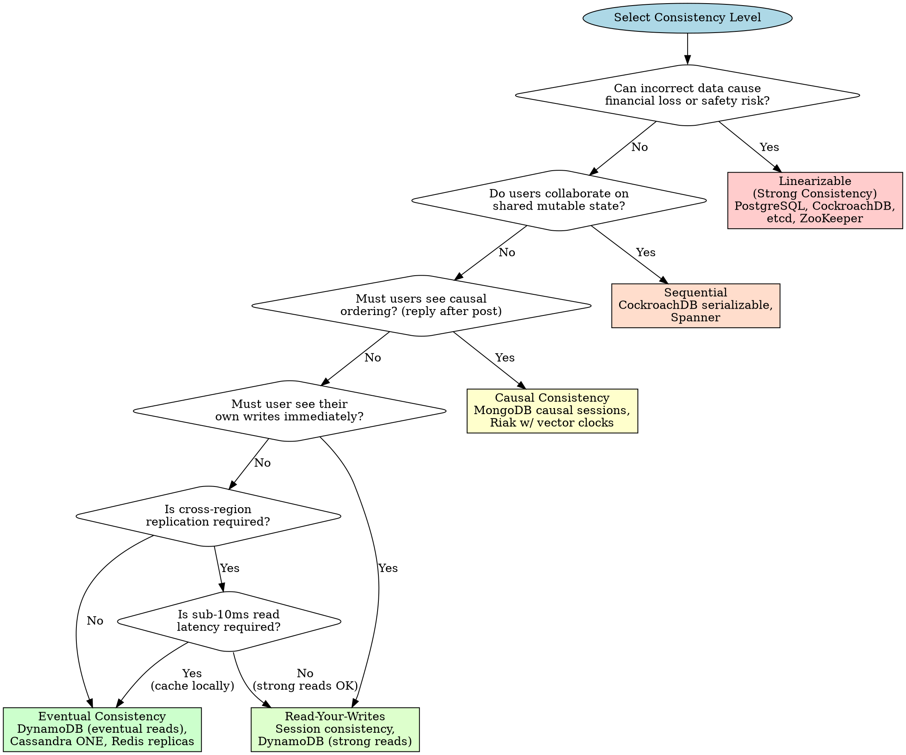
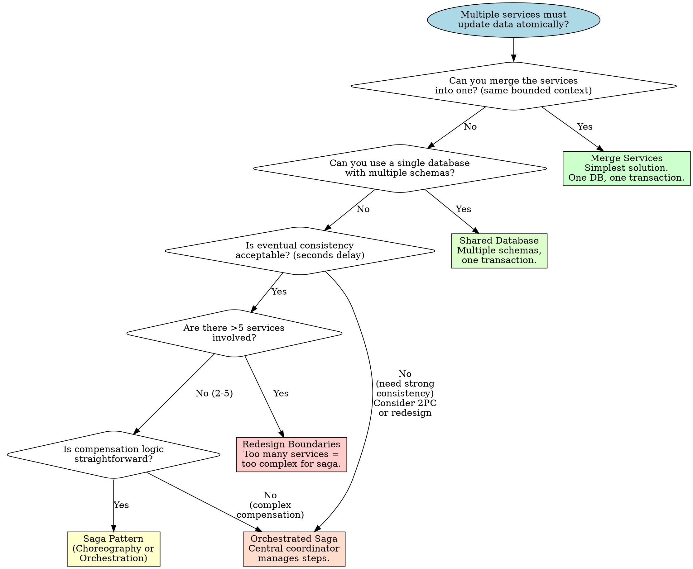
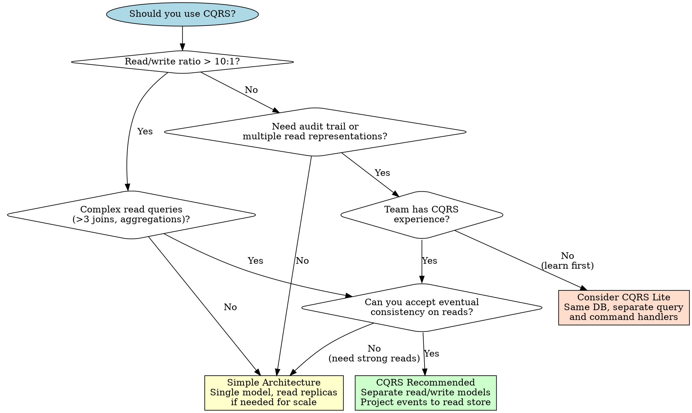
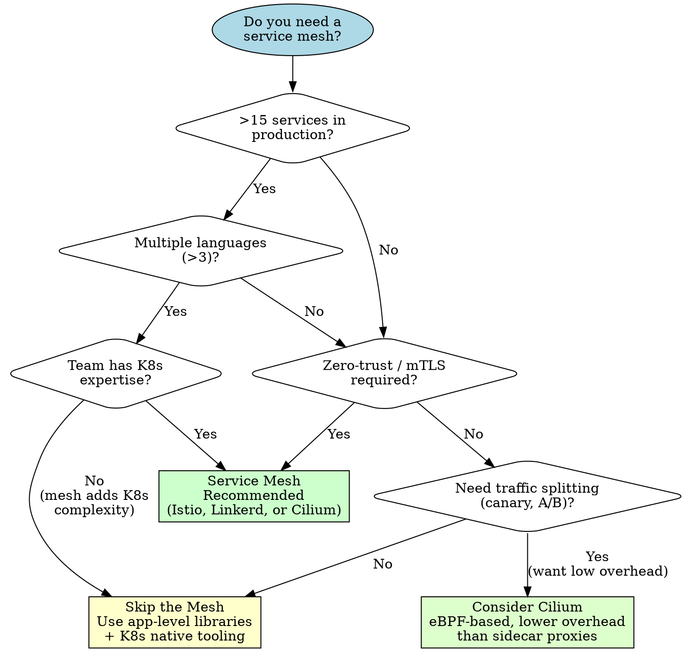
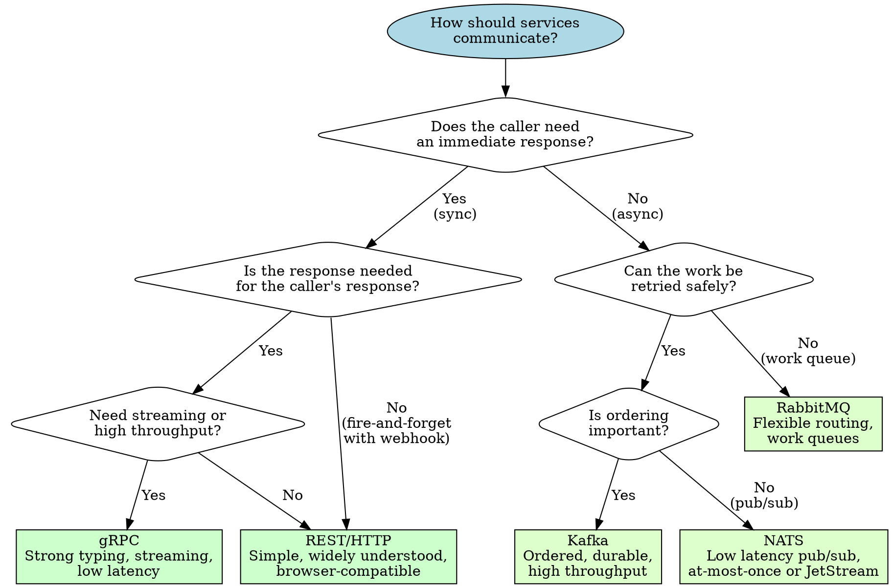
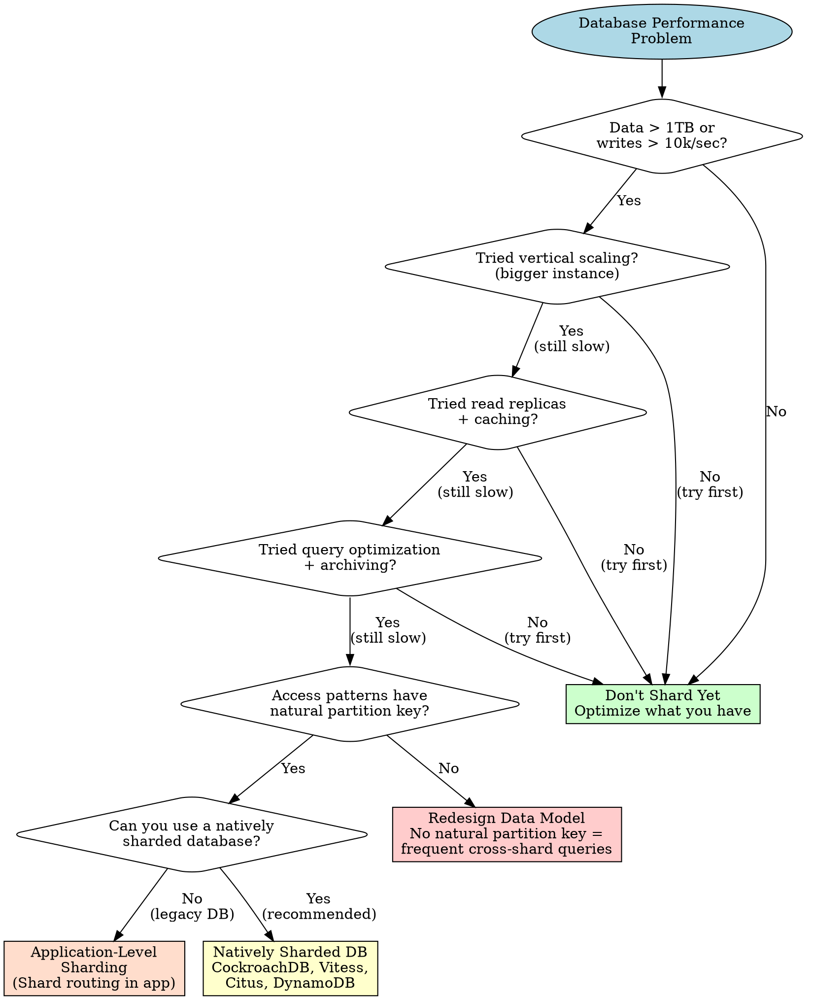
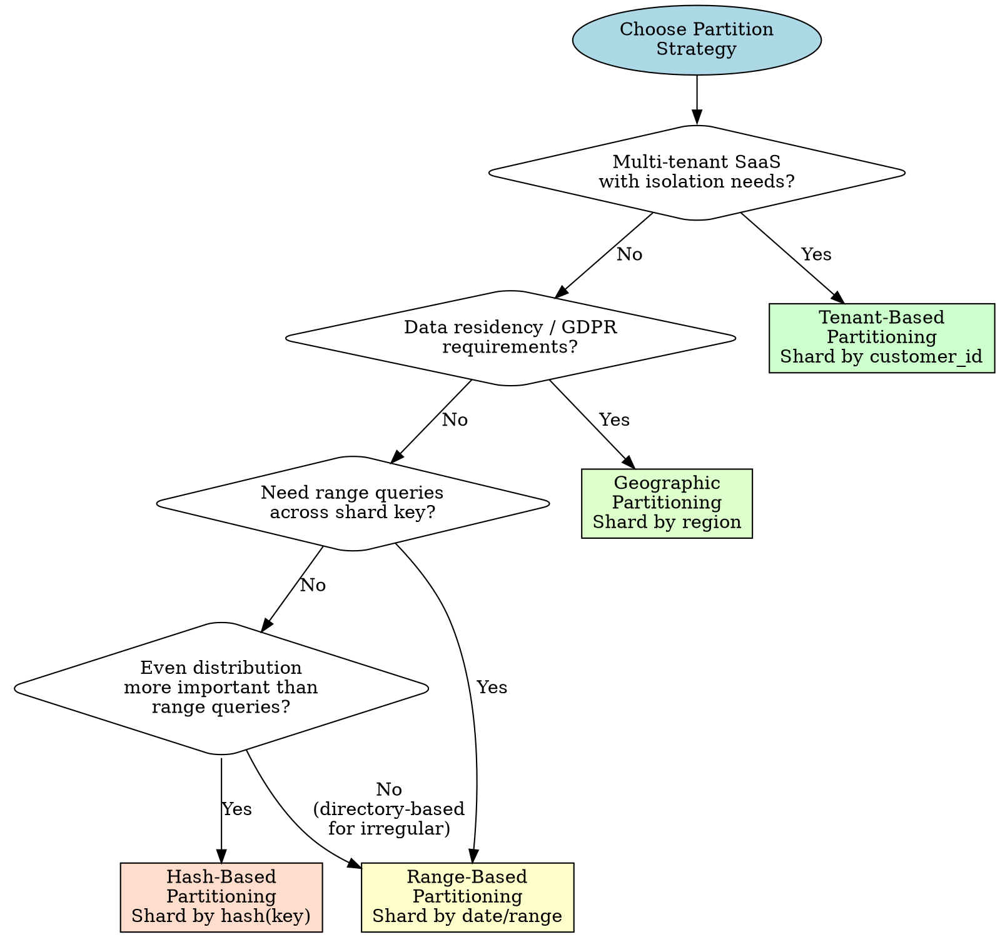

# Distributed Systems Architecture

**Purpose:** Distributed systems decision frameworks and patterns for Distinguished Systems Engineer
**Last Updated:** 2026-02-19
**Maintainer:** Distinguished Systems Engineer agent

## Overview

This library provides structured guidance for distributed systems architecture, covering:
- CAP theorem and consistency model selection
- Consensus protocols and leader election
- Distributed transactions (Saga, 2PC, Outbox)
- CQRS and Event Sourcing
- Service mesh and inter-service communication
- Cross-system API design (versioning, idempotency, circuit breakers)
- Data partitioning and sharding strategies

Each section includes:
- **Decision Framework:** Criteria, trade-offs, decision tree
- **Patterns:** Implementation guidance with multi-language examples
- **Anti-patterns:** What to avoid and why
- **Production Considerations:** What changes under load

## Table of Contents

1. [CAP Theorem & Consistency Models](#1-cap-theorem--consistency-models)
   - [CAP Decision Framework](#cap-decision-framework)
   - [Consistency Spectrum](#consistency-spectrum)
   - [Consistency Level Decision Tree](#consistency-level-decision-tree)
   - [Options Matrix](#consistency-options-matrix)
   - [Example Scenarios](#consistency-example-scenarios)
   - [Anti-Patterns](#consistency-anti-patterns)
   - [Production Considerations](#consistency-production-considerations)
2. [Consensus Protocols & Leader Election](#2-consensus-protocols--leader-election)
   - [Raft Overview](#raft-overview)
   - [When to Use Consensus](#when-to-use-consensus)
   - [Implementation Guidance](#consensus-implementation-guidance)
   - [Go Example: etcd Leader Election](#go-example-etcd-leader-election)
   - [Python Example: ZooKeeper Leader Election](#python-example-zookeeper-leader-election)
   - [Anti-Patterns](#consensus-anti-patterns)
   - [Production Considerations](#consensus-production-considerations)
3. [Distributed Transactions](#3-distributed-transactions)
   - [Do You Need Distributed Transactions?](#do-you-need-distributed-transactions)
   - [Saga Pattern](#saga-pattern)
   - [Outbox Pattern](#outbox-pattern)
   - [Two-Phase Commit (2PC)](#two-phase-commit-2pc)
   - [Anti-Patterns](#transaction-anti-patterns)
   - [Production Considerations](#transaction-production-considerations)
4. [CQRS & Event Sourcing](#4-cqrs--event-sourcing)
   - [CQRS Decision Framework](#cqrs-decision-framework)
   - [Event Sourcing](#event-sourcing)
   - [Go Example: Event Store](#go-example-event-store)
   - [Anti-Patterns](#cqrs-anti-patterns)
   - [Production Considerations](#cqrs-production-considerations)
5. [Service Mesh & Inter-Service Communication](#5-service-mesh--inter-service-communication)
   - [Service Mesh Decision Framework](#service-mesh-decision-framework)
   - [Mesh Comparison Matrix](#mesh-comparison-matrix)
   - [Communication Patterns](#communication-patterns)
   - [Resilience Patterns](#resilience-patterns)
   - [Anti-Patterns](#mesh-anti-patterns)
   - [Production Considerations](#mesh-production-considerations)
6. [Cross-System API Review Checklist](#6-cross-system-api-review-checklist)
   - [Versioning Strategy](#versioning-strategy)
   - [Backward Compatibility](#backward-compatibility)
   - [Idempotency Key Design](#idempotency-key-design)
   - [Pagination](#pagination)
   - [Rate Limiting](#rate-limiting)
   - [Anti-Patterns](#api-anti-patterns)
   - [Production Considerations](#api-production-considerations)
7. [Data Partitioning & Sharding](#7-data-partitioning--sharding)
   - [Sharding Decision Framework](#sharding-decision-framework)
   - [Partitioning Strategies](#partitioning-strategies)
   - [Shard Key Selection](#shard-key-selection)
   - [Rebalancing](#rebalancing)
   - [Anti-Patterns](#sharding-anti-patterns)
   - [Production Considerations](#sharding-production-considerations)

---

## 1. CAP Theorem & Consistency Models

### CAP Decision Framework

The CAP theorem states that a distributed system can provide at most two of three guarantees simultaneously:
- **Consistency (C):** Every read receives the most recent write or an error
- **Availability (A):** Every request receives a non-error response (no guarantee it's the most recent write)
- **Partition Tolerance (P):** The system continues to operate despite network partitions between nodes

**Critical insight:** In any distributed system, network partitions WILL happen. CA systems do not exist in production distributed environments. The real choice is between CP and AP during a partition.

#### Decision Criteria

| Criterion | Weight | CP Favored | AP Favored |
|-----------|--------|------------|------------|
| **Data correctness impact** | Critical | Incorrect data causes financial loss, safety risk, or legal liability | Stale data is annoying but not harmful |
| **User experience during partition** | High | Users expect errors rather than wrong data | Users expect degraded but functional service |
| **Recovery complexity** | High | Conflict resolution is complex or impossible (e.g., double-spending) | Conflicts are easy to merge (CRDT-friendly, last-write-wins acceptable) |
| **Partition frequency** | Medium | Partitions are rare (single datacenter) | Partitions are common (multi-region, mobile, edge) |
| **Read/write ratio** | Medium | Write-heavy with conflict potential | Read-heavy with infrequent writes |
| **Regulatory requirements** | High | Financial regulations require strict ordering | No regulatory constraints on ordering |

#### CP vs AP Decision

Choose **CP** when:
- Financial transactions (double-spending prevention)
- Inventory management (overselling prevention)
- User authentication and authorization state
- Configuration that affects system behavior
- Distributed locks and leader election

Choose **AP** when:
- Social media feeds and timelines
- Product catalog browsing
- Analytics and metrics collection
- DNS resolution
- Content delivery / caching layers
- Shopping cart (with conflict resolution)

### Consistency Spectrum

Consistency is not binary. Real systems operate on a spectrum from strongest to weakest:

```
Strongest ─────────────────────────────────────────────── Weakest

Linearizable → Sequential → Causal → Read-your-writes → Monotonic → Eventual
     │              │           │            │                │           │
  "Real-time     "Program    "Cause      "See my own      "Never go  "Eventually
   order"        order"      before       updates"        backwards"  converge"
                             effect"
```

| Level | Guarantee | Latency Cost | Use Case |
|-------|-----------|-------------|----------|
| **Linearizable (Strong)** | Operations appear instantaneous at some point between invocation and response. Global total order. | Highest: requires coordination across all replicas (typically 1-2 RTTs to quorum) | Financial ledger, distributed locks, leader election |
| **Sequential** | All operations appear in some total order consistent with each client's program order. | High: must coordinate write ordering globally | Shared document editing, version control |
| **Causal** | If operation A causally precedes B, all nodes see A before B. Concurrent operations may differ in order across nodes. | Medium: track causal dependencies (vector clocks / version vectors) | Social media comments (reply after post), messaging |
| **Read-your-writes** | A client always sees its own writes in subsequent reads. Other clients may see stale data. | Low: sticky sessions or client-side version tracking | Shopping cart, user profile edits, form submissions |
| **Monotonic reads** | Once a client reads value V, it never sees a value older than V on subsequent reads. | Low: track read version per client | Dashboard displays, feed scrolling |
| **Eventual** | If no new writes occur, all replicas converge to the same value. No ordering guarantees during convergence. | Lowest: fully asynchronous replication | DNS propagation, CDN cache, analytics counters |

### Consistency Level Decision Tree



### Consistency Options Matrix

| Database | Default Consistency | Tunable? | Strongest Available | Latency (P50 write) | Multi-Region | Best For |
|----------|-------------------|----------|--------------------|--------------------|-------------|----------|
| **PostgreSQL** | Linearizable (single node) | No (without extensions) | Linearizable | 1-5ms (local) | Streaming replication (async = eventual, sync = strong) | ACID workloads <1TB, single-region |
| **CockroachDB** | Serializable | Yes (stale reads) | Serializable | 10-50ms (multi-region) | Native, Raft-based | Multi-region ACID, global tables |
| **Redis** | Eventual (replicas) | Partial (WAIT command) | Strong (single node) | <1ms (local) | Redis Cluster (eventual) | Caching, ephemeral state, sub-ms reads |
| **DynamoDB** | Eventual | Yes (per-request) | Strong (single-region) | 5-10ms | Global Tables (eventual) | Key-value at scale, tunable per-read |
| **Cassandra** | Eventual (ONE) | Yes (per-query CL) | Linearizable (LWT, slow) | 2-10ms (LOCAL_QUORUM) | Native multi-DC | Write-heavy, time-series, wide-column |
| **MongoDB** | Eventual (secondaries) | Yes (read concern / write concern) | Linearizable (majority + linearizable read) | 5-20ms (w:majority) | Native replica sets | Document store, flexible schema |
| **Spanner** | Linearizable | No | Linearizable (TrueTime) | 10-20ms (multi-region) | Native, synchronized clocks | Global strong consistency (Google-scale budget) |

### Consistency Example Scenarios

#### Scenario 1: Financial Transactions (Strong Consistency)

**Requirements:** Account balance must never go negative. Two concurrent withdrawals must not both succeed if combined they exceed balance.

**Choice:** Linearizable / Serializable
**Implementation:** PostgreSQL with `SERIALIZABLE` isolation or CockroachDB

```go
// Go: Serializable transaction for balance transfer
package ledger

import (
	"context"
	"database/sql"
	"errors"
	"fmt"
)

var (
	ErrInsufficientFunds = errors.New("insufficient funds")
	ErrSameAccount       = errors.New("cannot transfer to same account")
)

type TransferRequest struct {
	FromAccountID string
	ToAccountID   string
	Amount        int64 // cents
	IdempotencyKey string
}

func Transfer(ctx context.Context, db *sql.DB, req TransferRequest) error {
	if req.FromAccountID == req.ToAccountID {
		return ErrSameAccount
	}
	if req.Amount <= 0 {
		return fmt.Errorf("amount must be positive, got %d", req.Amount)
	}

	tx, err := db.BeginTx(ctx, &sql.TxOptions{
		Isolation: sql.LevelSerializable,
	})
	if err != nil {
		return fmt.Errorf("begin tx: %w", err)
	}
	defer tx.Rollback()

	// Idempotency check
	var exists bool
	err = tx.QueryRowContext(ctx,
		"SELECT EXISTS(SELECT 1 FROM transfers WHERE idempotency_key = $1)",
		req.IdempotencyKey,
	).Scan(&exists)
	if err != nil {
		return fmt.Errorf("idempotency check: %w", err)
	}
	if exists {
		return nil // Already processed
	}

	// Check and debit source
	var balance int64
	err = tx.QueryRowContext(ctx,
		"SELECT balance FROM accounts WHERE id = $1 FOR UPDATE",
		req.FromAccountID,
	).Scan(&balance)
	if err != nil {
		return fmt.Errorf("read source balance: %w", err)
	}
	if balance < req.Amount {
		return ErrInsufficientFunds
	}

	_, err = tx.ExecContext(ctx,
		"UPDATE accounts SET balance = balance - $1, updated_at = NOW() WHERE id = $2",
		req.Amount, req.FromAccountID,
	)
	if err != nil {
		return fmt.Errorf("debit source: %w", err)
	}

	// Credit destination
	_, err = tx.ExecContext(ctx,
		"UPDATE accounts SET balance = balance + $1, updated_at = NOW() WHERE id = $2",
		req.Amount, req.ToAccountID,
	)
	if err != nil {
		return fmt.Errorf("credit destination: %w", err)
	}

	// Record transfer
	_, err = tx.ExecContext(ctx,
		`INSERT INTO transfers (idempotency_key, from_account_id, to_account_id, amount, created_at)
		 VALUES ($1, $2, $3, $4, NOW())`,
		req.IdempotencyKey, req.FromAccountID, req.ToAccountID, req.Amount,
	)
	if err != nil {
		return fmt.Errorf("record transfer: %w", err)
	}

	if err := tx.Commit(); err != nil {
		return fmt.Errorf("commit: %w", err)
	}
	return nil
}
```

#### Scenario 2: Social Media Feed (Eventual Consistency)

**Requirements:** Users see posts from people they follow. Slight delay (seconds) is acceptable. High read throughput required.

**Choice:** Eventual consistency
**Implementation:** Cassandra with `LOCAL_ONE` reads, async fan-out

```python
# Python: Eventual consistency feed with Cassandra
from cassandra.cluster import Cluster
from cassandra.policies import DCAwareRoundRobinPolicy
from cassandra.query import SimpleStatement, ConsistencyLevel
import uuid
from datetime import datetime, timezone


class FeedService:
    def __init__(self, contact_points: list[str], datacenter: str):
        self.cluster = Cluster(
            contact_points=contact_points,
            load_balancing_policy=DCAwareRoundRobinPolicy(
                local_dc=datacenter
            ),
        )
        self.session = self.cluster.connect("social")

    def create_post(self, author_id: str, content: str) -> str:
        """Write post with LOCAL_QUORUM for durability, then fan out async."""
        post_id = str(uuid.uuid4())
        now = datetime.now(timezone.utc)

        # Write to posts table with LOCAL_QUORUM (durable in local DC)
        stmt = SimpleStatement(
            """INSERT INTO posts (post_id, author_id, content, created_at)
               VALUES (%s, %s, %s, %s)""",
            consistency_level=ConsistencyLevel.LOCAL_QUORUM,
        )
        self.session.execute(stmt, (post_id, author_id, content, now))

        # Fan out to follower feeds with LOCAL_ONE (fast, eventual)
        followers = self._get_followers(author_id)
        stmt = SimpleStatement(
            """INSERT INTO user_feed (user_id, created_at, post_id, author_id)
               VALUES (%s, %s, %s, %s)
               USING TTL 2592000""",  # 30 day TTL
            consistency_level=ConsistencyLevel.LOCAL_ONE,
        )
        for follower_id in followers:
            self.session.execute_async(
                stmt, (follower_id, now, post_id, author_id)
            )

        return post_id

    def get_feed(self, user_id: str, limit: int = 20) -> list[dict]:
        """Read feed with LOCAL_ONE for lowest latency."""
        stmt = SimpleStatement(
            """SELECT post_id, author_id, created_at
               FROM user_feed
               WHERE user_id = %s
               ORDER BY created_at DESC
               LIMIT %s""",
            consistency_level=ConsistencyLevel.LOCAL_ONE,
        )
        rows = self.session.execute(stmt, (user_id, limit))

        feed = []
        for row in rows:
            post = self._get_post(row.post_id)
            if post:
                feed.append(post)
        return feed

    def _get_post(self, post_id: str) -> dict | None:
        stmt = SimpleStatement(
            "SELECT post_id, author_id, content, created_at FROM posts WHERE post_id = %s",
            consistency_level=ConsistencyLevel.LOCAL_ONE,
        )
        rows = self.session.execute(stmt, (post_id,))
        row = rows.one()
        if row is None:
            return None
        return {
            "post_id": row.post_id,
            "author_id": row.author_id,
            "content": row.content,
            "created_at": row.created_at.isoformat(),
        }

    def _get_followers(self, user_id: str) -> list[str]:
        stmt = SimpleStatement(
            "SELECT follower_id FROM followers WHERE user_id = %s",
            consistency_level=ConsistencyLevel.LOCAL_ONE,
        )
        rows = self.session.execute(stmt, (user_id,))
        return [row.follower_id for row in rows]
```

#### Scenario 3: Shopping Cart (Read-Your-Writes)

**Requirements:** User must see their own cart updates immediately. Cart merging on login is acceptable. High availability during sales events.

**Choice:** Read-your-writes consistency
**Implementation:** DynamoDB with strong reads for the owning user, eventual for analytics

```go
// Go: Shopping cart with read-your-writes via DynamoDB
package cart

import (
	"context"
	"fmt"
	"time"

	"github.com/aws/aws-sdk-go-v2/aws"
	"github.com/aws/aws-sdk-go-v2/feature/dynamodb/attributevalue"
	"github.com/aws/aws-sdk-go-v2/service/dynamodb"
	"github.com/aws/aws-sdk-go-v2/service/dynamodb/types"
)

type CartItem struct {
	ProductID string `dynamodbav:"product_id"`
	Quantity  int    `dynamodbav:"quantity"`
	Price     int64  `dynamodbav:"price_cents"`
	AddedAt   string `dynamodbav:"added_at"`
}

type Cart struct {
	UserID    string     `dynamodbav:"user_id"`
	Items     []CartItem `dynamodbav:"items"`
	UpdatedAt string     `dynamodbav:"updated_at"`
	Version   int        `dynamodbav:"version"`
}

type CartService struct {
	client    *dynamodb.Client
	tableName string
}

func NewCartService(client *dynamodb.Client, tableName string) *CartService {
	return &CartService{client: client, tableName: tableName}
}

func (s *CartService) AddItem(ctx context.Context, userID string, item CartItem) error {
	item.AddedAt = time.Now().UTC().Format(time.RFC3339)

	// Conditional update with optimistic locking
	cart, err := s.GetCart(ctx, userID, true) // strong read
	if err != nil {
		// Cart doesn't exist, create new one
		cart = &Cart{
			UserID:  userID,
			Items:   []CartItem{item},
			Version: 1,
		}
		return s.putNewCart(ctx, cart)
	}

	// Merge: update quantity if product exists, otherwise append
	found := false
	for i, existing := range cart.Items {
		if existing.ProductID == item.ProductID {
			cart.Items[i].Quantity += item.Quantity
			cart.Items[i].Price = item.Price // use latest price
			found = true
			break
		}
	}
	if !found {
		cart.Items = append(cart.Items, item)
	}

	return s.updateCart(ctx, cart)
}

func (s *CartService) GetCart(ctx context.Context, userID string, strongRead bool) (*Cart, error) {
	result, err := s.client.GetItem(ctx, &dynamodb.GetItemInput{
		TableName: &s.tableName,
		Key: map[string]types.AttributeValue{
			"user_id": &types.AttributeValueMemberS{Value: userID},
		},
		ConsistentRead: aws.Bool(strongRead), // read-your-writes for cart owner
	})
	if err != nil {
		return nil, fmt.Errorf("get cart: %w", err)
	}
	if result.Item == nil {
		return nil, fmt.Errorf("cart not found for user %s", userID)
	}

	var cart Cart
	if err := attributevalue.UnmarshalMap(result.Item, &cart); err != nil {
		return nil, fmt.Errorf("unmarshal cart: %w", err)
	}
	return &cart, nil
}

func (s *CartService) putNewCart(ctx context.Context, cart *Cart) error {
	cart.UpdatedAt = time.Now().UTC().Format(time.RFC3339)
	item, err := attributevalue.MarshalMap(cart)
	if err != nil {
		return fmt.Errorf("marshal cart: %w", err)
	}

	_, err = s.client.PutItem(ctx, &dynamodb.PutItemInput{
		TableName:           &s.tableName,
		Item:                item,
		ConditionExpression: aws.String("attribute_not_exists(user_id)"),
	})
	return err
}

func (s *CartService) updateCart(ctx context.Context, cart *Cart) error {
	oldVersion := cart.Version
	cart.Version++
	cart.UpdatedAt = time.Now().UTC().Format(time.RFC3339)

	item, err := attributevalue.MarshalMap(cart)
	if err != nil {
		return fmt.Errorf("marshal cart: %w", err)
	}

	_, err = s.client.PutItem(ctx, &dynamodb.PutItemInput{
		TableName: &s.tableName,
		Item:      item,
		ConditionExpression: aws.String("version = :v"),
		ExpressionAttributeValues: map[string]types.AttributeValue{
			":v": &types.AttributeValueMemberN{Value: fmt.Sprintf("%d", oldVersion)},
		},
	})
	return err
}
```

### Consistency Anti-Patterns

#### Anti-Pattern 1: Assuming Strong Consistency from Replicas

**Problem:** Reading from a database replica and assuming the data is current.

```go
// BAD: Reading from replica immediately after write to primary
func (s *UserService) UpdateAndRead(ctx context.Context, userID string, name string) (*User, error) {
    // Writes go to primary
    _, err := s.primaryDB.ExecContext(ctx,
        "UPDATE users SET name = $1 WHERE id = $2", name, userID)
    if err != nil {
        return nil, err
    }

    // Reading from replica -- MAY RETURN STALE DATA
    // Replication lag can be 10ms to several seconds
    var user User
    err = s.replicaDB.QueryRowContext(ctx,
        "SELECT id, name FROM users WHERE id = $1", userID).Scan(&user.ID, &user.Name)
    return &user, err
}

// GOOD: Read from primary after write, or use session-aware routing
func (s *UserService) UpdateAndRead(ctx context.Context, userID string, name string) (*User, error) {
    _, err := s.primaryDB.ExecContext(ctx,
        "UPDATE users SET name = $1 WHERE id = $2", name, userID)
    if err != nil {
        return nil, err
    }

    // Read from primary for read-your-writes guarantee
    var user User
    err = s.primaryDB.QueryRowContext(ctx,
        "SELECT id, name FROM users WHERE id = $1", userID).Scan(&user.ID, &user.Name)
    return &user, err
}
```

#### Anti-Pattern 2: Choosing Strong Consistency "Just to Be Safe"

**Problem:** Using linearizable reads everywhere destroys throughput and increases latency by 2-10x.

**Guideline:** Start with the weakest consistency that is correct for each operation. Strengthen only where the business domain requires it. A social media "like" count does not need linearizable reads.

#### Anti-Pattern 3: Ignoring Consistency During Failover

**Problem:** During leader failover, a CP system becomes unavailable. If your application doesn't handle this, users see 500 errors.

**Mitigation:** Implement retry with backoff and a clear degraded-mode UX.

### Consistency Production Considerations

- **Measure replication lag:** Monitor P50/P99 replication lag in dashboards. Alert if it exceeds your SLA (e.g., >1s for eventual consistency systems).
- **Test partition behavior:** Use tools like `tc netem`, Toxiproxy, or Chaos Mesh to simulate network partitions and verify your system behaves correctly.
- **Client-side version tracking:** For read-your-writes, pass a version token from write response to subsequent reads. If the replica hasn't caught up, route to primary.
- **Tunable consistency is powerful but dangerous:** DynamoDB and Cassandra let you choose per-request. Create wrapper functions that enforce the correct consistency level per operation type. Do not let callers choose ad hoc.
- **Multi-region consistency cost:** Strong consistency across regions costs 100-300ms per write (speed of light RTT). Budget this into your SLA.

---

## 2. Consensus Protocols & Leader Election

### Raft Overview

Raft is a consensus protocol designed for understandability. It guarantees that a cluster of nodes agrees on a sequence of values (log entries) even when some nodes fail.

#### Core Concepts

| Concept | Description |
|---------|-------------|
| **Leader** | Single node that accepts all client writes and replicates to followers. At most one leader per term. |
| **Follower** | Passive nodes that replicate the leader's log. Redirect client writes to leader. |
| **Candidate** | Follower that has timed out waiting for leader heartbeat and starts an election. |
| **Term** | Monotonically increasing logical clock. Each term has at most one leader. |
| **Log** | Ordered sequence of entries. Each entry has a term number and command. |
| **Commit** | An entry is committed when replicated to a majority (quorum) of nodes. |

#### Leader Election Process

1. Follower's election timer expires (randomized 150-300ms)
2. Follower becomes Candidate, increments term, votes for itself
3. Candidate sends `RequestVote` RPCs to all other nodes
4. Node grants vote if: (a) it hasn't voted this term, (b) candidate's log is at least as up-to-date
5. Candidate becomes Leader if it receives votes from a majority
6. Leader sends periodic heartbeats to prevent new elections

#### Safety Guarantees

- **Election Safety:** At most one leader per term
- **Leader Append-Only:** Leader never overwrites or deletes log entries
- **Log Matching:** If two logs contain an entry with same index and term, all preceding entries are identical
- **Leader Completeness:** If an entry is committed in a given term, it will be present in all leaders for higher terms
- **State Machine Safety:** If a node applies an entry at a given index, no other node applies a different entry at that index

### When to Use Consensus

| Use Case | Why Consensus | Alternative |
|----------|---------------|-------------|
| **Leader election** | Exactly one leader at a time, survive failures | Manual failover (downtime), split-brain risk |
| **Distributed locks** | Mutual exclusion across nodes | Redis SETNX (not safe across failures), database advisory locks |
| **Configuration management** | All nodes agree on config version | File sync (race conditions), manual rollout |
| **Service discovery** | Consistent registry of available services | DNS (eventual, TTL delay), gossip (eventual) |
| **Membership changes** | Agree on who's in the cluster | Static config (no elasticity), gossip (eventual) |
| **Distributed counters** | Exactly-once counting across nodes | Per-node counters + periodic merge (approximate) |

**Rule of thumb:** Use consensus when you need a single source of truth that multiple nodes must agree on, AND incorrect values are worse than unavailability.

### Consensus Implementation Guidance

#### etcd (Recommended for Kubernetes environments)

**When to use:**
- Already running Kubernetes (etcd is built-in)
- Need strong consistency for <10k keys
- Leader election, distributed locks, service discovery
- Small metadata (<1MB per key)

**When NOT to use:**
- Large data volumes (>8GB recommended limit)
- High write throughput (>10k writes/sec)
- Data that doesn't need consensus (logs, metrics)

#### ZooKeeper (Legacy systems)

**When to use:**
- Existing Hadoop/Kafka ecosystem
- Need hierarchical data model (znodes)
- Already have operational expertise
- Stable, battle-tested (15+ years in production)

**When NOT to use:**
- Greenfield projects (etcd is simpler to operate)
- JVM dependency is unacceptable
- Need >1MB per node

#### Redis Redlock (USE WITH EXTREME CAUTION)

**Martin Kleppmann's analysis (2016) identifies fundamental flaws:**
1. Relies on synchronized clocks across nodes (GC pauses, clock skew break assumptions)
2. No fencing tokens to prevent stale lock holders from making changes
3. During network partition, multiple clients can believe they hold the lock

**When Redlock is acceptable:**
- Efficiency optimization only (duplicate work is wasteful but not harmful)
- You can tolerate occasional double-execution

**When Redlock is NOT acceptable:**
- Correctness requirement (financial transactions, inventory)
- Anything where two concurrent holders cause data corruption

**Use instead:** etcd leases or ZooKeeper ephemeral nodes for correctness-critical distributed locks.

### Go Example: etcd Leader Election

```go
package election

import (
	"context"
	"fmt"
	"log"
	"os"
	"os/signal"
	"syscall"
	"time"

	clientv3 "go.etcd.io/etcd/client/v3"
	"go.etcd.io/etcd/client/v3/concurrency"
)

type LeaderElection struct {
	client     *clientv3.Client
	session    *concurrency.Session
	election   *concurrency.Election
	instanceID string
	prefix     string
}

func NewLeaderElection(endpoints []string, prefix string, instanceID string) (*LeaderElection, error) {
	client, err := clientv3.New(clientv3.Config{
		Endpoints:   endpoints,
		DialTimeout: 5 * time.Second,
	})
	if err != nil {
		return nil, fmt.Errorf("connect to etcd: %w", err)
	}

	// Session TTL: if this process dies, leadership is released after 10s
	session, err := concurrency.NewSession(client, concurrency.WithTTL(10))
	if err != nil {
		client.Close()
		return nil, fmt.Errorf("create session: %w", err)
	}

	election := concurrency.NewElection(session, prefix)

	return &LeaderElection{
		client:     client,
		session:    session,
		election:   election,
		instanceID: instanceID,
		prefix:     prefix,
	}, nil
}

func (le *LeaderElection) Run(ctx context.Context, onElected func(ctx context.Context)) error {
	ctx, cancel := context.WithCancel(ctx)
	defer cancel()

	// Handle graceful shutdown
	sigCh := make(chan os.Signal, 1)
	signal.Notify(sigCh, syscall.SIGINT, syscall.SIGTERM)
	go func() {
		<-sigCh
		log.Printf("[%s] Received shutdown signal, resigning leadership", le.instanceID)
		cancel()
	}()

	for {
		select {
		case <-ctx.Done():
			return le.resign(context.Background())
		default:
		}

		log.Printf("[%s] Campaigning for leadership on %s", le.instanceID, le.prefix)

		// Campaign blocks until this instance becomes leader or context is cancelled
		if err := le.election.Campaign(ctx, le.instanceID); err != nil {
			if ctx.Err() != nil {
				return le.resign(context.Background())
			}
			log.Printf("[%s] Campaign failed: %v, retrying in 5s", le.instanceID, err)
			time.Sleep(5 * time.Second)
			continue
		}

		log.Printf("[%s] Elected as leader!", le.instanceID)

		// Create a child context that is cancelled when leadership is lost
		leaderCtx, leaderCancel := context.WithCancel(ctx)

		// Watch for leadership loss
		go func() {
			defer leaderCancel()
			observe := le.election.Observe(leaderCtx)
			for resp := range observe {
				if string(resp.Kvs[0].Value) != le.instanceID {
					log.Printf("[%s] Lost leadership to %s", le.instanceID, string(resp.Kvs[0].Value))
					return
				}
			}
		}()

		// Execute leader work
		onElected(leaderCtx)

		leaderCancel()
		log.Printf("[%s] Leadership term ended, re-campaigning", le.instanceID)
	}
}

func (le *LeaderElection) resign(ctx context.Context) error {
	resignCtx, cancel := context.WithTimeout(ctx, 5*time.Second)
	defer cancel()

	if err := le.election.Resign(resignCtx); err != nil {
		log.Printf("[%s] Failed to resign: %v", le.instanceID, err)
	}
	le.session.Close()
	return le.client.Close()
}

// Usage example:
//
//   le, err := NewLeaderElection(
//       []string{"localhost:2379"},
//       "/services/scheduler/leader",
//       "scheduler-pod-abc123",
//   )
//   if err != nil {
//       log.Fatal(err)
//   }
//
//   err = le.Run(context.Background(), func(ctx context.Context) {
//       // This runs only while this instance is the leader
//       ticker := time.NewTicker(10 * time.Second)
//       defer ticker.Stop()
//       for {
//           select {
//           case <-ctx.Done():
//               return
//           case <-ticker.C:
//               log.Println("Performing leader-only scheduled work")
//               runScheduledJobs(ctx)
//           }
//       }
//   })
```

### Python Example: ZooKeeper Leader Election

```python
import logging
import signal
import sys
import time
from typing import Callable

from kazoo.client import KazooClient
from kazoo.recipe.election import Election

logging.basicConfig(level=logging.INFO)
logger = logging.getLogger(__name__)


class ZKLeaderElection:
    """Leader election using ZooKeeper ephemeral sequential nodes."""

    def __init__(
        self,
        hosts: str,
        election_path: str,
        instance_id: str,
        session_timeout: float = 10.0,
    ):
        self.instance_id = instance_id
        self.election_path = election_path
        self._running = True

        self.client = KazooClient(
            hosts=hosts,
            timeout=session_timeout,
        )
        self.client.add_listener(self._connection_listener)
        self.client.start()

        self.election = Election(self.client, election_path, instance_id)

        signal.signal(signal.SIGINT, self._handle_signal)
        signal.signal(signal.SIGTERM, self._handle_signal)

    def _connection_listener(self, state: str) -> None:
        logger.warning(
            "[%s] ZooKeeper connection state changed: %s",
            self.instance_id,
            state,
        )

    def _handle_signal(self, signum: int, frame: object) -> None:
        logger.info(
            "[%s] Received signal %d, shutting down", self.instance_id, signum
        )
        self._running = False

    def run(self, on_elected: Callable[[], None]) -> None:
        """Block until elected, then run on_elected. Re-campaigns if leadership lost."""
        try:
            while self._running:
                logger.info(
                    "[%s] Campaigning for leadership on %s",
                    self.instance_id,
                    self.election_path,
                )
                try:
                    # This blocks until we become the leader
                    self.election.run(self._leader_func, on_elected)
                except Exception:
                    logger.exception(
                        "[%s] Election error, retrying in 5s",
                        self.instance_id,
                    )
                    time.sleep(5)
        finally:
            self.close()

    def _leader_func(self, on_elected: Callable[[], None]) -> None:
        logger.info("[%s] Elected as leader!", self.instance_id)
        try:
            on_elected()
        except Exception:
            logger.exception(
                "[%s] Leader function raised exception", self.instance_id
            )
        logger.info("[%s] Leadership term ended", self.instance_id)

    def close(self) -> None:
        logger.info("[%s] Closing ZooKeeper connection", self.instance_id)
        try:
            self.client.stop()
            self.client.close()
        except Exception:
            logger.exception("[%s] Error closing connection", self.instance_id)


def example_leader_work() -> None:
    """Work that only the leader should perform."""
    logger.info("Starting leader-only work: scheduling jobs")
    while True:
        logger.info("Running scheduled batch job")
        time.sleep(10)


if __name__ == "__main__":
    le = ZKLeaderElection(
        hosts="zk1:2181,zk2:2181,zk3:2181",
        election_path="/services/scheduler/leader",
        instance_id=f"scheduler-{sys.argv[1] if len(sys.argv) > 1 else 'default'}",
    )
    le.run(example_leader_work)
```

### Consensus Anti-Patterns

#### Anti-Pattern 1: Rolling Your Own Consensus

**Problem:** Implementing Paxos, Raft, or any consensus algorithm from scratch.

**Why it's dangerous:**
- Consensus protocols have subtle edge cases that take years to discover in production
- Raft was designed to be understandable, yet production implementations (etcd, CockroachDB) have found dozens of bugs over years
- Testing distributed systems requires fault injection tooling that takes months to build

**What to do instead:** Use etcd, ZooKeeper, or Consul. The operational cost of running these is far lower than the risk of a flawed custom implementation.

#### Anti-Pattern 2: Using Consensus for High-Throughput Data

**Problem:** Routing all writes through a Raft cluster (etcd/ZooKeeper) for data that doesn't need consensus.

**Example:** Storing per-request metrics in etcd. etcd handles ~10k writes/sec; your service generates 100k req/sec.

**What to do instead:** Use consensus only for metadata and coordination. Use purpose-built data stores for high-throughput data:
- Metrics: Prometheus / InfluxDB / VictoriaMetrics
- Logs: Elasticsearch / Loki
- Events: Kafka / NATS

#### Anti-Pattern 3: Consensus Cluster Too Small or Too Large

**Cluster size guidelines:**
- **3 nodes:** Tolerates 1 failure. Minimum for production. Good for most workloads.
- **5 nodes:** Tolerates 2 failures. Recommended for critical services. Allows rolling upgrades without losing quorum.
- **7 nodes:** Tolerates 3 failures. Rarely needed. Higher write latency due to larger quorum.
- **>7 nodes:** Almost never justified. Write latency increases linearly. Consider multiple independent clusters.
- **Even numbers (2, 4, 6):** Never use. Same fault tolerance as N-1 but higher quorum cost.

### Consensus Production Considerations

- **Monitor leader elections:** Frequent leader elections indicate network instability or overloaded nodes. Alert if >1 election per hour.
- **Tune heartbeat and election timeouts:** Heartbeat interval should be << election timeout. Typical: heartbeat=100ms, election=1000-2000ms. Cross-region: increase both by 5-10x.
- **Backup etcd regularly:** `etcdctl snapshot save` every hour minimum. Test restores monthly.
- **Separate etcd from application workloads:** etcd is sensitive to disk latency. Use dedicated SSDs. Never co-locate with noisy workloads.
- **Client-side load balancing:** Distribute reads across followers. Only route writes to the leader.

---

## 3. Distributed Transactions

### Do You Need Distributed Transactions?

Before implementing distributed transactions, challenge the assumption. Often the answer is to redesign service boundaries.



### Saga Pattern

A saga is a sequence of local transactions where each step publishes an event or message that triggers the next step. If a step fails, compensating transactions undo the preceding steps.

#### Choreography vs Orchestration

| Aspect | Choreography | Orchestration |
|--------|-------------|---------------|
| **Coordination** | Each service listens for events and decides what to do next | Central orchestrator tells each service what to do |
| **Coupling** | Services know about events, not each other | Services know only the orchestrator |
| **Complexity at scale** | Grows exponentially with services (event chains hard to trace) | Grows linearly (orchestrator manages all paths) |
| **Single point of failure** | None (distributed) | Orchestrator (mitigate with HA deployment) |
| **Visibility** | Hard to see overall saga state (distributed across services) | Easy: orchestrator has complete state machine |
| **Error handling** | Each service handles its own compensation | Orchestrator coordinates all compensations |
| **Best for** | 2-3 services, simple flows, high autonomy teams | 4+ services, complex flows, need visibility |
| **Testing** | Integration tests across services needed | Orchestrator unit-testable with mocked services |

**Decision rule:** Use choreography for simple sagas (2-3 steps) where services are owned by independent teams. Use orchestration for anything more complex.

#### Go Example: Orchestrated Saga with State Machine

```go
package saga

import (
	"context"
	"encoding/json"
	"errors"
	"fmt"
	"log"
	"time"
)

// Step represents a single saga step with execute and compensate actions
type Step struct {
	Name       string
	Execute    func(ctx context.Context, data map[string]interface{}) error
	Compensate func(ctx context.Context, data map[string]interface{}) error
}

// State represents the current state of a saga execution
type State int

const (
	StatePending State = iota
	StateRunning
	StateCompleted
	StateFailing
	StateFailed
	StateCompensated
)

func (s State) String() string {
	names := []string{"PENDING", "RUNNING", "COMPLETED", "FAILING", "FAILED", "COMPENSATED"}
	if int(s) < len(names) {
		return names[s]
	}
	return "UNKNOWN"
}

// Execution tracks the state of a saga execution
type Execution struct {
	ID            string
	SagaName      string
	State         State
	CurrentStep   int
	CompletedSteps []string
	Data          map[string]interface{}
	Error         string
	StartedAt     time.Time
	CompletedAt   time.Time
}

// Orchestrator manages saga execution
type Orchestrator struct {
	name  string
	steps []Step
	store ExecutionStore
}

// ExecutionStore persists saga state for crash recovery
type ExecutionStore interface {
	Save(ctx context.Context, exec *Execution) error
	Load(ctx context.Context, id string) (*Execution, error)
}

func NewOrchestrator(name string, store ExecutionStore, steps []Step) *Orchestrator {
	return &Orchestrator{
		name:  name,
		steps: steps,
		store: store,
	}
}

func (o *Orchestrator) Execute(ctx context.Context, sagaID string, initialData map[string]interface{}) error {
	exec := &Execution{
		ID:        sagaID,
		SagaName:  o.name,
		State:     StatePending,
		Data:      initialData,
		StartedAt: time.Now().UTC(),
	}

	if err := o.store.Save(ctx, exec); err != nil {
		return fmt.Errorf("save initial state: %w", err)
	}

	exec.State = StateRunning
	for i, step := range o.steps {
		exec.CurrentStep = i
		if err := o.store.Save(ctx, exec); err != nil {
			return fmt.Errorf("save step %d state: %w", i, err)
		}

		log.Printf("[saga:%s:%s] Executing step %d: %s", o.name, sagaID, i, step.Name)

		if err := step.Execute(ctx, exec.Data); err != nil {
			log.Printf("[saga:%s:%s] Step %d (%s) failed: %v", o.name, sagaID, i, step.Name, err)
			exec.Error = err.Error()
			exec.State = StateFailing

			if compErr := o.compensate(ctx, exec, i-1); compErr != nil {
				exec.State = StateFailed
				exec.Error = fmt.Sprintf("execute: %s; compensate: %s", err.Error(), compErr.Error())
				exec.CompletedAt = time.Now().UTC()
				o.store.Save(ctx, exec)
				return fmt.Errorf("saga %s failed and compensation failed: execute=%w, compensate=%v", sagaID, err, compErr)
			}

			exec.State = StateCompensated
			exec.CompletedAt = time.Now().UTC()
			o.store.Save(ctx, exec)
			return fmt.Errorf("saga %s compensated after step %s failed: %w", sagaID, step.Name, err)
		}

		exec.CompletedSteps = append(exec.CompletedSteps, step.Name)
	}

	exec.State = StateCompleted
	exec.CompletedAt = time.Now().UTC()
	if err := o.store.Save(ctx, exec); err != nil {
		return fmt.Errorf("save completed state: %w", err)
	}

	log.Printf("[saga:%s:%s] Completed successfully", o.name, sagaID)
	return nil
}

func (o *Orchestrator) compensate(ctx context.Context, exec *Execution, fromStep int) error {
	var errs []error
	for i := fromStep; i >= 0; i-- {
		step := o.steps[i]
		if step.Compensate == nil {
			log.Printf("[saga:%s:%s] Step %d (%s) has no compensation, skipping",
				o.name, exec.ID, i, step.Name)
			continue
		}

		log.Printf("[saga:%s:%s] Compensating step %d: %s", o.name, exec.ID, i, step.Name)

		if err := step.Compensate(ctx, exec.Data); err != nil {
			log.Printf("[saga:%s:%s] Compensation for step %d (%s) failed: %v",
				o.name, exec.ID, i, step.Name, err)
			errs = append(errs, fmt.Errorf("compensate %s: %w", step.Name, err))
		}
	}

	if len(errs) > 0 {
		return errors.Join(errs...)
	}
	return nil
}

// --- Example: Order Processing Saga ---

// InMemoryStore is a simple in-memory execution store for examples
type InMemoryStore struct {
	executions map[string]*Execution
}

func NewInMemoryStore() *InMemoryStore {
	return &InMemoryStore{executions: make(map[string]*Execution)}
}

func (s *InMemoryStore) Save(ctx context.Context, exec *Execution) error {
	data, err := json.Marshal(exec)
	if err != nil {
		return err
	}
	var copy Execution
	if err := json.Unmarshal(data, &copy); err != nil {
		return err
	}
	s.executions[exec.ID] = &copy
	return nil
}

func (s *InMemoryStore) Load(ctx context.Context, id string) (*Execution, error) {
	exec, ok := s.executions[id]
	if !ok {
		return nil, fmt.Errorf("execution %s not found", id)
	}
	return exec, nil
}

func NewOrderSaga(store ExecutionStore) *Orchestrator {
	return NewOrchestrator("order-processing", store, []Step{
		{
			Name: "reserve-inventory",
			Execute: func(ctx context.Context, data map[string]interface{}) error {
				orderID := data["order_id"].(string)
				log.Printf("Reserving inventory for order %s", orderID)
				data["inventory_reservation_id"] = fmt.Sprintf("inv-%s", orderID)
				return nil
			},
			Compensate: func(ctx context.Context, data map[string]interface{}) error {
				resID := data["inventory_reservation_id"].(string)
				log.Printf("Releasing inventory reservation %s", resID)
				return nil
			},
		},
		{
			Name: "charge-payment",
			Execute: func(ctx context.Context, data map[string]interface{}) error {
				orderID := data["order_id"].(string)
				amount := data["amount"].(float64)
				log.Printf("Charging $%.2f for order %s", amount/100, orderID)
				data["payment_id"] = fmt.Sprintf("pay-%s", orderID)
				return nil
			},
			Compensate: func(ctx context.Context, data map[string]interface{}) error {
				paymentID := data["payment_id"].(string)
				log.Printf("Refunding payment %s", paymentID)
				return nil
			},
		},
		{
			Name: "schedule-shipment",
			Execute: func(ctx context.Context, data map[string]interface{}) error {
				orderID := data["order_id"].(string)
				log.Printf("Scheduling shipment for order %s", orderID)
				data["shipment_id"] = fmt.Sprintf("ship-%s", orderID)
				return nil
			},
			Compensate: func(ctx context.Context, data map[string]interface{}) error {
				shipmentID := data["shipment_id"].(string)
				log.Printf("Cancelling shipment %s", shipmentID)
				return nil
			},
		},
		{
			Name: "send-confirmation",
			Execute: func(ctx context.Context, data map[string]interface{}) error {
				orderID := data["order_id"].(string)
				log.Printf("Sending confirmation email for order %s", orderID)
				return nil
			},
			Compensate: nil, // Email cannot be un-sent; no compensation needed
		},
	})
}

// Usage:
//
//   store := NewInMemoryStore()
//   saga := NewOrderSaga(store)
//   err := saga.Execute(context.Background(), "order-123", map[string]interface{}{
//       "order_id": "order-123",
//       "amount":   4999.0, // $49.99 in cents
//       "user_id":  "user-456",
//   })
```

#### TypeScript Example: Choreographed Saga with Event Bus

```typescript
// TypeScript: Choreographed saga using an event bus
// Each service independently subscribes to events and emits new ones

interface SagaEvent {
  type: string;
  sagaId: string;
  timestamp: string;
  payload: Record<string, unknown>;
}

type EventHandler = (event: SagaEvent) => Promise<void>;

class EventBus {
  private handlers: Map<string, EventHandler[]> = new Map();
  private deadLetterQueue: SagaEvent[] = [];

  subscribe(eventType: string, handler: EventHandler): void {
    const existing = this.handlers.get(eventType) ?? [];
    existing.push(handler);
    this.handlers.set(eventType, existing);
  }

  async publish(event: SagaEvent): Promise<void> {
    const handlers = this.handlers.get(event.type) ?? [];
    if (handlers.length === 0) {
      console.warn(`No handlers for event type: ${event.type}`);
      return;
    }

    for (const handler of handlers) {
      try {
        await handler(event);
      } catch (error) {
        console.error(
          `Handler failed for ${event.type}:`,
          error instanceof Error ? error.message : error
        );
        this.deadLetterQueue.push(event);
      }
    }
  }

  getDeadLetterQueue(): SagaEvent[] {
    return [...this.deadLetterQueue];
  }
}

// --- Inventory Service ---
class InventoryService {
  private reservations: Map<string, { productId: string; quantity: number }> =
    new Map();

  constructor(private bus: EventBus) {
    // React to order created
    bus.subscribe("order.created", async (event) => {
      const { productId, quantity } = event.payload as {
        productId: string;
        quantity: number;
      };

      try {
        const reservationId = `inv-${event.sagaId}`;
        // In production: check stock, decrement available count
        this.reservations.set(reservationId, { productId, quantity });

        console.log(
          `[Inventory] Reserved ${quantity}x ${productId} (${reservationId})`
        );

        await this.bus.publish({
          type: "inventory.reserved",
          sagaId: event.sagaId,
          timestamp: new Date().toISOString(),
          payload: { reservationId, productId, quantity },
        });
      } catch (error) {
        await this.bus.publish({
          type: "inventory.reservation_failed",
          sagaId: event.sagaId,
          timestamp: new Date().toISOString(),
          payload: {
            reason: error instanceof Error ? error.message : "unknown",
          },
        });
      }
    });

    // React to payment failure -- compensate by releasing reservation
    bus.subscribe("payment.failed", async (event) => {
      const reservationId = `inv-${event.sagaId}`;
      if (this.reservations.has(reservationId)) {
        this.reservations.delete(reservationId);
        console.log(`[Inventory] Released reservation ${reservationId}`);

        await this.bus.publish({
          type: "inventory.released",
          sagaId: event.sagaId,
          timestamp: new Date().toISOString(),
          payload: { reservationId },
        });
      }
    });
  }
}

// --- Payment Service ---
class PaymentService {
  private payments: Map<string, { amount: number; status: string }> = new Map();

  constructor(private bus: EventBus) {
    bus.subscribe("inventory.reserved", async (event) => {
      const { amount } = event.payload as { amount?: number };
      const paymentAmount = amount ?? 0;

      try {
        const paymentId = `pay-${event.sagaId}`;
        // In production: call payment gateway
        this.payments.set(paymentId, { amount: paymentAmount, status: "charged" });

        console.log(
          `[Payment] Charged $${(paymentAmount / 100).toFixed(2)} (${paymentId})`
        );

        await this.bus.publish({
          type: "payment.completed",
          sagaId: event.sagaId,
          timestamp: new Date().toISOString(),
          payload: { paymentId, amount: paymentAmount },
        });
      } catch (error) {
        await this.bus.publish({
          type: "payment.failed",
          sagaId: event.sagaId,
          timestamp: new Date().toISOString(),
          payload: {
            reason: error instanceof Error ? error.message : "unknown",
          },
        });
      }
    });
  }
}

// --- Shipping Service ---
class ShippingService {
  constructor(private bus: EventBus) {
    bus.subscribe("payment.completed", async (event) => {
      const shipmentId = `ship-${event.sagaId}`;
      console.log(`[Shipping] Scheduled shipment ${shipmentId}`);

      await this.bus.publish({
        type: "shipment.scheduled",
        sagaId: event.sagaId,
        timestamp: new Date().toISOString(),
        payload: { shipmentId },
      });
    });
  }
}

// --- Notification Service ---
class NotificationService {
  constructor(private bus: EventBus) {
    bus.subscribe("shipment.scheduled", async (event) => {
      console.log(`[Notification] Order ${event.sagaId} confirmed and shipping`);
    });

    bus.subscribe("inventory.reservation_failed", async (event) => {
      console.log(
        `[Notification] Order ${event.sagaId} failed: out of stock`
      );
    });

    bus.subscribe("payment.failed", async (event) => {
      console.log(
        `[Notification] Order ${event.sagaId} failed: payment declined`
      );
    });
  }
}

// --- Wire everything together ---
async function runOrderSaga(): Promise<void> {
  const bus = new EventBus();

  // Each service registers independently
  new InventoryService(bus);
  new PaymentService(bus);
  new ShippingService(bus);
  new NotificationService(bus);

  // Kick off the saga by publishing the initial event
  const sagaId = "order-789";
  await bus.publish({
    type: "order.created",
    sagaId,
    timestamp: new Date().toISOString(),
    payload: {
      productId: "sku-abc",
      quantity: 2,
      amount: 4999,
      userId: "user-123",
    },
  });
}

runOrderSaga().catch(console.error);
```

### Outbox Pattern

The Outbox pattern guarantees that a local database transaction and an event publication happen atomically, without requiring two-phase commit.

**How it works:**
1. Service writes business data AND an event row to an `outbox` table in the same local transaction
2. A separate process (poller or CDC) reads the outbox table and publishes events to the message broker
3. After successful publication, the outbox row is marked as published (or deleted)

**Why it matters:** Writing to a database and publishing to Kafka in sequence is NOT atomic. If the app crashes between the two, you get inconsistency.

#### Go Example: PostgreSQL Outbox

```go
package outbox

import (
	"context"
	"database/sql"
	"encoding/json"
	"fmt"
	"log"
	"time"

	"github.com/google/uuid"
	"github.com/lib/pq"
)

// Schema:
// CREATE TABLE outbox (
//     id UUID PRIMARY KEY DEFAULT gen_random_uuid(),
//     aggregate_type TEXT NOT NULL,
//     aggregate_id TEXT NOT NULL,
//     event_type TEXT NOT NULL,
//     payload JSONB NOT NULL,
//     created_at TIMESTAMPTZ NOT NULL DEFAULT NOW(),
//     published_at TIMESTAMPTZ,
//     retries INT NOT NULL DEFAULT 0
// );
// CREATE INDEX idx_outbox_unpublished ON outbox (created_at) WHERE published_at IS NULL;

type OutboxEvent struct {
	ID            string
	AggregateType string
	AggregateID   string
	EventType     string
	Payload       json.RawMessage
	CreatedAt     time.Time
}

// Publisher defines where events are sent (Kafka, NATS, RabbitMQ, etc.)
type Publisher interface {
	Publish(ctx context.Context, topic string, key string, payload []byte) error
}

// WriteWithEvent performs a business operation and writes an outbox event atomically
func WriteWithEvent(
	ctx context.Context,
	db *sql.DB,
	businessFn func(tx *sql.Tx) error,
	event OutboxEvent,
) error {
	tx, err := db.BeginTx(ctx, nil)
	if err != nil {
		return fmt.Errorf("begin tx: %w", err)
	}
	defer tx.Rollback()

	// Execute business logic
	if err := businessFn(tx); err != nil {
		return fmt.Errorf("business logic: %w", err)
	}

	// Write event to outbox in the same transaction
	eventID := uuid.New().String()
	_, err = tx.ExecContext(ctx,
		`INSERT INTO outbox (id, aggregate_type, aggregate_id, event_type, payload, created_at)
		 VALUES ($1, $2, $3, $4, $5, $6)`,
		eventID,
		event.AggregateType,
		event.AggregateID,
		event.EventType,
		event.Payload,
		time.Now().UTC(),
	)
	if err != nil {
		return fmt.Errorf("write outbox event: %w", err)
	}

	if err := tx.Commit(); err != nil {
		return fmt.Errorf("commit: %w", err)
	}
	return nil
}

// OutboxPoller reads unpublished events and sends them to the message broker
type OutboxPoller struct {
	db        *sql.DB
	publisher Publisher
	interval  time.Duration
	batchSize int
}

func NewOutboxPoller(db *sql.DB, publisher Publisher, interval time.Duration, batchSize int) *OutboxPoller {
	return &OutboxPoller{
		db:        db,
		publisher: publisher,
		interval:  interval,
		batchSize: batchSize,
	}
}

func (p *OutboxPoller) Run(ctx context.Context) {
	ticker := time.NewTicker(p.interval)
	defer ticker.Stop()

	for {
		select {
		case <-ctx.Done():
			log.Println("[outbox-poller] Shutting down")
			return
		case <-ticker.C:
			if err := p.pollBatch(ctx); err != nil {
				log.Printf("[outbox-poller] Error polling: %v", err)
			}
		}
	}
}

func (p *OutboxPoller) pollBatch(ctx context.Context) error {
	rows, err := p.db.QueryContext(ctx,
		`SELECT id, aggregate_type, aggregate_id, event_type, payload
		 FROM outbox
		 WHERE published_at IS NULL AND retries < 5
		 ORDER BY created_at ASC
		 LIMIT $1
		 FOR UPDATE SKIP LOCKED`,
		p.batchSize,
	)
	if err != nil {
		return fmt.Errorf("query outbox: %w", err)
	}
	defer rows.Close()

	var publishedIDs []string
	var failedIDs []string

	for rows.Next() {
		var event OutboxEvent
		if err := rows.Scan(
			&event.ID,
			&event.AggregateType,
			&event.AggregateID,
			&event.EventType,
			&event.Payload,
		); err != nil {
			return fmt.Errorf("scan outbox row: %w", err)
		}

		topic := fmt.Sprintf("%s.%s", event.AggregateType, event.EventType)
		if err := p.publisher.Publish(ctx, topic, event.AggregateID, event.Payload); err != nil {
			log.Printf("[outbox-poller] Failed to publish event %s: %v", event.ID, err)
			failedIDs = append(failedIDs, event.ID)
			continue
		}

		publishedIDs = append(publishedIDs, event.ID)
	}

	if len(publishedIDs) > 0 {
		_, err := p.db.ExecContext(ctx,
			"UPDATE outbox SET published_at = NOW() WHERE id = ANY($1)",
			pq.Array(publishedIDs),
		)
		if err != nil {
			return fmt.Errorf("mark published: %w", err)
		}
		log.Printf("[outbox-poller] Published %d events", len(publishedIDs))
	}

	if len(failedIDs) > 0 {
		_, err := p.db.ExecContext(ctx,
			"UPDATE outbox SET retries = retries + 1 WHERE id = ANY($1)",
			pq.Array(failedIDs),
		)
		if err != nil {
			return fmt.Errorf("increment retries: %w", err)
		}
	}

	return nil
}

// Usage:
//
//   // In your order service handler:
//   payload, _ := json.Marshal(map[string]interface{}{
//       "order_id": "order-123",
//       "total": 4999,
//       "items": []string{"sku-abc", "sku-def"},
//   })
//
//   err := WriteWithEvent(ctx, db,
//       func(tx *sql.Tx) error {
//           _, err := tx.Exec(
//               "INSERT INTO orders (id, user_id, total, status) VALUES ($1, $2, $3, $4)",
//               "order-123", "user-456", 4999, "pending",
//           )
//           return err
//       },
//       OutboxEvent{
//           AggregateType: "order",
//           AggregateID:   "order-123",
//           EventType:     "created",
//           Payload:       payload,
//       },
//   )
//
//   // Poller runs in background:
//   poller := NewOutboxPoller(db, kafkaPublisher, 500*time.Millisecond, 100)
//   go poller.Run(ctx)
```

### Two-Phase Commit (2PC)

**When to use 2PC:** Almost never in microservices. 2PC is appropriate when:
- All participants are within a single datacenter with reliable networking
- Latency of the coordination is acceptable (adds 2 extra round trips)
- You are using databases that natively support XA transactions (PostgreSQL, MySQL, Oracle)
- The number of participants is small (2-3)
- You have no alternative (e.g., legacy system integration)

**Why 2PC is avoided in microservices:**
- **Blocking protocol:** If the coordinator crashes after sending PREPARE but before sending COMMIT, all participants are blocked holding locks until the coordinator recovers
- **Latency:** Minimum 2 extra round trips (prepare + commit)
- **Availability:** The protocol is synchronous; any participant failure blocks all others
- **Scalability:** Lock contention under the held locks for the entire 2PC duration

**Protocol phases:**
1. **Prepare phase:** Coordinator asks all participants "can you commit?" Each participant writes to its WAL and responds YES or NO.
2. **Commit phase:** If all said YES, coordinator writes COMMIT to its log and tells all participants to commit. If any said NO, coordinator tells all to ABORT.

### Transaction Anti-Patterns

#### Anti-Pattern 1: Distributed Monolith

**Problem:** Microservices that always require synchronous calls to multiple other services before responding. This is a monolith with network hops.

**Symptoms:**
- Service A cannot respond without calling B, C, and D synchronously
- Failure in any downstream service causes upstream failure
- Latency is the sum of all downstream latencies
- You need distributed transactions for what should be a local operation

**Fix:** Redefine service boundaries along consistency boundaries. If data must be consistent together, it probably belongs in the same service.

#### Anti-Pattern 2: Chatty Sagas (>5-7 Steps)

**Problem:** A saga with 10+ steps is extremely hard to reason about, test, and operate. The compensation logic becomes a second system as complex as the forward path.

**Guideline:** If your saga has >5-7 steps, you likely have the wrong service boundaries. Merge related steps into a single service that handles them in a local transaction.

#### Anti-Pattern 3: Saga Without Idempotency

**Problem:** Saga steps that are not idempotent cause double-execution on retry.

**Fix:** Every saga step (both execute and compensate) MUST be idempotent. Use idempotency keys:

```go
// GOOD: Idempotent saga step
func chargePayment(ctx context.Context, data map[string]interface{}) error {
    idempotencyKey := fmt.Sprintf("saga-%s-payment", data["saga_id"])
    // Payment gateway deduplicates by idempotency key
    return paymentClient.Charge(ctx, ChargeRequest{
        IdempotencyKey: idempotencyKey,
        Amount:         data["amount"].(int64),
        CustomerID:     data["customer_id"].(string),
    })
}
```

### Transaction Production Considerations

- **Saga execution store must be durable:** Use PostgreSQL, not Redis, for saga state. If the orchestrator crashes mid-saga, you need to recover and resume.
- **Set timeouts on every saga step:** A hung downstream service should not block the entire saga. Timeout, log, and compensate.
- **Monitor saga completion rates:** Track what percentage of sagas complete vs compensate vs get stuck. Alert if stuck sagas exceed 0.1%.
- **Outbox table maintenance:** The outbox table grows continuously. Run periodic cleanup to delete published events older than your retention window (7-30 days). Create a `published_at IS NOT NULL AND published_at < NOW() - INTERVAL '7 days'` deletion job.
- **Dead letter handling:** Events that fail after max retries need a dead letter queue and an alerting pipeline. Do not silently drop them.

---

## 4. CQRS & Event Sourcing

### CQRS Decision Framework

CQRS (Command Query Responsibility Segregation) separates the write model (commands) from the read model (queries). This is NOT the same as having separate read replicas. CQRS means fundamentally different data models for reads and writes.

#### When CQRS Adds Value

| Criterion | Threshold | Reasoning |
|-----------|-----------|-----------|
| Read/write ratio | >10:1 | High read ratio justifies optimizing read model independently |
| Query complexity | >3 joins per read query | Complex reads benefit from pre-computed denormalized views |
| Domain complexity | >5 aggregate types with cross-aggregate queries | CQRS allows each read model to be tailored to its use case |
| Audit trail required | Regulatory or compliance | Event-sourced write side provides natural audit log |
| Multiple read representations | >2 different views of same data | Dashboard view, API view, search index, report view |
| Team structure | Separate read/write teams | CQRS allows independent development and deployment |
| Scale asymmetry | Read throughput >10x write throughput | Scale read and write sides independently |

#### When CQRS is Unnecessary Complexity

- **Simple CRUD applications:** If your read model is basically your write model, CQRS doubles your code for no benefit
- **Low traffic:** <100 req/sec does not justify the operational overhead of maintaining two models
- **Team unfamiliar:** CQRS has a steep learning curve; introducing it on a deadline is high-risk
- **Consistent reads required:** CQRS read models are eventually consistent by nature (projection lag). If every read must reflect the latest write, CQRS adds complexity without benefit
- **Greenfield MVP:** Ship with simple architecture first. Add CQRS when you have evidence of the problems it solves



### Event Sourcing

Event sourcing stores state as a sequence of events rather than current state. The current state is derived by replaying events.

#### Event Store Design

| Component | Purpose | Implementation |
|-----------|---------|----------------|
| **Event stream** | Ordered sequence of events for one aggregate | Table partitioned by aggregate_id, ordered by version |
| **Snapshots** | Periodic state checkpoints to avoid full replay | Separate table, created every N events (e.g., 100) |
| **Projections** | Read models built by processing events | Materialized views in read database, rebuilt from events |
| **Schema evolution** | Handle event format changes over time | Upcaster functions that transform old events to new format |

#### Snapshot Strategy

| Strategy | When to Snapshot | Pros | Cons |
|----------|-----------------|------|------|
| **Every N events** | After every 100 events for an aggregate | Simple, predictable | May snapshot too often or rarely |
| **Time-based** | Every hour for active aggregates | Good for steady-load systems | Bursty workloads may have long replays |
| **On read** | When replay takes >50ms | Only snapshots what's needed | First slow read before snapshot exists |
| **Hybrid** | Every 100 events OR if replay >50ms | Best of both | More complex to implement |

**Recommendation:** Start with every-100-events. Measure replay latency. Adjust threshold based on P99 replay time.

#### Schema Evolution for Events

Events are immutable. Once written, they cannot be changed. Handle schema changes with upcasters:

```go
// Event version evolution example
// v1: OrderCreated{OrderID, CustomerID, Total}
// v2: OrderCreated{OrderID, CustomerID, Total, Currency} (added Currency)
// v3: OrderCreated{OrderID, CustomerID, LineItems, Currency} (replaced Total with LineItems)

type EventUpcaster func(raw json.RawMessage, fromVersion int) (json.RawMessage, error)

var orderCreatedUpcaster EventUpcaster = func(raw json.RawMessage, fromVersion int) (json.RawMessage, error) {
    var data map[string]interface{}
    if err := json.Unmarshal(raw, &data); err != nil {
        return nil, err
    }

    switch fromVersion {
    case 1:
        // v1 -> v2: add default currency
        data["currency"] = "USD"
        fallthrough
    case 2:
        // v2 -> v3: convert total to line items
        if total, ok := data["total"]; ok {
            data["line_items"] = []map[string]interface{}{
                {"description": "legacy_total", "amount": total},
            }
            delete(data, "total")
        }
    }

    return json.Marshal(data)
}
```

### Go Example: Event Store with PostgreSQL

```go
package eventstore

import (
	"context"
	"database/sql"
	"encoding/json"
	"fmt"
	"time"
)

// Schema:
// CREATE TABLE events (
//     id BIGSERIAL PRIMARY KEY,
//     aggregate_type TEXT NOT NULL,
//     aggregate_id TEXT NOT NULL,
//     event_type TEXT NOT NULL,
//     event_version INT NOT NULL,
//     data JSONB NOT NULL,
//     metadata JSONB,
//     created_at TIMESTAMPTZ NOT NULL DEFAULT NOW(),
//     UNIQUE (aggregate_id, event_version)
// );
// CREATE INDEX idx_events_aggregate ON events (aggregate_id, event_version);
//
// CREATE TABLE snapshots (
//     aggregate_id TEXT PRIMARY KEY,
//     aggregate_type TEXT NOT NULL,
//     version INT NOT NULL,
//     data JSONB NOT NULL,
//     created_at TIMESTAMPTZ NOT NULL DEFAULT NOW()
// );

type Event struct {
	ID            int64
	AggregateType string
	AggregateID   string
	EventType     string
	EventVersion  int
	Data          json.RawMessage
	Metadata      json.RawMessage
	CreatedAt     time.Time
}

type Snapshot struct {
	AggregateID   string
	AggregateType string
	Version       int
	Data          json.RawMessage
	CreatedAt     time.Time
}

type Aggregate interface {
	AggregateID() string
	AggregateType() string
	Version() int
	Apply(event Event) error
	Marshal() (json.RawMessage, error)
	Unmarshal(data json.RawMessage) error
}

type Store struct {
	db               *sql.DB
	snapshotInterval int
}

func NewStore(db *sql.DB, snapshotInterval int) *Store {
	return &Store{db: db, snapshotInterval: snapshotInterval}
}

// Append stores new events atomically with optimistic concurrency control
func (s *Store) Append(ctx context.Context, aggregateID string, aggregateType string, expectedVersion int, events []Event) error {
	tx, err := s.db.BeginTx(ctx, nil)
	if err != nil {
		return fmt.Errorf("begin tx: %w", err)
	}
	defer tx.Rollback()

	// Optimistic concurrency: check current version
	var currentVersion int
	err = tx.QueryRowContext(ctx,
		"SELECT COALESCE(MAX(event_version), 0) FROM events WHERE aggregate_id = $1",
		aggregateID,
	).Scan(&currentVersion)
	if err != nil {
		return fmt.Errorf("check version: %w", err)
	}

	if currentVersion != expectedVersion {
		return fmt.Errorf("concurrency conflict: expected version %d, got %d", expectedVersion, currentVersion)
	}

	for i, event := range events {
		version := expectedVersion + i + 1
		_, err := tx.ExecContext(ctx,
			`INSERT INTO events (aggregate_type, aggregate_id, event_type, event_version, data, metadata, created_at)
			 VALUES ($1, $2, $3, $4, $5, $6, $7)`,
			aggregateType,
			aggregateID,
			event.EventType,
			version,
			event.Data,
			event.Metadata,
			time.Now().UTC(),
		)
		if err != nil {
			return fmt.Errorf("insert event %d: %w", i, err)
		}
	}

	if err := tx.Commit(); err != nil {
		return fmt.Errorf("commit: %w", err)
	}
	return nil
}

// Load reconstructs an aggregate from snapshot + subsequent events
func (s *Store) Load(ctx context.Context, aggregate Aggregate) error {
	aggregateID := aggregate.AggregateID()
	fromVersion := 0

	// Try loading from snapshot
	snapshot, err := s.loadSnapshot(ctx, aggregateID)
	if err == nil && snapshot != nil {
		if err := aggregate.Unmarshal(snapshot.Data); err != nil {
			return fmt.Errorf("unmarshal snapshot: %w", err)
		}
		fromVersion = snapshot.Version
	}

	// Load events after snapshot
	events, err := s.loadEvents(ctx, aggregateID, fromVersion)
	if err != nil {
		return fmt.Errorf("load events: %w", err)
	}

	for _, event := range events {
		if err := aggregate.Apply(event); err != nil {
			return fmt.Errorf("apply event %d (%s): %w", event.EventVersion, event.EventType, err)
		}
	}

	// Create snapshot if needed
	if len(events) > 0 && aggregate.Version() > 0 && aggregate.Version()%s.snapshotInterval == 0 {
		if err := s.saveSnapshot(ctx, aggregate); err != nil {
			// Non-fatal: snapshot is an optimization
			fmt.Printf("warning: failed to save snapshot for %s: %v\n", aggregateID, err)
		}
	}

	return nil
}

func (s *Store) loadSnapshot(ctx context.Context, aggregateID string) (*Snapshot, error) {
	var snap Snapshot
	err := s.db.QueryRowContext(ctx,
		"SELECT aggregate_id, aggregate_type, version, data, created_at FROM snapshots WHERE aggregate_id = $1",
		aggregateID,
	).Scan(&snap.AggregateID, &snap.AggregateType, &snap.Version, &snap.Data, &snap.CreatedAt)
	if err == sql.ErrNoRows {
		return nil, nil
	}
	if err != nil {
		return nil, err
	}
	return &snap, nil
}

func (s *Store) loadEvents(ctx context.Context, aggregateID string, afterVersion int) ([]Event, error) {
	rows, err := s.db.QueryContext(ctx,
		`SELECT id, aggregate_type, aggregate_id, event_type, event_version, data, metadata, created_at
		 FROM events
		 WHERE aggregate_id = $1 AND event_version > $2
		 ORDER BY event_version ASC`,
		aggregateID, afterVersion,
	)
	if err != nil {
		return nil, err
	}
	defer rows.Close()

	var events []Event
	for rows.Next() {
		var e Event
		if err := rows.Scan(
			&e.ID, &e.AggregateType, &e.AggregateID,
			&e.EventType, &e.EventVersion, &e.Data, &e.Metadata, &e.CreatedAt,
		); err != nil {
			return nil, err
		}
		events = append(events, e)
	}
	return events, rows.Err()
}

func (s *Store) saveSnapshot(ctx context.Context, aggregate Aggregate) error {
	data, err := aggregate.Marshal()
	if err != nil {
		return fmt.Errorf("marshal aggregate: %w", err)
	}

	_, err = s.db.ExecContext(ctx,
		`INSERT INTO snapshots (aggregate_id, aggregate_type, version, data, created_at)
		 VALUES ($1, $2, $3, $4, $5)
		 ON CONFLICT (aggregate_id) DO UPDATE
		 SET version = EXCLUDED.version, data = EXCLUDED.data, created_at = EXCLUDED.created_at`,
		aggregate.AggregateID(),
		aggregate.AggregateType(),
		aggregate.Version(),
		data,
		time.Now().UTC(),
	)
	return err
}

// --- Example Aggregate: BankAccount ---

type BankAccount struct {
	ID      string
	Owner   string
	Balance int64 // cents
	version int
}

func NewBankAccount(id string) *BankAccount {
	return &BankAccount{ID: id}
}

func (a *BankAccount) AggregateID() string   { return a.ID }
func (a *BankAccount) AggregateType() string { return "bank_account" }
func (a *BankAccount) Version() int          { return a.version }

func (a *BankAccount) Apply(event Event) error {
	switch event.EventType {
	case "account_opened":
		var data struct {
			Owner string `json:"owner"`
		}
		if err := json.Unmarshal(event.Data, &data); err != nil {
			return err
		}
		a.Owner = data.Owner
		a.Balance = 0

	case "money_deposited":
		var data struct {
			Amount int64 `json:"amount"`
		}
		if err := json.Unmarshal(event.Data, &data); err != nil {
			return err
		}
		a.Balance += data.Amount

	case "money_withdrawn":
		var data struct {
			Amount int64 `json:"amount"`
		}
		if err := json.Unmarshal(event.Data, &data); err != nil {
			return err
		}
		a.Balance -= data.Amount

	default:
		return fmt.Errorf("unknown event type: %s", event.EventType)
	}

	a.version = event.EventVersion
	return nil
}

func (a *BankAccount) Marshal() (json.RawMessage, error) {
	return json.Marshal(map[string]interface{}{
		"id":      a.ID,
		"owner":   a.Owner,
		"balance": a.Balance,
		"version": a.version,
	})
}

func (a *BankAccount) Unmarshal(data json.RawMessage) error {
	var raw struct {
		ID      string `json:"id"`
		Owner   string `json:"owner"`
		Balance int64  `json:"balance"`
		Version int    `json:"version"`
	}
	if err := json.Unmarshal(data, &raw); err != nil {
		return err
	}
	a.ID = raw.ID
	a.Owner = raw.Owner
	a.Balance = raw.Balance
	a.version = raw.Version
	return nil
}

// Usage:
//
//   store := NewStore(db, 100) // snapshot every 100 events
//
//   // Open account
//   data, _ := json.Marshal(map[string]string{"owner": "Alice"})
//   store.Append(ctx, "acct-001", "bank_account", 0, []Event{
//       {EventType: "account_opened", Data: data},
//   })
//
//   // Deposit
//   data, _ = json.Marshal(map[string]int64{"amount": 10000}) // $100.00
//   store.Append(ctx, "acct-001", "bank_account", 1, []Event{
//       {EventType: "money_deposited", Data: data},
//   })
//
//   // Load account
//   account := NewBankAccount("acct-001")
//   store.Load(ctx, account)
//   fmt.Printf("Balance: $%.2f\n", float64(account.Balance)/100)
```

### CQRS Anti-Patterns

#### Anti-Pattern 1: Event Sourcing Everything

**Problem:** Applying event sourcing to every entity in the system, including simple CRUD entities.

**Why it's harmful:**
- Simple entities (user preferences, settings) don't benefit from event history
- Event sourcing adds complexity: schema evolution, snapshots, projections, eventual consistency
- Debugging is harder: you must replay events to see current state

**Rule of thumb:** Event-source only aggregates where:
1. The history of changes has business value (audit, undo, temporal queries)
2. The domain has complex state transitions (order lifecycle, insurance claims)
3. Multiple projections of the same data are needed

#### Anti-Pattern 2: Synchronous Projections

**Problem:** Updating read models synchronously during the command (write) path.

**Why it's harmful:** Defeats the purpose of CQRS. The write path now depends on all read model stores being available. If Elasticsearch is down, writes fail.

**Fix:** Project asynchronously. Accept eventual consistency on reads (typically <100ms lag).

#### Anti-Pattern 3: No Event Versioning Strategy

**Problem:** Changing event schemas without a migration path.

**What happens:** Old events in the store cannot be deserialized by new code. Projections break. Aggregate replay fails.

**Fix:** Use explicit event versions and upcasters (see Schema Evolution section above). Never modify an existing event schema; always create a new version.

### CQRS Production Considerations

- **Projection lag monitoring:** Measure and alert on the delay between event creation and projection update. P99 should be <1s for user-facing read models.
- **Projection rebuild capability:** You MUST be able to rebuild any projection from scratch by replaying all events. Test this quarterly. If it takes >1 hour, investigate partitioning the event stream.
- **Event store compaction:** Event stores grow forever. Plan for storage growth: 1M events at 1KB each = 1GB. At 10k events/sec, that is 864M events/day = 864GB/day. Snapshot aggressively and consider archiving old events to cold storage.
- **Idempotent projections:** Projections must handle duplicate events (at-least-once delivery). Use event ID or sequence number for deduplication.

---

## 5. Service Mesh & Inter-Service Communication

### Service Mesh Decision Framework

A service mesh adds a sidecar proxy to every service instance, handling traffic management, security (mTLS), and observability transparently.

#### Do You Need a Service Mesh?

| Criterion | Threshold for Mesh | Alternative Without Mesh |
|-----------|-------------------|--------------------------|
| Number of services | >15-20 microservices | Application-level libraries (e.g., gRPC interceptors) |
| mTLS requirement | Zero-trust network policy required | Manual cert management or simpler tools (cert-manager) |
| Traffic management | Canary deployments, traffic splitting, fault injection | Kubernetes native (Flagger) or Argo Rollouts |
| Multi-language stack | >3 languages in production | Per-language libraries are unmaintainable |
| Observability | Need distributed tracing without code changes | OpenTelemetry SDK in each service |
| Compliance | Audit trail of all service-to-service calls | Custom middleware per service |

**Rule of thumb:** If you have fewer than 15 services in a single language, a mesh is overhead. Use application-level libraries instead. If you have >20 services in multiple languages, a mesh pays for itself.



### Mesh Comparison Matrix

| Feature | Istio | Linkerd | Cilium |
|---------|-------|---------|--------|
| **Proxy** | Envoy (C++) | linkerd2-proxy (Rust) | eBPF (kernel) + Envoy for L7 |
| **Resource overhead** | High (~50MB per sidecar) | Low (~20MB per sidecar) | Lowest (no sidecar for L3/L4) |
| **Latency added** | 2-5ms P99 | 0.5-1ms P99 | <0.5ms P99 (L4) |
| **mTLS** | Yes (automatic) | Yes (automatic, on by default) | Yes (WireGuard or SPIFFE) |
| **Traffic management** | Excellent (VirtualService, DestinationRule) | Good (TrafficSplit, HTTPRoute) | Good (CiliumNetworkPolicy, Gateway API) |
| **Observability** | Excellent (Kiali, Jaeger, Prometheus integration) | Good (built-in dashboard, Prometheus) | Good (Hubble UI, Prometheus) |
| **Multi-cluster** | Yes (complex setup) | Yes (simpler than Istio) | Yes (ClusterMesh, straightforward) |
| **Learning curve** | Steep (many CRDs, complex configuration) | Moderate (simpler API surface) | Moderate (eBPF concepts new to most) |
| **Maturity** | Most mature, largest ecosystem | Production-ready, CNCF graduated | Rapidly maturing, CNCF graduated |
| **Best for** | Complex enterprise with full feature needs | Teams wanting simplicity + performance | Performance-sensitive, eBPF-capable kernels |
| **Avoid when** | Small cluster (<15 services), tight latency budgets | Need advanced traffic management (Istio is richer) | Kernel version <5.4, Windows nodes |

**Recommendation by context:**
- **Greenfield K8s, performance-sensitive:** Cilium
- **Enterprise, complex traffic rules:** Istio
- **Simplicity, just need mTLS + observability:** Linkerd

### Communication Patterns

#### Synchronous vs Asynchronous Decision



#### Comparison Matrix: Message Brokers

| Broker | Ordering | Durability | Throughput | Latency | Best For |
|--------|----------|------------|------------|---------|----------|
| **Kafka** | Per-partition | Durable (configurable retention) | 1M+ msg/sec | 5-15ms | Event streaming, log aggregation, ETL |
| **NATS (Core)** | None | At-most-once (in-memory) | 10M+ msg/sec | <1ms | Real-time pub/sub, service discovery |
| **NATS JetStream** | Per-stream | Durable (file/memory) | 500k+ msg/sec | 1-5ms | Durable messaging without Kafka complexity |
| **RabbitMQ** | Per-queue (with single consumer) | Durable (disk-backed) | 50k-100k msg/sec | 1-5ms | Work queues, routing patterns, RPC |
| **Redis Streams** | Per-stream | Durable (AOF) | 100k+ msg/sec | <1ms | Simple streaming, ephemeral events |

### Resilience Patterns

#### Circuit Breaker

Prevents cascading failures by stopping requests to a failing downstream service.

**States:**
- **Closed:** Requests flow normally. Track failure rate.
- **Open:** Requests immediately fail (fast-fail). Timer starts.
- **Half-Open:** Allow one test request. If it succeeds, close. If it fails, re-open.

```go
package resilience

import (
	"context"
	"errors"
	"fmt"
	"sync"
	"time"
)

var (
	ErrCircuitOpen    = errors.New("circuit breaker is open")
	ErrCircuitTimeout = errors.New("circuit breaker: request timed out")
)

type CircuitState int

const (
	StateClosed CircuitState = iota
	StateOpen
	StateHalfOpen
)

func (s CircuitState) String() string {
	switch s {
	case StateClosed:
		return "CLOSED"
	case StateOpen:
		return "OPEN"
	case StateHalfOpen:
		return "HALF_OPEN"
	default:
		return "UNKNOWN"
	}
}

type CircuitBreaker struct {
	mu sync.Mutex

	name             string
	state            CircuitState
	failureThreshold int
	successThreshold int
	timeout          time.Duration
	requestTimeout   time.Duration

	failureCount int
	successCount int
	lastFailure  time.Time

	onStateChange func(name string, from, to CircuitState)
}

type CircuitBreakerConfig struct {
	Name             string
	FailureThreshold int           // failures before opening (default: 5)
	SuccessThreshold int           // successes in half-open before closing (default: 2)
	Timeout          time.Duration // how long to stay open (default: 30s)
	RequestTimeout   time.Duration // per-request timeout (default: 5s)
	OnStateChange    func(name string, from, to CircuitState)
}

func NewCircuitBreaker(cfg CircuitBreakerConfig) *CircuitBreaker {
	if cfg.FailureThreshold == 0 {
		cfg.FailureThreshold = 5
	}
	if cfg.SuccessThreshold == 0 {
		cfg.SuccessThreshold = 2
	}
	if cfg.Timeout == 0 {
		cfg.Timeout = 30 * time.Second
	}
	if cfg.RequestTimeout == 0 {
		cfg.RequestTimeout = 5 * time.Second
	}
	if cfg.OnStateChange == nil {
		cfg.OnStateChange = func(name string, from, to CircuitState) {}
	}

	return &CircuitBreaker{
		name:             cfg.Name,
		state:            StateClosed,
		failureThreshold: cfg.FailureThreshold,
		successThreshold: cfg.SuccessThreshold,
		timeout:          cfg.Timeout,
		requestTimeout:   cfg.RequestTimeout,
		onStateChange:    cfg.OnStateChange,
	}
}

func (cb *CircuitBreaker) Execute(ctx context.Context, fn func(ctx context.Context) error) error {
	if err := cb.canExecute(); err != nil {
		return err
	}

	reqCtx, cancel := context.WithTimeout(ctx, cb.requestTimeout)
	defer cancel()

	done := make(chan error, 1)
	go func() {
		done <- fn(reqCtx)
	}()

	select {
	case err := <-done:
		if err != nil {
			cb.recordFailure()
			return err
		}
		cb.recordSuccess()
		return nil
	case <-reqCtx.Done():
		cb.recordFailure()
		return ErrCircuitTimeout
	}
}

func (cb *CircuitBreaker) canExecute() error {
	cb.mu.Lock()
	defer cb.mu.Unlock()

	switch cb.state {
	case StateClosed:
		return nil
	case StateOpen:
		if time.Since(cb.lastFailure) > cb.timeout {
			cb.setState(StateHalfOpen)
			return nil
		}
		return fmt.Errorf("%w: %s (retry after %v)", ErrCircuitOpen, cb.name,
			cb.timeout-time.Since(cb.lastFailure))
	case StateHalfOpen:
		return nil
	}
	return nil
}

func (cb *CircuitBreaker) recordSuccess() {
	cb.mu.Lock()
	defer cb.mu.Unlock()

	switch cb.state {
	case StateHalfOpen:
		cb.successCount++
		if cb.successCount >= cb.successThreshold {
			cb.setState(StateClosed)
		}
	case StateClosed:
		cb.failureCount = 0
	}
}

func (cb *CircuitBreaker) recordFailure() {
	cb.mu.Lock()
	defer cb.mu.Unlock()

	cb.lastFailure = time.Now()

	switch cb.state {
	case StateClosed:
		cb.failureCount++
		if cb.failureCount >= cb.failureThreshold {
			cb.setState(StateOpen)
		}
	case StateHalfOpen:
		cb.setState(StateOpen)
	}
}

func (cb *CircuitBreaker) setState(newState CircuitState) {
	if cb.state == newState {
		return
	}
	oldState := cb.state
	cb.state = newState
	cb.failureCount = 0
	cb.successCount = 0
	cb.onStateChange(cb.name, oldState, newState)
}

func (cb *CircuitBreaker) State() CircuitState {
	cb.mu.Lock()
	defer cb.mu.Unlock()
	return cb.state
}

// Usage:
//
//   cb := NewCircuitBreaker(CircuitBreakerConfig{
//       Name:             "payment-service",
//       FailureThreshold: 5,
//       SuccessThreshold: 2,
//       Timeout:          30 * time.Second,
//       OnStateChange: func(name string, from, to CircuitState) {
//           log.Printf("[circuit-breaker] %s: %s -> %s", name, from, to)
//       },
//   })
//
//   err := cb.Execute(ctx, func(ctx context.Context) error {
//       return paymentClient.Charge(ctx, amount)
//   })
//   if errors.Is(err, ErrCircuitOpen) {
//       // Return cached/default response or queue for retry
//   }
```

#### Retry with Exponential Backoff + Jitter

```go
package resilience

import (
	"context"
	"fmt"
	"math"
	"math/rand/v2"
	"time"
)

type RetryConfig struct {
	MaxRetries  int
	BaseDelay   time.Duration
	MaxDelay    time.Duration
	Retryable   func(error) bool // return true if the error is retryable
}

func DefaultRetryConfig() RetryConfig {
	return RetryConfig{
		MaxRetries: 3,
		BaseDelay:  100 * time.Millisecond,
		MaxDelay:   10 * time.Second,
		Retryable:  func(err error) bool { return true },
	}
}

func RetryWithBackoff(ctx context.Context, cfg RetryConfig, fn func(ctx context.Context) error) error {
	var lastErr error

	for attempt := 0; attempt <= cfg.MaxRetries; attempt++ {
		lastErr = fn(ctx)
		if lastErr == nil {
			return nil
		}

		if !cfg.Retryable(lastErr) {
			return fmt.Errorf("non-retryable error on attempt %d: %w", attempt+1, lastErr)
		}

		if attempt == cfg.MaxRetries {
			break
		}

		// Exponential backoff with full jitter
		// delay = random(0, min(maxDelay, baseDelay * 2^attempt))
		expDelay := float64(cfg.BaseDelay) * math.Pow(2, float64(attempt))
		maxDelay := math.Min(expDelay, float64(cfg.MaxDelay))
		jitteredDelay := time.Duration(rand.Float64() * maxDelay)

		select {
		case <-ctx.Done():
			return fmt.Errorf("context cancelled during retry: %w", ctx.Err())
		case <-time.After(jitteredDelay):
			// continue to next attempt
		}
	}

	return fmt.Errorf("max retries (%d) exceeded: %w", cfg.MaxRetries, lastErr)
}

// Usage:
//
//   err := RetryWithBackoff(ctx, RetryConfig{
//       MaxRetries: 3,
//       BaseDelay:  200 * time.Millisecond,
//       MaxDelay:   5 * time.Second,
//       Retryable: func(err error) bool {
//           // Only retry transient errors
//           var httpErr *HTTPError
//           if errors.As(err, &httpErr) {
//               return httpErr.StatusCode >= 500 || httpErr.StatusCode == 429
//           }
//           return false
//       },
//   }, func(ctx context.Context) error {
//       return client.Do(ctx, request)
//   })
```

#### TypeScript: Resilience Middleware

```typescript
// TypeScript: Circuit breaker + retry for HTTP clients

interface RetryConfig {
  maxRetries: number;
  baseDelayMs: number;
  maxDelayMs: number;
  retryableStatuses: Set<number>;
}

interface CircuitConfig {
  failureThreshold: number;
  resetTimeoutMs: number;
}

class ResilientClient {
  private failureCount = 0;
  private lastFailureTime = 0;
  private circuitOpen = false;

  constructor(
    private readonly baseUrl: string,
    private readonly retryConfig: RetryConfig = {
      maxRetries: 3,
      baseDelayMs: 100,
      maxDelayMs: 10000,
      retryableStatuses: new Set([408, 429, 500, 502, 503, 504]),
    },
    private readonly circuitConfig: CircuitConfig = {
      failureThreshold: 5,
      resetTimeoutMs: 30000,
    }
  ) {}

  async request<T>(
    path: string,
    options: RequestInit = {}
  ): Promise<T> {
    // Circuit breaker check
    if (this.isCircuitOpen()) {
      throw new Error(
        `Circuit breaker open for ${this.baseUrl} ` +
          `(retry in ${this.timeUntilReset()}ms)`
      );
    }

    let lastError: Error | null = null;

    for (
      let attempt = 0;
      attempt <= this.retryConfig.maxRetries;
      attempt++
    ) {
      try {
        const response = await fetch(`${this.baseUrl}${path}`, {
          ...options,
          signal: AbortSignal.timeout(5000),
        });

        if (!response.ok) {
          if (this.retryConfig.retryableStatuses.has(response.status)) {
            lastError = new Error(
              `HTTP ${response.status}: ${response.statusText}`
            );
            this.recordFailure();

            if (attempt < this.retryConfig.maxRetries) {
              await this.backoff(attempt);
              continue;
            }
            throw lastError;
          }
          // Non-retryable error
          throw new Error(
            `HTTP ${response.status}: ${response.statusText}`
          );
        }

        this.recordSuccess();
        return (await response.json()) as T;
      } catch (error) {
        if (error instanceof DOMException && error.name === "AbortError") {
          lastError = new Error("Request timed out");
        } else if (error instanceof Error) {
          lastError = error;
        } else {
          lastError = new Error(String(error));
        }

        this.recordFailure();

        if (attempt < this.retryConfig.maxRetries) {
          await this.backoff(attempt);
        }
      }
    }

    throw new Error(
      `Max retries (${this.retryConfig.maxRetries}) exceeded: ${lastError?.message}`
    );
  }

  private isCircuitOpen(): boolean {
    if (!this.circuitOpen) return false;
    if (
      Date.now() - this.lastFailureTime >
      this.circuitConfig.resetTimeoutMs
    ) {
      // Half-open: allow one request through
      this.circuitOpen = false;
      this.failureCount = 0;
      return false;
    }
    return true;
  }

  private timeUntilReset(): number {
    return Math.max(
      0,
      this.circuitConfig.resetTimeoutMs -
        (Date.now() - this.lastFailureTime)
    );
  }

  private recordFailure(): void {
    this.failureCount++;
    this.lastFailureTime = Date.now();
    if (this.failureCount >= this.circuitConfig.failureThreshold) {
      this.circuitOpen = true;
      console.warn(
        `[circuit-breaker] ${this.baseUrl}: OPENED after ${this.failureCount} failures`
      );
    }
  }

  private recordSuccess(): void {
    this.failureCount = 0;
  }

  private async backoff(attempt: number): Promise<void> {
    const expDelay =
      this.retryConfig.baseDelayMs * Math.pow(2, attempt);
    const cappedDelay = Math.min(expDelay, this.retryConfig.maxDelayMs);
    const jitteredDelay = Math.random() * cappedDelay;
    await new Promise((resolve) => setTimeout(resolve, jitteredDelay));
  }
}

// Usage:
//
//   const client = new ResilientClient("https://api.payment.svc.cluster.local");
//
//   try {
//     const result = await client.request<{ chargeId: string }>(
//       "/v1/charges",
//       {
//         method: "POST",
//         headers: { "Content-Type": "application/json" },
//         body: JSON.stringify({ amount: 4999, currency: "usd" }),
//       }
//     );
//     console.log("Charge ID:", result.chargeId);
//   } catch (error) {
//     if (error instanceof Error && error.message.includes("Circuit breaker")) {
//       // Fallback: queue for retry, return cached data, or degrade gracefully
//     }
//   }
```

### Mesh Anti-Patterns

#### Anti-Pattern 1: Mesh for <10 Services

**Problem:** Installing Istio for a 5-service application. The mesh control plane (istiod) uses more resources than your services combined.

**Fix:** Use application-level libraries (gRPC interceptors, HTTP middleware) until you outgrow them.

#### Anti-Pattern 2: No Gradual Rollout

**Problem:** Enabling mesh sidecar injection cluster-wide on day one.

**Why it's dangerous:** Sidecar injection changes networking behavior. Misconfigured mTLS can break service-to-service communication. Debug visibility changes.

**Fix:** Roll out namespace by namespace. Start with non-critical services. Validate mTLS, latency, and error rates before proceeding.

#### Anti-Pattern 3: Ignoring Sidecar Resource Consumption

**Problem:** Not budgeting for sidecar memory and CPU.

**Impact:** With Istio, each pod adds ~50MB memory and 0.1 CPU for the Envoy sidecar. In a cluster with 500 pods, that is 25GB memory and 50 CPU cores.

**Fix:** Include sidecar overhead in capacity planning. Set resource requests/limits on sidecars. Consider Cilium for lower overhead.

### Mesh Production Considerations

- **Sidecar resource limits:** Always set memory/CPU limits on sidecar containers. Envoy can consume significant memory under high connection counts.
- **Gradual mTLS rollout:** Start with PERMISSIVE mode (accept both plaintext and TLS), then move to STRICT after all services have sidecars.
- **Monitor sidecar latency:** Add dashboard panels showing P50/P99 latency added by the mesh. Alert if it exceeds 5ms P99.
- **Control plane HA:** Run at least 2 replicas of the mesh control plane. A single istiod failure should not affect data plane routing.
- **Canary the mesh itself:** Test mesh upgrades in staging with production-like traffic before rolling out to production.

---

## 6. Cross-System API Review Checklist

### Versioning Strategy

| Strategy | URL Example | Header Example | Pros | Cons | Best For |
|----------|-------------|----------------|------|------|----------|
| **URL path** | `/v1/users` | N/A | Explicit, cacheable, simple routing | URL pollution, hard to deprecate | Public APIs, mobile apps |
| **Header** | `/users` | `Accept: application/vnd.api+json; version=2` | Clean URLs, granular | Hidden versioning, cache-unfriendly | Internal APIs, GraphQL |
| **Query param** | `/users?version=2` | N/A | Simple to add | Cache key pollution, easy to forget | Rarely recommended |
| **Content negotiation** | `/users` | `Accept: application/vnd.company.user.v2+json` | REST-purist, granular per resource | Complex, hard to discover | APIs with media type evolution |

**Recommendation:** URL path versioning for public APIs. Header versioning for internal APIs where you control all clients.

#### Versioning Rules

1. **Increment version only for breaking changes.** Non-breaking additions (new fields, new endpoints) do not require a new version.
2. **Support at most 2 versions simultaneously.** Announce deprecation 6 months before removal.
3. **Default to latest version** only for internal APIs. Public APIs should require explicit version.

### Backward Compatibility

#### Safe Changes (Non-Breaking)

- Adding a new optional field to a response body
- Adding a new endpoint
- Adding a new optional query parameter
- Adding a new HTTP method to an existing resource
- Widening an enum (adding new values)
- Increasing a rate limit
- Adding a new webhook event type

#### Breaking Changes (Require New Version)

- Removing or renaming a field in a response body
- Removing an endpoint
- Changing a field type (string to integer)
- Making an optional field required
- Narrowing an enum (removing values)
- Changing error response format
- Reducing a rate limit
- Changing authentication mechanism
- Changing the meaning of an existing field

### Idempotency Key Design

Idempotency ensures that retrying a request produces the same result as the original. Critical for payment, order creation, and any non-read operation.

#### Design Principles

1. **Client generates the key:** UUID v4 or deterministic hash of request content
2. **Server stores key + response:** Return the cached response on duplicate requests
3. **Key expiry:** 24-48 hours (balance storage vs retry window)
4. **Scope:** Per-user + per-operation (not global, to avoid collision)

#### Go Middleware Example

```go
package middleware

import (
	"bytes"
	"context"
	"crypto/sha256"
	"database/sql"
	"encoding/hex"
	"encoding/json"
	"fmt"
	"io"
	"net/http"
	"time"
)

// Schema:
// CREATE TABLE idempotency_keys (
//     key TEXT PRIMARY KEY,
//     user_id TEXT NOT NULL,
//     status_code INT NOT NULL,
//     response_headers JSONB,
//     response_body BYTEA,
//     created_at TIMESTAMPTZ NOT NULL DEFAULT NOW(),
//     expires_at TIMESTAMPTZ NOT NULL
// );
// CREATE INDEX idx_idempotency_expires ON idempotency_keys (expires_at);

type IdempotencyMiddleware struct {
	db     *sql.DB
	ttl    time.Duration
	header string
}

func NewIdempotencyMiddleware(db *sql.DB) *IdempotencyMiddleware {
	return &IdempotencyMiddleware{
		db:     db,
		ttl:    24 * time.Hour,
		header: "Idempotency-Key",
	}
}

func (m *IdempotencyMiddleware) Wrap(next http.Handler) http.Handler {
	return http.HandlerFunc(func(w http.ResponseWriter, r *http.Request) {
		// Only apply to mutating methods
		if r.Method == http.MethodGet || r.Method == http.MethodHead || r.Method == http.MethodOptions {
			next.ServeHTTP(w, r)
			return
		}

		key := r.Header.Get(m.header)
		if key == "" {
			http.Error(w, fmt.Sprintf("Missing %s header", m.header), http.StatusBadRequest)
			return
		}

		userID := getUserID(r.Context())
		scopedKey := m.scopeKey(userID, key)

		// Check for existing response
		cachedStatus, cachedHeaders, cachedBody, err := m.lookup(r.Context(), scopedKey)
		if err == nil {
			// Return cached response
			for k, v := range cachedHeaders {
				w.Header().Set(k, v)
			}
			w.Header().Set("X-Idempotent-Replayed", "true")
			w.WriteHeader(cachedStatus)
			w.Write(cachedBody)
			return
		}

		// Lock the key to prevent concurrent duplicate requests
		acquired, err := m.acquireLock(r.Context(), scopedKey)
		if err != nil || !acquired {
			http.Error(w, "Concurrent request with same idempotency key", http.StatusConflict)
			return
		}

		// Capture the response
		recorder := &responseRecorder{
			ResponseWriter: w,
			statusCode:     http.StatusOK,
			body:           &bytes.Buffer{},
		}

		next.ServeHTTP(recorder, r)

		// Store the response for future replays
		headers := make(map[string]string)
		for k, v := range recorder.Header() {
			if len(v) > 0 {
				headers[k] = v[0]
			}
		}

		m.store(r.Context(), scopedKey, userID, recorder.statusCode, headers, recorder.body.Bytes())
	})
}

func (m *IdempotencyMiddleware) scopeKey(userID, key string) string {
	h := sha256.New()
	h.Write([]byte(userID))
	h.Write([]byte(":"))
	h.Write([]byte(key))
	return hex.EncodeToString(h.Sum(nil))
}

func (m *IdempotencyMiddleware) lookup(ctx context.Context, key string) (int, map[string]string, []byte, error) {
	var statusCode int
	var headersJSON []byte
	var body []byte

	err := m.db.QueryRowContext(ctx,
		`SELECT status_code, response_headers, response_body
		 FROM idempotency_keys
		 WHERE key = $1 AND expires_at > NOW()`,
		key,
	).Scan(&statusCode, &headersJSON, &body)
	if err != nil {
		return 0, nil, nil, err
	}

	var headers map[string]string
	if err := json.Unmarshal(headersJSON, &headers); err != nil {
		return 0, nil, nil, fmt.Errorf("unmarshal headers: %w", err)
	}

	return statusCode, headers, body, nil
}

func (m *IdempotencyMiddleware) acquireLock(ctx context.Context, key string) (bool, error) {
	result, err := m.db.ExecContext(ctx,
		`INSERT INTO idempotency_keys (key, user_id, status_code, response_body, expires_at)
		 VALUES ($1, '', 0, '', $2)
		 ON CONFLICT (key) DO NOTHING`,
		key, time.Now().Add(m.ttl),
	)
	if err != nil {
		return false, err
	}
	rows, err := result.RowsAffected()
	return rows == 1, err
}

func (m *IdempotencyMiddleware) store(ctx context.Context, key, userID string, status int, headers map[string]string, body []byte) {
	headersJSON, err := json.Marshal(headers)
	if err != nil {
		return
	}

	m.db.ExecContext(ctx,
		`UPDATE idempotency_keys
		 SET user_id = $1, status_code = $2, response_headers = $3, response_body = $4, expires_at = $5
		 WHERE key = $6`,
		userID, status, headersJSON, body, time.Now().Add(m.ttl), key,
	)
}

// responseRecorder captures the response for caching
type responseRecorder struct {
	http.ResponseWriter
	statusCode int
	body       *bytes.Buffer
}

func (r *responseRecorder) WriteHeader(code int) {
	r.statusCode = code
	r.ResponseWriter.WriteHeader(code)
}

func (r *responseRecorder) Write(b []byte) (int, error) {
	r.body.Write(b)
	return r.ResponseWriter.Write(b)
}

func getUserID(ctx context.Context) string {
	if id, ok := ctx.Value("user_id").(string); ok {
		return id
	}
	return "anonymous"
}

// Cleanup job (run periodically via cron)
func CleanupExpiredKeys(ctx context.Context, db *sql.DB) (int64, error) {
	result, err := db.ExecContext(ctx,
		"DELETE FROM idempotency_keys WHERE expires_at < NOW()")
	if err != nil {
		return 0, err
	}
	return result.RowsAffected()
}

// Usage:
//
//   db, _ := sql.Open("postgres", connStr)
//   mw := NewIdempotencyMiddleware(db)
//
//   mux := http.NewServeMux()
//   mux.HandleFunc("/v1/orders", createOrderHandler)
//   mux.HandleFunc("/v1/payments", createPaymentHandler)
//
//   server := &http.Server{
//       Addr:    ":8080",
//       Handler: mw.Wrap(mux),
//   }
//
//   // Client sends:
//   // POST /v1/orders
//   // Idempotency-Key: 550e8400-e29b-41d4-a716-446655440000
//   // Content-Type: application/json
//   // {"product_id": "sku-abc", "quantity": 1}

// To suppress unused import warnings:
var _ = io.EOF
```

### Pagination

#### Cursor-Based vs Offset-Based

| Aspect | Cursor-Based | Offset-Based |
|--------|-------------|--------------|
| **Performance** | O(1) per page (seek by cursor) | O(N) for large offsets (DB skips rows) |
| **Consistency** | Stable across inserts/deletes | Rows shift when data changes (duplicates, gaps) |
| **Implementation** | More complex (encode/decode cursor) | Simple (`LIMIT $1 OFFSET $2`) |
| **Use case** | Infinite scroll, real-time feeds, >10k total items | Admin dashboards, small datasets, page-number UI |
| **Jumpable** | No (must traverse sequentially) | Yes (jump to page 50) |

**Recommendation:** Cursor-based for public APIs and any endpoint that may return >1000 items. Offset-based only for admin/internal tools where total count is needed and dataset is small.

#### Cursor-Based Pagination Response Format

```json
{
  "data": [
    {"id": "item-001", "name": "Widget A", "created_at": "2026-02-19T10:00:00Z"},
    {"id": "item-002", "name": "Widget B", "created_at": "2026-02-19T09:00:00Z"}
  ],
  "pagination": {
    "has_next": true,
    "next_cursor": "eyJjcmVhdGVkX2F0IjoiMjAyNi0wMi0xOVQwOTowMDowMFoiLCJpZCI6Iml0ZW0tMDAyIn0=",
    "page_size": 20
  }
}
```

**Cursor encoding:** Base64-encode the last item's sort key (e.g., `{"created_at":"...","id":"..."}`). Never expose raw database IDs or offsets.

### Rate Limiting

#### Algorithm Comparison

| Algorithm | Description | Pros | Cons | Best For |
|-----------|-------------|------|------|----------|
| **Token Bucket** | Bucket fills at steady rate, each request takes a token | Allows bursts up to bucket size, smooth rate | Burst can overwhelm backends | General-purpose APIs, user-facing |
| **Sliding Window Log** | Track exact timestamp of each request in a window | Precise, no boundary issues | Memory-intensive (stores all timestamps) | Low-volume APIs, strict compliance |
| **Sliding Window Counter** | Weighted average of current and previous window counts | Memory-efficient, smooth | Approximate (up to 2x burst at window boundary) | High-volume APIs, good trade-off |
| **Fixed Window** | Count requests in fixed time windows | Simplest to implement | Burst at window boundaries (2x rate) | Internal APIs, rough throttling |

**Recommendation:** Token bucket for public-facing APIs. Sliding window counter for internal services.

#### Response Headers

Every rate-limited API should return these headers:

```
X-RateLimit-Limit: 100        # Maximum requests per window
X-RateLimit-Remaining: 42     # Requests remaining in current window
X-RateLimit-Reset: 1708344000 # Unix timestamp when window resets
Retry-After: 30               # Seconds until client should retry (on 429)
```

When rate limit is exceeded, return HTTP 429 with a body explaining the limit:

```json
{
  "error": "rate_limit_exceeded",
  "message": "Rate limit of 100 requests per minute exceeded",
  "retry_after_seconds": 30
}
```

### API Anti-Patterns

#### Anti-Pattern 1: Versioning in Request Body

**Problem:** `{"version": 2, "name": "Alice"}` -- version is buried in the payload, invisible to routers, caches, and load balancers.

**Fix:** Version in URL path or header. These are visible to infrastructure.

#### Anti-Pattern 2: No Idempotency on Create/Update Endpoints

**Problem:** POST /orders without an idempotency key. A network timeout causes the client to retry, creating a duplicate order.

**Fix:** Require `Idempotency-Key` header on all mutating endpoints. Return 400 if missing.

#### Anti-Pattern 3: Offset Pagination on Large Datasets

**Problem:** `SELECT * FROM items ORDER BY created_at OFFSET 100000 LIMIT 20` -- the database reads and discards 100,000 rows.

**Fix:** Cursor-based pagination using indexed columns: `WHERE created_at < $cursor ORDER BY created_at DESC LIMIT 20`

#### Anti-Pattern 4: Rate Limiting Without Backpressure Headers

**Problem:** Returning 429 without `Retry-After` or `X-RateLimit-Reset`. Clients retry immediately in a tight loop, making the problem worse.

**Fix:** Always include `Retry-After` header on 429 responses.

### API Production Considerations

- **Deprecation notices:** Add `Sunset: Sat, 01 Jan 2027 00:00:00 GMT` and `Deprecation: true` headers to deprecated API versions. Link to migration guide in `Link` header.
- **Health check endpoints:** Every service needs `GET /healthz` (liveness) and `GET /readyz` (readiness). Do not authenticate these endpoints.
- **Request ID propagation:** Generate a `X-Request-ID` on ingress. Propagate through all downstream calls. Log it everywhere. Return it to the client in the response.
- **Payload size limits:** Set and enforce `Content-Length` limits (e.g., 1MB for JSON APIs). Return 413 if exceeded.
- **Timeout headers:** Consider returning `X-Request-Timeout: 30` to inform clients of server-side timeout, so they can set their client timeout slightly higher.

---

## 7. Data Partitioning & Sharding

### Sharding Decision Framework

Sharding horizontally divides data across multiple database instances. It adds significant operational complexity and should be a last resort after vertical scaling and read replicas are exhausted.

#### When to Shard

| Signal | Threshold | Why |
|--------|-----------|-----|
| **Data volume** | >1TB per table | Single-node storage, backup time, and restore time become impractical |
| **Write throughput** | >10k writes/sec sustained | Single writer cannot keep up; replication lag on replicas grows unbounded |
| **Read latency** | P99 >100ms on indexed queries | Working set doesn't fit in memory; queries hit disk |
| **Table scans** | Any full scan >10s | Partition pruning can reduce scan to single shard |
| **Growth rate** | Doubling data every 6 months | Shard proactively before hitting a cliff |

**Before sharding, try:**
1. **Vertical scaling:** Bigger machine (CPU, RAM, NVMe SSD). Can often 10x capacity.
2. **Read replicas:** Offload reads. Works until write throughput is the bottleneck.
3. **Connection pooling:** PgBouncer can 10x connection capacity.
4. **Query optimization:** Missing indexes, N+1 queries, unoptimized joins.
5. **Archiving:** Move old data to cold storage. Keep hot table small.
6. **Caching:** Redis for hot reads. Can eliminate 90%+ of database reads.



### Partitioning Strategies

| Strategy | How It Works | Pros | Cons | Best For |
|----------|-------------|------|------|----------|
| **Hash-based** | `shard = hash(key) % N` | Even distribution, simple | Rebalancing requires rehashing all data, no range queries | User data (user_id), session data, general purpose |
| **Range-based** | Ranges of key values map to shards (e.g., A-M shard 1, N-Z shard 2) | Range queries within shard, natural ordering | Uneven distribution (hot ranges), manual range management | Time-series (partition by month), alphabetical data |
| **Geographic** | Data lives in the region closest to the user | Low latency, data residency compliance (GDPR) | Cross-region queries are slow, complex replication | Global applications, data sovereignty requirements |
| **Tenant-based** | Each tenant (customer) gets a shard or set of shards | Isolation, easy per-tenant backup/restore, noisy-neighbor protection | Uneven tenant sizes (large tenant = hot shard), complex tenant migration | SaaS platforms, multi-tenant applications |
| **Directory-based** | Lookup table maps each key to a shard | Maximum flexibility, can move individual keys | Lookup table is a single point of failure and bottleneck | Irregular access patterns, need fine-grained control |

#### Decision Tree for Partition Strategy



### Shard Key Selection

The shard key determines which shard owns a row. A bad shard key causes hot shards, cross-shard queries, and rebalancing pain.

#### Selection Criteria

| Criterion | Weight | Good | Bad |
|-----------|--------|------|-----|
| **Cardinality** | Critical | High (millions of distinct values: user_id, order_id) | Low (enum with 5 values: status, country) |
| **Distribution** | Critical | Uniform (no single key owns >5% of data) | Skewed (one customer has 40% of data) |
| **Query affinity** | High | Most queries include the shard key in WHERE clause | Queries frequently need data from all shards |
| **Growth pattern** | High | Even growth across key space | Monotonic (auto-increment: all new data goes to last shard) |
| **Join locality** | Medium | Related data co-located on same shard (orders + order_items) | Parent and child on different shards (cross-shard join) |
| **Immutability** | Medium | Key never changes (user_id) | Key changes (email, status) requiring shard migration |

#### Good Shard Keys by Domain

| Domain | Good Shard Key | Why | Bad Shard Key | Why Bad |
|--------|---------------|-----|---------------|---------|
| E-commerce | `customer_id` | Orders, cart, history co-located per customer | `order_date` | Yesterday's shard is cold, today's is hot |
| SaaS | `tenant_id` | Perfect isolation, all tenant data co-located | `user_email` | Unpredictable distribution, changes |
| Social media | `user_id` | Posts, follows, messages co-located | `post_id` (random UUID) | No query locality (feed = scatter-gather) |
| IoT | `device_id` | All readings from one device co-located | `timestamp` | Monotonic, all writes to latest shard |
| Analytics | `date` + `source_id` (composite) | Range queries by date, distributed across sources | `event_type` | Low cardinality (5-10 types) |

### Rebalancing

#### Consistent Hashing

Standard hash-based sharding (`hash(key) % N`) requires rehashing all keys when N changes. Consistent hashing minimizes data movement.

**How it works:**
1. Map the hash space to a ring (0 to 2^32-1)
2. Each shard owns a range of the ring
3. Each key is hashed to a point on the ring; it belongs to the next shard clockwise
4. Adding a shard only moves keys from the adjacent shard (not all shards)

**Problem:** With few physical shards, distribution is uneven.

**Solution: Virtual nodes.** Each physical shard gets 100-200 virtual positions on the ring. This spreads the hash space evenly.

```go
package sharding

import (
	"fmt"
	"hash/crc32"
	"sort"
	"sync"
)

type ConsistentHash struct {
	mu           sync.RWMutex
	ring         []uint32          // sorted list of virtual node hashes
	nodeMap      map[uint32]string // hash -> physical node name
	virtualNodes int
}

func NewConsistentHash(virtualNodes int) *ConsistentHash {
	if virtualNodes <= 0 {
		virtualNodes = 150
	}
	return &ConsistentHash{
		nodeMap:      make(map[uint32]string),
		virtualNodes: virtualNodes,
	}
}

func (ch *ConsistentHash) AddNode(node string) {
	ch.mu.Lock()
	defer ch.mu.Unlock()

	for i := 0; i < ch.virtualNodes; i++ {
		virtualKey := fmt.Sprintf("%s#%d", node, i)
		hash := crc32.ChecksumIEEE([]byte(virtualKey))
		ch.ring = append(ch.ring, hash)
		ch.nodeMap[hash] = node
	}

	sort.Slice(ch.ring, func(i, j int) bool {
		return ch.ring[i] < ch.ring[j]
	})
}

func (ch *ConsistentHash) RemoveNode(node string) {
	ch.mu.Lock()
	defer ch.mu.Unlock()

	newRing := make([]uint32, 0, len(ch.ring))
	for _, hash := range ch.ring {
		if ch.nodeMap[hash] != node {
			newRing = append(newRing, hash)
		} else {
			delete(ch.nodeMap, hash)
		}
	}
	ch.ring = newRing
}

func (ch *ConsistentHash) GetNode(key string) (string, error) {
	ch.mu.RLock()
	defer ch.mu.RUnlock()

	if len(ch.ring) == 0 {
		return "", fmt.Errorf("no nodes available")
	}

	hash := crc32.ChecksumIEEE([]byte(key))

	// Binary search for the first virtual node >= hash
	idx := sort.Search(len(ch.ring), func(i int) bool {
		return ch.ring[i] >= hash
	})

	// Wrap around to the first node if we've passed the end
	if idx == len(ch.ring) {
		idx = 0
	}

	return ch.nodeMap[ch.ring[idx]], nil
}

// GetNodes returns N distinct physical nodes for replication
func (ch *ConsistentHash) GetNodes(key string, count int) ([]string, error) {
	ch.mu.RLock()
	defer ch.mu.RUnlock()

	if len(ch.ring) == 0 {
		return nil, fmt.Errorf("no nodes available")
	}

	hash := crc32.ChecksumIEEE([]byte(key))
	idx := sort.Search(len(ch.ring), func(i int) bool {
		return ch.ring[i] >= hash
	})
	if idx == len(ch.ring) {
		idx = 0
	}

	seen := make(map[string]bool)
	var nodes []string

	for i := 0; i < len(ch.ring) && len(nodes) < count; i++ {
		nodeIdx := (idx + i) % len(ch.ring)
		node := ch.nodeMap[ch.ring[nodeIdx]]
		if !seen[node] {
			seen[node] = true
			nodes = append(nodes, node)
		}
	}

	return nodes, nil
}

// Usage:
//
//   ch := NewConsistentHash(150)
//   ch.AddNode("shard-1")
//   ch.AddNode("shard-2")
//   ch.AddNode("shard-3")
//
//   node, _ := ch.GetNode("user-12345")
//   fmt.Printf("user-12345 -> %s\n", node) // e.g., "shard-2"
//
//   // Add a 4th shard -- only ~25% of keys move
//   ch.AddNode("shard-4")
//   node, _ = ch.GetNode("user-12345")
//   fmt.Printf("user-12345 -> %s\n", node) // likely still "shard-2"
//
//   // Get 2 nodes for replication
//   nodes, _ := ch.GetNodes("order-789", 2)
//   fmt.Printf("order-789 replicas: %v\n", nodes) // e.g., ["shard-1", "shard-3"]
```

#### Python: Consistent Hashing with Virtual Nodes

```python
import hashlib
from bisect import bisect_right
from typing import Optional


class ConsistentHash:
    """Consistent hashing ring with virtual nodes."""

    def __init__(self, virtual_nodes: int = 150):
        self.virtual_nodes = virtual_nodes
        self.ring: list[int] = []
        self.node_map: dict[int, str] = {}  # hash -> physical node

    def _hash(self, key: str) -> int:
        return int(hashlib.md5(key.encode()).hexdigest(), 16)

    def add_node(self, node: str) -> None:
        for i in range(self.virtual_nodes):
            virtual_key = f"{node}#{i}"
            h = self._hash(virtual_key)
            self.ring.append(h)
            self.node_map[h] = node
        self.ring.sort()

    def remove_node(self, node: str) -> None:
        new_ring = []
        for h in self.ring:
            if self.node_map[h] == node:
                del self.node_map[h]
            else:
                new_ring.append(h)
        self.ring = new_ring

    def get_node(self, key: str) -> Optional[str]:
        if not self.ring:
            return None

        h = self._hash(key)
        idx = bisect_right(self.ring, h)
        if idx == len(self.ring):
            idx = 0

        return self.node_map[self.ring[idx]]

    def get_nodes(self, key: str, count: int) -> list[str]:
        """Get N distinct physical nodes for replication."""
        if not self.ring:
            return []

        h = self._hash(key)
        idx = bisect_right(self.ring, h)
        if idx == len(self.ring):
            idx = 0

        seen: set[str] = set()
        nodes: list[str] = []

        for i in range(len(self.ring)):
            node_idx = (idx + i) % len(self.ring)
            node = self.node_map[self.ring[node_idx]]
            if node not in seen:
                seen.add(node)
                nodes.append(node)
                if len(nodes) == count:
                    break

        return nodes


if __name__ == "__main__":
    ch = ConsistentHash(virtual_nodes=150)
    ch.add_node("shard-1")
    ch.add_node("shard-2")
    ch.add_node("shard-3")

    # Check distribution
    distribution: dict[str, int] = {}
    for i in range(10000):
        node = ch.get_node(f"key-{i}")
        if node:
            distribution[node] = distribution.get(node, 0) + 1

    print("Distribution across 10000 keys:")
    for node, count in sorted(distribution.items()):
        print(f"  {node}: {count} ({count / 100:.1f}%)")

    # Add a node and check movement
    before = {f"key-{i}": ch.get_node(f"key-{i}") for i in range(10000)}
    ch.add_node("shard-4")
    moved = sum(
        1
        for i in range(10000)
        if ch.get_node(f"key-{i}") != before[f"key-{i}"]
    )
    print(f"\nAdded shard-4: {moved}/10000 keys moved ({moved / 100:.1f}%)")
```

### Sharding Anti-Patterns

#### Anti-Pattern 1: Cross-Shard Joins

**Problem:** Query that joins data across shards. Example: "Find all orders for users in California" when users and orders are sharded by different keys.

**Why it's harmful:** Requires scatter-gather across all shards, then merge in application. Latency is the max of all shards. Defeats the purpose of sharding.

**Fix:**
1. Co-locate related data on the same shard (shard orders by customer_id, same as users)
2. Denormalize: store user.state in the orders table
3. Use a separate analytics database (data warehouse) for cross-shard analytical queries

#### Anti-Pattern 2: Hot Partitions

**Problem:** One shard receives disproportionate traffic. Causes: celebrity user, viral content, monotonically increasing keys.

**Symptoms:**
- One shard at 90% CPU while others are at 10%
- Latency spikes correlated with specific shard
- Auto-scaling doesn't help (problem is data distribution, not compute)

**Fixes:**
- **Add entropy:** Append random suffix to hot keys (e.g., `celebrity-user-id-{0..9}`) and scatter reads across suffixed keys
- **Split hot shard:** If one shard is 10x hotter, split it into 10 sub-shards
- **Rate limit per shard key:** Protect backend from hot-key thundering herd
- **Cache hot keys:** Put a read cache (Redis) in front of the hot shard

#### Anti-Pattern 3: Too Many Shards Too Early

**Problem:** Starting with 64 shards when you have 10GB of data. Each shard has 160MB, wastes resources, and adds operational overhead.

**Guideline:** Start with the minimum number of shards that solves your current problem. 2-4 shards is often enough for the first year. Double when needed.

**Operational cost per shard:**
- Each shard needs monitoring, backups, failover
- Schema migrations must run on every shard
- Connection pools multiply by shard count
- Debugging queries across N shards is N times harder

#### Anti-Pattern 4: Sharding Without a Routing Layer

**Problem:** Application code contains hardcoded shard routing logic spread across dozens of files.

**Fix:** Centralize shard routing in a single module/service:

```go
// GOOD: Centralized shard routing
package sharding

import (
	"context"
	"database/sql"
	"fmt"
)

type ShardRouter struct {
	shards map[string]*sql.DB
	hasher *ConsistentHash
}

func NewShardRouter(shardDSNs map[string]string) (*ShardRouter, error) {
	router := &ShardRouter{
		shards: make(map[string]*sql.DB),
		hasher: NewConsistentHash(150),
	}

	for name, dsn := range shardDSNs {
		db, err := sql.Open("postgres", dsn)
		if err != nil {
			return nil, fmt.Errorf("connect to shard %s: %w", name, err)
		}
		db.SetMaxOpenConns(25)
		db.SetMaxIdleConns(5)
		router.shards[name] = db
		router.hasher.AddNode(name)
	}

	return router, nil
}

func (r *ShardRouter) GetShard(shardKey string) (*sql.DB, error) {
	node, err := r.hasher.GetNode(shardKey)
	if err != nil {
		return nil, fmt.Errorf("resolve shard for key %s: %w", shardKey, err)
	}

	db, ok := r.shards[node]
	if !ok {
		return nil, fmt.Errorf("shard %s not found", node)
	}
	return db, nil
}

// ScatterGather executes a query on all shards and aggregates results
func (r *ShardRouter) ScatterGather(
	ctx context.Context,
	queryFn func(ctx context.Context, db *sql.DB) ([]interface{}, error),
) ([]interface{}, error) {
	type result struct {
		data []interface{}
		err  error
	}

	resultCh := make(chan result, len(r.shards))

	for _, db := range r.shards {
		db := db
		go func() {
			data, err := queryFn(ctx, db)
			resultCh <- result{data: data, err: err}
		}()
	}

	var allData []interface{}
	var firstErr error

	for i := 0; i < len(r.shards); i++ {
		res := <-resultCh
		if res.err != nil && firstErr == nil {
			firstErr = res.err
		}
		allData = append(allData, res.data...)
	}

	if firstErr != nil {
		return allData, fmt.Errorf("scatter-gather partial failure: %w", firstErr)
	}
	return allData, nil
}

func (r *ShardRouter) Close() error {
	for name, db := range r.shards {
		if err := db.Close(); err != nil {
			return fmt.Errorf("close shard %s: %w", name, err)
		}
	}
	return nil
}

// Usage:
//
//   router, _ := NewShardRouter(map[string]string{
//       "shard-1": "postgres://localhost:5432/app_shard1",
//       "shard-2": "postgres://localhost:5433/app_shard2",
//       "shard-3": "postgres://localhost:5434/app_shard3",
//   })
//   defer router.Close()
//
//   // Route a single query
//   db, _ := router.GetShard("user-12345")
//   var name string
//   db.QueryRowContext(ctx, "SELECT name FROM users WHERE id = $1", "user-12345").Scan(&name)
//
//   // Scatter-gather across all shards
//   results, _ := router.ScatterGather(ctx, func(ctx context.Context, db *sql.DB) ([]interface{}, error) {
//       rows, err := db.QueryContext(ctx, "SELECT id FROM users WHERE status = $1", "active")
//       // ... collect rows into []interface{} ...
//   })
```

### Sharding Production Considerations

- **Schema migrations across shards:** Use a migration orchestrator that runs migrations on all shards atomically (or with a rollback plan). Never manually run DDL on individual shards.
- **Monitoring per shard:** Dashboard must show per-shard metrics: QPS, latency, disk usage, connection count. A cluster-average metric hides hot shards.
- **Backup and restore per shard:** Each shard needs independent backup. Test shard-level restore quarterly. Document the procedure for restoring a single shard without affecting others.
- **Shard capacity planning:** Track per-shard growth rate. Project when each shard will hit capacity limits. Plan rebalancing before hitting the wall.
- **Cross-shard queries budget:** Set a target: <5% of queries should be cross-shard. If this percentage grows, your shard key is wrong or your access patterns have changed.
- **Resharding plan:** Before you shard, document how you will reshard. If you cannot articulate the plan, reconsider sharding. Resharding is 10x harder than initial sharding.
