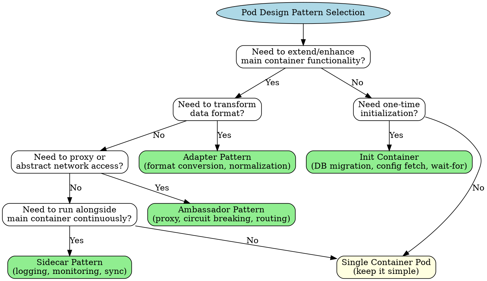
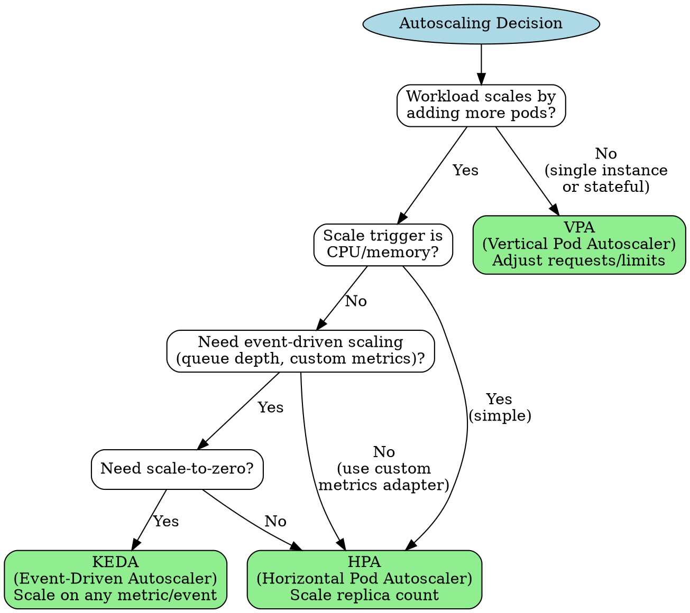
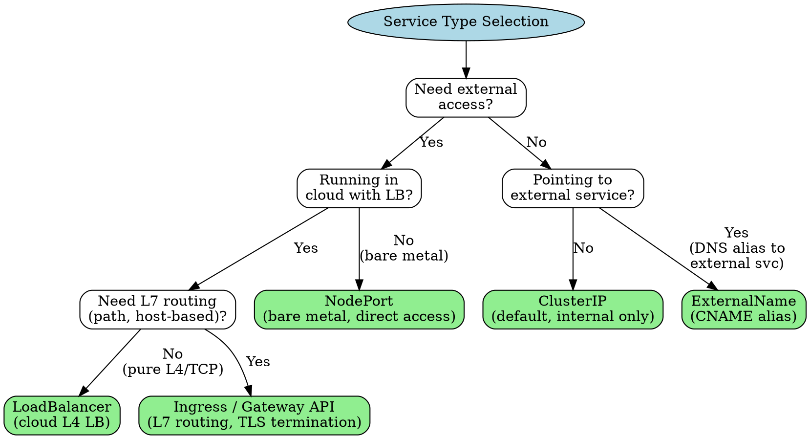
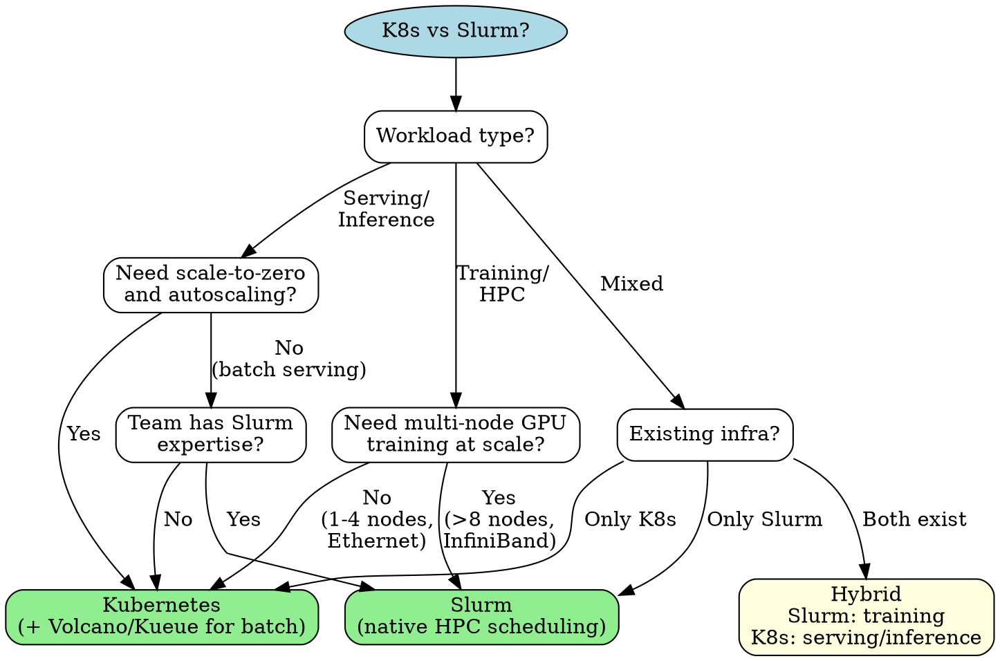
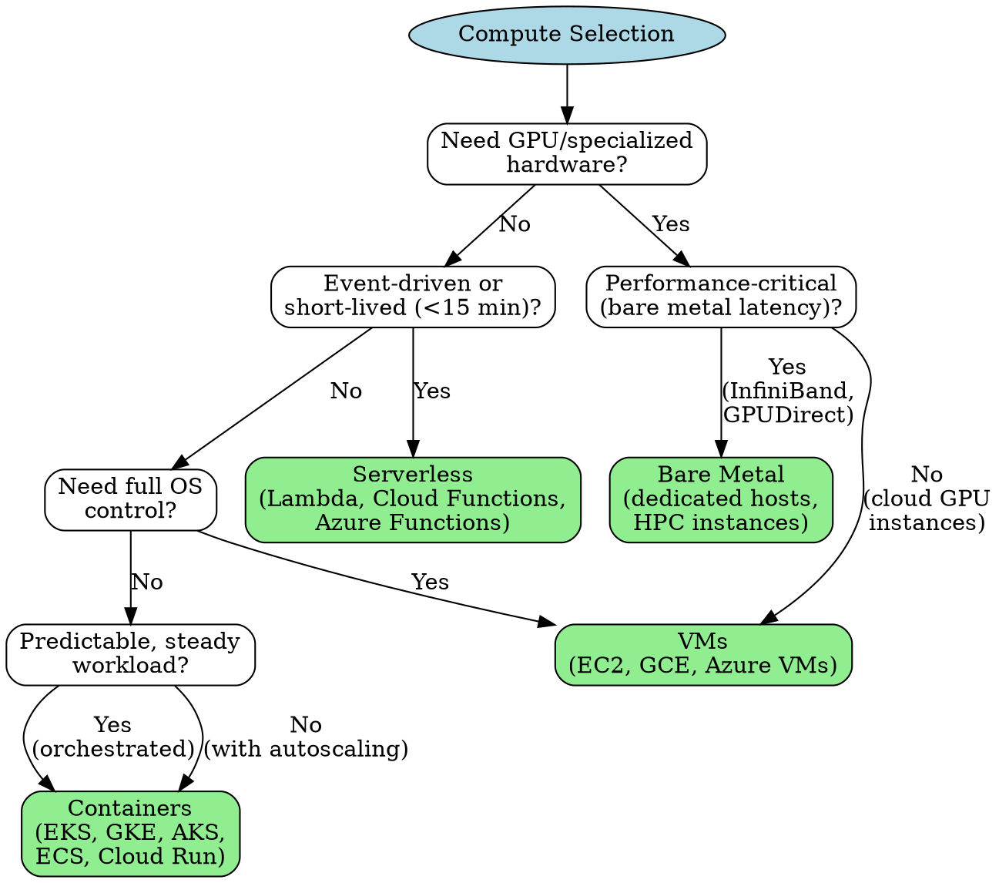
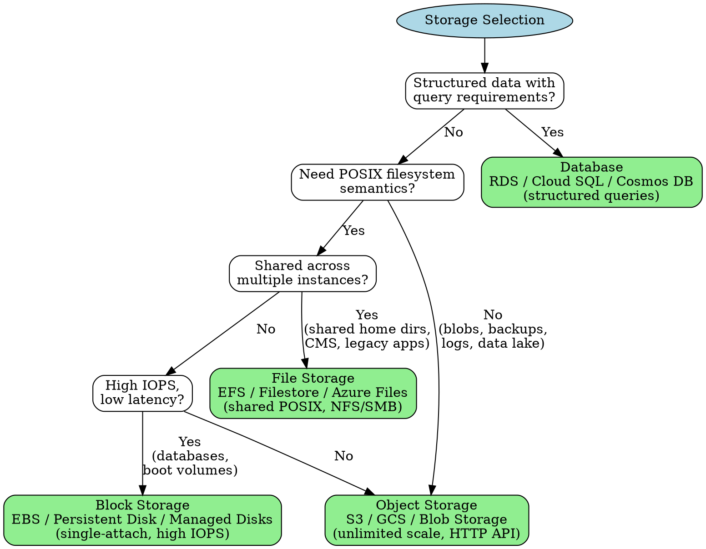
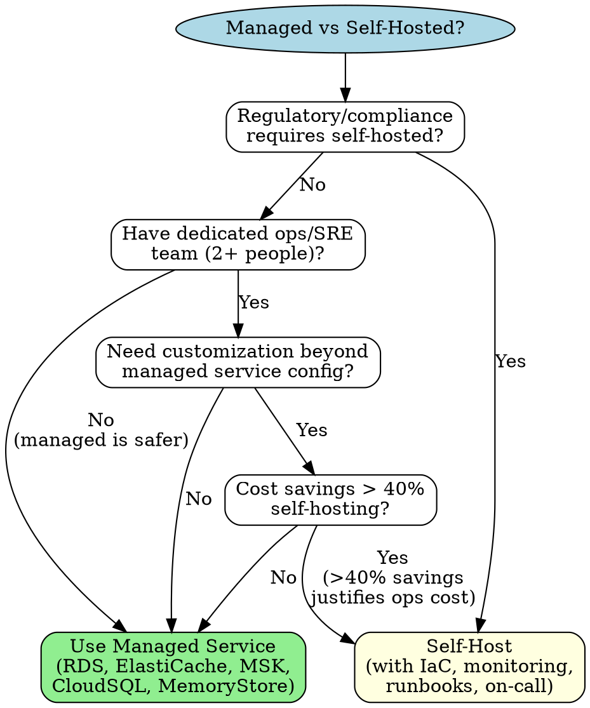
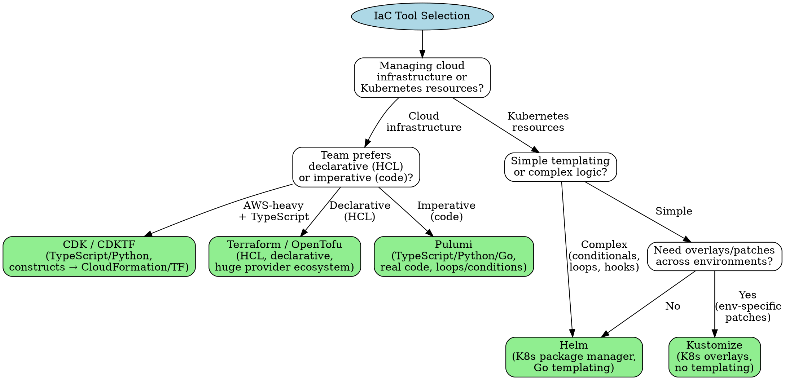
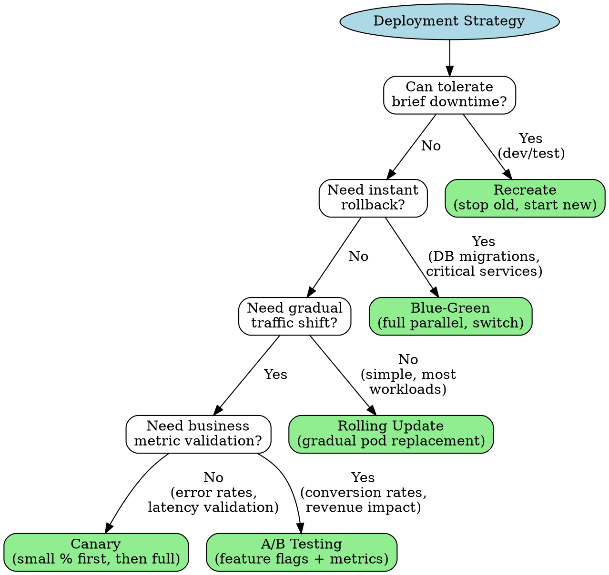

# Cloud & Infrastructure Architecture

**Purpose:** Kubernetes, Slurm/HPC, and cloud deployment decision frameworks for Distinguished Systems Engineer
**Last Updated:** 2026-02-19
**Maintainer:** Distinguished Systems Engineer agent

## Overview

This library provides structured guidance for infrastructure architecture, covering:
- Kubernetes deep patterns (pod design, operators, resource management, networking)
- Slurm/HPC patterns (job scheduling, GPU allocation, multi-node training)
- Cloud service selection (AWS, GCP, Azure decision frameworks)
- Infrastructure as Code (Terraform, Pulumi, Helm)
- Container orchestration and deployment strategies
- Cost optimization and capacity planning

Each section includes:
- **Decision Framework:** When to use what, with trade-offs
- **Configuration Examples:** Production-ready YAML/HCL/code
- **Anti-patterns:** Common mistakes in production
- **Scaling Considerations:** What breaks at scale

## Table of Contents

1. [Kubernetes Deep Patterns](#1-kubernetes-deep-patterns)
   - [Pod Design Patterns](#pod-design-patterns)
   - [Resource Management](#resource-management)
   - [Networking](#networking)
   - [Operator Pattern](#operator-pattern)
   - [StatefulSet Deep Patterns](#statefulset-deep-patterns)
2. [Slurm & HPC Patterns](#2-slurm--hpc-patterns)
   - [Job Scheduling Fundamentals](#job-scheduling-fundamentals)
   - [GPU Scheduling & Multi-Node Training](#gpu-scheduling--multi-node-training)
   - [Resource Management (Slurm)](#resource-management-slurm)
   - [Kubernetes vs Slurm Decision Framework](#kubernetes-vs-slurm-decision-framework)
3. [Cloud Service Selection](#3-cloud-service-selection)
   - [Compute Selection](#compute-selection)
   - [Storage Selection](#storage-selection)
   - [Networking](#cloud-networking)
   - [Managed vs Self-Hosted](#managed-vs-self-hosted)
4. [Infrastructure as Code](#4-infrastructure-as-code)
   - [Tool Selection](#tool-selection)
   - [Terraform Best Practices](#terraform-best-practices)
   - [Helm Best Practices](#helm-best-practices)
5. [Deployment Strategies](#5-deployment-strategies)
   - [Strategy Comparison](#strategy-comparison)
   - [GitOps](#gitops)
   - [Progressive Delivery](#progressive-delivery)
6. [Cost Optimization](#6-cost-optimization)
   - [Compute Cost](#compute-cost)
   - [Storage Cost](#storage-cost)
   - [Network Cost](#network-cost)
   - [Cost Anti-Patterns](#cost-anti-patterns)

---

## 1. Kubernetes Deep Patterns

### Pod Design Patterns

#### Pattern Decision Tree



#### Sidecar Pattern

**When to use:** Logging/monitoring agents, service mesh proxies (Envoy/Istio), config reloaders, certificate rotators.

**When NOT to use:** If the functionality can be a library in the main container. Sidecars add memory overhead (typically 50-128Mi per pod), scheduling complexity, and startup ordering issues.

```yaml
apiVersion: v1
kind: Pod
metadata:
  name: app-with-logging-sidecar
spec:
  containers:
    - name: app
      image: myapp:1.2.3
      ports:
        - containerPort: 8080
      volumeMounts:
        - name: shared-logs
          mountPath: /var/log/app
      resources:
        requests:
          cpu: 250m
          memory: 256Mi
        limits:
          memory: 512Mi
    - name: log-shipper
      image: fluent-bit:2.1
      volumeMounts:
        - name: shared-logs
          mountPath: /var/log/app
          readOnly: true
        - name: fluent-config
          mountPath: /fluent-bit/etc/
      resources:
        requests:
          cpu: 50m
          memory: 64Mi
        limits:
          memory: 128Mi
  volumes:
    - name: shared-logs
      emptyDir: {}
    - name: fluent-config
      configMap:
        name: fluent-bit-config
```

#### Ambassador Pattern

**When to use:** Service discovery proxies, connection pooling (e.g., PgBouncer sidecar), rate limiting, circuit breaking for legacy apps that cannot embed client libraries.

```yaml
apiVersion: v1
kind: Pod
metadata:
  name: app-with-ambassador
spec:
  containers:
    - name: app
      image: legacy-app:3.0
      env:
        - name: DATABASE_URL
          # App connects to localhost; ambassador handles routing
          value: "postgresql://localhost:5432/mydb"
      resources:
        requests:
          cpu: 500m
          memory: 512Mi
        limits:
          memory: 1Gi
    - name: pgbouncer
      image: pgbouncer:1.21
      ports:
        - containerPort: 5432
      env:
        - name: DATABASES_HOST
          value: "primary-db.prod.svc.cluster.local"
        - name: POOL_MODE
          value: "transaction"
        - name: MAX_CLIENT_CONN
          value: "200"
        - name: DEFAULT_POOL_SIZE
          value: "20"
      resources:
        requests:
          cpu: 100m
          memory: 64Mi
        limits:
          memory: 128Mi
```

#### Adapter Pattern

**When to use:** Normalizing metrics from heterogeneous systems to a common format (e.g., Prometheus exposition format), log format transformation, protocol conversion.

```yaml
apiVersion: v1
kind: Pod
metadata:
  name: redis-with-metrics-adapter
spec:
  containers:
    - name: redis
      image: redis:7.2
      ports:
        - containerPort: 6379
      resources:
        requests:
          cpu: 250m
          memory: 256Mi
        limits:
          memory: 512Mi
    - name: redis-exporter
      image: oliver006/redis_exporter:v1.55.0
      ports:
        - containerPort: 9121
          name: metrics
      env:
        - name: REDIS_ADDR
          value: "localhost:6379"
      resources:
        requests:
          cpu: 50m
          memory: 32Mi
        limits:
          memory: 64Mi
```

#### Init Containers

**When to use:** Database migrations before app start, waiting for dependent services, downloading configs/secrets from vault, setting filesystem permissions.

**Ordering guarantee:** Init containers run sequentially, each must complete successfully before the next starts.

```yaml
apiVersion: v1
kind: Pod
metadata:
  name: app-with-init
spec:
  initContainers:
    - name: wait-for-db
      image: busybox:1.36
      command:
        - sh
        - -c
        - |
          until nc -z postgres-primary.prod.svc.cluster.local 5432; do
            echo "Waiting for PostgreSQL..."
            sleep 2
          done
      resources:
        requests:
          cpu: 10m
          memory: 16Mi
        limits:
          memory: 32Mi
    - name: run-migrations
      image: myapp-migrations:1.2.3
      command: ["./migrate", "up"]
      env:
        - name: DATABASE_URL
          valueFrom:
            secretKeyRef:
              name: db-credentials
              key: url
      resources:
        requests:
          cpu: 100m
          memory: 128Mi
        limits:
          memory: 256Mi
  containers:
    - name: app
      image: myapp:1.2.3
      ports:
        - containerPort: 8080
      resources:
        requests:
          cpu: 250m
          memory: 256Mi
        limits:
          memory: 512Mi
```

### Resource Management

#### Requests vs Limits: Why Requests Matter More

**Requests** determine scheduling. The scheduler places pods on nodes based on the sum of requests, not limits. If you set requests too low, the node becomes overcommitted and OOM kills happen under load.

**Limits** are a safety net. CPU limits cause throttling (CFS quota); memory limits cause OOM kills.

**Critical insight:** Set requests to the P95 usage of your container. Set memory limits to 1.5-2x requests. Omit CPU limits in most cases (throttling is worse than burst usage).

| Resource | Request Guidance | Limit Guidance |
|----------|-----------------|----------------|
| **CPU** | P95 steady-state usage | Omit or set to 2-4x request (throttling is harmful) |
| **Memory** | P95 usage + 20% headroom | 1.5-2x request (OOM is worse than throttling) |
| **Ephemeral storage** | Average usage | Peak usage + 20% |

#### QoS Classes

Kubernetes assigns QoS classes based on requests/limits configuration:

| QoS Class | Configuration | Eviction Priority | Use Case |
|-----------|---------------|-------------------|----------|
| **Guaranteed** | requests == limits for ALL containers in pod (cpu + memory) | Last to be evicted | Databases, stateful services, latency-critical APIs |
| **Burstable** | At least one container has request != limit, or only requests set | Middle | Most application workloads |
| **BestEffort** | No requests or limits set on any container | First to be evicted | Batch jobs, dev/test, non-critical workers |

**Anti-pattern:** Setting all pods to Guaranteed. This wastes cluster resources because you cannot overcommit. Reserve Guaranteed for truly critical workloads (5-15% of pods).

#### LimitRange and ResourceQuota

```yaml
# LimitRange: defaults and constraints per pod/container in a namespace
apiVersion: v1
kind: LimitRange
metadata:
  name: default-limits
  namespace: production
spec:
  limits:
    - type: Container
      default:
        cpu: 500m
        memory: 512Mi
      defaultRequest:
        cpu: 100m
        memory: 128Mi
      max:
        cpu: "4"
        memory: 8Gi
      min:
        cpu: 50m
        memory: 64Mi
    - type: PersistentVolumeClaim
      max:
        storage: 100Gi
      min:
        storage: 1Gi
---
# ResourceQuota: aggregate limits per namespace
apiVersion: v1
kind: ResourceQuota
metadata:
  name: production-quota
  namespace: production
spec:
  hard:
    requests.cpu: "64"
    requests.memory: 128Gi
    limits.cpu: "128"
    limits.memory: 256Gi
    pods: "200"
    persistentvolumeclaims: "50"
    services.loadbalancers: "5"
    services.nodeports: "10"
```

#### Autoscaling Decision: VPA vs HPA vs KEDA



| Autoscaler | Scales | Trigger | Scale-to-Zero | Complexity |
|------------|--------|---------|---------------|------------|
| **HPA** | Replica count | CPU, memory, custom metrics | No (min=1) | Low |
| **VPA** | Container resources | Historical usage | N/A | Medium (requires restart) |
| **KEDA** | Replica count | 60+ event sources (queues, cron, Prometheus, etc.) | Yes | Medium |
| **HPA + VPA** | Both | Combined | No | High (use cautiously, conflict risk) |

**Anti-pattern:** Using HPA and VPA together on the same metric (e.g., both scaling on CPU). They fight each other. If you must combine them, use VPA for memory and HPA for CPU, or use KEDA's built-in resource scaling.

#### Production-Ready Deployment Example

```yaml
apiVersion: apps/v1
kind: Deployment
metadata:
  name: api-server
  namespace: production
  labels:
    app: api-server
    version: v1.2.3
    team: platform
spec:
  replicas: 3
  revisionHistoryLimit: 5
  strategy:
    type: RollingUpdate
    rollingUpdate:
      maxSurge: 1
      maxUnavailable: 0
  selector:
    matchLabels:
      app: api-server
  template:
    metadata:
      labels:
        app: api-server
        version: v1.2.3
      annotations:
        prometheus.io/scrape: "true"
        prometheus.io/port: "9090"
        prometheus.io/path: "/metrics"
    spec:
      serviceAccountName: api-server
      terminationGracePeriodSeconds: 60
      securityContext:
        runAsNonRoot: true
        runAsUser: 1000
        runAsGroup: 1000
        fsGroup: 1000
        seccompProfile:
          type: RuntimeDefault
      topologySpreadConstraints:
        - maxSkew: 1
          topologyKey: topology.kubernetes.io/zone
          whenUnsatisfiable: DoNotSchedule
          labelSelector:
            matchLabels:
              app: api-server
      affinity:
        podAntiAffinity:
          preferredDuringSchedulingIgnoredDuringExecution:
            - weight: 100
              podAffinityTerm:
                labelSelector:
                  matchLabels:
                    app: api-server
                topologyKey: kubernetes.io/hostname
      containers:
        - name: api-server
          image: registry.example.com/api-server:1.2.3@sha256:abc123...
          ports:
            - name: http
              containerPort: 8080
              protocol: TCP
            - name: metrics
              containerPort: 9090
              protocol: TCP
          env:
            - name: GOMAXPROCS
              valueFrom:
                resourceFieldRef:
                  resource: requests.cpu
            - name: GOMEMLIMIT
              valueFrom:
                resourceFieldRef:
                  resource: limits.memory
          envFrom:
            - configMapRef:
                name: api-server-config
          resources:
            requests:
              cpu: 500m
              memory: 512Mi
            limits:
              # No CPU limit: avoid throttling
              memory: 1Gi
          startupProbe:
            httpGet:
              path: /healthz
              port: http
            initialDelaySeconds: 5
            periodSeconds: 5
            failureThreshold: 30  # 5 + 30*5 = 155s max startup
          livenessProbe:
            httpGet:
              path: /healthz
              port: http
            periodSeconds: 15
            timeoutSeconds: 5
            failureThreshold: 3
          readinessProbe:
            httpGet:
              path: /readyz
              port: http
            periodSeconds: 5
            timeoutSeconds: 3
            failureThreshold: 3
          lifecycle:
            preStop:
              exec:
                command:
                  - sh
                  - -c
                  - "sleep 10"  # Allow LB to drain connections
          volumeMounts:
            - name: tmp
              mountPath: /tmp
          securityContext:
            allowPrivilegeEscalation: false
            readOnlyRootFilesystem: true
            capabilities:
              drop: ["ALL"]
      volumes:
        - name: tmp
          emptyDir:
            sizeLimit: 100Mi
---
apiVersion: autoscaling/v2
kind: HorizontalPodAutoscaler
metadata:
  name: api-server
  namespace: production
spec:
  scaleTargetRef:
    apiVersion: apps/v1
    kind: Deployment
    name: api-server
  minReplicas: 3
  maxReplicas: 20
  behavior:
    scaleUp:
      stabilizationWindowSeconds: 60
      policies:
        - type: Percent
          value: 50
          periodSeconds: 60
    scaleDown:
      stabilizationWindowSeconds: 300
      policies:
        - type: Percent
          value: 25
          periodSeconds: 120
  metrics:
    - type: Resource
      resource:
        name: cpu
        target:
          type: Utilization
          averageUtilization: 70
    - type: Pods
      pods:
        metric:
          name: http_requests_per_second
        target:
          type: AverageValue
          averageValue: "1000"
---
apiVersion: policy/v1
kind: PodDisruptionBudget
metadata:
  name: api-server
  namespace: production
spec:
  minAvailable: 2
  selector:
    matchLabels:
      app: api-server
```

### Networking

#### Service Types Decision Tree



| Service Type | Layer | External | Cost | Use Case |
|-------------|-------|----------|------|----------|
| **ClusterIP** | L4 | No | Free | Service-to-service communication |
| **NodePort** | L4 | Yes (port 30000-32767) | Free | Bare metal, dev, NodePort range acceptable |
| **LoadBalancer** | L4 | Yes | $15-25/month per LB (cloud) | TCP/UDP services needing dedicated IP |
| **ExternalName** | DNS | No | Free | CNAME to external services (RDS, etc.) |
| **Ingress** | L7 | Yes | 1 LB cost shared | HTTP/HTTPS with path/host routing |
| **Gateway API** | L4-L7 | Yes | 1 LB cost shared | Next-gen ingress, multi-tenant, TCP/HTTP |

#### Ingress vs Gateway API

| Feature | Ingress | Gateway API |
|---------|---------|-------------|
| **Maturity** | Stable, widely adopted | GA (v1.0+), growing adoption |
| **Protocol** | HTTP/HTTPS only | HTTP, HTTPS, TCP, UDP, gRPC, TLS |
| **Multi-tenancy** | Limited (single IngressClass) | Built-in (Gateway/Route separation) |
| **Role separation** | None | Infra admin (Gateway) vs App dev (Route) |
| **Extensibility** | Annotations (vendor-specific) | Typed extension points, policy attachment |
| **Traffic splitting** | Not natively | Native (weight-based routing) |
| **Recommendation** | Existing deployments | New deployments, complex routing |

#### NetworkPolicy: Default-Deny Pattern

```yaml
# Step 1: Default deny all ingress and egress in namespace
apiVersion: networking.k8s.io/v1
kind: NetworkPolicy
metadata:
  name: default-deny-all
  namespace: production
spec:
  podSelector: {}
  policyTypes:
    - Ingress
    - Egress
---
# Step 2: Allow DNS resolution (critical — without this, nothing works)
apiVersion: networking.k8s.io/v1
kind: NetworkPolicy
metadata:
  name: allow-dns
  namespace: production
spec:
  podSelector: {}
  policyTypes:
    - Egress
  egress:
    - to: []
      ports:
        - protocol: UDP
          port: 53
        - protocol: TCP
          port: 53
---
# Step 3: Allow specific service-to-service communication
apiVersion: networking.k8s.io/v1
kind: NetworkPolicy
metadata:
  name: api-server-policy
  namespace: production
spec:
  podSelector:
    matchLabels:
      app: api-server
  policyTypes:
    - Ingress
    - Egress
  ingress:
    - from:
        - namespaceSelector:
            matchLabels:
              name: ingress-nginx
        - podSelector:
            matchLabels:
              app: frontend
      ports:
        - protocol: TCP
          port: 8080
  egress:
    - to:
        - podSelector:
            matchLabels:
              app: postgres
      ports:
        - protocol: TCP
          port: 5432
    - to:
        - podSelector:
            matchLabels:
              app: redis
      ports:
        - protocol: TCP
          port: 6379
```

**Anti-pattern:** NetworkPolicies without testing. Use `kubectl run` ephemeral pods to verify connectivity after applying policies. Missing the DNS egress rule is the most common mistake and causes all DNS resolution to fail.

#### CoreDNS and Headless Services

Headless services (clusterIP: None) return individual pod IPs instead of a virtual IP. Essential for:
- StatefulSet peer discovery (pod-0.service.namespace.svc.cluster.local)
- Client-side load balancing
- Services that need to know all endpoints

```yaml
apiVersion: v1
kind: Service
metadata:
  name: cache-nodes
  namespace: production
spec:
  clusterIP: None  # Headless
  selector:
    app: cache
  ports:
    - port: 6379
      targetPort: 6379
# DNS returns: cache-nodes.production.svc.cluster.local -> [10.0.1.5, 10.0.1.6, 10.0.1.7]
# Individual pods: cache-0.cache-nodes.production.svc.cluster.local -> 10.0.1.5
```

### Operator Pattern

#### When to Build a Custom Operator

Build an operator when:
- You need automated Day 2 operations (backup, restore, failover, scaling) for a stateful system
- The operational knowledge is complex enough that automation prevents human error
- You manage 10+ instances of the same stateful workload
- Standard Kubernetes primitives (Deployment, StatefulSet, Job) cannot express your desired state

Do NOT build an operator when:
- A Helm chart or Kustomize overlay suffices
- The workload is stateless (use Deployment + HPA)
- An existing operator already handles your use case (check OperatorHub.io)
- Your team cannot commit to maintaining it (operators are software, they need updates)

#### Framework Comparison

| Feature | Kubebuilder | Operator SDK | controller-runtime (raw) |
|---------|------------|--------------|--------------------------|
| **Language** | Go | Go, Ansible, Helm | Go |
| **Scaffolding** | Full project generation | Full project generation | None |
| **OLM Integration** | Manual | Built-in | Manual |
| **Learning curve** | Medium | Medium | High |
| **Flexibility** | High | High | Highest |
| **Community** | Large (upstream K8s SIG) | Large (Red Hat/CNCF) | Used by both above |
| **Best for** | Go operators, upstream alignment | Multi-language, OLM publishing | Existing Go projects, max control |

**Recommendation:** Use Kubebuilder for new Go operators. Use Operator SDK if you need Ansible/Helm operators or OLM integration. Use raw controller-runtime only if embedding in an existing Go project.

#### Anti-pattern: Operator That Does Too Much

An operator should manage ONE type of resource and its lifecycle. Signs your operator is too complex:
- It manages more than 3 CRD types
- Reconcile loop exceeds 500 lines
- It has cross-namespace side effects
- It takes more than 30 seconds to reconcile
- It modifies resources it does not own

**Fix:** Split into multiple operators with clear ownership boundaries. Use a "platform operator" that creates CRs for sub-operators.

### StatefulSet Deep Patterns

#### When StatefulSet vs Deployment

| Criterion | StatefulSet | Deployment |
|-----------|------------|------------|
| **Stable network identity** | Yes (pod-0, pod-1, ...) | No (random suffix) |
| **Stable storage** | Yes (PVC per pod) | No (shared or ephemeral) |
| **Ordered deployment** | Yes (0 → 1 → 2) | No (parallel) |
| **Ordered scaling** | Yes (scale up: 0,1,2; scale down: 2,1,0) | No |
| **Use when** | Databases, distributed caches, consensus clusters | Stateless APIs, workers, anything with external state |

#### StatefulSet with Headless Service for Peer Discovery

```yaml
apiVersion: v1
kind: Service
metadata:
  name: etcd
  namespace: infrastructure
spec:
  clusterIP: None
  selector:
    app: etcd
  ports:
    - name: client
      port: 2379
    - name: peer
      port: 2380
---
apiVersion: apps/v1
kind: StatefulSet
metadata:
  name: etcd
  namespace: infrastructure
spec:
  serviceName: etcd  # Must match headless service name
  replicas: 3
  podManagementPolicy: Parallel  # For faster startup (etcd handles its own ordering)
  selector:
    matchLabels:
      app: etcd
  template:
    metadata:
      labels:
        app: etcd
    spec:
      terminationGracePeriodSeconds: 30
      containers:
        - name: etcd
          image: quay.io/coreos/etcd:v3.5.11
          ports:
            - containerPort: 2379
              name: client
            - containerPort: 2380
              name: peer
          env:
            - name: POD_NAME
              valueFrom:
                fieldRef:
                  fieldPath: metadata.name
            - name: ETCD_NAME
              value: "$(POD_NAME)"
            - name: ETCD_INITIAL_CLUSTER
              value: "etcd-0=http://etcd-0.etcd.infrastructure.svc.cluster.local:2380,etcd-1=http://etcd-1.etcd.infrastructure.svc.cluster.local:2380,etcd-2=http://etcd-2.etcd.infrastructure.svc.cluster.local:2380"
            - name: ETCD_INITIAL_CLUSTER_TOKEN
              value: "etcd-cluster-prod"
            - name: ETCD_LISTEN_CLIENT_URLS
              value: "http://0.0.0.0:2379"
            - name: ETCD_LISTEN_PEER_URLS
              value: "http://0.0.0.0:2380"
            - name: ETCD_ADVERTISE_CLIENT_URLS
              value: "http://$(POD_NAME).etcd.infrastructure.svc.cluster.local:2379"
            - name: ETCD_INITIAL_ADVERTISE_PEER_URLS
              value: "http://$(POD_NAME).etcd.infrastructure.svc.cluster.local:2380"
          resources:
            requests:
              cpu: 500m
              memory: 1Gi
            limits:
              memory: 2Gi
          volumeMounts:
            - name: data
              mountPath: /var/run/etcd
          livenessProbe:
            exec:
              command:
                - etcdctl
                - endpoint
                - health
            periodSeconds: 10
            failureThreshold: 3
          readinessProbe:
            exec:
              command:
                - etcdctl
                - endpoint
                - health
            periodSeconds: 5
            failureThreshold: 3
  volumeClaimTemplates:
    - metadata:
        name: data
      spec:
        accessModes: ["ReadWriteOnce"]
        storageClassName: fast-ssd
        resources:
          requests:
            storage: 20Gi
```

#### PVC Management

PVCs created by volumeClaimTemplates are NOT deleted when a StatefulSet is scaled down or deleted. This is intentional (data safety) but can cause storage leaks.

```bash
# Find orphaned PVCs after StatefulSet deletion
kubectl get pvc -n infrastructure -l app=etcd --no-headers | \
  while read name _; do
    pod_name="${name#data-}"
    kubectl get pod "$pod_name" -n infrastructure &>/dev/null || echo "Orphaned PVC: $name"
  done
```

**Anti-pattern:** Using StatefulSet when Deployment + external state works. If your application stores state in an external database or object store, you do NOT need StatefulSet. StatefulSet adds operational complexity (ordered updates, PVC management, recovery). Only use it when the pod itself IS the data store.

---

## 2. Slurm & HPC Patterns

### Job Scheduling Fundamentals

#### Partition Design

Partitions (queues) in Slurm control resource allocation and priority. Design partitions around hardware type and job priority:

```ini
# /etc/slurm/slurm.conf partition excerpt
# General CPU partition
PartitionName=cpu Nodes=cpu-[001-100] Default=YES MaxTime=24:00:00 State=UP
# GPU partition (A100 nodes)
PartitionName=gpu-a100 Nodes=gpu-a100-[001-032] MaxTime=72:00:00 State=UP
# GPU partition (H100 nodes, limited access)
PartitionName=gpu-h100 Nodes=gpu-h100-[001-016] MaxTime=168:00:00 State=UP AllowGroups=ml-research
# Interactive/debug partition (short jobs, high priority)
PartitionName=debug Nodes=cpu-[001-004],gpu-a100-[001-002] MaxTime=01:00:00 State=UP Priority=100
# Preemptible partition (low priority, can be interrupted)
PartitionName=preempt Nodes=ALL MaxTime=24:00:00 State=UP PreemptMode=REQUEUE Priority=10
```

#### Job Arrays

Job arrays run many similar jobs efficiently. Better than submitting individual jobs because Slurm schedules them as a unit.

```bash
#!/bin/bash
#SBATCH --job-name=hyperparameter-sweep
#SBATCH --array=0-99%20        # 100 jobs, max 20 running concurrently
#SBATCH --partition=gpu-a100
#SBATCH --gres=gpu:1
#SBATCH --cpus-per-task=8
#SBATCH --mem=32G
#SBATCH --time=04:00:00
#SBATCH --output=logs/sweep_%A_%a.out  # %A = array job ID, %a = task ID
#SBATCH --error=logs/sweep_%A_%a.err

# Map array index to hyperparameters
LEARNING_RATES=(0.0001 0.0003 0.001 0.003 0.01)
BATCH_SIZES=(16 32 64 128)
DROPOUTS=(0.0 0.1 0.2 0.3 0.5)

LR_IDX=$(( SLURM_ARRAY_TASK_ID / 20 ))
BS_IDX=$(( (SLURM_ARRAY_TASK_ID / 5) % 4 ))
DO_IDX=$(( SLURM_ARRAY_TASK_ID % 5 ))

LR=${LEARNING_RATES[$LR_IDX]}
BS=${BATCH_SIZES[$BS_IDX]}
DO=${DROPOUTS[$DO_IDX]}

echo "Task $SLURM_ARRAY_TASK_ID: lr=$LR bs=$BS dropout=$DO"

python train.py \
    --learning-rate "$LR" \
    --batch-size "$BS" \
    --dropout "$DO" \
    --experiment-id "${SLURM_ARRAY_JOB_ID}_${SLURM_ARRAY_TASK_ID}"
```

#### Job Dependencies

```bash
# afterok: run only if previous job succeeded
JOB1=$(sbatch --parsable preprocess.sh)
JOB2=$(sbatch --parsable --dependency=afterok:$JOB1 train.sh)
JOB3=$(sbatch --parsable --dependency=afterok:$JOB2 evaluate.sh)

# afternotok: run cleanup if job failed
sbatch --dependency=afternotok:$JOB2 cleanup_failed.sh

# afterany: run regardless of success/failure (logging, notification)
sbatch --dependency=afterany:$JOB3 notify.sh

# singleton: only one job with this name can run at a time
sbatch --dependency=singleton --job-name=nightly-retrain retrain.sh

# Complex dependency chains
# Train on 4 data shards, then merge
SHARD_JOBS=""
for i in $(seq 0 3); do
    JID=$(sbatch --parsable --export=SHARD_ID=$i train_shard.sh)
    SHARD_JOBS="${SHARD_JOBS:+$SHARD_JOBS:}$JID"
done
sbatch --dependency=afterok:$SHARD_JOBS merge_shards.sh
```

#### SBATCH Script Template

```bash
#!/bin/bash
#SBATCH --job-name=training-run
#SBATCH --partition=gpu-a100
#SBATCH --nodes=1
#SBATCH --ntasks-per-node=1
#SBATCH --cpus-per-task=16
#SBATCH --mem=128G
#SBATCH --gres=gpu:4
#SBATCH --time=24:00:00
#SBATCH --output=logs/%x_%j.out      # %x = job name, %j = job ID
#SBATCH --error=logs/%x_%j.err
#SBATCH --mail-type=END,FAIL
#SBATCH --mail-user=team@example.com
#SBATCH --signal=B:USR1@120          # Send SIGUSR1 120s before time limit

# -- Environment setup --
module load cuda/12.2
module load nccl/2.19
module load python/3.11

source /shared/envs/ml/bin/activate

# -- Signal handler for graceful checkpoint --
trap_handler() {
    echo "Caught signal, saving checkpoint..."
    kill -USR1 "$TRAIN_PID"
    wait "$TRAIN_PID"
    echo "Checkpoint saved, requeuing job"
    scontrol requeue "$SLURM_JOB_ID"
    exit 0
}
trap trap_handler USR1

# -- Run training --
echo "Starting training on $(hostname)"
echo "GPUs: $CUDA_VISIBLE_DEVICES"
echo "Job ID: $SLURM_JOB_ID"

python train.py \
    --data-dir /shared/datasets/imagenet \
    --checkpoint-dir /scratch/$USER/checkpoints/$SLURM_JOB_ID \
    --num-gpus 4 \
    --epochs 100 \
    --resume-from-checkpoint &

TRAIN_PID=$!
wait "$TRAIN_PID"
```

### GPU Scheduling & Multi-Node Training

#### GPU Allocation Strategies

| Strategy | Config | Use Case | Waste |
|----------|--------|----------|-------|
| **Exclusive GPU** | `--gres=gpu:1` | Single-GPU training, inference | Low if GPU is fully utilized |
| **Multiple GPUs** | `--gres=gpu:4` | Data-parallel training | Moderate if model is small |
| **Full Node** | `--gres=gpu:8 --exclusive` | Large-model training, NCCL optimized | High if not using all GPUs |
| **MIG (A100/H100)** | `--gres=gpu:a100_1g.5gb:1` | Small inference, hyperparameter tuning | Lowest |
| **MPS (time-sharing)** | CUDA_MPS_PIPE_DIRECTORY | Multiple small inference tasks | Low |

#### MIG (Multi-Instance GPU) Configuration

A100 80GB can be partitioned into up to 7 instances:

```bash
# Check current MIG status
nvidia-smi mig -lgip    # List GPU instance profiles
nvidia-smi mig -lgi     # List current GPU instances

# Common MIG profiles for A100-80GB:
# Profile 19: 1g.10gb (1/7 GPU, 10GB)  - small inference
# Profile 14: 2g.20gb (2/7 GPU, 20GB)  - medium inference
# Profile  9: 3g.40gb (3/7 GPU, 40GB)  - training/large inference
# Profile  5: 4g.40gb (4/7 GPU, 40GB)  - training
# Profile  0: 7g.80gb (full GPU, 80GB) - large model training

# Slurm GRES configuration for MIG
# /etc/slurm/gres.conf
# NodeName=gpu-a100-001 Name=gpu Type=a100_1g.10gb File=/dev/nvidia0 Count=7
# NodeName=gpu-a100-001 Name=gpu Type=a100_3g.40gb File=/dev/nvidia0 Count=2
```

#### NCCL Environment Variables for Multi-Node

```bash
# Essential NCCL configuration for multi-node training
export NCCL_DEBUG=INFO                      # Debug logging (use WARN in production)
export NCCL_IB_DISABLE=0                    # Enable InfiniBand (set 1 if using RoCE/TCP)
export NCCL_NET_GDR_LEVEL=5                # GPUDirect RDMA level (5 = max)
export NCCL_IB_HCA=mlx5                    # InfiniBand HCA device prefix
export NCCL_IB_GID_INDEX=3                 # RoCEv2 GID index
export NCCL_SOCKET_IFNAME=ib0              # Network interface for OOB communication
export NCCL_NSOCKS_PERTHREAD=4             # Sockets per thread
export NCCL_SOCKET_NTHREADS=2             # Socket threads

# Performance tuning
export NCCL_BUFFSIZE=8388608               # 8MB buffer (increase for large allreduce)
export NCCL_P2P_LEVEL=NVL                  # NVLink for intra-node, IB for inter-node
export NCCL_CROSS_NIC=1                    # Allow cross-NIC communication
```

#### InfiniBand vs RoCE Decision

| Feature | InfiniBand (IB) | RoCE v2 | TCP/IP |
|---------|-----------------|---------|--------|
| **Latency** | ~1 μs | ~2-3 μs | ~50-100 μs |
| **Bandwidth** | 200-400 Gbps (HDR/NDR) | 100-200 Gbps | 10-100 Gbps |
| **GPUDirect RDMA** | Native | Supported | Not available |
| **Cost** | Highest (dedicated switches) | Medium (Ethernet + RDMA) | Lowest |
| **Use for** | Large-scale training (>8 nodes) | Medium scale, existing Ethernet | Small scale, development |
| **Multi-node scaling** | Near-linear to 1000+ GPUs | Good to ~256 GPUs | Bottleneck at ~16 GPUs |

#### Slurm + PyTorch Distributed Training

```bash
#!/bin/bash
#SBATCH --job-name=distributed-training
#SBATCH --partition=gpu-h100
#SBATCH --nodes=4
#SBATCH --ntasks-per-node=8           # 8 GPUs per node
#SBATCH --cpus-per-task=12            # 12 CPUs per GPU (for data loading)
#SBATCH --mem=0                       # Request all memory on node
#SBATCH --gres=gpu:8
#SBATCH --exclusive                    # Exclusive node access
#SBATCH --time=72:00:00
#SBATCH --output=logs/dist_%j.out
#SBATCH --error=logs/dist_%j.err

# -- Environment --
module load cuda/12.2 nccl/2.19

# -- NCCL Config --
export NCCL_IB_DISABLE=0
export NCCL_NET_GDR_LEVEL=5
export NCCL_IB_HCA=mlx5
export NCCL_DEBUG=WARN

# -- PyTorch Distributed Setup --
export MASTER_ADDR=$(scontrol show hostname "$SLURM_NODELIST" | head -n1)
export MASTER_PORT=29500
export WORLD_SIZE=$((SLURM_NNODES * SLURM_NTASKS_PER_NODE))

echo "Master: $MASTER_ADDR:$MASTER_PORT"
echo "World size: $WORLD_SIZE"
echo "Nodes: $SLURM_NODELIST"

# Use srun to launch one process per GPU across all nodes
srun --kill-on-bad-exit=1 python -u train_distributed.py \
    --backend nccl \
    --model llama-7b \
    --data-path /shared/datasets/training \
    --checkpoint-dir /scratch/$USER/checkpoints/$SLURM_JOB_ID \
    --per-device-batch-size 4 \
    --gradient-accumulation-steps 8 \
    --learning-rate 3e-4 \
    --warmup-steps 2000 \
    --max-steps 100000 \
    --save-steps 1000 \
    --fp16
```

Corresponding Python launcher:

```python
# train_distributed.py
import os
import torch
import torch.distributed as dist
from torch.nn.parallel import DistributedDataParallel as DDP

def setup_distributed():
    """Initialize distributed training from Slurm environment."""
    # Slurm sets SLURM_PROCID (global rank) and SLURM_LOCALID (local rank)
    rank = int(os.environ["SLURM_PROCID"])
    local_rank = int(os.environ["SLURM_LOCALID"])
    world_size = int(os.environ["WORLD_SIZE"])
    master_addr = os.environ["MASTER_ADDR"]
    master_port = os.environ["MASTER_PORT"]

    os.environ["RANK"] = str(rank)
    os.environ["LOCAL_RANK"] = str(local_rank)

    dist.init_process_group(
        backend="nccl",
        init_method=f"tcp://{master_addr}:{master_port}",
        world_size=world_size,
        rank=rank,
    )
    torch.cuda.set_device(local_rank)
    return rank, local_rank, world_size

def main():
    rank, local_rank, world_size = setup_distributed()

    model = build_model().cuda(local_rank)
    model = DDP(model, device_ids=[local_rank])

    # ... training loop with checkpoint saving on rank 0 ...

    dist.destroy_process_group()

if __name__ == "__main__":
    main()
```

#### Slurm + Horovod Example

```bash
#!/bin/bash
#SBATCH --job-name=horovod-training
#SBATCH --partition=gpu-a100
#SBATCH --nodes=2
#SBATCH --ntasks-per-node=4
#SBATCH --cpus-per-task=8
#SBATCH --mem=256G
#SBATCH --gres=gpu:4
#SBATCH --time=48:00:00
#SBATCH --output=logs/hvd_%j.out

module load cuda/12.2 nccl/2.19 openmpi/4.1

# Horovod uses MPI — srun or mpirun both work
# srun is preferred on Slurm (better integration)
srun --mpi=pmix_v4 python train_horovod.py \
    --batch-size 64 \
    --epochs 90 \
    --fp16
```

```python
# train_horovod.py
import horovod.torch as hvd
import torch

hvd.init()
torch.cuda.set_device(hvd.local_rank())

model = build_model().cuda()
optimizer = torch.optim.Adam(model.parameters(), lr=0.001 * hvd.size())

# Broadcast parameters from rank 0
hvd.broadcast_parameters(model.state_dict(), root_rank=0)
hvd.broadcast_optimizer_state(optimizer, root_rank=0)

# Wrap optimizer for distributed gradient averaging
optimizer = hvd.DistributedOptimizer(
    optimizer,
    named_parameters=model.named_parameters(),
    compression=hvd.Compression.fp16,  # Gradient compression
)
```

**Anti-pattern: Requesting full nodes for 1 GPU.** If your training uses 1 GPU, request `--gres=gpu:1` and appropriate CPU/memory, NOT `--exclusive`. Exclusive access wastes 7 GPUs per node. Exception: if you need all the CPU memory (e.g., large data preprocessing) or NVLink bandwidth, exclusive is justified.

### Resource Management (Slurm)

#### Fair-Share Scheduling

Fair-share ensures equitable resource distribution across accounts/users over time. Users who have consumed less than their fair share get higher priority.

```ini
# /etc/slurm/slurm.conf
PriorityType=priority/multifactor
PriorityWeightAge=1000          # Wait time factor
PriorityWeightFairshare=10000   # Fair-share dominates
PriorityWeightJobSize=500       # Smaller jobs get slight boost
PriorityWeightPartition=1000    # Partition-based priority
PriorityDecayHalfLife=14-0      # 14-day half-life for usage decay
```

```bash
# Check fair-share status
sshare -a -l
# Output: Account, User, RawShares, NormShares, RawUsage, NormUsage, EffectvUsage, FairShare

# Check job priority breakdown
sprio -l -j <job_id>
```

#### Backfill Scheduling

Backfill allows smaller jobs to start before larger jobs if they will complete before the large job's expected start time. This is critical for utilization.

**Key insight:** Backfill only works if jobs specify accurate `--time` limits. If all jobs request the maximum, backfill is ineffective.

```bash
# Backfill-friendly: specify realistic time limits
#SBATCH --time=02:00:00    # 2 hours, not 72:00:00

# Check expected start times
squeue --start -u $USER
```

#### Memory/CPU Overcommit Risks

| Risk | Symptom | Mitigation |
|------|---------|------------|
| **Memory overcommit** | OOM kills, node instability | Set `OverSubscribe=NO` on critical partitions; use `--mem-per-cpu` |
| **CPU overcommit** | Slow jobs, inconsistent performance | Set `OverSubscribe=FORCE:2` maximum (2x overcommit) |
| **GPU memory** | CUDA OOM errors | Cannot overcommit GPU memory; right-size or use MIG |
| **Swap thrashing** | Jobs 10-100x slower | Disable swap on compute nodes or set swappiness=1 |

#### Monitoring with sacct and sinfo

```bash
# Check completed job efficiency
sacct -j <job_id> --format=JobID,JobName,Elapsed,MaxRSS,MaxVMSize,ReqMem,AllocCPUS,TotalCPU,State

# Find inefficient jobs (low CPU utilization)
sacct --starttime=$(date -d '7 days ago' +%Y-%m-%d) \
  --format=JobID,User,AllocCPUS,TotalCPU,Elapsed,State \
  --state=COMPLETED | awk 'NR>2 {
    split($4, cpu, ":"); split($5, wall, ":");
    cpu_sec = cpu[1]*3600 + cpu[2]*60 + cpu[3];
    wall_sec = wall[1]*3600 + wall[2]*60 + wall[3];
    if (wall_sec > 0 && $3 > 0) {
      eff = cpu_sec / (wall_sec * $3) * 100;
      if (eff < 20) print $0, "  EFFICIENCY:", eff"%"
    }
  }'

# Node status overview
sinfo --format="%20N %10P %10T %10c %10m %20G %10e"
# Output: NODELIST, PARTITION, STATE, CPUS, MEMORY, GRES, FREE_MEM
```

### Kubernetes vs Slurm Decision Framework



| Factor | Kubernetes | Slurm |
|--------|-----------|-------|
| **Scheduling model** | Continuous (pods always running) | Batch (jobs start and end) |
| **GPU support** | Device plugin + topology-aware | Native GRES, MIG, MPS |
| **Multi-node training** | Possible (Volcano, Kueue, MPI Operator) | Native, battle-tested |
| **InfiniBand** | Requires SR-IOV, host networking | Native support |
| **Autoscaling** | HPA, KEDA, Karpenter (scale nodes) | No native autoscaling |
| **Service mesh** | Native (Istio, Linkerd) | Not applicable |
| **Multi-tenancy** | Namespaces, RBAC, NetworkPolicy | Accounts, partitions, QOS |
| **Learning curve** | Steep (YAML, networking, storage) | Moderate (shell scripts, sbatch) |
| **Best for** | Microservices, serving, CI/CD | Large-scale training, HPC |

**Hybrid approach (recommended for ML orgs):**
- **Slurm** for: multi-node training, hyperparameter sweeps, large batch jobs
- **Kubernetes** for: model serving (Triton, TGI, vLLM), API endpoints, monitoring, CI/CD
- **Bridge:** Training completes on Slurm → model artifact pushed to registry → K8s serving deployment auto-updated

---

## 3. Cloud Service Selection

### Compute Selection

#### Decision Tree: VM vs Container vs Serverless vs Bare Metal



#### Cloud Compute Options Matrix

| Service | AWS | GCP | Azure | When to Use |
|---------|-----|-----|-------|-------------|
| **VMs** | EC2 | Compute Engine (GCE) | Virtual Machines | Full OS control, legacy apps, specific hardware |
| **Managed K8s** | EKS ($73/mo/cluster) | GKE (free/Autopilot) | AKS (free control plane) | Microservices, complex orchestration |
| **Container Service** | ECS + Fargate | Cloud Run | Container Apps | Simpler container workloads, per-request billing |
| **Serverless** | Lambda (15 min max) | Cloud Functions (60 min) | Functions (10 min) | Event-driven, short-lived, infrequent |
| **Bare Metal** | EC2 .metal instances | Bare Metal Solution | Dedicated Hosts | HPC, licensing, compliance, max performance |
| **GPU Instances** | P4d/P5 (A100/H100) | A2/A3 (A100/H100) | ND (A100/H100) | ML training, inference |
| **Spot/Preemptible** | Spot (up to 90% off) | Spot VMs (60-91% off) | Spot VMs (up to 90% off) | Fault-tolerant batch, CI/CD |

### Storage Selection

#### Block vs Object vs File vs Database Decision Tree



| Storage Type | AWS | GCP | Azure | IOPS | Throughput | Cost (per GB/mo) |
|-------------|-----|-----|-------|------|------------|-------------------|
| **Block (SSD)** | EBS gp3 | PD SSD | Premium SSD | 3K-16K | 125-1000 MB/s | $0.08-0.17 |
| **Block (HDD)** | EBS st1 | PD Standard | Standard HDD | 500 | 40-500 MB/s | $0.025-0.045 |
| **Object** | S3 Standard | GCS Standard | Blob Hot | N/A | 5500 PUT/s per prefix | $0.021-0.023 |
| **Object (IA)** | S3 IA | GCS Nearline | Blob Cool | N/A | Same | $0.0125-0.01 |
| **File (NFS)** | EFS | Filestore | Azure Files | Variable | Up to 10 GB/s | $0.08-0.30 |
| **File (High Perf)** | FSx Lustre | Filestore Enterprise | Azure NetApp | 100K+ | Up to 100 GB/s | $0.14-0.45 |

### Cloud Networking

#### VPC Design: Multi-AZ Architecture

```
┌─────────────────────────────────── VPC: 10.0.0.0/16 ───────────────────────────────────┐
│                                                                                         │
│  ┌──────── AZ-a ────────┐  ┌──────── AZ-b ────────┐  ┌──────── AZ-c ────────┐        │
│  │                       │  │                       │  │                       │        │
│  │ Public: 10.0.1.0/24  │  │ Public: 10.0.2.0/24  │  │ Public: 10.0.3.0/24  │        │
│  │ (ALB, NAT GW, Bastion)│  │ (ALB, NAT GW)        │  │ (ALB, NAT GW)        │        │
│  │                       │  │                       │  │                       │        │
│  │ Private: 10.0.11.0/24│  │ Private: 10.0.12.0/24│  │ Private: 10.0.13.0/24│        │
│  │ (App servers, K8s)    │  │ (App servers, K8s)    │  │ (App servers, K8s)    │        │
│  │                       │  │                       │  │                       │        │
│  │ Data: 10.0.21.0/24   │  │ Data: 10.0.22.0/24   │  │ Data: 10.0.23.0/24   │        │
│  │ (RDS, ElastiCache)    │  │ (RDS, ElastiCache)    │  │ (RDS, ElastiCache)    │        │
│  │                       │  │                       │  │                       │        │
│  └───────────────────────┘  └───────────────────────┘  └───────────────────────┘        │
│                                                                                         │
│  Internet GW ←→ Public subnets ←→ NAT GW ←→ Private subnets                           │
│  Private subnets ←→ VPC Endpoints (S3, DynamoDB, ECR, etc.)                            │
│                                                                                         │
└─────────────────────────────────────────────────────────────────────────────────────────┘
```

**Key rules:**
- Public subnets: Only load balancers, NAT gateways, bastion hosts
- Private subnets: All application workloads
- Data subnets: Databases, caches (no internet route)
- Use /16 for VPC, /24 for subnets (251 usable IPs each)
- Reserve CIDR space for future AZs and peering

#### Load Balancer Selection

| Type | AWS | GCP | Azure | Layer | Use Case |
|------|-----|-----|-------|-------|----------|
| **Application LB** | ALB | External HTTP(S) LB | Application Gateway | L7 | HTTP/HTTPS, path routing, WebSocket |
| **Network LB** | NLB | External TCP/UDP LB | Load Balancer | L4 | TCP/UDP, static IP, extreme perf |
| **Internal LB** | Internal ALB/NLB | Internal HTTP(S)/TCP LB | Internal LB | L4/L7 | Service-to-service |
| **Gateway LB** | GWLB | N/A | Gateway LB | L3 | Firewall/IDS appliance chaining |

#### Service Mesh in Cloud

| Mesh | Managed By | Data Plane | Best For |
|------|-----------|------------|----------|
| **AWS App Mesh** | AWS | Envoy | ECS/EKS workloads on AWS |
| **GKE + Anthos Service Mesh** | Google | Envoy (Istio-based) | GKE workloads |
| **Istio** | Self-managed | Envoy | Multi-cloud, complex routing |
| **Linkerd** | Self-managed | linkerd2-proxy (Rust) | Simplicity, low resource overhead |
| **Consul Connect** | HashiCorp | Envoy or built-in | Multi-platform (K8s + VMs) |

### Managed vs Self-Hosted

#### Decision Framework



#### Breakeven Analysis Examples

| Service | Managed Cost | Self-Hosted Cost | Breakeven Point | Recommendation |
|---------|-------------|-----------------|-----------------|----------------|
| **PostgreSQL** (db.r6g.xlarge) | RDS: ~$450/mo | EC2 + EBS: ~$250/mo | Need 0.5 FTE DBA ($4K/mo) to self-manage | Managed unless >10 instances |
| **Redis** (cache.r6g.large) | ElastiCache: ~$230/mo | EC2: ~$130/mo | Need monitoring, failover, patching | Managed unless extreme performance tuning needed |
| **Kafka** (3 broker, m5.2xlarge) | MSK: ~$1,200/mo | EC2: ~$700/mo | Kafka ops is notoriously complex | Managed unless team has deep Kafka expertise |
| **Kubernetes** (control plane) | EKS: $73/mo | kubeadm: $0 (+ ops) | Control plane ops is thankless | Always managed (EKS/GKE/AKS) |
| **Elasticsearch** (3-node) | OpenSearch: ~$900/mo | EC2: ~$500/mo | Heap tuning, shard management, upgrades | Managed for <5 nodes, self-host at scale |

**Anti-pattern: Self-hosting without ops capacity.** A team of 5 developers managing their own PostgreSQL, Redis, Kafka, and Elasticsearch is a recipe for 3AM pages and data loss. The $2K/month savings vanishes with one outage (engineer hours) or data loss event. Use managed services until you have dedicated SRE headcount.

---

## 4. Infrastructure as Code

### Tool Selection



| Tool | Language | State | Learning Curve | Ecosystem | Best For |
|------|----------|-------|---------------|-----------|----------|
| **Terraform** | HCL | Remote (S3, GCS, etc.) | Medium | 3000+ providers | Multi-cloud infrastructure |
| **OpenTofu** | HCL | Same as Terraform | Medium | Fork of Terraform | Terraform without BSL license |
| **Pulumi** | TS, Python, Go, C# | Pulumi Cloud or S3 | Medium-High | Growing | Teams who want real programming languages |
| **CDK** | TS, Python, Java | CloudFormation | High | AWS only | AWS-native with constructs |
| **CDKTF** | TS, Python | Terraform state | High | Terraform providers | CDK patterns + Terraform providers |
| **Helm** | Go templates + YAML | N/A (K8s state) | Medium | 10K+ charts | Kubernetes package management |
| **Kustomize** | YAML patches | N/A (K8s state) | Low | Built into kubectl | K8s environment overlays |

### Terraform Best Practices

#### Module Structure

```
infrastructure/
├── modules/                    # Reusable modules
│   ├── vpc/
│   │   ├── main.tf
│   │   ├── variables.tf
│   │   ├── outputs.tf
│   │   └── versions.tf
│   ├── eks-cluster/
│   │   ├── main.tf
│   │   ├── variables.tf
│   │   ├── outputs.tf
│   │   └── versions.tf
│   └── rds/
│       ├── main.tf
│       ├── variables.tf
│       ├── outputs.tf
│       └── versions.tf
├── environments/               # Environment-specific configuration
│   ├── dev/
│   │   ├── main.tf            # Module instantiation
│   │   ├── terraform.tfvars   # Dev-specific values
│   │   └── backend.tf         # Dev state backend
│   ├── staging/
│   │   ├── main.tf
│   │   ├── terraform.tfvars
│   │   └── backend.tf
│   └── production/
│       ├── main.tf
│       ├── terraform.tfvars
│       └── backend.tf
└── global/                     # Shared resources (IAM, DNS)
    ├── iam/
    │   ├── main.tf
    │   └── backend.tf
    └── dns/
        ├── main.tf
        └── backend.tf
```

#### State Management: S3 + DynamoDB

```hcl
# backend.tf — production environment
terraform {
  backend "s3" {
    bucket         = "mycompany-terraform-state"
    key            = "production/infrastructure.tfstate"
    region         = "us-east-1"
    encrypt        = true
    dynamodb_table = "terraform-state-lock"
    # Use assume_role for cross-account state access
    role_arn       = "arn:aws:iam::123456789012:role/TerraformStateAccess"
  }
}

# State bucket and lock table (bootstrap once, manually or with a separate TF config)
resource "aws_s3_bucket" "terraform_state" {
  bucket = "mycompany-terraform-state"

  lifecycle {
    prevent_destroy = true
  }
}

resource "aws_s3_bucket_versioning" "terraform_state" {
  bucket = aws_s3_bucket.terraform_state.id
  versioning_configuration {
    status = "Enabled"
  }
}

resource "aws_s3_bucket_server_side_encryption_configuration" "terraform_state" {
  bucket = aws_s3_bucket.terraform_state.id
  rule {
    apply_server_side_encryption_by_default {
      sse_algorithm = "aws:kms"
    }
  }
}

resource "aws_dynamodb_table" "terraform_locks" {
  name         = "terraform-state-lock"
  billing_mode = "PAY_PER_REQUEST"
  hash_key     = "LockID"

  attribute {
    name = "LockID"
    type = "S"
  }
}
```

#### Workspace vs Directory Separation

| Approach | Pros | Cons | Use When |
|----------|------|------|----------|
| **Workspaces** | Less code duplication, single config | Hard to diverge between envs, shared backend config, easy to apply to wrong workspace | Environments are nearly identical |
| **Directories** | Full isolation, clear separation, independent state | Code duplication across envs | Environments differ significantly, need independent blast radius |

**Recommendation:** Use directory separation (environments/dev, environments/staging, environments/production) with shared modules. Workspaces are acceptable for ephemeral environments (PR previews, feature branches).

#### Anti-pattern: Monolithic Root Module

A single root module with >500 resources leads to:
- `terraform plan` takes 5-15 minutes (API rate limits, dependency graph)
- Blast radius is the entire infrastructure
- State file becomes large and fragile
- Team contention on state locks

**Fix:** Split into focused root modules:
- `networking/` — VPC, subnets, route tables, security groups
- `compute/` — EKS cluster, node groups, autoscaling
- `data/` — RDS, ElastiCache, S3 buckets
- `monitoring/` — CloudWatch, Prometheus, alerting rules

Use `terraform_remote_state` data source or Terragrunt `dependency` blocks to share outputs between modules.

### Helm Best Practices

#### Chart Structure

```
charts/
└── api-server/
    ├── Chart.yaml
    ├── Chart.lock
    ├── values.yaml              # Default values
    ├── values-dev.yaml          # Dev overrides
    ├── values-staging.yaml      # Staging overrides
    ├── values-production.yaml   # Production overrides
    ├── templates/
    │   ├── _helpers.tpl         # Named templates
    │   ├── deployment.yaml
    │   ├── service.yaml
    │   ├── ingress.yaml
    │   ├── hpa.yaml
    │   ├── pdb.yaml
    │   ├── serviceaccount.yaml
    │   ├── configmap.yaml
    │   ├── NOTES.txt            # Post-install instructions
    │   └── tests/
    │       └── test-connection.yaml
    └── ci/
        └── test-values.yaml     # Values for CI testing
```

#### Values Hierarchy

```yaml
# values.yaml — sane defaults, works out of the box for dev
replicaCount: 1
image:
  repository: registry.example.com/api-server
  tag: latest
  pullPolicy: IfNotPresent
resources:
  requests:
    cpu: 100m
    memory: 128Mi
  limits:
    memory: 256Mi
autoscaling:
  enabled: false
ingress:
  enabled: false

# values-production.yaml — production overrides only
replicaCount: 3
image:
  pullPolicy: Always
resources:
  requests:
    cpu: 500m
    memory: 512Mi
  limits:
    memory: 1Gi
autoscaling:
  enabled: true
  minReplicas: 3
  maxReplicas: 20
  targetCPUUtilization: 70
ingress:
  enabled: true
  className: nginx
  hosts:
    - host: api.example.com
      paths:
        - path: /
          pathType: Prefix
  tls:
    - secretName: api-tls
      hosts:
        - api.example.com
```

```bash
# Install with production values
helm upgrade --install api-server ./charts/api-server \
  -f charts/api-server/values-production.yaml \
  --set image.tag=1.2.3 \
  --namespace production \
  --wait --timeout 5m
```

#### Helm Hooks

```yaml
# templates/pre-upgrade-migration.yaml
apiVersion: batch/v1
kind: Job
metadata:
  name: {{ include "api-server.fullname" . }}-migrate
  annotations:
    "helm.sh/hook": pre-upgrade
    "helm.sh/hook-weight": "-5"
    "helm.sh/hook-delete-policy": before-hook-creation,hook-succeeded
spec:
  backoffLimit: 3
  template:
    spec:
      restartPolicy: Never
      containers:
        - name: migrate
          image: "{{ .Values.image.repository }}:{{ .Values.image.tag }}"
          command: ["./migrate", "up"]
          env:
            - name: DATABASE_URL
              valueFrom:
                secretKeyRef:
                  name: db-credentials
                  key: url
```

#### Anti-pattern: Over-Templating

Signs your Helm chart is over-templated:
- `_helpers.tpl` exceeds 200 lines
- Nested `{{ if }}` blocks more than 3 levels deep
- Templating logic that generates fundamentally different resource types based on values
- Values file has more than 100 configurable fields

**Fix:** Use Kustomize overlays for environment differences. Keep Helm for packaging and dependency management, not as a general-purpose templating engine. If you need complex logic, use Pulumi or CDK instead.

---

## 5. Deployment Strategies

### Strategy Comparison

| Strategy | Risk | Rollback Speed | Resource Cost | Complexity | Best For |
|----------|------|---------------|---------------|------------|----------|
| **Rolling Update** | Medium | Medium (new rollout) | 1x + surge | Low | Most workloads, default choice |
| **Blue-Green** | Low | Instant (switch LB) | 2x | Medium | Databases, critical services |
| **Canary** | Lowest | Fast (route to stable) | 1x + canary % | High | High-traffic services, gradual validation |
| **A/B Testing** | Low | Fast (route to stable) | 1x + test % | Highest | Feature validation, business metrics |
| **Recreate** | Highest | Slow (full deploy) | 1x | Lowest | Dev/test, downtime acceptable |

#### Deployment Strategy Decision Tree



### GitOps

#### ArgoCD vs Flux

| Feature | ArgoCD | Flux v2 |
|---------|--------|---------|
| **UI** | Rich web UI, visualization | CLI-only (or Weave GitOps UI) |
| **Multi-cluster** | ApplicationSet, centralized management | Kustomization, decentralized |
| **Sync strategies** | Auto-sync, manual sync, sync waves | Auto-reconciliation, dependencies |
| **Helm support** | Native (renders on server) | HelmRelease CRD (renders on cluster) |
| **RBAC** | Built-in, SSO integration | K8s native RBAC |
| **Notifications** | Built-in (Slack, Teams, etc.) | Notification controller |
| **Multi-tenancy** | AppProject isolation | Namespace-scoped controllers |
| **Community** | Larger, CNCF graduated | CNCF graduated, smaller |
| **Best for** | Teams wanting UI, centralized management | Teams wanting lightweight, decentralized |

#### GitOps Repository Structure

```
gitops-repo/
├── apps/                       # Application definitions
│   ├── api-server/
│   │   ├── base/
│   │   │   ├── kustomization.yaml
│   │   │   ├── deployment.yaml
│   │   │   ├── service.yaml
│   │   │   └── hpa.yaml
│   │   └── overlays/
│   │       ├── dev/
│   │       │   ├── kustomization.yaml
│   │       │   └── patch-replicas.yaml
│   │       ├── staging/
│   │       │   ├── kustomization.yaml
│   │       │   └── patch-resources.yaml
│   │       └── production/
│   │           ├── kustomization.yaml
│   │           ├── patch-resources.yaml
│   │           └── patch-replicas.yaml
│   └── frontend/
│       ├── base/
│       └── overlays/
├── infrastructure/             # Cluster-level resources
│   ├── cert-manager/
│   ├── ingress-nginx/
│   ├── monitoring/
│   └── sealed-secrets/
├── clusters/                   # Cluster-specific entrypoints
│   ├── dev/
│   │   ├── apps.yaml          # ArgoCD Application or Flux Kustomization
│   │   └── infrastructure.yaml
│   ├── staging/
│   └── production/
└── projects/                   # ArgoCD AppProject definitions
    ├── platform.yaml
    └── applications.yaml
```

#### ArgoCD Application Example

```yaml
apiVersion: argoproj.io/v1alpha1
kind: Application
metadata:
  name: api-server-production
  namespace: argocd
  finalizers:
    - resources-finalizer.argocd.argoproj.io
spec:
  project: applications
  source:
    repoURL: https://github.com/myorg/gitops-repo.git
    targetRevision: main
    path: apps/api-server/overlays/production
  destination:
    server: https://kubernetes.default.svc
    namespace: production
  syncPolicy:
    automated:
      prune: true
      selfHeal: true
      allowEmpty: false
    syncOptions:
      - CreateNamespace=true
      - PrunePropagationPolicy=foreground
      - PruneLast=true
    retry:
      limit: 5
      backoff:
        duration: 5s
        factor: 2
        maxDuration: 3m
  ignoreDifferences:
    - group: apps
      kind: Deployment
      jsonPointers:
        - /spec/replicas  # HPA manages replicas
```

#### Anti-pattern: Mixing Imperative with Declarative

Signs of this anti-pattern:
- Running `kubectl apply` or `kubectl set image` directly in production alongside ArgoCD
- Helm releases managed both by ArgoCD and `helm upgrade` CLI
- Manual secret creation in namespaces managed by GitOps

**Why it breaks:** ArgoCD/Flux detects drift and reverts manual changes (if self-heal is on) or shows persistent "OutOfSync" (if self-heal is off). Either way, confusion and potential outages.

**Fix:** ALL changes go through Git. Use SealedSecrets or External Secrets Operator for secrets. Use ArgoCD sync waves for ordering. Disable `kubectl edit/patch` with RBAC for production namespaces.

### Progressive Delivery

#### Flagger Canary Example

```yaml
apiVersion: flagger.app/v1beta1
kind: Canary
metadata:
  name: api-server
  namespace: production
spec:
  targetRef:
    apiVersion: apps/v1
    kind: Deployment
    name: api-server
  service:
    port: 8080
    targetPort: 8080
    gateways:
      - public-gateway.istio-system.svc.cluster.local
    hosts:
      - api.example.com
  analysis:
    interval: 1m                 # Check metrics every minute
    threshold: 5                 # Max failed checks before rollback
    maxWeight: 50                # Max canary traffic percentage
    stepWeight: 10               # Increase canary by 10% per interval
    metrics:
      - name: request-success-rate
        thresholdRange:
          min: 99                # Rollback if success rate < 99%
        interval: 1m
      - name: request-duration
        thresholdRange:
          max: 500               # Rollback if P99 > 500ms
        interval: 1m
    webhooks:
      - name: load-test
        url: http://flagger-loadtester.test/
        metadata:
          cmd: "hey -z 1m -q 10 -c 2 http://api-server-canary.production:8080/"
```

#### Argo Rollouts Canary Example

```yaml
apiVersion: argoproj.io/v1alpha1
kind: Rollout
metadata:
  name: api-server
  namespace: production
spec:
  replicas: 10
  revisionHistoryLimit: 3
  selector:
    matchLabels:
      app: api-server
  template:
    metadata:
      labels:
        app: api-server
    spec:
      containers:
        - name: api-server
          image: registry.example.com/api-server:1.2.3
          ports:
            - containerPort: 8080
          resources:
            requests:
              cpu: 500m
              memory: 512Mi
            limits:
              memory: 1Gi
  strategy:
    canary:
      canaryService: api-server-canary
      stableService: api-server-stable
      trafficRouting:
        istio:
          virtualService:
            name: api-server
            routes:
              - primary
      steps:
        - setWeight: 5
        - pause: { duration: 5m }
        - analysis:
            templates:
              - templateName: success-rate
            args:
              - name: service-name
                value: api-server-canary.production.svc.cluster.local
        - setWeight: 20
        - pause: { duration: 5m }
        - analysis:
            templates:
              - templateName: success-rate
        - setWeight: 50
        - pause: { duration: 10m }
        - analysis:
            templates:
              - templateName: success-rate
        # Full promotion after all analyses pass
---
apiVersion: argoproj.io/v1alpha1
kind: AnalysisTemplate
metadata:
  name: success-rate
  namespace: production
spec:
  args:
    - name: service-name
  metrics:
    - name: success-rate
      interval: 1m
      count: 5
      successCondition: result[0] >= 0.99
      failureLimit: 3
      provider:
        prometheus:
          address: http://prometheus.monitoring:9090
          query: |
            sum(rate(
              http_requests_total{service="{{args.service-name}}", status=~"2.."}[2m]
            )) /
            sum(rate(
              http_requests_total{service="{{args.service-name}}"}[2m]
            ))
```

---

## 6. Cost Optimization

### Compute Cost

#### Spot/Preemptible Instances

**When safe to use Spot:**
- Stateless workers, batch processing, CI/CD runners
- Fault-tolerant data processing (Spark, Flink with checkpointing)
- Dev/staging environments
- Kubernetes node pools with pod disruption budgets
- ML training with checkpointing (save every N steps)

**When dangerous to use Spot:**
- Databases, stateful services (data loss risk)
- Single-instance services with no redundancy
- Long-running jobs without checkpointing (>1 hour)
- Production API servers without sufficient stable capacity

| Provider | Discount | Interruption Notice | Max Duration |
|----------|----------|-------------------|-------------|
| **AWS Spot** | Up to 90% off On-Demand | 2 minutes | Indefinite (but can be reclaimed) |
| **GCP Spot VMs** | 60-91% off On-Demand | 30 seconds | 24 hours max |
| **Azure Spot** | Up to 90% off | 30 seconds | Configurable eviction policy |

#### Reserved Instances vs Savings Plans

| Option | Discount | Commitment | Flexibility | Best For |
|--------|----------|-----------|-------------|----------|
| **On-Demand** | 0% | None | Full | Unpredictable, short-term |
| **Reserved (1yr)** | 30-40% | Instance type + region | Low | Steady-state databases |
| **Reserved (3yr)** | 50-60% | Instance type + region | Low | Long-lived infrastructure |
| **Savings Plans (1yr)** | 20-30% | $/hr commitment | High (any instance family) | Varied workloads |
| **Savings Plans (3yr)** | 40-50% | $/hr commitment | High | Large, predictable spend |

**Strategy:** Cover baseline with Reserved/Savings Plans (70-80% of steady state), handle peaks with On-Demand, use Spot for fault-tolerant workloads.

#### Right-Sizing

```bash
# AWS: Identify underutilized instances (avg CPU < 20% over 14 days)
aws cloudwatch get-metric-statistics \
  --namespace AWS/EC2 \
  --metric-name CPUUtilization \
  --dimensions Name=InstanceId,Value=i-1234567890abcdef0 \
  --start-time $(date -d '14 days ago' -u +%Y-%m-%dT%H:%M:%S) \
  --end-time $(date -u +%Y-%m-%dT%H:%M:%S) \
  --period 86400 \
  --statistics Average

# Tools for right-sizing:
# - AWS Compute Optimizer (free, uses ML)
# - Kubecost (K8s-specific)
# - Datadog APM resource recommendations
# - Goldilocks (K8s VPA recommendations)
```

### Storage Cost

#### S3 Storage Classes and Lifecycle

| Storage Class | Cost (per GB/mo) | Retrieval Cost | Min Duration | Use Case |
|--------------|-------------------|----------------|-------------|----------|
| **S3 Standard** | $0.023 | None | None | Frequently accessed data |
| **S3 Intelligent-Tiering** | $0.023 (+ $0.0025/1K objects) | None | None | Unknown access patterns |
| **S3 Standard-IA** | $0.0125 | $0.01/GB | 30 days | Infrequent but fast access needed |
| **S3 One Zone-IA** | $0.01 | $0.01/GB | 30 days | Reproducible, infrequent data |
| **S3 Glacier Instant** | $0.004 | $0.03/GB | 90 days | Archive with instant access |
| **S3 Glacier Flexible** | $0.0036 | $0.03/GB (3-5 hrs) | 90 days | Archive, hours to retrieve |
| **S3 Glacier Deep** | $0.00099 | $0.02/GB (12 hrs) | 180 days | Long-term archive, compliance |

#### Lifecycle Policy Example

```json
{
  "Rules": [
    {
      "ID": "logs-lifecycle",
      "Filter": { "Prefix": "logs/" },
      "Status": "Enabled",
      "Transitions": [
        {
          "Days": 30,
          "StorageClass": "STANDARD_IA"
        },
        {
          "Days": 90,
          "StorageClass": "GLACIER_IR"
        },
        {
          "Days": 365,
          "StorageClass": "DEEP_ARCHIVE"
        }
      ],
      "Expiration": {
        "Days": 2555
      }
    },
    {
      "ID": "delete-incomplete-uploads",
      "Filter": {},
      "Status": "Enabled",
      "AbortIncompleteMultipartUpload": {
        "DaysAfterInitiation": 7
      }
    },
    {
      "ID": "delete-old-versions",
      "Filter": {},
      "Status": "Enabled",
      "NoncurrentVersionTransitions": [
        {
          "NoncurrentDays": 30,
          "StorageClass": "STANDARD_IA"
        }
      ],
      "NoncurrentVersionExpiration": {
        "NoncurrentDays": 90
      }
    }
  ]
}
```

### Network Cost

#### Cross-AZ Traffic: The Hidden Cost

| Traffic Type | AWS Cost | GCP Cost | Azure Cost |
|-------------|----------|----------|------------|
| **Same AZ** | Free | Free | Free |
| **Cross-AZ** | $0.01/GB each way ($0.02 round trip) | $0.01/GB | $0.01/GB |
| **Cross-Region** | $0.02-0.09/GB | $0.01-0.08/GB | $0.02-0.08/GB |
| **Internet Egress** | $0.09/GB (first 10TB) | $0.12/GB (first 1TB) | $0.087/GB (first 5GB free) |

**Impact example:** A service doing 100 requests/sec with 10KB average response across 3 AZs:
- Cross-AZ traffic: ~100 req/s * 10KB * 2 (AZ pairs) * 86400 sec/day = ~165 GB/day
- Monthly cost: ~165 * 30 * $0.02 = **~$99/month** just for cross-AZ traffic
- At 10,000 req/s: **~$9,900/month**

**Mitigation strategies:**
- Use topology-aware routing (K8s `topologySpreadConstraints` + `service.kubernetes.io/topology-mode: Auto`)
- Place chatty services in the same AZ when possible
- Use service mesh locality-aware routing (Istio locality load balancing)
- Cache aggressively to reduce cross-AZ calls

#### NAT Gateway Costs

NAT Gateway is one of the most expensive services per-GB on AWS:
- **Hourly cost:** $0.045/hr per NAT GW per AZ = ~$32/month per AZ
- **Data processing:** $0.045/GB (both directions)
- **3 AZs:** ~$97/month fixed + $0.045/GB

**Cost example:** 1TB/month through NAT = $97 + $45 = **$142/month** for NAT alone.

**Mitigation:**
- Use VPC Endpoints for AWS services (S3, DynamoDB, ECR, SQS, etc.) — **free for Gateway endpoints, $0.01/GB for Interface endpoints**
- Use S3 Gateway Endpoint (free) for large data transfers
- Pull container images through VPC endpoint for ECR

```hcl
# Terraform: S3 Gateway Endpoint (free, eliminates NAT for S3 traffic)
resource "aws_vpc_endpoint" "s3" {
  vpc_id       = aws_vpc.main.id
  service_name = "com.amazonaws.us-east-1.s3"
  vpc_endpoint_type = "Gateway"
  route_table_ids = [
    aws_route_table.private_a.id,
    aws_route_table.private_b.id,
    aws_route_table.private_c.id,
  ]
}

# Terraform: ECR Interface Endpoints (reduces NAT for container pulls)
resource "aws_vpc_endpoint" "ecr_api" {
  vpc_id              = aws_vpc.main.id
  service_name        = "com.amazonaws.us-east-1.ecr.api"
  vpc_endpoint_type   = "Interface"
  private_dns_enabled = true
  subnet_ids          = aws_subnet.private[*].id
  security_group_ids  = [aws_security_group.vpc_endpoints.id]
}

resource "aws_vpc_endpoint" "ecr_dkr" {
  vpc_id              = aws_vpc.main.id
  service_name        = "com.amazonaws.us-east-1.ecr.dkr"
  vpc_endpoint_type   = "Interface"
  private_dns_enabled = true
  subnet_ids          = aws_subnet.private[*].id
  security_group_ids  = [aws_security_group.vpc_endpoints.id]
}
```

#### CDN for Static Content

Serving static assets directly from origin (S3, API server) incurs egress costs. CDN reduces origin traffic by 85-99%.

| CDN | Cost (per GB) | Free Tier | Best For |
|-----|--------------|-----------|----------|
| **CloudFront** | $0.085/GB (first 10TB) | 1TB/month free | AWS-native, Lambda@Edge |
| **Cloud CDN** | $0.08/GB (first 10TB) | None | GCP-native |
| **Azure CDN** | $0.081/GB (first 10TB) | None | Azure-native |
| **Cloudflare** | Free (unlimited bandwidth) | Unlimited | Cost-sensitive, global |

### Cost Anti-Patterns

#### 1. Dev/Staging Running 24/7

**Problem:** Dev and staging environments running identical infrastructure to production, 24/7.

**Waste:** If production costs $10K/month, dev + staging = $20K/month for environments used only during business hours (40 hours/week = 24% of total time).

**Solutions:**
- Auto-shutdown dev environments nights/weekends (save 76%)
- Use smaller instance types for non-production (50% savings)
- Spot instances for all non-production workloads (60-90% savings)
- Combine: $20K → ~$2K/month

```bash
# AWS: Schedule dev environment shutdown
# EventBridge rule: stop at 7PM, start at 7AM weekdays
aws scheduler create-schedule --name stop-dev-instances \
  --schedule-expression "cron(0 19 ? * MON-FRI *)" \
  --target '{"Arn": "arn:aws:scheduler:::aws-sdk:ec2:stopInstances", "Input": "{\"InstanceIds\": [\"i-xxx\"]}"}'
```

#### 2. Over-Provisioned Databases

**Problem:** Production RDS db.r6g.4xlarge (16 vCPU, 128GB RAM) at 10% CPU utilization.

**Waste:** ~$2,400/month for a db.r6g.4xlarge when db.r6g.xlarge ($600/month) would suffice.

**Detection:**
- Average CPU < 20% over 30 days
- FreeableMemory consistently > 75% of total
- DatabaseConnections < 20% of max_connections
- Read IOPS consistently < baseline IOPS

**Fix:** Downsize gradually (4xlarge → 2xlarge → xlarge), validating performance at each step.

#### 3. Ignoring Data Transfer Costs

**Problem:** Data transfer costs are invisible until the bill arrives. Common sources:
- Cross-AZ replication for services that do not need HA
- NAT Gateway processing fees for S3/ECR traffic
- Internet egress for internal service-to-service communication that could use VPC peering
- Multi-region replication of data that does not need it

**Detection:** AWS Cost Explorer → filter by "Data Transfer" usage type group.

**Example bill shock:** A team moved from single-AZ to multi-AZ deployment. Their $500/month compute cost grew by $3,000/month in data transfer due to:
- ElastiCache cross-AZ replication: $200/month
- RDS Multi-AZ synchronous replication: $150/month
- Application cross-AZ traffic (service mesh): $800/month
- NAT Gateway data processing: $1,850/month

#### 4. Unused Resources Accumulating

Common waste sources:
- **Unattached EBS volumes:** Snapshot and delete. Average waste: $50-200/month per forgotten volume.
- **Idle load balancers:** $16-22/month each even with no traffic.
- **Unused Elastic IPs:** $3.65/month per unattached EIP.
- **Old snapshots:** EBS snapshots at $0.05/GB/month accumulate silently.
- **Orphaned PVCs in Kubernetes:** PVCs from deleted StatefulSets still incur storage costs.

```bash
# Find unattached EBS volumes (AWS CLI)
aws ec2 describe-volumes \
  --filters Name=status,Values=available \
  --query 'Volumes[*].{ID:VolumeId,Size:Size,Created:CreateTime}' \
  --output table

# Find unused Elastic IPs
aws ec2 describe-addresses \
  --query 'Addresses[?AssociationId==`null`].{IP:PublicIp,AllocId:AllocationId}' \
  --output table

# Find old EBS snapshots (>90 days)
aws ec2 describe-snapshots --owner-ids self \
  --query "Snapshots[?StartTime<='$(date -d '90 days ago' -u +%Y-%m-%d)'].{ID:SnapshotId,Size:VolumeSize,Date:StartTime}" \
  --output table
```

#### Cost Optimization Checklist

| Category | Action | Typical Savings |
|----------|--------|----------------|
| **Compute** | Right-size instances (Compute Optimizer) | 20-40% |
| **Compute** | Reserved/Savings Plans for baseline | 30-50% |
| **Compute** | Spot for fault-tolerant workloads | 60-90% |
| **Compute** | Shut down dev/staging off-hours | 60-76% on those envs |
| **Storage** | S3 lifecycle policies | 50-80% on aged data |
| **Storage** | Delete unattached EBS, old snapshots | $50-500/month |
| **Network** | VPC Endpoints for AWS services | 50-80% on NAT costs |
| **Network** | Topology-aware routing | 30-60% on cross-AZ |
| **Network** | CDN for static content | 50-70% on egress |
| **Database** | Right-size RDS/ElastiCache | 30-60% |
| **K8s** | Kubecost + right-size pods | 20-40% |
| **General** | Tag everything, allocate costs to teams | Accountability drives 10-20% |
