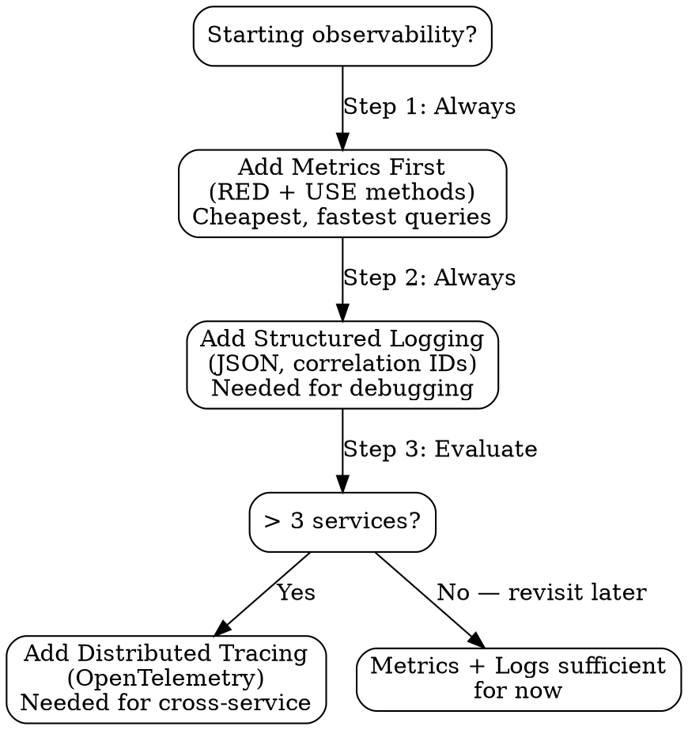
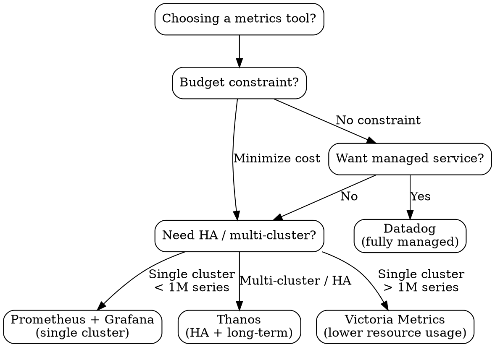
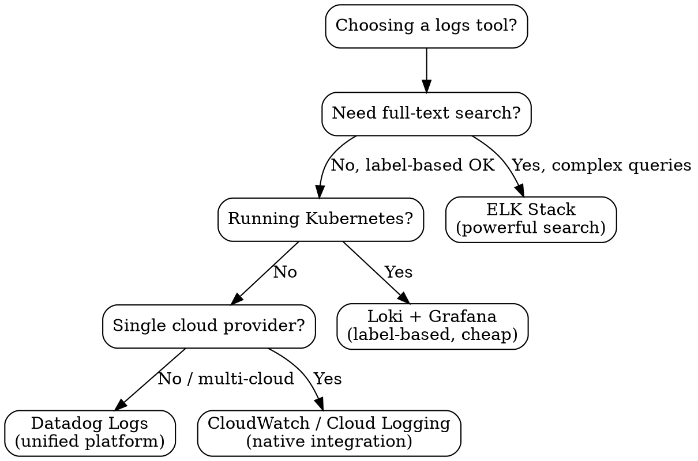
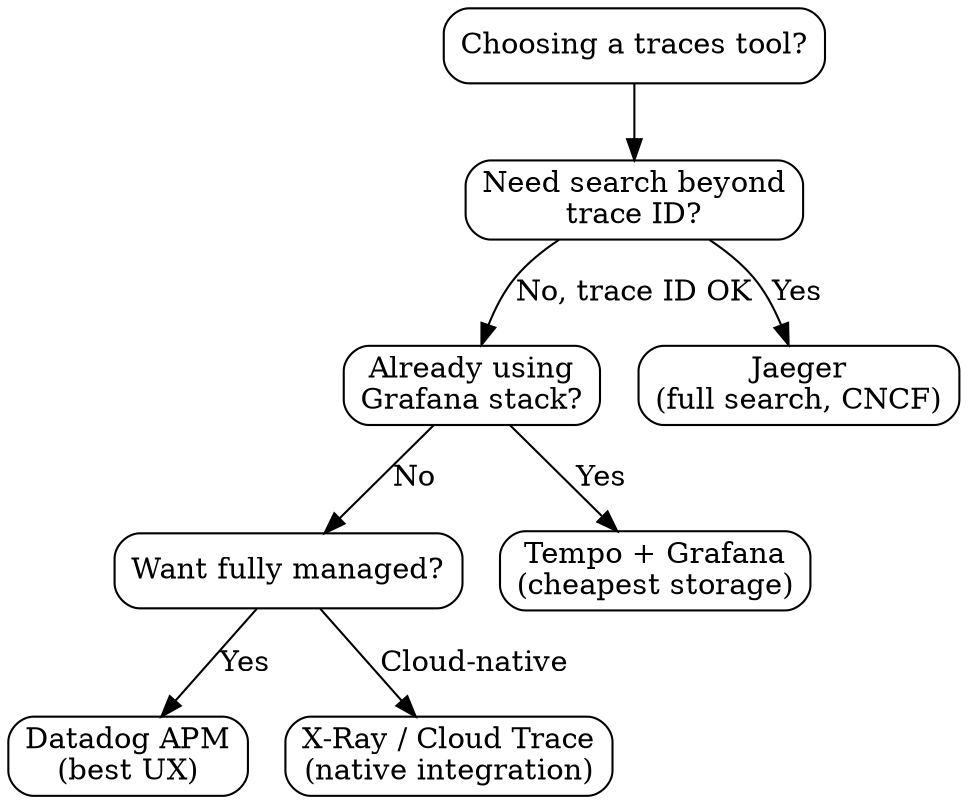

# Observability & Monitoring Architecture

**Purpose:** Observability strategy, monitoring patterns, and incident response guidance for Distinguished Systems Engineer
**Last Updated:** 2026-02-19
**Maintainer:** Distinguished Systems Engineer agent

## Overview

This library provides structured guidance for observability architecture, covering:
- Three pillars: metrics, logs, traces
- Monitoring strategy and SLI/SLO/SLA design
- Alerting patterns and on-call design
- Distributed tracing implementation
- Log aggregation and structured logging
- Dashboard design and incident response
- Observability in Kubernetes and cloud environments

Each section includes:
- **Decision Framework:** Tool selection and architecture choices
- **Implementation Patterns:** Production-ready configurations and code
- **Anti-patterns:** Common observability mistakes
- **Scale Considerations:** What changes at 10x, 100x, 1000x

## Table of Contents

1. [Three Pillars Strategy](#1-three-pillars-strategy)
   - [Metrics](#metrics)
   - [Logs](#logs)
   - [Traces](#traces)
   - [Pillar Decision Framework](#pillar-decision-framework)
   - [Anti-Patterns](#pillar-anti-patterns)
   - [Scale Considerations](#pillar-scale-considerations)
2. [SLI/SLO/SLA Design](#2-slislosla-design)
   - [SLI Selection](#sli-selection)
   - [SLO Design](#slo-design)
   - [SLA vs SLO](#sla-vs-slo)
   - [Error Budget Policy](#error-budget-policy)
   - [Anti-Patterns](#slo-anti-patterns)
   - [Scale Considerations](#slo-scale-considerations)
3. [Monitoring Tool Selection](#3-monitoring-tool-selection)
   - [Metrics Tools](#metrics-tools)
   - [Logs Tools](#logs-tools)
   - [Traces Tools](#traces-tools)
   - [Unified Observability](#unified-observability)
   - [Decision Trees](#tool-decision-trees)
   - [Scale Considerations](#tool-scale-considerations)
4. [Alerting Patterns](#4-alerting-patterns)
   - [Alert Design Principles](#alert-design-principles)
   - [Severity Classification](#severity-classification)
   - [Alert Fatigue Prevention](#alert-fatigue-prevention)
   - [On-Call Design](#on-call-design)
   - [AlertManager Configuration](#alertmanager-configuration)
   - [Anti-Patterns](#alerting-anti-patterns)
5. [Distributed Tracing Implementation](#5-distributed-tracing-implementation)
   - [OpenTelemetry Setup](#opentelemetry-setup)
   - [Go Tracing](#go-tracing)
   - [TypeScript Tracing](#typescript-tracing)
   - [Python Tracing](#python-tracing)
   - [Sampling Strategies](#sampling-strategies)
   - [Anti-Patterns](#tracing-anti-patterns)
   - [Scale Considerations](#tracing-scale-considerations)
6. [Structured Logging Patterns](#6-structured-logging-patterns)
   - [Log Schema](#log-schema)
   - [Log Aggregation Architecture](#log-aggregation-architecture)
   - [Log-Based Metrics](#log-based-metrics)
   - [Log Retention Policy](#log-retention-policy)
   - [Anti-Patterns](#logging-anti-patterns)
   - [Scale Considerations](#logging-scale-considerations)
7. [Dashboard Design](#7-dashboard-design)
   - [Dashboard Hierarchy](#dashboard-hierarchy)
   - [Design Principles](#dashboard-design-principles)
   - [Grafana Dashboard-as-Code](#grafana-dashboard-as-code)
   - [Anti-Patterns](#dashboard-anti-patterns)
8. [Kubernetes-Specific Observability](#8-kubernetes-specific-observability)
   - [Kubernetes Metrics](#kubernetes-metrics)
   - [Kubernetes Logging](#kubernetes-logging)
   - [Kubernetes Tracing](#kubernetes-tracing)
   - [Health Checks](#health-checks)
   - [Anti-Patterns](#kubernetes-anti-patterns)
   - [Scale Considerations](#kubernetes-scale-considerations)
9. [Incident Response & Runbooks](#9-incident-response--runbooks)
   - [Incident Workflow](#incident-workflow)
   - [Runbook Template](#runbook-template)
   - [Post-Incident Retrospective](#post-incident-retrospective)
   - [Anti-Patterns](#incident-anti-patterns)

---

## 1. Three Pillars Strategy

### Metrics

Metrics are numeric measurements collected at regular intervals. They are the cheapest signal to store and query, and should be your first line of observability.

#### RED Method (Request-Driven Services)

Use RED for any service handling requests (APIs, web servers, gRPC services):

| Signal   | What It Measures           | Example Metric                           |
|----------|---------------------------|------------------------------------------|
| **R**ate     | Requests per second       | `http_requests_total`                    |
| **E**rrors   | Failed requests per second| `http_requests_total{status=~"5.."}`     |
| **D**uration | Latency distribution      | `http_request_duration_seconds`          |

#### USE Method (Resource-Oriented)

Use USE for infrastructure and resource monitoring (CPU, memory, disk, network):

| Signal          | What It Measures                 | Example Metric                        |
|-----------------|----------------------------------|---------------------------------------|
| **U**tilization | % resource busy                  | `node_cpu_seconds_total`              |
| **S**aturation  | Queue depth / backlog            | `node_cpu_guest_seconds_total`        |
| **E**rrors      | Error events                     | `node_disk_io_time_weighted_seconds`  |

#### Metric Types

| Type        | Use When                                    | Example                              | Notes                                    |
|-------------|---------------------------------------------|--------------------------------------|------------------------------------------|
| **Counter** | Value only goes up                          | `http_requests_total`                | Always use `rate()` or `increase()`      |
| **Gauge**   | Value goes up and down                      | `temperature_celsius`                | Point-in-time value, use for snapshots   |
| **Histogram**| Need percentile distribution               | `http_request_duration_seconds`      | Predefined buckets, server-side quantile |
| **Summary** | Need client-calculated quantiles            | `go_gc_duration_seconds`             | Not aggregatable across instances        |

**When to use Histogram vs Summary:**
- **Histogram:** Default choice. Aggregatable across instances. Use when you need P50/P95/P99 across a fleet. Choose bucket boundaries carefully.
- **Summary:** Only when you need exact quantiles from a single instance and cannot pre-define buckets. Cannot aggregate across instances.

#### Cardinality Management

Cardinality = unique combinations of label values. High cardinality is the #1 cause of metrics system failure.

**Rules:**
- Never use unbounded values as labels (user IDs, email addresses, request IDs, full URLs)
- Keep total cardinality per metric under 10,000 time series
- Use label value allow-lists where possible
- Monitor cardinality: `prometheus_tsdb_head_series` should stay bounded

```yaml
# BAD: Creates a time series per user — cardinality explosion
http_requests_total{user_id="12345", method="GET", path="/api/v1/users/12345"}

# GOOD: Bounded label values
http_requests_total{method="GET", path="/api/v1/users", status="200"}
```

**Go: Prometheus metrics registration with bounded labels:**

```go
package metrics

import (
    "github.com/prometheus/client_golang/prometheus"
    "github.com/prometheus/client_golang/prometheus/promauto"
)

var (
    // Counter — requests total, bounded labels
    HTTPRequestsTotal = promauto.NewCounterVec(
        prometheus.CounterOpts{
            Name: "http_requests_total",
            Help: "Total HTTP requests by method, path pattern, and status code",
        },
        []string{"method", "path", "status_code"},
    )

    // Histogram — request duration with carefully chosen buckets
    HTTPRequestDuration = promauto.NewHistogramVec(
        prometheus.HistogramOpts{
            Name:    "http_request_duration_seconds",
            Help:    "HTTP request duration in seconds",
            Buckets: []float64{0.001, 0.005, 0.01, 0.025, 0.05, 0.1, 0.25, 0.5, 1, 2.5, 5, 10},
        },
        []string{"method", "path", "status_code"},
    )

    // Gauge — in-flight requests
    HTTPRequestsInFlight = promauto.NewGauge(
        prometheus.GaugeOpts{
            Name: "http_requests_in_flight",
            Help: "Current number of HTTP requests being processed",
        },
    )
)

// RecordRequest records a completed HTTP request.
// path MUST be the route pattern (e.g., "/api/v1/users/:id"), NOT the actual URL.
func RecordRequest(method, pathPattern, statusCode string, durationSeconds float64) {
    HTTPRequestsTotal.WithLabelValues(method, pathPattern, statusCode).Inc()
    HTTPRequestDuration.WithLabelValues(method, pathPattern, statusCode).Observe(durationSeconds)
}
```

### Logs

Logs are immutable, timestamped records of discrete events. In production, always use structured logging (JSON).

#### Log Levels

| Level   | When to Use                           | Operational Meaning       |
|---------|---------------------------------------|---------------------------|
| `ERROR` | Something broke, needs attention      | **Page / alert**          |
| `WARN`  | Something unexpected, not broken yet  | **Investigate in hours**  |
| `INFO`  | Normal operational events             | **Normal operations**     |
| `DEBUG` | Development/troubleshooting detail    | **Dev only, never in prod** |

**Rule:** If you can't assign an operational meaning to a log line, don't log it.

#### Correlation IDs

Every request entering the system gets a unique correlation ID (usually the trace ID). This ID propagates through all services handling that request.

```
Request → API Gateway (generates trace_id) → Service A → Service B → Database
              ↓                                  ↓            ↓
         trace_id=abc123                   trace_id=abc123  trace_id=abc123
```

#### Go: Structured Logging with slog

```go
package logging

import (
    "context"
    "log/slog"
    "os"

    "go.opentelemetry.io/otel/trace"
)

// NewLogger creates a production-ready structured JSON logger.
func NewLogger(service string, level slog.Level) *slog.Logger {
    opts := &slog.HandlerOptions{
        Level: level,
        ReplaceAttr: func(groups []string, a slog.Attr) slog.Attr {
            // Normalize time field name for log aggregation
            if a.Key == slog.TimeKey {
                a.Key = "timestamp"
            }
            return a
        },
    }

    handler := slog.NewJSONHandler(os.Stdout, opts)
    return slog.New(handler).With(
        slog.String("service", service),
        slog.String("version", os.Getenv("APP_VERSION")),
    )
}

// WithTraceContext extracts trace/span IDs from context and adds them to the logger.
func WithTraceContext(ctx context.Context, logger *slog.Logger) *slog.Logger {
    spanCtx := trace.SpanContextFromContext(ctx)
    if !spanCtx.IsValid() {
        return logger
    }
    return logger.With(
        slog.String("trace_id", spanCtx.TraceID().String()),
        slog.String("span_id", spanCtx.SpanID().String()),
    )
}

// Usage example:
//
//   logger := logging.NewLogger("order-service", slog.LevelInfo)
//   // In request handler:
//   log := logging.WithTraceContext(ctx, logger)
//   log.InfoContext(ctx, "order created",
//       slog.String("order_id", order.ID),
//       slog.Int("item_count", len(order.Items)),
//       slog.Float64("total_usd", order.Total),
//   )
//
// Output:
// {"timestamp":"2026-02-19T10:30:00Z","level":"INFO","msg":"order created",
//  "service":"order-service","version":"1.2.3",
//  "trace_id":"abc123def456","span_id":"789xyz",
//  "order_id":"ord-001","item_count":3,"total_usd":59.99}
```

#### TypeScript: Structured Logging with pino

```typescript
import pino from "pino";
import { context, trace } from "@opentelemetry/api";

// Create a production logger — JSON by default, pretty in dev
const logger = pino({
  level: process.env.LOG_LEVEL || "info",
  formatters: {
    level(label: string) {
      return { level: label };
    },
  },
  base: {
    service: process.env.SERVICE_NAME || "unknown",
    version: process.env.APP_VERSION || "unknown",
  },
  timestamp: pino.stdTimeFunctions.isoTime,
  // Redact sensitive fields
  redact: ["req.headers.authorization", "req.headers.cookie", "password", "ssn"],
});

/**
 * Creates a child logger with trace context from the active OpenTelemetry span.
 */
function withTraceContext(baseLogger: pino.Logger): pino.Logger {
  const span = trace.getSpan(context.active());
  if (!span) return baseLogger;

  const spanCtx = span.spanContext();
  return baseLogger.child({
    trace_id: spanCtx.traceId,
    span_id: spanCtx.spanId,
  });
}

// Usage:
// const log = withTraceContext(logger);
// log.info({ orderId: "ord-001", itemCount: 3, totalUsd: 59.99 }, "order created");
//
// Output:
// {"level":"info","timestamp":"2026-02-19T10:30:00.000Z",
//  "service":"order-service","version":"1.2.3",
//  "trace_id":"abc123def456","span_id":"789xyz",
//  "orderId":"ord-001","itemCount":3,"totalUsd":59.99,
//  "msg":"order created"}

export { logger, withTraceContext };
```

#### Python: Structured Logging with structlog

```python
import logging
import os
import structlog
from opentelemetry import trace


def setup_logging(service: str, level: str = "INFO") -> None:
    """Configure structlog for production JSON output with trace correlation."""
    structlog.configure(
        processors=[
            structlog.contextvars.merge_contextvars,
            structlog.processors.add_log_level,
            structlog.processors.StackInfoRenderer(),
            structlog.processors.format_exc_info,
            structlog.processors.TimeStamper(fmt="iso"),
            structlog.processors.JSONRenderer(),
        ],
        wrapper_class=structlog.make_filtering_bound_logger(
            getattr(logging, level.upper(), logging.INFO)
        ),
        context_class=dict,
        logger_factory=structlog.PrintLoggerFactory(),
        cache_logger_on_first_use=True,
    )


def get_logger(name: str) -> structlog.stdlib.BoundLogger:
    """Get a logger with service metadata and trace context."""
    log = structlog.get_logger(name)
    log = log.bind(
        service=os.getenv("SERVICE_NAME", "unknown"),
        version=os.getenv("APP_VERSION", "unknown"),
    )
    # Inject trace context if available
    span = trace.get_current_span()
    if span.is_recording():
        ctx = span.get_span_context()
        log = log.bind(
            trace_id=format(ctx.trace_id, "032x"),
            span_id=format(ctx.span_id, "016x"),
        )
    return log


# Usage:
#   setup_logging("order-service")
#   log = get_logger(__name__)
#   log.info("order created", order_id="ord-001", item_count=3, total_usd=59.99)
#
# Output:
# {"service":"order-service","version":"1.2.3",
#  "trace_id":"abc123def456","span_id":"789xyz",
#  "order_id":"ord-001","item_count":3,"total_usd":59.99,
#  "event":"order created","level":"info","timestamp":"2026-02-19T10:30:00Z"}
```

### Traces

Traces represent the end-to-end journey of a request across services. A trace is a tree of spans; each span represents a unit of work.

#### OpenTelemetry Standard

OpenTelemetry (OTel) is the industry standard for traces (and increasingly for metrics and logs). Always use OTel — vendor-specific SDKs create lock-in.

#### Span Design

```
Trace: order-checkout
├── Span: HTTP POST /api/v1/orders (API Gateway, 250ms)
│   ├── Span: ValidateOrder (Order Service, 15ms)
│   ├── Span: CheckInventory (Inventory Service, 45ms)
│   │   └── Span: SELECT * FROM inventory (PostgreSQL, 12ms)
│   ├── Span: ProcessPayment (Payment Service, 180ms)
│   │   ├── Span: HTTP POST /charge (Stripe API, 150ms)
│   │   └── Span: INSERT INTO payments (PostgreSQL, 8ms)
│   └── Span: SendConfirmation (Notification Service, 20ms)
│       └── Span: PUBLISH order.confirmed (Kafka, 5ms)
```

**Span naming conventions:**
- HTTP: `HTTP {METHOD} {route_pattern}` (e.g., `HTTP GET /api/v1/users/:id`)
- RPC: `{service}/{method}` (e.g., `OrderService/CreateOrder`)
- Database: `{db_operation} {table}` (e.g., `SELECT orders`)
- Messaging: `{queue} {operation}` (e.g., `order.events PUBLISH`)

#### Sampling Strategies

| Strategy          | How It Works                                                   | Best For                        |
|-------------------|----------------------------------------------------------------|---------------------------------|
| **Head-based**    | Decide at trace start (e.g., sample 10%)                       | High throughput, predictable cost |
| **Tail-based**    | Decide after trace completes (keep errors, slow traces)        | Catching rare failures          |
| **Adaptive**      | Adjust rate based on traffic volume                            | Variable-load services          |

**Decision guidance:**
- Start with head-based sampling at 10% for most services
- Add tail-based sampling for critical paths (checkout, payments)
- Use adaptive sampling when traffic varies >10x between peak and trough

### Pillar Decision Framework



**Summary:**
1. **Always start with metrics.** They're cheap, fast to query, and answer "is something wrong?"
2. **Always add structured logs.** They answer "what went wrong?" with correlation IDs
3. **Add traces when you have >3 services.** They answer "where in the call chain did it go wrong?"

### Pillar Anti-Patterns

| Anti-Pattern                                | Why It's Bad                                          | Do This Instead                           |
|---------------------------------------------|-------------------------------------------------------|-------------------------------------------|
| Metric per user ID                          | Cardinality explosion, crashes Prometheus              | Aggregate by bounded dimensions           |
| Unstructured log strings                    | Cannot query, filter, or aggregate                     | Always JSON with consistent schema        |
| Tracing everything at 100%                  | Storage costs explode, sampling is mandatory at scale  | Head-based 10%, tail-based for errors     |
| Using traces instead of metrics for dashboards | Traces are expensive to query in aggregate           | Use metrics for dashboards, traces for drill-down |
| Log levels that mean nothing                | DEBUG in prod floods storage, ERROR for non-errors    | Strict level definitions (see table above)|
| No correlation IDs                          | Cannot follow a request across services                | Propagate trace_id through all services   |

### Pillar Scale Considerations

| Scale        | Metrics                                | Logs                                     | Traces                                |
|-------------|----------------------------------------|------------------------------------------|---------------------------------------|
| **10x**     | Add Thanos/Cortex for HA               | Index hot path only                      | Reduce sampling rate                  |
| **100x**    | Shard Prometheus, downsample old data  | Tiered storage (hot/warm/cold)           | Tail-based sampling mandatory         |
| **1000x**   | Victoria Metrics or Datadog            | Log-based metrics replace many raw logs  | Sample <1%, keep 100% of errors       |

---

## 2. SLI/SLO/SLA Design

### SLI Selection

Service Level Indicators (SLIs) are the metrics that matter most to your users. Pick 3-5 max per service.

| SLI Type        | What It Measures                     | Good For                              | Example                                       |
|-----------------|--------------------------------------|---------------------------------------|-----------------------------------------------|
| **Availability**| Service is responding                | All services                          | % of requests returning non-5xx               |
| **Latency**     | Response time distribution           | User-facing APIs                      | P99 < 500ms                                   |
| **Throughput**   | Requests processed per second       | Data pipelines, batch jobs            | > 10,000 events/sec                           |
| **Error Rate**  | % of requests that fail              | All services                          | < 0.1% 5xx responses                          |
| **Freshness**   | Data staleness                       | Caches, search indexes, read replicas | Index updated within 30 seconds of write      |

**SLI Selection Process:**
1. Identify your critical user journeys (e.g., "user can complete checkout")
2. For each journey, pick the SLI types that directly measure user happiness
3. Express each SLI as a ratio: `good events / total events`
4. Validate: if this SLI degrades, do users actually notice?

### SLO Design

Service Level Objectives (SLOs) are target values for your SLIs over a time window.

#### Error Budget Model

The error budget is the inverse of your SLO. If your SLO is 99.9%, your error budget is 0.1%.

| SLO Target | Error Budget | Downtime per 30-day Window | Interpretation                     |
|------------|-------------|----------------------------|------------------------------------|
| 99%        | 1%          | 7.3 hours                  | Adequate for internal tools        |
| 99.5%      | 0.5%        | 3.6 hours                  | Standard for B2B SaaS              |
| 99.9%      | 0.1%        | 43 minutes                 | Standard for user-facing APIs      |
| 99.95%     | 0.05%       | 22 minutes                 | High-reliability services          |
| 99.99%     | 0.01%       | 4.3 minutes                | Critical infrastructure only       |

**Window:** Always use a rolling 30-day window. Calendar months create inconsistency (28 vs 31 days).

#### SLO Specification Example

```yaml
# SLO specification for Order API
service: order-api
slos:
  - name: availability
    description: "Order API returns non-5xx responses"
    sli: |
      sum(rate(http_requests_total{service="order-api",status_code!~"5.."}[5m]))
      /
      sum(rate(http_requests_total{service="order-api"}[5m]))
    target: 0.999          # 99.9%
    window: 30d            # Rolling 30-day
    alert_burn_rate: 14.4  # Page if burning 14.4x normal rate (exhausts budget in 1hr)

  - name: latency-p99
    description: "99th percentile latency under 500ms"
    sli: |
      sum(rate(http_request_duration_seconds_bucket{service="order-api",le="0.5"}[5m]))
      /
      sum(rate(http_request_duration_seconds_count{service="order-api"}[5m]))
    target: 0.999
    window: 30d

  - name: latency-p50
    description: "50th percentile latency under 100ms"
    sli: |
      sum(rate(http_request_duration_seconds_bucket{service="order-api",le="0.1"}[5m]))
      /
      sum(rate(http_request_duration_seconds_count{service="order-api"}[5m]))
    target: 0.99
    window: 30d
```

### SLA vs SLO

| Aspect      | SLO (Internal)                    | SLA (External)                     |
|-------------|-----------------------------------|------------------------------------|
| Audience    | Engineering team                  | Customers, legal                   |
| Consequence | Error budget policy triggers      | Financial penalties, credits        |
| Target      | **Stricter** than SLA             | Relaxed (buffer for safety)        |
| Example     | 99.95% availability               | 99.9% availability (in contract)  |

**Rule:** Your internal SLO must always be stricter than your external SLA. If your SLA promises 99.9%, your SLO should target 99.95% so you have buffer before breaching the SLA.

### Error Budget Policy

Define automated responses based on error budget consumption.

| Budget Remaining | Policy                                           | Actions                                    |
|-----------------|--------------------------------------------------|--------------------------------------------|
| > 50%           | **Deploy freely**                                | Normal release cadence                     |
| 20% - 50%      | **Reduce deployment frequency**                  | No Friday deploys, extra review required   |
| 5% - 20%       | **Feature freeze**                               | Only reliability improvements and bug fixes|
| < 5%           | **Full freeze**                                  | Incident-mode, rollback risky changes      |
| Exhausted       | **Postmortem required**                          | RCA + reliability sprint before new features|

#### Go: Error Budget Calculation from Prometheus

```go
package slo

import (
    "context"
    "fmt"
    "time"

    "github.com/prometheus/client_golang/api"
    v1 "github.com/prometheus/client_golang/api/prometheus/v1"
    "github.com/prometheus/common/model"
)

// ErrorBudgetStatus represents the current error budget state.
type ErrorBudgetStatus struct {
    SLOTarget       float64       `json:"slo_target"`
    CurrentSLI      float64       `json:"current_sli"`
    BudgetTotal     float64       `json:"budget_total"`      // Total allowed error ratio
    BudgetConsumed  float64       `json:"budget_consumed"`   // How much has been used
    BudgetRemaining float64       `json:"budget_remaining"`  // What's left (0.0 - 1.0)
    Window          time.Duration `json:"window"`
    Policy          string        `json:"policy"`            // What action to take
}

// CalculateErrorBudget queries Prometheus and returns the current error budget status.
func CalculateErrorBudget(
    ctx context.Context,
    promClient api.Client,
    service string,
    sloTarget float64,
    window time.Duration,
) (*ErrorBudgetStatus, error) {
    v1api := v1.NewAPI(promClient)

    // Query: ratio of successful requests over the window
    query := fmt.Sprintf(
        `sum(increase(http_requests_total{service="%s",status_code!~"5.."}[%s]))`+
            ` / `+
            `sum(increase(http_requests_total{service="%s"}[%s]))`,
        service, model.Duration(window),
        service, model.Duration(window),
    )

    result, _, err := v1api.Query(ctx, query, time.Now())
    if err != nil {
        return nil, fmt.Errorf("prometheus query failed: %w", err)
    }

    vector, ok := result.(model.Vector)
    if !ok || len(vector) == 0 {
        return nil, fmt.Errorf("unexpected result type or empty result")
    }

    currentSLI := float64(vector[0].Value)
    budgetTotal := 1.0 - sloTarget                                           // e.g., 0.001 for 99.9%
    budgetConsumed := (1.0 - currentSLI) / budgetTotal                       // Fraction of budget used
    budgetRemaining := 1.0 - budgetConsumed
    if budgetRemaining < 0 {
        budgetRemaining = 0
    }

    status := &ErrorBudgetStatus{
        SLOTarget:       sloTarget,
        CurrentSLI:      currentSLI,
        BudgetTotal:     budgetTotal,
        BudgetConsumed:  budgetConsumed,
        BudgetRemaining: budgetRemaining,
        Window:          window,
    }

    // Determine policy
    switch {
    case budgetRemaining > 0.50:
        status.Policy = "deploy_freely"
    case budgetRemaining > 0.20:
        status.Policy = "reduce_frequency"
    case budgetRemaining > 0.05:
        status.Policy = "feature_freeze"
    case budgetRemaining > 0:
        status.Policy = "full_freeze"
    default:
        status.Policy = "postmortem_required"
    }

    return status, nil
}

// Usage:
//   client, _ := api.NewClient(api.Config{Address: "http://prometheus:9090"})
//   status, err := CalculateErrorBudget(ctx, client, "order-api", 0.999, 30*24*time.Hour)
//   if status.Policy == "feature_freeze" {
//       log.Warn("error budget low", "remaining", status.BudgetRemaining)
//   }
```

### SLO Anti-Patterns

| Anti-Pattern                     | Why It's Bad                                               | Do This Instead                               |
|----------------------------------|------------------------------------------------------------|-----------------------------------------------|
| SLO of 100%                     | Impossible; leaves zero room for maintenance or deploys    | Use 99.99% as the max practical target        |
| SLO without error budget policy | SLO becomes toothless, nobody acts on violations           | Define policy table with clear triggers       |
| Too many SLIs (>5)              | Dilutes focus, nobody watches all of them                  | Pick 3-5 that directly reflect user experience|
| Calendar month window            | Months vary in length, creates inconsistency              | Rolling 30-day window                         |
| SLO = SLA                       | No safety buffer; you breach SLA the moment SLO breaks    | SLO should be 2-5x stricter than SLA          |
| SLI that doesn't reflect users  | Vanity metric that doesn't correlate with user happiness   | Validate: if SLI degrades, do users notice?   |

### SLO Scale Considerations

| Scale   | Change                                                          |
|---------|-----------------------------------------------------------------|
| **10x** | Automate error budget tracking; integrate with CI/CD gates      |
| **100x**| Per-customer SLOs for enterprise tiers; multi-region SLI aggregation |
| **1000x**| SLO-driven auto-scaling; ML-based burn rate prediction         |

---

## 3. Monitoring Tool Selection

### Metrics Tools

| Tool                | Type           | Cost Model              | Strengths                                    | Weaknesses                              |
|---------------------|----------------|-------------------------|----------------------------------------------|-----------------------------------------|
| **Prometheus + Grafana** | OSS       | Infra cost only         | Industry standard, huge ecosystem, PromQL    | Single-node, no native HA               |
| **Datadog**         | SaaS           | ~$15/host/month         | Unified platform, easy setup, great UX       | Expensive at scale, vendor lock-in      |
| **Victoria Metrics**| OSS            | Infra cost only         | Drop-in Prometheus replacement, lower resource usage | Smaller community                |
| **Thanos**          | OSS (on Prom)  | Infra + object storage  | HA for Prometheus, long-term storage         | Complex operations                       |
| **Cortex**          | OSS (on Prom)  | Infra + object storage  | Multi-tenant Prometheus, horizontally scalable| Even more complex than Thanos           |

### Logs Tools

| Tool                    | Type       | Cost Model                | Strengths                                | Weaknesses                              |
|-------------------------|-----------|---------------------------|------------------------------------------|-----------------------------------------|
| **ELK (Elasticsearch)** | OSS/SaaS  | Infra or Elastic Cloud    | Powerful full-text search, mature        | Resource hungry, complex to operate     |
| **Loki + Grafana**      | OSS       | Infra cost only           | Lightweight, indexes labels not content  | Less powerful search than ES            |
| **Datadog Logs**        | SaaS      | Per GB ingested           | Unified with metrics/traces              | Very expensive at high volume           |
| **CloudWatch Logs**     | Cloud     | Per GB ingested + stored  | Native AWS integration                   | Slow queries, limited analysis          |
| **Cloud Logging (GCP)** | Cloud     | Per GB ingested           | Native GCP integration, good query lang  | GCP lock-in                             |

### Traces Tools

| Tool                    | Type       | Cost Model               | Strengths                                | Weaknesses                              |
|-------------------------|-----------|---------------------------|------------------------------------------|-----------------------------------------|
| **Jaeger**              | OSS       | Infra cost only           | CNCF project, good UI, Cassandra/ES backend | Complex to operate at scale          |
| **Tempo + Grafana**     | OSS       | Infra + object storage    | Very cheap storage (object store), no indexing | Search only by trace ID           |
| **Datadog APM**         | SaaS      | Per host + per span       | Great UX, auto-instrumentation           | Expensive, vendor lock-in               |
| **AWS X-Ray**           | Cloud     | Per trace recorded        | Native AWS integration                   | Limited to AWS ecosystem                |
| **Cloud Trace (GCP)**   | Cloud     | Per trace ingested        | Native GCP integration                   | GCP lock-in                             |

### Unified Observability

| Approach                  | Components                          | Cost                  | Best For                                  |
|---------------------------|-------------------------------------|-----------------------|-------------------------------------------|
| **Grafana Stack**         | Prometheus + Loki + Tempo + Grafana | Infra only            | Cost-conscious, Kubernetes-native, teams that want control |
| **Datadog**               | Single platform                     | $15-30+/host/month    | Teams that value ease over cost, quick setup |
| **Cloud-Native**          | CloudWatch/Cloud Monitoring + Logs + Trace | Per-usage      | Single-cloud shops, serverless-heavy      |

**Recommendation: Grafana Stack** for most organizations:
- Open source, no vendor lock-in
- Unified UI in Grafana for metrics, logs, and traces
- Cost scales with infrastructure, not per-host licensing
- CNCF ecosystem alignment
- Massive community and plugin ecosystem

### Tool Decision Trees

#### Metrics Tool Decision Tree



#### Logs Tool Decision Tree



#### Traces Tool Decision Tree



### Tool Scale Considerations

| Scale    | Metrics                                   | Logs                                 | Traces                              |
|---------|-------------------------------------------|--------------------------------------|-------------------------------------|
| **10x** | Thanos/Cortex for HA                      | Move to Loki from ELK               | Add tail-based sampling             |
| **100x**| Victoria Metrics, aggressive downsampling | Tiered storage, strict retention     | <5% head sampling, 100% error traces|
| **1000x**| Evaluate Datadog for operational simplicity| Log-based metrics, sample logs too  | <1% sampling, dedicated trace store |

---

## 4. Alerting Patterns

### Alert Design Principles

1. **Alert on symptoms, not causes.** Alert on "HTTP error rate > 1%" not "CPU > 80%". Users don't care about CPU; they care about errors.
2. **Every alert must be actionable.** If an on-call engineer receives an alert, they must be able to do something about it. If no action is possible, it shouldn't be an alert.
3. **Every alert must have a runbook link.** The alert fires at 3 AM; the engineer needs step-by-step instructions, not guesswork.
4. **Alerts should detect novel situations.** Don't alert on known, self-healing conditions.

### Severity Classification

| Severity | Name      | Response                      | Examples                                              | Notification        |
|----------|-----------|-------------------------------|-------------------------------------------------------|---------------------|
| **P1**   | Critical  | Page immediately, 24/7        | Service down, data loss, security breach              | PagerDuty / phone   |
| **P2**   | High      | Page during business hours    | Degraded performance, partial outage, SLO burn rate high | PagerDuty / Slack |
| **P3**   | Medium    | Create ticket, fix in days    | Elevated error rate (within SLO), disk filling slowly | Jira / Slack channel|
| **P4**   | Low       | Informational                 | Approaching capacity threshold, deprecation warnings  | Dashboard / email   |

### Alert Fatigue Prevention

Alert fatigue is the #1 operational failure mode. When every alert pages, no alert pages.

**Strategies:**
- **Monthly alert review:** Review every alert that fired. Delete alerts that were never actionable.
- **Alert grouping:** Group related alerts (e.g., all pods in a deployment) into a single notification.
- **Quiet hours:** P3/P4 alerts suppressed outside business hours.
- **Deduplication:** Same alert firing for the same resource within 5 minutes = 1 notification.
- **Threshold tuning:** If an alert fires > 3 times/week and is never actionable, raise the threshold or delete it.

**Metric to track:** Alert-to-incident ratio. If < 50% of pages result in real incidents, you have too many alerts.

### On-Call Design

**Rotation:**
- Minimum 2 people per rotation (primary + secondary)
- 1-week rotations (longer leads to burnout, shorter leads to insufficient context)
- Follow-the-sun for global teams (no one is on-call during sleep hours)
- Maximum 25% toil budget: if on-call spends > 25% of time on repetitive operational work, automate it

**Escalation Path:**
1. Primary on-call (0-15 min to acknowledge)
2. Secondary on-call (if no ack in 15 min)
3. Team lead (if no ack in 30 min)
4. Engineering manager (if no ack in 45 min)
5. VP of Engineering (if no ack in 60 min)

**Post-Incident:**
- Blameless retrospective within 48 hours for every P1 and P2
- Write up timeline, impact, root cause, contributing factors, action items
- Track action item completion (SLA: 30 days for non-trivial items)

### AlertManager Configuration

#### Prometheus Alerting Rules

```yaml
# prometheus-rules.yaml
groups:
  - name: service-slos
    rules:
      # High error rate — burn rate alerting (Multi-Burn-Rate Multi-Window)
      - alert: HighErrorBurnRate
        expr: |
          (
            sum(rate(http_requests_total{status_code=~"5.."}[1h]))
            /
            sum(rate(http_requests_total[1h]))
          ) > (14.4 * (1 - 0.999))
        for: 2m
        labels:
          severity: critical
          team: platform
        annotations:
          summary: "High error burn rate on {{ $labels.service }}"
          description: >
            Error rate is burning through the error budget at 14.4x the normal rate.
            At this rate, the 30-day error budget will be exhausted in 1 hour.
            Current error rate: {{ $value | humanizePercentage }}
          runbook_url: "https://runbooks.internal/alerts/high-error-burn-rate"
          dashboard_url: "https://grafana.internal/d/service-overview?var-service={{ $labels.service }}"

      # Slow burn rate — catches slow degradation
      - alert: SlowErrorBurnRate
        expr: |
          (
            sum(rate(http_requests_total{status_code=~"5.."}[6h]))
            /
            sum(rate(http_requests_total[6h]))
          ) > (6 * (1 - 0.999))
        for: 30m
        labels:
          severity: warning
          team: platform
        annotations:
          summary: "Slow error burn rate on {{ $labels.service }}"
          description: >
            Error rate is burning through the error budget at 6x the normal rate.
            At this rate, the 30-day error budget will be exhausted in 5 hours.
          runbook_url: "https://runbooks.internal/alerts/slow-error-burn-rate"

      # High latency P99
      - alert: HighP99Latency
        expr: |
          histogram_quantile(0.99,
            sum(rate(http_request_duration_seconds_bucket[5m])) by (le, service)
          ) > 1.0
        for: 5m
        labels:
          severity: warning
          team: platform
        annotations:
          summary: "P99 latency > 1s on {{ $labels.service }}"
          description: "P99 latency: {{ $value | humanizeDuration }}"
          runbook_url: "https://runbooks.internal/alerts/high-latency"

      # Pod crash looping
      - alert: PodCrashLooping
        expr: |
          increase(kube_pod_container_status_restarts_total[1h]) > 5
        for: 10m
        labels:
          severity: warning
          team: platform
        annotations:
          summary: "Pod {{ $labels.pod }} crash looping"
          description: "Pod has restarted {{ $value }} times in the last hour"
          runbook_url: "https://runbooks.internal/alerts/pod-crash-loop"

  - name: infrastructure
    rules:
      # Disk will fill in 4 hours (prediction-based)
      - alert: DiskWillFillIn4Hours
        expr: |
          predict_linear(node_filesystem_avail_bytes{fstype!="tmpfs"}[6h], 4 * 3600) < 0
        for: 30m
        labels:
          severity: warning
          team: infrastructure
        annotations:
          summary: "Disk on {{ $labels.instance }} predicted to fill in 4 hours"
          runbook_url: "https://runbooks.internal/alerts/disk-filling"

      # Memory pressure
      - alert: HighMemoryUsage
        expr: |
          (1 - (node_memory_MemAvailable_bytes / node_memory_MemTotal_bytes)) > 0.90
        for: 15m
        labels:
          severity: warning
          team: infrastructure
        annotations:
          summary: "Memory usage > 90% on {{ $labels.instance }}"
          runbook_url: "https://runbooks.internal/alerts/high-memory"
```

#### AlertManager Configuration

```yaml
# alertmanager.yaml
global:
  resolve_timeout: 5m
  slack_api_url: "https://hooks.slack.com/services/xxx/yyy/zzz"

route:
  receiver: "default-slack"
  group_by: ["alertname", "service", "namespace"]
  group_wait: 30s       # Wait to batch initial alerts
  group_interval: 5m    # Wait before sending updates
  repeat_interval: 4h   # Re-notify after 4 hours if still firing

  routes:
    # P1: Critical — page immediately via PagerDuty
    - match:
        severity: critical
      receiver: "pagerduty-critical"
      group_wait: 10s
      repeat_interval: 1h

    # P2: Warning — page during business hours via PagerDuty
    - match:
        severity: warning
      receiver: "pagerduty-warning"
      repeat_interval: 4h
      active_time_intervals:
        - business-hours

    # P2: Warning outside business hours — Slack only
    - match:
        severity: warning
      receiver: "slack-warnings"
      repeat_interval: 8h

    # Silence noisy alerts during maintenance windows
    - match_re:
        alertname: "^(DiskWillFillIn4Hours|HighMemoryUsage)$"
      receiver: "slack-infra"
      repeat_interval: 12h

receivers:
  - name: "default-slack"
    slack_configs:
      - channel: "#alerts-general"
        send_resolved: true
        title: '{{ template "slack.default.title" . }}'
        text: '{{ template "slack.default.text" . }}'

  - name: "pagerduty-critical"
    pagerduty_configs:
      - service_key: "<pagerduty-service-key>"
        severity: critical
        description: '{{ template "pagerduty.default.description" . }}'
        details:
          firing: '{{ template "pagerduty.default.instances" .Alerts.Firing }}'
          runbook: '{{ (index .Alerts 0).Annotations.runbook_url }}'

  - name: "pagerduty-warning"
    pagerduty_configs:
      - service_key: "<pagerduty-service-key>"
        severity: warning

  - name: "slack-warnings"
    slack_configs:
      - channel: "#alerts-warning"
        send_resolved: true

  - name: "slack-infra"
    slack_configs:
      - channel: "#alerts-infra"
        send_resolved: true

time_intervals:
  - name: business-hours
    time_intervals:
      - weekdays: ["monday:friday"]
        times:
          - start_time: "09:00"
            end_time: "18:00"
```

### Alerting Anti-Patterns

| Anti-Pattern                             | Why It's Bad                                          | Do This Instead                                 |
|------------------------------------------|-------------------------------------------------------|-------------------------------------------------|
| Alert on causes (CPU > 80%)              | Users don't experience CPU; they experience errors    | Alert on symptoms (error rate, latency)         |
| Alert without runbook                    | 3 AM page with no instructions = wasted incident time | Every alert links to a runbook                  |
| Alert on every warning                   | Alert fatigue; on-call ignores real alerts             | Only page on actionable, user-impacting issues  |
| Same threshold for all services          | A background job and a payment API have different needs| Per-service SLO-driven thresholds               |
| No escalation path                       | Primary on-call is sick/asleep = nobody responds      | Automatic escalation after 15 min               |
| Alert on self-healing conditions         | Kubernetes restarts a pod = noise, not an incident    | Alert on sustained failure (5+ restarts/hour)   |
| No deduplication                         | Same issue fires 50 alerts = noise                    | AlertManager group_by + group_wait              |

---

## 5. Distributed Tracing Implementation

### OpenTelemetry Setup

OpenTelemetry (OTel) is the standard for distributed tracing. All new instrumentation should use OTel SDKs.

**Core Concepts:**
- **Tracer Provider:** Creates tracers, configures exporters and sampling
- **Tracer:** Creates spans
- **Span:** A unit of work with start/end time, attributes, events, links
- **Context Propagation:** Carries trace context across process boundaries (HTTP headers, gRPC metadata)
- **Exporter:** Sends spans to a backend (OTLP, Jaeger, Zipkin)

**Propagation Standard:** Always use W3C TraceContext (`traceparent` / `tracestate` headers). This is the default in OTel.

### Go Tracing

#### Full Service Setup

```go
package tracing

import (
    "context"
    "fmt"
    "time"

    "go.opentelemetry.io/otel"
    "go.opentelemetry.io/otel/attribute"
    "go.opentelemetry.io/otel/exporters/otlp/otlptrace/otlptracegrpc"
    "go.opentelemetry.io/otel/propagation"
    "go.opentelemetry.io/otel/sdk/resource"
    sdktrace "go.opentelemetry.io/otel/sdk/trace"
    semconv "go.opentelemetry.io/otel/semconv/v1.24.0"
    "go.opentelemetry.io/otel/trace"
)

// Config holds tracing configuration.
type Config struct {
    ServiceName    string
    ServiceVersion string
    Environment    string
    OTLPEndpoint   string  // e.g., "otel-collector:4317"
    SampleRate     float64 // 0.0 to 1.0
}

// InitTracer initializes the OpenTelemetry tracer provider.
// Call the returned shutdown function on application exit.
func InitTracer(ctx context.Context, cfg Config) (func(context.Context) error, error) {
    // Create OTLP gRPC exporter
    exporter, err := otlptracegrpc.New(ctx,
        otlptracegrpc.WithEndpoint(cfg.OTLPEndpoint),
        otlptracegrpc.WithInsecure(), // Use WithTLSCredentials in production
    )
    if err != nil {
        return nil, fmt.Errorf("creating OTLP exporter: %w", err)
    }

    // Define resource attributes (service identity)
    res, err := resource.Merge(
        resource.Default(),
        resource.NewWithAttributes(
            semconv.SchemaURL,
            semconv.ServiceName(cfg.ServiceName),
            semconv.ServiceVersion(cfg.ServiceVersion),
            semconv.DeploymentEnvironment(cfg.Environment),
        ),
    )
    if err != nil {
        return nil, fmt.Errorf("creating resource: %w", err)
    }

    // Create tracer provider with batch span processor
    tp := sdktrace.NewTracerProvider(
        sdktrace.WithBatcher(exporter,
            sdktrace.WithMaxExportBatchSize(512),
            sdktrace.WithBatchTimeout(5*time.Second),
        ),
        sdktrace.WithResource(res),
        sdktrace.WithSampler(
            sdktrace.ParentBased(
                sdktrace.TraceIDRatioBased(cfg.SampleRate),
            ),
        ),
    )

    // Set global tracer provider and propagator
    otel.SetTracerProvider(tp)
    otel.SetTextMapPropagator(propagation.NewCompositeTextMapPropagator(
        propagation.TraceContext{}, // W3C TraceContext
        propagation.Baggage{},     // W3C Baggage
    ))

    return tp.Shutdown, nil
}

// Tracer returns a named tracer for creating spans.
func Tracer(name string) trace.Tracer {
    return otel.Tracer(name)
}
```

#### HTTP Middleware

```go
package middleware

import (
    "fmt"
    "net/http"
    "time"

    "go.opentelemetry.io/contrib/instrumentation/net/http/otelhttp"
    "go.opentelemetry.io/otel/attribute"
    "go.opentelemetry.io/otel/trace"
)

// TracingMiddleware wraps an HTTP handler with OpenTelemetry tracing.
// It automatically creates spans, propagates context, and records attributes.
func TracingMiddleware(next http.Handler) http.Handler {
    return otelhttp.NewHandler(next, "http-server",
        otelhttp.WithSpanNameFormatter(func(operation string, r *http.Request) string {
            return fmt.Sprintf("HTTP %s %s", r.Method, r.URL.Path)
        }),
    )
}

// ManualSpanMiddleware demonstrates manual span creation for more control.
func ManualSpanMiddleware(tracer trace.Tracer) func(http.Handler) http.Handler {
    return func(next http.Handler) http.Handler {
        return http.HandlerFunc(func(w http.ResponseWriter, r *http.Request) {
            ctx, span := tracer.Start(r.Context(), fmt.Sprintf("HTTP %s %s", r.Method, r.URL.Path),
                trace.WithSpanKind(trace.SpanKindServer),
                trace.WithAttributes(
                    attribute.String("http.method", r.Method),
                    attribute.String("http.url", r.URL.String()),
                    attribute.String("http.user_agent", r.UserAgent()),
                    attribute.String("net.peer.ip", r.RemoteAddr),
                ),
            )
            defer span.End()

            // Wrap response writer to capture status code
            rw := &responseWriter{ResponseWriter: w, statusCode: http.StatusOK}
            start := time.Now()

            next.ServeHTTP(rw, r.WithContext(ctx))

            span.SetAttributes(
                attribute.Int("http.status_code", rw.statusCode),
                attribute.Int64("http.response_time_ms", time.Since(start).Milliseconds()),
            )

            if rw.statusCode >= 500 {
                span.SetAttributes(attribute.Bool("error", true))
            }
        })
    }
}

type responseWriter struct {
    http.ResponseWriter
    statusCode int
}

func (rw *responseWriter) WriteHeader(code int) {
    rw.statusCode = code
    rw.ResponseWriter.WriteHeader(code)
}
```

#### gRPC Interceptors

```go
package middleware

import (
    "go.opentelemetry.io/contrib/instrumentation/google.golang.org/grpc/otelgrpc"
    "google.golang.org/grpc"
)

// NewTracedGRPCServer creates a gRPC server with OpenTelemetry tracing interceptors.
func NewTracedGRPCServer(opts ...grpc.ServerOption) *grpc.Server {
    tracingOpts := []grpc.ServerOption{
        grpc.StatsHandler(otelgrpc.NewServerHandler()),
    }
    return grpc.NewServer(append(tracingOpts, opts...)...)
}

// NewTracedGRPCClient creates a gRPC client connection with OpenTelemetry tracing.
func NewTracedGRPCClient(target string, opts ...grpc.DialOption) (*grpc.ClientConn, error) {
    tracingOpts := []grpc.DialOption{
        grpc.WithStatsHandler(otelgrpc.NewClientHandler()),
    }
    return grpc.NewClient(target, append(tracingOpts, opts...)...)
}
```

#### Database Instrumentation

```go
package database

import (
    "database/sql"

    "github.com/XSAM/otelsql"
    semconv "go.opentelemetry.io/otel/semconv/v1.24.0"
)

// OpenTracedDB opens a database connection with OpenTelemetry instrumentation.
func OpenTracedDB(driverName, dsn string) (*sql.DB, error) {
    db, err := otelsql.Open(driverName, dsn,
        otelsql.WithAttributes(
            semconv.DBSystemPostgreSQL,
        ),
        otelsql.WithSpanOptions(otelsql.SpanOptions{
            Ping:                 true,
            RowsNext:             false, // Don't trace every row iteration
            DisableErrSkip:       true,
            OmitConnResetSession: true,
            OmitConnPrepare:      true,
        }),
    )
    if err != nil {
        return nil, err
    }

    // Register metrics for connection pool
    if err := otelsql.RegisterDBStatsMetrics(db, otelsql.WithAttributes(
        semconv.DBSystemPostgreSQL,
    )); err != nil {
        return nil, err
    }

    return db, nil
}
```

### TypeScript Tracing

```typescript
import { NodeSDK } from "@opentelemetry/sdk-node";
import { OTLPTraceExporter } from "@opentelemetry/exporter-trace-otlp-grpc";
import { getNodeAutoInstrumentations } from "@opentelemetry/auto-instrumentations-node";
import { Resource } from "@opentelemetry/resources";
import {
  ATTR_SERVICE_NAME,
  ATTR_SERVICE_VERSION,
  ATTR_DEPLOYMENT_ENVIRONMENT,
} from "@opentelemetry/semantic-conventions";
import { ParentBasedSampler, TraceIdRatioBasedSampler } from "@opentelemetry/sdk-trace-base";
import { trace, SpanStatusCode, context, SpanKind } from "@opentelemetry/api";

// Initialize the SDK — call this BEFORE importing any other modules
const sdk = new NodeSDK({
  resource: new Resource({
    [ATTR_SERVICE_NAME]: process.env.SERVICE_NAME || "unknown",
    [ATTR_SERVICE_VERSION]: process.env.APP_VERSION || "0.0.0",
    [ATTR_DEPLOYMENT_ENVIRONMENT]: process.env.NODE_ENV || "development",
  }),
  traceExporter: new OTLPTraceExporter({
    url: process.env.OTEL_EXPORTER_OTLP_ENDPOINT || "http://otel-collector:4317",
  }),
  sampler: new ParentBasedSampler({
    root: new TraceIdRatioBasedSampler(
      parseFloat(process.env.OTEL_SAMPLE_RATE || "0.1")
    ),
  }),
  instrumentations: [
    getNodeAutoInstrumentations({
      // Disable noisy file system instrumentation
      "@opentelemetry/instrumentation-fs": { enabled: false },
      // Configure HTTP instrumentation
      "@opentelemetry/instrumentation-http": {
        ignoreIncomingPaths: ["/health", "/ready", "/metrics"],
      },
    }),
  ],
});

sdk.start();

// Graceful shutdown
process.on("SIGTERM", () => {
  sdk.shutdown().then(
    () => process.exit(0),
    (err) => {
      console.error("Error shutting down OTel SDK", err);
      process.exit(1);
    }
  );
});

// Express middleware for custom span attributes
import { Request, Response, NextFunction } from "express";

function tracingMiddleware(req: Request, res: Response, next: NextFunction): void {
  const span = trace.getActiveSpan();
  if (span) {
    span.setAttributes({
      "http.route": req.route?.path || req.path,
      "user.id": (req as any).userId || "anonymous",
    });
  }
  next();
}

// Custom span example
async function processOrder(orderId: string): Promise<void> {
  const tracer = trace.getTracer("order-service");

  await tracer.startActiveSpan(
    "processOrder",
    { kind: SpanKind.INTERNAL, attributes: { "order.id": orderId } },
    async (span) => {
      try {
        // Validate
        await tracer.startActiveSpan("validateOrder", async (validateSpan) => {
          // validation logic
          validateSpan.setAttributes({ "order.valid": true });
          validateSpan.end();
        });

        // Process payment
        await tracer.startActiveSpan("processPayment", async (paymentSpan) => {
          // payment logic
          paymentSpan.setAttributes({ "payment.method": "card" });
          paymentSpan.end();
        });

        span.setStatus({ code: SpanStatusCode.OK });
      } catch (error) {
        span.setStatus({ code: SpanStatusCode.ERROR, message: (error as Error).message });
        span.recordException(error as Error);
        throw error;
      } finally {
        span.end();
      }
    }
  );
}

export { sdk, tracingMiddleware, processOrder };
```

### Python Tracing

```python
import os
from opentelemetry import trace
from opentelemetry.sdk.trace import TracerProvider
from opentelemetry.sdk.trace.export import BatchSpanProcessor
from opentelemetry.exporter.otlp.proto.grpc.trace_exporter import OTLPSpanExporter
from opentelemetry.sdk.resources import Resource, SERVICE_NAME, SERVICE_VERSION
from opentelemetry.sdk.trace.sampling import ParentBasedTraceIdRatio
from opentelemetry.instrumentation.fastapi import FastAPIInstrumentor
from opentelemetry.instrumentation.sqlalchemy import SQLAlchemyInstrumentor
from opentelemetry.instrumentation.requests import RequestsInstrumentor
from opentelemetry.propagate import set_global_textmap
from opentelemetry.propagators.composite import CompositePropagator
from opentelemetry.trace.propagation import TraceContextTextMapPropagator
from opentelemetry.baggage.propagation import W3CBaggagePropagator
from opentelemetry.trace import StatusCode, SpanKind


def init_tracing(service_name: str, sample_rate: float = 0.1) -> None:
    """Initialize OpenTelemetry tracing with OTLP exporter.

    Call this BEFORE creating your FastAPI/Flask app.
    """
    resource = Resource.create({
        SERVICE_NAME: service_name,
        SERVICE_VERSION: os.getenv("APP_VERSION", "0.0.0"),
        "deployment.environment": os.getenv("ENVIRONMENT", "development"),
    })

    provider = TracerProvider(
        resource=resource,
        sampler=ParentBasedTraceIdRatio(sample_rate),
    )

    exporter = OTLPSpanExporter(
        endpoint=os.getenv("OTEL_EXPORTER_OTLP_ENDPOINT", "http://otel-collector:4317"),
        insecure=True,
    )

    provider.add_span_processor(BatchSpanProcessor(
        exporter,
        max_export_batch_size=512,
        schedule_delay_millis=5000,
    ))

    trace.set_tracer_provider(provider)

    # W3C TraceContext propagation
    set_global_textmap(CompositePropagator([
        TraceContextTextMapPropagator(),
        W3CBaggagePropagator(),
    ]))


def instrument_fastapi(app) -> None:
    """Add OpenTelemetry instrumentation to a FastAPI app."""
    FastAPIInstrumentor.instrument_app(
        app,
        excluded_urls="health,ready,metrics",
    )


def instrument_sqlalchemy(engine) -> None:
    """Add OpenTelemetry instrumentation to SQLAlchemy."""
    SQLAlchemyInstrumentor().instrument(engine=engine)


def instrument_requests() -> None:
    """Add OpenTelemetry instrumentation to the requests library."""
    RequestsInstrumentor().instrument()


# Custom span example
tracer = trace.get_tracer(__name__)


async def process_order(order_id: str) -> dict:
    """Process an order with full tracing."""
    with tracer.start_as_current_span(
        "process_order",
        kind=SpanKind.INTERNAL,
        attributes={"order.id": order_id},
    ) as span:
        try:
            # Validate
            with tracer.start_as_current_span("validate_order") as validate_span:
                # validation logic here
                validate_span.set_attribute("order.valid", True)

            # Process payment
            with tracer.start_as_current_span("process_payment") as payment_span:
                # payment logic here
                payment_span.set_attribute("payment.method", "card")

            span.set_status(StatusCode.OK)
            return {"status": "completed", "order_id": order_id}

        except Exception as e:
            span.set_status(StatusCode.ERROR, str(e))
            span.record_exception(e)
            raise


# FastAPI app example:
#
#   from fastapi import FastAPI
#
#   init_tracing("order-service", sample_rate=0.1)
#   app = FastAPI()
#   instrument_fastapi(app)
#   instrument_requests()
#
#   @app.post("/orders")
#   async def create_order(order: OrderRequest):
#       return await process_order(order.id)
```

### Sampling Strategies

| Strategy       | Implementation                                     | Keep Rate | Best For                         |
|---------------|-----------------------------------------------------|-----------|----------------------------------|
| **Head-based** | Decide at root span creation                       | 1-10%     | High-throughput services         |
| **Tail-based** | OTel Collector evaluates complete traces            | Variable  | Catching errors and slow traces  |
| **Adaptive**   | Adjust rate based on traffic volume                 | Variable  | Variable-load services           |
| **Always-on**  | Sample 100%                                         | 100%      | Low-throughput critical services  |

#### Tail-Based Sampling with OTel Collector

```yaml
# otel-collector-config.yaml
receivers:
  otlp:
    protocols:
      grpc:
        endpoint: "0.0.0.0:4317"
      http:
        endpoint: "0.0.0.0:4318"

processors:
  # Tail-based sampling: keep errors, slow traces, and a sample of normal traces
  tail_sampling:
    decision_wait: 10s                # Wait for complete traces
    num_traces: 100000                # Max traces in memory
    expected_new_traces_per_sec: 1000
    policies:
      # Always keep error traces
      - name: errors
        type: status_code
        status_code:
          status_codes:
            - ERROR
      # Always keep slow traces (> 2 seconds)
      - name: slow-traces
        type: latency
        latency:
          threshold_ms: 2000
      # Sample 5% of normal traces
      - name: normal-sample
        type: probabilistic
        probabilistic:
          sampling_percentage: 5

  batch:
    timeout: 5s
    send_batch_size: 1024

exporters:
  otlp/tempo:
    endpoint: "tempo:4317"
    tls:
      insecure: true

service:
  pipelines:
    traces:
      receivers: [otlp]
      processors: [tail_sampling, batch]
      exporters: [otlp/tempo]
```

**Decision guidance:**
- **< 100 req/sec:** Start with 100% sampling
- **100-10,000 req/sec:** Head-based 10% + tail-based for errors
- **> 10,000 req/sec:** Head-based 1-5% + tail-based for errors and slow traces
- **Payment/critical paths:** Always 100% regardless of volume

### Tracing Anti-Patterns

| Anti-Pattern                          | Why It's Bad                                        | Do This Instead                               |
|---------------------------------------|-----------------------------------------------------|-----------------------------------------------|
| Tracing every database query          | Massive span volume, most queries uninteresting     | Trace slow queries (>100ms) and errors only   |
| Empty spans (no attributes)           | Useless for debugging, just noise                   | Always add relevant attributes                |
| Broken async context propagation      | Child spans disconnect from parent = broken traces  | Use context-aware async patterns              |
| Vendor-specific SDK (not OTel)        | Vendor lock-in, migration pain                      | Always use OpenTelemetry SDK                  |
| Not propagating context in messages   | Traces break at message queue boundaries            | Inject trace context into message headers     |
| Tracing health checks                 | Noise from load balancers hitting /health            | Exclude health/ready/metrics endpoints        |
| Span names with high cardinality      | `GET /users/12345` creates unique span per user     | Use route patterns: `GET /users/:id`          |

### Tracing Scale Considerations

| Scale    | Strategy                                                           |
|---------|---------------------------------------------------------------------|
| **10x** | Move to tail-based sampling, batch span export                      |
| **100x**| Reduce head sampling to 1%, aggressive tail-based for errors        |
| **1000x**| OTel Collector fleet with load balancing, <0.1% head sampling, dedicated trace storage |

---

## 6. Structured Logging Patterns

### Log Schema

Every log line in production must be JSON with these required fields:

```json
{
  "timestamp": "2026-02-19T10:30:00.123Z",
  "level": "info",
  "message": "order created",
  "service": "order-service",
  "version": "1.2.3",
  "trace_id": "abc123def456789",
  "span_id": "123456789",
  "environment": "production",
  "host": "order-service-7f8b9c-x4k2n"
}
```

**Required fields:**

| Field       | Type   | Description                                     |
|-------------|--------|-------------------------------------------------|
| `timestamp` | string | ISO 8601 with milliseconds, always UTC          |
| `level`     | string | `error`, `warn`, `info`, `debug`                |
| `message`   | string | Human-readable description of the event         |
| `service`   | string | Name of the service emitting the log            |
| `trace_id`  | string | OpenTelemetry trace ID for correlation          |
| `span_id`   | string | OpenTelemetry span ID for correlation           |

**Optional but recommended:**

| Field         | Type   | Description                                   |
|---------------|--------|-----------------------------------------------|
| `version`     | string | Application version (git SHA or semver)       |
| `environment` | string | `production`, `staging`, `development`        |
| `host`        | string | Hostname / pod name                           |
| `error.type`  | string | Exception class name (for error logs)         |
| `error.stack` | string | Stack trace (for error logs)                  |
| `request_id`  | string | Unique request identifier                     |
| `user_id`     | string | **Hashed or anonymized** user identifier      |

**PII Rule:** Never log personally identifiable information (PII) in plain text. This includes: email addresses, full names, IP addresses (in GDPR regions), credit card numbers, SSNs, passwords, API keys, session tokens. Use redaction, hashing, or omission.

### Log Aggregation Architecture

#### Agent-Based (Recommended for Kubernetes)

```
Application → stdout/stderr → Container Runtime
                                    ↓
                             Fluent Bit DaemonSet
                              (per node agent)
                                    ↓
                            ┌───────┴───────┐
                            ↓               ↓
                         Loki            S3 (archive)
                            ↓
                         Grafana
```

#### Sidecar Pattern

```
┌─────────────────────────────┐
│ Pod                          │
│ ┌─────────┐  ┌────────────┐ │
│ │   App   │→│ Fluent Bit  │ │
│ │container│  │  sidecar   │ │
│ └─────────┘  └────────────┘ │
└─────────────────────────────┘
                    ↓
               Loki / ES
```

#### Direct SDK (Recommended for Serverless)

```
Lambda Function → SDK → CloudWatch Logs / Loki API
```

**Decision:**
- **Kubernetes:** Fluent Bit DaemonSet (cheapest, least overhead per pod)
- **Serverless:** Direct SDK (no daemon available)
- **VM/Bare metal:** Agent installed on host (Fluent Bit or Vector)
- **Multi-tenant/compliance:** Sidecar (per-pod isolation and filtering)

#### Fluent Bit DaemonSet Configuration

```yaml
# fluent-bit-configmap.yaml
apiVersion: v1
kind: ConfigMap
metadata:
  name: fluent-bit-config
  namespace: logging
data:
  fluent-bit.conf: |
    [SERVICE]
        Flush         5
        Log_Level     info
        Daemon        off
        Parsers_File  parsers.conf
        HTTP_Server   On
        HTTP_Listen   0.0.0.0
        HTTP_Port     2020

    [INPUT]
        Name              tail
        Path              /var/log/containers/*.log
        Parser            cri
        Tag               kube.*
        Mem_Buf_Limit     50MB
        Skip_Long_Lines   On
        Refresh_Interval  10

    [FILTER]
        Name                kubernetes
        Match               kube.*
        Kube_URL            https://kubernetes.default.svc:443
        Kube_CA_File        /var/run/secrets/kubernetes.io/serviceaccount/ca.crt
        Kube_Token_File     /var/run/secrets/kubernetes.io/serviceaccount/token
        Kube_Tag_Prefix     kube.var.log.containers.
        Merge_Log           On
        Merge_Log_Key       log_processed
        K8S-Logging.Parser  On
        K8S-Logging.Exclude On

    [FILTER]
        Name    grep
        Match   kube.*
        Exclude log /health|/ready|/metrics/

    [OUTPUT]
        Name        loki
        Match       kube.*
        Host        loki.logging.svc.cluster.local
        Port        3100
        Labels      job=fluent-bit, namespace=$kubernetes['namespace_name'], app=$kubernetes['labels']['app']
        Auto_Kubernetes_Labels Off
        Line_Format json

  parsers.conf: |
    [PARSER]
        Name        cri
        Format      regex
        Regex       ^(?<time>[^ ]+) (?<stream>stdout|stderr) (?<logtag>[^ ]*) (?<log>.*)$
        Time_Key    time
        Time_Format %Y-%m-%dT%H:%M:%S.%L%z
```

### Log-Based Metrics

Extract metrics from log content when proper instrumentation is impractical or for ad-hoc analysis.

#### Loki LogQL Metric Queries

```promql
# Count of errors per service (as a metric from logs)
sum by (service) (
  rate({namespace="production"} |= "level=error" [5m])
)

# P99 latency from log lines (when structured JSON)
quantile_over_time(0.99,
  {service="order-api"} | json | unwrap response_time_ms [5m]
) by (service)

# Error rate from HTTP status in logs
sum(rate({service="api-gateway"} | json | status_code >= 500 [5m]))
/
sum(rate({service="api-gateway"} | json [5m]))
```

**When to use log-based metrics:**
- Legacy services without proper instrumentation
- Ad-hoc investigation during incidents
- Validating that proper metrics match reality
- Business metrics from application logs (orders created, etc.)

**When NOT to use log-based metrics:**
- As a replacement for Prometheus metrics (log queries are slower and more expensive)
- For alerting (use proper metrics for alerting; log-based metrics are too slow)
- For high-cardinality dimensions (use metrics with bounded labels instead)

### Log Retention Policy

| Tier     | Duration     | Storage         | Cost     | Access Pattern                      |
|----------|-------------|-----------------|----------|-------------------------------------|
| **Hot**  | 7-14 days   | SSD / index     | $$$      | Frequent queries, real-time search  |
| **Warm** | 30-90 days  | HDD / reduced replica | $$ | Occasional queries, incident review |
| **Cold** | 1-7 years   | Object storage (S3/GCS) | $  | Compliance, audit, rare access      |

**Retention decisions:**
- **Production:** 14 days hot, 90 days warm, 1 year cold (compliance dependent)
- **Staging:** 7 days hot, 30 days warm, no cold
- **Development:** 3 days hot, no warm, no cold

### Logging Anti-Patterns

| Anti-Pattern                        | Why It's Bad                                      | Do This Instead                              |
|-------------------------------------|---------------------------------------------------|----------------------------------------------|
| Logging PII in plain text           | GDPR/CCPA violation, security risk                | Redact, hash, or omit PII                   |
| Unstructured log strings            | Cannot query, filter, or aggregate                | Always JSON with consistent schema           |
| Replacing metrics with log queries  | Log queries are 10-100x slower and more expensive | Use proper Prometheus metrics for dashboards |
| Logging request/response bodies     | Storage explosion, potential PII leakage          | Log summary + trace_id for drill-down        |
| No log rotation                     | Disk fills, service crashes                       | Configure rotation: 100MB per file, 5 files  |
| DEBUG level in production           | Storage explosion, performance degradation        | INFO minimum in prod; DEBUG only in dev      |
| Inconsistent timestamp formats      | Cannot correlate across services                  | Always ISO 8601 UTC with milliseconds        |

### Logging Scale Considerations

| Scale    | Strategy                                                          |
|---------|-------------------------------------------------------------------|
| **10x** | Add Fluent Bit buffering, increase Loki replicas                  |
| **100x**| Tiered storage, aggressive retention policies, sample verbose logs|
| **1000x**| Replace high-volume logs with metrics, keep only errors and warnings, structured sampling |

---

## 7. Dashboard Design

### Dashboard Hierarchy

Design dashboards in layers. Each layer serves a different audience and time-to-resolution need.

| Level | Name            | Audience            | Refresh  | Content                                          |
|-------|-----------------|---------------------|----------|--------------------------------------------------|
| **L0**| Executive       | VP/Director         | 5 min    | Business KPIs, overall availability, SLO status  |
| **L1**| Service Overview| On-call engineer    | 30 sec   | RED metrics per service, error budget remaining   |
| **L2**| Debug           | Investigating engineer | 10 sec | Per-endpoint latency, error breakdown, recent logs|
| **L3**| Infrastructure  | Platform team       | 30 sec   | Node CPU/memory, disk, network, K8s resource usage|

**Navigation:** L0 → click service → L1 → click endpoint → L2 → click host → L3

### Dashboard Design Principles

1. **Top-left = most important.** Users read dashboards like a page: top-left first. Put the most critical panel (availability SLO) there.
2. **Default time range: 6 hours.** Last 6 hours shows recent trends without being too noisy.
3. **Consistent colors:** Green = good, Yellow = warning, Red = critical. Never use red for non-critical data.
4. **Template variables:** Every dashboard should have `$service`, `$namespace`, `$environment` variables. One dashboard definition serves all services.
5. **Annotations:** Mark deployments, incidents, and config changes on every dashboard. This is the single most useful debugging correlation.
6. **Max 4 rows visible without scrolling.** If the engineer has to scroll to see the most important data, the dashboard has failed.

### Grafana Dashboard-as-Code

Store dashboards in version control. Never create dashboards by hand in the UI.

#### Grafana Dashboard JSON Model (Service L1)

```json
{
  "dashboard": {
    "title": "Service Overview — ${service}",
    "tags": ["service", "l1", "auto-generated"],
    "timezone": "utc",
    "refresh": "30s",
    "time": {
      "from": "now-6h",
      "to": "now"
    },
    "templating": {
      "list": [
        {
          "name": "service",
          "type": "query",
          "query": "label_values(http_requests_total, service)",
          "refresh": 2,
          "sort": 1
        },
        {
          "name": "namespace",
          "type": "query",
          "query": "label_values(http_requests_total{service=\"$service\"}, namespace)",
          "refresh": 2
        }
      ]
    },
    "annotations": {
      "list": [
        {
          "name": "Deployments",
          "datasource": "Prometheus",
          "expr": "changes(kube_deployment_status_observed_generation{deployment=\"$service\", namespace=\"$namespace\"}[2m]) > 0",
          "tagKeys": "deployment",
          "titleFormat": "Deploy: {{deployment}}",
          "iconColor": "blue"
        }
      ]
    },
    "panels": [
      {
        "title": "Availability (SLO: 99.9%)",
        "type": "gauge",
        "gridPos": { "h": 6, "w": 6, "x": 0, "y": 0 },
        "targets": [
          {
            "expr": "sum(rate(http_requests_total{service=\"$service\",namespace=\"$namespace\",status_code!~\"5..\"}[5m])) / sum(rate(http_requests_total{service=\"$service\",namespace=\"$namespace\"}[5m]))",
            "legendFormat": "availability"
          }
        ],
        "fieldConfig": {
          "defaults": {
            "thresholds": {
              "steps": [
                { "color": "red", "value": 0 },
                { "color": "yellow", "value": 0.995 },
                { "color": "green", "value": 0.999 }
              ]
            },
            "unit": "percentunit",
            "min": 0.99,
            "max": 1
          }
        }
      },
      {
        "title": "Request Rate",
        "type": "timeseries",
        "gridPos": { "h": 6, "w": 6, "x": 6, "y": 0 },
        "targets": [
          {
            "expr": "sum(rate(http_requests_total{service=\"$service\",namespace=\"$namespace\"}[5m]))",
            "legendFormat": "requests/sec"
          }
        ]
      },
      {
        "title": "Error Rate",
        "type": "timeseries",
        "gridPos": { "h": 6, "w": 6, "x": 12, "y": 0 },
        "targets": [
          {
            "expr": "sum(rate(http_requests_total{service=\"$service\",namespace=\"$namespace\",status_code=~\"5..\"}[5m])) / sum(rate(http_requests_total{service=\"$service\",namespace=\"$namespace\"}[5m]))",
            "legendFormat": "error rate"
          }
        ],
        "fieldConfig": {
          "defaults": {
            "unit": "percentunit",
            "thresholds": {
              "steps": [
                { "color": "green", "value": 0 },
                { "color": "yellow", "value": 0.001 },
                { "color": "red", "value": 0.01 }
              ]
            }
          }
        }
      },
      {
        "title": "Error Budget Remaining (30d)",
        "type": "gauge",
        "gridPos": { "h": 6, "w": 6, "x": 18, "y": 0 },
        "targets": [
          {
            "expr": "1 - ((1 - (sum(increase(http_requests_total{service=\"$service\",namespace=\"$namespace\",status_code!~\"5..\"}[30d])) / sum(increase(http_requests_total{service=\"$service\",namespace=\"$namespace\"}[30d])))) / (1 - 0.999))",
            "legendFormat": "budget remaining"
          }
        ],
        "fieldConfig": {
          "defaults": {
            "unit": "percentunit",
            "min": 0,
            "max": 1,
            "thresholds": {
              "steps": [
                { "color": "red", "value": 0 },
                { "color": "yellow", "value": 0.2 },
                { "color": "green", "value": 0.5 }
              ]
            }
          }
        }
      },
      {
        "title": "Latency (P50 / P95 / P99)",
        "type": "timeseries",
        "gridPos": { "h": 8, "w": 12, "x": 0, "y": 6 },
        "targets": [
          {
            "expr": "histogram_quantile(0.50, sum(rate(http_request_duration_seconds_bucket{service=\"$service\",namespace=\"$namespace\"}[5m])) by (le))",
            "legendFormat": "P50"
          },
          {
            "expr": "histogram_quantile(0.95, sum(rate(http_request_duration_seconds_bucket{service=\"$service\",namespace=\"$namespace\"}[5m])) by (le))",
            "legendFormat": "P95"
          },
          {
            "expr": "histogram_quantile(0.99, sum(rate(http_request_duration_seconds_bucket{service=\"$service\",namespace=\"$namespace\"}[5m])) by (le))",
            "legendFormat": "P99"
          }
        ],
        "fieldConfig": {
          "defaults": { "unit": "s" }
        }
      },
      {
        "title": "Requests by Status Code",
        "type": "timeseries",
        "gridPos": { "h": 8, "w": 12, "x": 12, "y": 6 },
        "targets": [
          {
            "expr": "sum(rate(http_requests_total{service=\"$service\",namespace=\"$namespace\"}[5m])) by (status_code)",
            "legendFormat": "{{status_code}}"
          }
        ],
        "fieldConfig": {
          "overrides": [
            {
              "matcher": { "id": "byRegexp", "options": "^2.." },
              "properties": [{ "id": "color", "value": { "fixedColor": "green", "mode": "fixed" } }]
            },
            {
              "matcher": { "id": "byRegexp", "options": "^4.." },
              "properties": [{ "id": "color", "value": { "fixedColor": "yellow", "mode": "fixed" } }]
            },
            {
              "matcher": { "id": "byRegexp", "options": "^5.." },
              "properties": [{ "id": "color", "value": { "fixedColor": "red", "mode": "fixed" } }]
            }
          ]
        }
      }
    ]
  }
}
```

#### Provisioning Dashboards via ConfigMap

```yaml
# grafana-dashboard-provisioning.yaml
apiVersion: v1
kind: ConfigMap
metadata:
  name: grafana-dashboards
  namespace: monitoring
  labels:
    grafana_dashboard: "1"
data:
  service-overview.json: |
    { ... dashboard JSON above ... }
```

### Dashboard Anti-Patterns

| Anti-Pattern                        | Why It's Bad                                       | Do This Instead                               |
|-------------------------------------|----------------------------------------------------|-----------------------------------------------|
| > 20 panels per dashboard           | Overwhelming, slow to load, nobody reads all of it | Max 12-16 panels; split into L1/L2/L3         |
| No template variables               | One dashboard per service = maintenance nightmare  | Use `$service`, `$namespace` variables         |
| No deployment annotations           | Cannot correlate changes to symptoms               | Annotate every deploy, config change, incident |
| Using red for informational data    | Cry wolf; engineers stop trusting color signals     | Red = critical only; use blue/purple for info  |
| Default time range of 24h+          | Too much data, hides recent anomalies              | Default 6 hours; let users zoom out            |
| Dashboard created only in UI        | No version control, no review, lost on Grafana rebuild | Dashboard-as-code in git                   |
| Same dashboard for all audiences    | Exec sees debug data; engineer sees vanity metrics | Separate L0/L1/L2/L3 dashboards              |

---

## 8. Kubernetes-Specific Observability

### Kubernetes Metrics

#### Required Metric Sources

| Source                | What It Provides                              | How to Deploy                      |
|-----------------------|-----------------------------------------------|------------------------------------|
| **kube-state-metrics**| K8s object state (pods, deployments, nodes)   | Deployment in `kube-system`        |
| **cAdvisor**          | Container resource usage (CPU, memory, I/O)   | Built into kubelet                 |
| **node-exporter**     | Host-level metrics (disk, network, CPU)       | DaemonSet                          |
| **metrics-server**    | API resource metrics (for HPA)                | Deployment in `kube-system`        |
| **Custom metrics**    | Application-specific business metrics         | Prometheus annotations on pods     |

#### Key Kubernetes Metrics to Monitor

```yaml
# Essential Kubernetes metrics for alerting and dashboards

# Pod health
- kube_pod_status_phase                        # Pod lifecycle phase
- kube_pod_container_status_restarts_total      # Container restart count
- kube_pod_container_status_waiting_reason      # Why container is waiting (CrashLoopBackOff, etc.)

# Deployment health
- kube_deployment_status_replicas_available     # Available replicas
- kube_deployment_spec_replicas                 # Desired replicas
- kube_deployment_status_observed_generation    # Tracks rollouts

# Resource usage
- container_cpu_usage_seconds_total             # CPU usage per container
- container_memory_working_set_bytes            # Memory usage per container
- container_fs_usage_bytes                      # Filesystem usage per container

# Resource requests vs usage (right-sizing)
- kube_pod_container_resource_requests          # Requested resources
- kube_pod_container_resource_limits            # Resource limits

# Node health
- kube_node_status_condition                    # Node conditions (Ready, DiskPressure, etc.)
- node_cpu_seconds_total                        # Node CPU
- node_memory_MemAvailable_bytes               # Node available memory
- node_filesystem_avail_bytes                   # Node disk space
```

#### Prometheus ServiceMonitor for Custom Metrics

```yaml
# servicemonitor.yaml — auto-discover pods with prometheus annotations
apiVersion: monitoring.coreos.com/v1
kind: ServiceMonitor
metadata:
  name: order-service
  namespace: monitoring
  labels:
    release: prometheus    # Must match Prometheus operator selector
spec:
  namespaceSelector:
    matchNames:
      - production
  selector:
    matchLabels:
      app: order-service
  endpoints:
    - port: metrics        # Named port on the Service
      path: /metrics
      interval: 15s
      scrapeTimeout: 10s
      metricRelabelings:
        # Drop high-cardinality metrics to protect Prometheus
        - sourceLabels: [__name__]
          regex: "go_.*"
          action: drop
```

### Kubernetes Logging

#### Architecture: stdout/stderr to Fluent Bit DaemonSet to Loki

All Kubernetes applications must log to stdout/stderr. Never log to files inside containers.

```
┌──────────────────────────────────────────────────────────────┐
│ Node                                                          │
│                                                               │
│  ┌─────────┐  ┌─────────┐  ┌─────────┐                      │
│  │ Pod A   │  │ Pod B   │  │ Pod C   │    (apps log to      │
│  │ stdout  │  │ stdout  │  │ stdout  │     stdout/stderr)   │
│  └────┬────┘  └────┬────┘  └────┬────┘                      │
│       └────────────┼────────────┘                            │
│                    ↓                                         │
│         /var/log/containers/*.log                            │
│                    ↓                                         │
│          ┌─────────────────┐                                 │
│          │   Fluent Bit    │  (DaemonSet — one per node)     │
│          │   DaemonSet     │                                 │
│          └────────┬────────┘                                 │
└───────────────────┼──────────────────────────────────────────┘
                    ↓
              Loki / Elasticsearch
```

#### Log Rotation

Kubernetes handles log rotation at the container runtime level. Configure via kubelet:

```yaml
# kubelet-config.yaml
apiVersion: kubelet.config.k8s.io/v1beta1
kind: KubeletConfiguration
containerLogMaxSize: "100Mi"    # Rotate when log file reaches 100MB
containerLogMaxFiles: 5          # Keep 5 rotated files per container
```

### Kubernetes Tracing

#### OTel Collector Deployment Modes

| Mode          | How                                 | Best For                              |
|---------------|-------------------------------------|---------------------------------------|
| **DaemonSet** | One collector per node              | General purpose, node-level aggregation|
| **Sidecar**   | One collector per pod               | High-security, per-pod processing     |
| **Deployment**| Centralized collector fleet         | Gateway mode, tail-based sampling     |

**Recommendation:** DaemonSet for collection + Deployment for processing (tail sampling).

#### OTel Collector DaemonSet

```yaml
# otel-collector-daemonset.yaml
apiVersion: apps/v1
kind: DaemonSet
metadata:
  name: otel-collector
  namespace: observability
spec:
  selector:
    matchLabels:
      app: otel-collector
  template:
    metadata:
      labels:
        app: otel-collector
    spec:
      containers:
        - name: otel-collector
          image: otel/opentelemetry-collector-contrib:0.96.0
          args:
            - "--config=/conf/otel-collector-config.yaml"
          ports:
            - containerPort: 4317    # OTLP gRPC
              hostPort: 4317
              protocol: TCP
            - containerPort: 4318    # OTLP HTTP
              hostPort: 4318
              protocol: TCP
            - containerPort: 8888    # Collector metrics
              protocol: TCP
          resources:
            requests:
              cpu: 200m
              memory: 256Mi
            limits:
              cpu: 500m
              memory: 512Mi
          volumeMounts:
            - name: config
              mountPath: /conf
      volumes:
        - name: config
          configMap:
            name: otel-collector-config
---
apiVersion: v1
kind: ConfigMap
metadata:
  name: otel-collector-config
  namespace: observability
data:
  otel-collector-config.yaml: |
    receivers:
      otlp:
        protocols:
          grpc:
            endpoint: "0.0.0.0:4317"
          http:
            endpoint: "0.0.0.0:4318"

    processors:
      memory_limiter:
        check_interval: 1s
        limit_mib: 400
        spike_limit_mib: 100
      batch:
        timeout: 5s
        send_batch_size: 1024
      resource:
        attributes:
          - key: k8s.node.name
            from_attribute: ""
            action: upsert
            value: "${env:K8S_NODE_NAME}"

    exporters:
      otlp/tempo:
        endpoint: "tempo.observability.svc.cluster.local:4317"
        tls:
          insecure: true
      prometheus:
        endpoint: "0.0.0.0:8889"

    service:
      pipelines:
        traces:
          receivers: [otlp]
          processors: [memory_limiter, batch, resource]
          exporters: [otlp/tempo]
        metrics:
          receivers: [otlp]
          processors: [memory_limiter, batch]
          exporters: [prometheus]
```

#### Auto-Instrumentation via OTel Operator

The OpenTelemetry Operator can inject instrumentation without code changes:

```yaml
# otel-instrumentation.yaml
apiVersion: opentelemetry.io/v1alpha1
kind: Instrumentation
metadata:
  name: auto-instrumentation
  namespace: production
spec:
  exporter:
    endpoint: http://otel-collector.observability.svc.cluster.local:4317
  propagators:
    - tracecontext
    - baggage
  sampler:
    type: parentbased_traceidratio
    argument: "0.1"
  python:
    image: ghcr.io/open-telemetry/opentelemetry-operator/autoinstrumentation-python:latest
  nodejs:
    image: ghcr.io/open-telemetry/opentelemetry-operator/autoinstrumentation-nodejs:latest
  java:
    image: ghcr.io/open-telemetry/opentelemetry-operator/autoinstrumentation-java:latest
---
# Annotate pods for auto-instrumentation
apiVersion: apps/v1
kind: Deployment
metadata:
  name: order-service
  namespace: production
spec:
  template:
    metadata:
      annotations:
        # Choose one based on language:
        instrumentation.opentelemetry.io/inject-python: "true"
        # instrumentation.opentelemetry.io/inject-nodejs: "true"
        # instrumentation.opentelemetry.io/inject-java: "true"
    spec:
      containers:
        - name: order-service
          image: order-service:latest
          env:
            - name: OTEL_SERVICE_NAME
              value: "order-service"
```

### Health Checks

#### Probe Types

| Probe       | Purpose                                      | Failure Action                     |
|-------------|----------------------------------------------|------------------------------------|
| **Liveness**| Is the process alive and not deadlocked?     | Kill and restart container         |
| **Readiness**| Can the pod serve traffic?                  | Remove from Service endpoints      |
| **Startup** | Has the app finished initialization?         | Delay liveness/readiness checks    |

#### Probe Configuration

```yaml
# pod-probes.yaml
apiVersion: apps/v1
kind: Deployment
metadata:
  name: order-service
spec:
  template:
    spec:
      containers:
        - name: order-service
          image: order-service:latest
          ports:
            - containerPort: 8080
          # Startup probe: allow up to 5 minutes for initialization
          startupProbe:
            httpGet:
              path: /healthz/startup
              port: 8080
            initialDelaySeconds: 5
            periodSeconds: 10
            failureThreshold: 30     # 30 * 10s = 5 minutes max startup time
          # Liveness probe: restart if the process is stuck
          livenessProbe:
            httpGet:
              path: /healthz/live
              port: 8080
            periodSeconds: 10
            failureThreshold: 3
            timeoutSeconds: 5
          # Readiness probe: stop sending traffic if not ready
          readinessProbe:
            httpGet:
              path: /healthz/ready
              port: 8080
            periodSeconds: 5
            failureThreshold: 3
            timeoutSeconds: 5
```

#### Health Check Implementation (Go)

```go
package health

import (
    "context"
    "database/sql"
    "encoding/json"
    "net/http"
    "sync"
    "time"
)

// Checker defines a health check function.
type Checker func(ctx context.Context) error

// Handler manages health check endpoints.
type Handler struct {
    mu       sync.RWMutex
    ready    bool
    checks   map[string]Checker
}

// NewHandler creates a health check handler.
func NewHandler() *Handler {
    return &Handler{
        checks: make(map[string]Checker),
    }
}

// AddCheck registers a named dependency check (used by readiness probe).
func (h *Handler) AddCheck(name string, checker Checker) {
    h.mu.Lock()
    defer h.mu.Unlock()
    h.checks[name] = checker
}

// SetReady marks the service as ready to receive traffic.
func (h *Handler) SetReady(ready bool) {
    h.mu.Lock()
    defer h.mu.Unlock()
    h.ready = ready
}

// LiveHandler checks if the process is alive.
// IMPORTANT: Liveness should NEVER check external dependencies.
// If it does, a database outage would cascade into pod restarts.
func (h *Handler) LiveHandler(w http.ResponseWriter, r *http.Request) {
    w.Header().Set("Content-Type", "application/json")
    w.WriteHeader(http.StatusOK)
    json.NewEncoder(w).Encode(map[string]string{"status": "alive"})
}

// ReadyHandler checks if the service can accept traffic.
// This checks external dependencies (database, cache, etc.)
func (h *Handler) ReadyHandler(w http.ResponseWriter, r *http.Request) {
    h.mu.RLock()
    ready := h.ready
    checks := h.checks
    h.mu.RUnlock()

    if !ready {
        w.Header().Set("Content-Type", "application/json")
        w.WriteHeader(http.StatusServiceUnavailable)
        json.NewEncoder(w).Encode(map[string]string{"status": "not_ready"})
        return
    }

    ctx, cancel := context.WithTimeout(r.Context(), 5*time.Second)
    defer cancel()

    results := make(map[string]string)
    allHealthy := true
    for name, check := range checks {
        if err := check(ctx); err != nil {
            results[name] = err.Error()
            allHealthy = false
        } else {
            results[name] = "ok"
        }
    }

    w.Header().Set("Content-Type", "application/json")
    if allHealthy {
        w.WriteHeader(http.StatusOK)
    } else {
        w.WriteHeader(http.StatusServiceUnavailable)
    }
    json.NewEncoder(w).Encode(map[string]interface{}{
        "status": map[bool]string{true: "ready", false: "not_ready"}[allHealthy],
        "checks": results,
    })
}

// StartupHandler indicates whether initialization is complete.
func (h *Handler) StartupHandler(w http.ResponseWriter, r *http.Request) {
    h.mu.RLock()
    ready := h.ready
    h.mu.RUnlock()

    w.Header().Set("Content-Type", "application/json")
    if ready {
        w.WriteHeader(http.StatusOK)
        json.NewEncoder(w).Encode(map[string]string{"status": "started"})
    } else {
        w.WriteHeader(http.StatusServiceUnavailable)
        json.NewEncoder(w).Encode(map[string]string{"status": "starting"})
    }
}

// DatabaseCheck returns a health checker for a SQL database.
func DatabaseCheck(db *sql.DB) Checker {
    return func(ctx context.Context) error {
        return db.PingContext(ctx)
    }
}

// Usage:
//   h := health.NewHandler()
//   h.AddCheck("postgres", health.DatabaseCheck(db))
//   h.AddCheck("redis", func(ctx context.Context) error { return redisClient.Ping(ctx).Err() })
//
//   mux.HandleFunc("/healthz/live", h.LiveHandler)
//   mux.HandleFunc("/healthz/ready", h.ReadyHandler)
//   mux.HandleFunc("/healthz/startup", h.StartupHandler)
//
//   // After initialization:
//   h.SetReady(true)
```

### Kubernetes Anti-Patterns

| Anti-Pattern                                  | Why It's Bad                                           | Do This Instead                              |
|-----------------------------------------------|--------------------------------------------------------|----------------------------------------------|
| Liveness probe checks external dependencies   | Database outage → all pods restart → cascading failure | Liveness checks only internal state          |
| No startup probe on slow-starting apps        | Liveness probe kills pods during initialization        | Use startup probe with high failureThreshold |
| Logging to files inside containers            | Logs lost on pod restart, disk fills                   | Always log to stdout/stderr                  |
| No resource requests/limits                   | Noisy neighbor, OOM kills, unschedulable pods          | Set requests and limits for CPU and memory   |
| Scraping metrics from every pod individually  | Doesn't scale, hard to manage                          | Use ServiceMonitor with Prometheus Operator  |
| No PodDisruptionBudget                        | Node drain kills all replicas simultaneously           | PDB with minAvailable or maxUnavailable      |

### Kubernetes Scale Considerations

| Scale    | Strategy                                                          |
|---------|-------------------------------------------------------------------|
| **10x** | Federation or Thanos for multi-cluster metrics, centralized Loki  |
| **100x**| Per-namespace metric limits, aggressive relabeling, log sampling  |
| **1000x**| Dedicated observability cluster, OTel Collector fleet with autoscaling |

---

## 9. Incident Response & Runbooks

### Incident Workflow

```
Detect → Triage → Mitigate → Resolve → Retrospective
```

#### Phase Details

| Phase           | Duration Target | Key Activities                                         | Owner              |
|-----------------|----------------|--------------------------------------------------------|--------------------|
| **Detect**      | < 5 min        | Alert fires, on-call acknowledges                      | Monitoring system  |
| **Triage**      | < 15 min       | Assess severity, assign roles, open incident channel   | Incident Commander |
| **Mitigate**    | < 1 hour (P1)  | Stop the bleeding: rollback, scale, failover, feature flag | SME            |
| **Resolve**     | Hours to days  | Root cause fix, deploy, verify                         | Engineering team   |
| **Retrospective**| Within 48 hrs | Blameless review, timeline, action items               | IC + team          |

#### Incident Roles

| Role                       | Responsibilities                                           |
|----------------------------|-----------------------------------------------------------|
| **Incident Commander (IC)**| Coordinates response, makes decisions, tracks timeline    |
| **Communications Lead**    | Updates stakeholders, status page, customer notifications |
| **Subject Matter Expert (SME)** | Investigates and implements mitigation/fix            |
| **Scribe** (optional)      | Documents timeline in real-time during the incident       |

#### Severity Matrix

| Severity | Impact                                    | Response Time | Stakeholder Update | Example                         |
|----------|-------------------------------------------|---------------|--------------------|---------------------------------|
| **SEV1** | Full service outage / data loss           | 15 min ack    | Every 30 min       | Payment processing down         |
| **SEV2** | Degraded for significant user segment     | 30 min ack    | Every 1 hour       | 30% of users seeing errors      |
| **SEV3** | Minor impact, workaround available        | 4 hour ack    | Once daily          | Search results slightly delayed |
| **SEV4** | No user impact, internal issue            | Next business day | None            | Background job queue growing    |

### Runbook Template

Every alert must link to a runbook. Use this template:

```markdown
# Runbook: [Alert Name]

## What This Alert Means

[One paragraph explaining what triggered the alert and what it indicates about system health.]

## Impact

- **User-facing:** [Yes/No — what users experience]
- **Data:** [Any data loss or corruption risk]
- **Scope:** [Percentage of users/traffic affected]

## Investigation Steps

### 1. Assess current state

```bash
# Check service health
kubectl get pods -n production -l app=order-service
kubectl top pods -n production -l app=order-service

# Check recent deployments
kubectl rollout history deployment/order-service -n production

# Check error rate
curl -s 'http://prometheus:9090/api/v1/query?query=sum(rate(http_requests_total{service="order-service",status_code=~"5.."}[5m]))'
```

### 2. Check common causes

- [ ] Recent deployment? → Check `kubectl rollout history`
- [ ] Config change? → Check ConfigMap/Secret changes
- [ ] Dependency down? → Check upstream service dashboards
- [ ] Resource exhaustion? → Check CPU/memory/disk on L3 dashboard
- [ ] Traffic spike? → Check request rate vs normal baseline

### 3. Check logs

```bash
# Recent error logs
kubectl logs -n production -l app=order-service --tail=100 | grep -i error

# Or via Grafana/Loki:
# {namespace="production", app="order-service"} |= "error" | json
```

## Mitigation

### Option A: Rollback (safest, fastest)

```bash
kubectl rollout undo deployment/order-service -n production
# Verify:
kubectl rollout status deployment/order-service -n production
```

### Option B: Scale up (if resource-constrained)

```bash
kubectl scale deployment/order-service -n production --replicas=10
```

### Option C: Feature flag (if specific feature causing issues)

```bash
# Disable the problematic feature via feature flag service
curl -X PUT https://feature-flags.internal/api/flags/new-checkout-flow \
  -H "Content-Type: application/json" \
  -d '{"enabled": false}'
```

## Escalation

| Escalation Level | Contact              | When                                     |
|------------------|----------------------|------------------------------------------|
| L1               | On-call primary      | Initial response                         |
| L2               | Team lead            | No resolution in 30 minutes              |
| L3               | Architecture team    | Multi-service issue, systemic failure    |

## Related Links

- [Service Dashboard](https://grafana.internal/d/service-overview?var-service=order-service)
- [Service Runbook Index](https://wiki.internal/runbooks/order-service)
- [On-call Schedule](https://pagerduty.com/schedules/platform-team)
```

### Post-Incident Retrospective

Conduct within 48 hours of incident resolution. All retrospectives are **blameless** — focus on systems and processes, not individuals.

#### Retrospective Template

```markdown
# Post-Incident Retrospective: [Incident Title]

**Date:** YYYY-MM-DD
**Severity:** SEV-X
**Duration:** X hours Y minutes (detected to resolved)
**Incident Commander:** [Name]
**Author:** [Name]

## Summary

[2-3 sentences: what happened, who was affected, how it was resolved.]

## Impact

- **Duration:** HH:MM (from first user impact to full resolution)
- **Users affected:** [Number or percentage]
- **Revenue impact:** [Estimated if applicable]
- **SLO impact:** [Error budget consumed]

## Timeline (all times UTC)

| Time  | Event                                                    |
|-------|----------------------------------------------------------|
| 14:00 | Deploy v2.3.1 to production                             |
| 14:05 | Error rate alert fires (HighErrorBurnRate)               |
| 14:07 | On-call acknowledges, opens incident channel             |
| 14:10 | IC assigned, severity assessed as SEV1                   |
| 14:12 | SME identifies new deployment as likely cause            |
| 14:15 | Rollback initiated                                       |
| 14:18 | Rollback complete, error rate returning to normal        |
| 14:25 | Full recovery confirmed, incident resolved               |

## Root Cause

[Technical explanation of what went wrong. Be specific: "The migration in v2.3.1 added
a NOT NULL column without a default value, causing INSERT failures for the order table."]

## Contributing Factors

- [Factor 1: e.g., "Migration was not tested against production data volume"]
- [Factor 2: e.g., "Canary deployment was configured with 1% traffic, below error detection threshold"]
- [Factor 3: e.g., "No schema validation in CI pipeline"]

## What Went Well

- [e.g., "Alert fired within 5 minutes of deployment"]
- [e.g., "Rollback completed in under 3 minutes"]
- [e.g., "On-call engineer had clear runbook to follow"]

## What Didn't Go Well

- [e.g., "Migration was not caught in staging because staging has different data"]
- [e.g., "Canary percentage was too low to detect the issue"]

## Action Items

| # | Action                                              | Owner        | Priority | Due Date   | Status |
|---|-----------------------------------------------------|-------------|----------|------------|--------|
| 1 | Add schema migration linter to CI pipeline          | @alice      | P1       | 2026-03-01 | Open   |
| 2 | Increase canary traffic to 5% with error gate       | @bob        | P1       | 2026-03-01 | Open   |
| 3 | Add production data sampling to staging migrations  | @carol      | P2       | 2026-03-15 | Open   |
| 4 | Document migration best practices in eng handbook   | @dave       | P3       | 2026-03-15 | Open   |

## Lessons Learned

[Key takeaway that applies beyond this specific incident.]
```

### Incident Anti-Patterns

| Anti-Pattern                           | Why It's Bad                                          | Do This Instead                                |
|----------------------------------------|-------------------------------------------------------|------------------------------------------------|
| No action items from retrospective     | Same incident will happen again                       | Every retro must have >= 1 tracked action item |
| Blame individuals                      | People hide mistakes, culture degrades                | Blameless: "the system allowed" not "Bob did"  |
| No retrospective at all                | Missed learning opportunity, repeat failures          | Mandatory retro within 48 hours for P1/P2      |
| Retrospective but no follow-through    | Action items rot in a document nobody reads           | Track in Jira/Linear with owners and due dates |
| Same IC for every incident             | Burnout, single point of failure                      | Rotate IC role across team                     |
| No communication during incident       | Stakeholders escalate independently, chaos increases  | Assign Comms Lead, update every 30 min (P1)   |
| Mitigate before triaging               | May make wrong thing worse                            | Triage severity first, then mitigate           |
| No runbooks                            | 3 AM debugging from scratch every time                | Runbook linked from every alert annotation     |

---

## Appendix: Quick Reference

### Observability Maturity Model

| Level | Description                         | Characteristics                                           |
|-------|-------------------------------------|-----------------------------------------------------------|
| **0** | None                                | No monitoring, learn about outages from users             |
| **1** | Reactive                            | Basic uptime checks, unstructured logs                    |
| **2** | Proactive                           | Metrics + structured logs, SLOs defined, basic alerting   |
| **3** | Predictive                          | Distributed tracing, error budgets, dashboards-as-code    |
| **4** | Optimized                           | Automated remediation, ML anomaly detection, chaos engineering |

### Checklist: New Service Observability

- [ ] Prometheus metrics exposed (`/metrics` endpoint)
- [ ] RED metrics (rate, errors, duration) for all HTTP/gRPC endpoints
- [ ] Structured JSON logging to stdout with trace_id correlation
- [ ] OpenTelemetry SDK initialized with OTLP exporter
- [ ] Health check endpoints: `/healthz/live`, `/healthz/ready`, `/healthz/startup`
- [ ] Kubernetes probes configured (liveness, readiness, startup)
- [ ] ServiceMonitor created for Prometheus scraping
- [ ] SLO defined with error budget policy
- [ ] At minimum P1 and P2 alerts with runbook links
- [ ] L1 dashboard (RED metrics + error budget) in Grafana
- [ ] On-call rotation configured in PagerDuty/OpsGenie
- [ ] Runbook written for each alert
