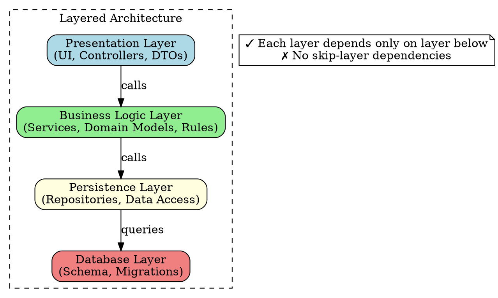
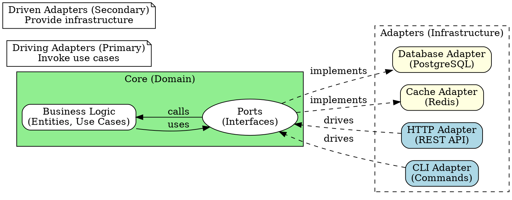
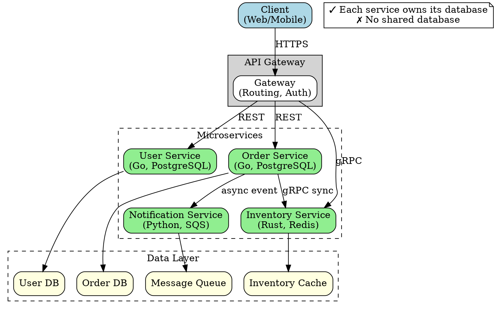
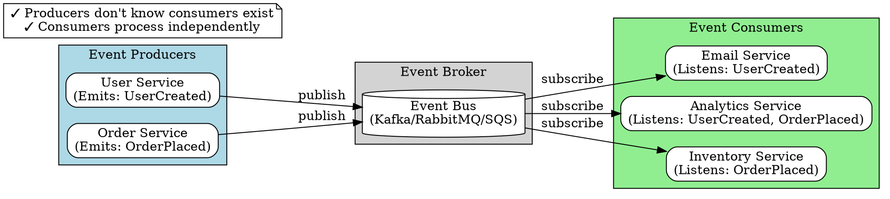

# Architect Design Patterns

**Purpose:** Design patterns and architectural guidance for Systems Architect agent
**Last Updated:** 2026-02-14
**Maintainer:** Architect agent

## Overview

This library provides structured guidance on design patterns and architectural approaches, covering:
- Architectural patterns (layered, hexagonal, microservices, event-driven)
- Design patterns by category (creational, structural, behavioral)
- Language-specific idioms
- Testing patterns
- Error handling patterns

Each pattern includes:
- **Intent:** One-sentence problem statement
- **When to Use:** 3-4 concrete use cases
- **When to Avoid:** 3-4 anti-use-cases
- **Structure:** Diagram showing components and relationships
- **Trade-offs:** Specific pros and cons with context

## Table of Contents

1. [Architectural Patterns](#architectural-patterns)
   - [Layered Architecture](#layered-architecture)
   - [Hexagonal Architecture](#hexagonal-architecture)
   - [Microservices Architecture](#microservices-architecture)
   - [Event-Driven Architecture](#event-driven-architecture)
2. [Creational Patterns](#creational-patterns)
   - [Factory Pattern](#factory-pattern)
   - [Builder Pattern](#builder-pattern)
   - [Singleton Pattern](#singleton-pattern)
3. [Structural Patterns](#structural-patterns)
   - [Repository Pattern](#repository-pattern)
   - [Decorator Pattern](#decorator-pattern)
   - [Adapter Pattern](#adapter-pattern)
   - [Facade Pattern](#facade-pattern)
4. [Behavioral Patterns](#behavioral-patterns)
   - [Observer Pattern](#observer-pattern)
   - [Strategy Pattern](#strategy-pattern)
   - [Command Pattern](#command-pattern)
   - [Chain of Responsibility](#chain-of-responsibility)
5. [Testing Patterns](#testing-patterns)
   - [Test Doubles](#test-doubles)
   - [Fixtures](#fixtures)
   - [Table-Driven Tests](#table-driven-tests)
   - [Property-Based Testing](#property-based-testing)
6. [Error Handling Patterns](#error-handling-patterns)
   - [Go Error Handling](#go-error-handling)
   - [TypeScript Error Handling](#typescript-error-handling)
   - [Rust Error Handling](#rust-error-handling)
   - [Python Error Handling](#python-error-handling)

---

## Architectural Patterns

### Layered Architecture

#### Intent

Organize code into horizontal layers where each layer depends only on layers below it, creating clear separation of concerns and reducing coupling.

#### When to Use

- **Monolithic applications** where clear module boundaries prevent spaghetti code
- **Enterprise systems** with well-defined business logic, data access, and presentation layers
- **Teams with role specialization** (frontend devs, backend devs, DBAs) working on different layers
- **Incremental modernization** where you need to replace one layer without affecting others

#### When to Avoid

- **Distributed systems** where network boundaries don't align with logical layers (creates chatty APIs)
- **High-performance systems** where cross-layer calls add unacceptable latency overhead
- **Rapidly evolving domains** where layer boundaries change frequently (causes cascading refactors)
- **Small microservices** where the overhead of 3-4 layers outweighs benefits (over-engineering)

#### Structure



**Key Rules:**
- **Strict layering:** Layer N can only call Layer N-1 (no skipping layers)
- **Acyclic dependencies:** Lower layers never depend on higher layers
- **Cohesion:** Each layer has a single responsibility (presentation, business, data)

#### Trade-offs

**Pros:**
- **Clear separation:** Easy to understand where code belongs (UI code in presentation, business rules in logic layer)
- **Independent testing:** Can test business logic without database using mocks/stubs
- **Team scalability:** Different teams can own different layers with minimal coordination
- **Technology swapping:** Replace database (PostgreSQL → MongoDB) by changing only persistence layer

**Cons:**
- **Performance overhead:** Every operation crosses multiple layers (3-4 function calls minimum)
- **Rigid structure:** Hard to implement cross-cutting concerns (logging, auth) without violating layers
- **Anemic domain models:** Business layer often becomes thin wrappers around database entities
- **Change amplification:** Simple feature additions require touching all layers (presentation → business → persistence)

**Metrics:**
- Layer violation rate: Should be 0% (enforce with tools like `go-cleanarch`, `dependency-cruiser`)
- Average call depth: Typical 3-4 layers; >5 indicates over-layering
- Cross-layer coupling: Measure with cyclomatic complexity; aim for <10 dependencies per layer

#### Related Patterns

- **Clean Architecture:** Extends layered with dependency inversion (business layer at center)
- **Onion Architecture:** Similar to clean architecture with concentric dependency rings
- **MVC (Model-View-Controller):** Specialized layered pattern for presentation layer

---

### Hexagonal Architecture

#### Intent

Isolate core business logic from external concerns (databases, APIs, UI) by defining ports (interfaces) and adapters (implementations), allowing the domain to remain independent of infrastructure.

#### When to Use

- **Domain-driven design** where business logic complexity justifies isolation from technical concerns
- **Multiple interfaces** to same business logic (REST API, GraphQL, CLI, batch jobs share domain)
- **Legacy system migration** where you need to swap databases/APIs without changing business rules
- **Test-first development** where you want to test business logic without spinning up databases/servers

#### When to Avoid

- **CRUD applications** with thin business logic (hexagonal adds ceremony without benefit)
- **Tight integration requirements** where business logic and infrastructure are inseparable (ETL pipelines)
- **Prototyping/MVPs** where flexibility to change domain logic quickly is more important than isolation
- **Small teams** unfamiliar with pattern (steep learning curve, easy to misuse)

#### Structure



**Key Concepts:**
- **Core/Domain:** Contains business logic, agnostic to frameworks/databases
- **Ports:** Interfaces defined by domain (input ports = use cases, output ports = repositories/services)
- **Adapters:** Concrete implementations of ports (HTTP handler, PostgreSQL repository)

**Dependency Rule:** All dependencies point inward toward the domain. Infrastructure depends on domain, not vice versa.

#### Trade-offs

**Pros:**
- **Technology agnostic:** Swap PostgreSQL for MongoDB by changing one adapter (domain unchanged)
- **Highly testable:** Test domain logic with in-memory adapters (no infrastructure needed)
- **Multiple interfaces:** Add new API (GraphQL, gRPC) by creating new driving adapter
- **Clear boundaries:** Impossible for infrastructure concerns to leak into business logic (compiler enforced)

**Cons:**
- **High initial complexity:** Requires defining ports, writing adapters, wiring dependency injection
- **Verbose codebase:** 3-4 files per feature (use case, port interface, adapter, tests) vs 1-2 in traditional layered
- **Mapping overhead:** Constant translation between domain entities and infrastructure DTOs (database rows, API responses)
- **Team learning curve:** Takes 2-3 months for team to internalize pattern and use correctly

**Metrics:**
- Adapter count per port: Should be ≥2 (if only 1 adapter per port, hexagonal is overkill)
- Domain-to-infrastructure dependency ratio: Should be 0:N (domain has zero outgoing dependencies)
- Test pyramid: Unit tests (domain) should outnumber integration tests 3:1

#### Related Patterns

- **Ports and Adapters:** Original name for hexagonal architecture
- **Clean Architecture:** Similar isolation with concentric circles instead of hexagon
- **Dependency Inversion Principle:** Core SOLID principle that hexagonal architecture enforces

---

### Microservices Architecture

#### Intent

Decompose application into small, independently deployable services that communicate over network, enabling teams to develop, deploy, and scale components independently.

#### When to Use

- **Large distributed teams** (>50 engineers) where coordination overhead of monolith becomes bottleneck
- **Polyglot requirements** where different components need different languages/frameworks (ML in Python, real-time in Go)
- **Independent scaling** where components have vastly different load patterns (auth service vs video processing)
- **Continuous deployment** where you need to deploy features multiple times per day without coordinating releases

#### When to Avoid

- **Small teams** (<10 engineers) where operational overhead outweighs benefits (monitoring, tracing, deployments)
- **Unknown domain boundaries** where service boundaries will change frequently (creates distributed monolith)
- **Strong consistency requirements** where transactions span services (2PC doesn't scale, sagas are complex)
- **Latency-sensitive systems** where network calls between services add unacceptable overhead (>50ms)

#### Structure



**Key Principles:**
- **Single Responsibility:** Each service does one thing well (user management, order processing)
- **Database per Service:** No shared databases (avoids coupling at data layer)
- **API-based Communication:** Services communicate only via network APIs (REST, gRPC, events)

#### Trade-offs

**Pros:**
- **Independent deployment:** Deploy user service without touching order service (reduces coordination, speeds delivery)
- **Technology flexibility:** Use Go for high-throughput services, Python for ML, Rust for low-latency (best tool for job)
- **Team autonomy:** Each team owns 2-3 services end-to-end (no cross-team dependencies for features)
- **Fault isolation:** Order service crash doesn't take down user service (circuit breakers contain failures)
- **Granular scaling:** Scale inventory service to 100 instances, user service to 5 (optimize cost per component)

**Cons:**
- **Operational complexity:** 10 services = 10 deployments, 10 monitoring dashboards, 10 log streams (requires DevOps maturity)
- **Distributed debugging:** Tracing requests across 5 services with correlation IDs is harder than single process debugging
- **Data consistency challenges:** No distributed transactions; use eventual consistency with sagas/event sourcing (complex to implement)
- **Network latency overhead:** 4 service hops = 20-100ms added latency vs in-process function calls (<1ms)
- **Testing complexity:** Integration tests require spinning up 5+ services or maintaining complex mocks

**Metrics:**
- Service size: Should be <1000 LOC per service; >5000 LOC indicates service too large
- Service dependencies: Should be <3 sync dependencies per service; >5 indicates tight coupling
- Deployment frequency: Should be ≥1 deploy/week per service; <1/month indicates services too large
- P99 latency budget: Allocate 10-20ms per service hop; >5 hops indicates architecture issue

#### Related Patterns

- **Service Mesh:** Infrastructure layer for service-to-service communication (Istio, Linkerd)
- **API Gateway:** Single entry point for clients, handles routing/auth/rate-limiting
- **Event-Driven Architecture:** Async communication pattern often used with microservices

---

### Event-Driven Architecture

#### Intent

Decouple components by having them react to events (state changes) rather than calling each other directly, enabling asynchronous communication and loose coupling.

#### When to Use

- **Asynchronous workflows** where components don't need immediate responses (order placed → email sent hours later)
- **Fan-out patterns** where one action triggers multiple independent reactions (user signup → send email, create profile, log analytics)
- **Event sourcing** where you need complete audit trail of all state changes (financial systems, compliance)
- **Scalable systems** where components have different processing speeds (slow video processing shouldn't block fast API)

#### When to Avoid

- **Synchronous requirements** where caller needs immediate response (user login → show dashboard requires user data now)
- **Simple CRUD apps** where direct database reads/writes are sufficient (event overhead not justified)
- **Strong ordering guarantees** where events must be processed in exact order (event systems guarantee at-least-once, not order)
- **Low-latency requirements** where event queue latency (10-100ms) is unacceptable (real-time trading, gaming)

#### Structure



**Key Concepts:**
- **Events:** Immutable facts about state changes (UserCreated, OrderPlaced, PaymentProcessed)
- **Producers:** Services that publish events when state changes
- **Consumers:** Services that subscribe to events and react independently
- **Event Broker:** Message queue that stores events and delivers to consumers (Kafka, RabbitMQ, SQS)

#### Trade-offs

**Pros:**
- **Loose coupling:** Email service can be added/removed without changing user service (producer doesn't know consumers exist)
- **Scalability:** Consumers process events at their own pace (slow video processing doesn't block fast API)
- **Flexibility:** Add new consumer for new feature without touching existing code (audit service subscribes to all events)
- **Resilience:** If email service is down, events queue up and process when it recovers (no data loss)
- **Audit trail:** Event log provides complete history of system state changes (replay events to debug)

**Cons:**
- **Eventual consistency:** User creation and email sending happen seconds/minutes apart (not immediate)
- **Debugging complexity:** Tracing event flow across 5 consumers harder than synchronous call stack
- **Message broker SPOF:** If Kafka is down, entire system stops publishing/consuming events (need HA setup)
- **Duplicate processing:** At-least-once delivery means consumers must be idempotent (handle same event twice)
- **Event schema evolution:** Changing event structure requires coordinating consumers (versioning strategies needed)

**Metrics:**
- Event processing lag: Should be <1 second for most events; >10 seconds indicates consumer bottleneck
- Dead letter queue size: Should be <1% of total events; high rate indicates consumer bugs
- Event throughput: Measure events/second; compare to broker capacity (Kafka sustains 1M events/sec)
- Consumer retry rate: Should be <5%; high rate indicates transient errors or bad events

#### Related Patterns

- **Event Sourcing:** Store events as source of truth instead of current state (enables time travel, audit)
- **CQRS (Command Query Responsibility Segregation):** Separate read and write models, synced via events
- **Saga Pattern:** Coordinate distributed transactions using events (order service → payment service → inventory service)

---

## Creational Patterns

### Factory Pattern

#### Intent

Encapsulate object creation logic to decouple client code from concrete types, allowing instantiation based on runtime conditions without exposing construction complexity.

#### When to Use

- **Multiple implementations** of an interface where selection depends on configuration/runtime data (DatabaseFactory returns PostgreSQL or MySQL client)
- **Complex construction logic** that shouldn't clutter client code (HTTP client with retries, circuit breakers, auth)
- **Plugin systems** where new types can be registered without modifying factory code
- **Testing** where you need to swap real implementations with mocks/fakes

#### When to Avoid

- **Single concrete type** with no alternatives (factory adds unnecessary indirection)
- **Simple constructors** with 1-2 parameters (direct instantiation is clearer)
- **Compile-time type selection** where generics/templates suffice (factory runtime overhead not needed)

#### Implementation Examples

**Go:**
```go
// Repository interface
type Repository interface {
    Save(ctx context.Context, entity Entity) error
    Find(ctx context.Context, id string) (Entity, error)
}

// Factory function
func NewRepository(dbType string, connStr string) (Repository, error) {
    switch dbType {
    case "postgres":
        return &PostgresRepository{connStr: connStr}, nil
    case "mysql":
        return &MySQLRepository{connStr: connStr}, nil
    default:
        return nil, fmt.Errorf("unsupported database type: %s", dbType)
    }
}

// Concrete implementations
type PostgresRepository struct{ connStr string }
func (r *PostgresRepository) Save(ctx context.Context, e Entity) error { /*...*/ }
func (r *PostgresRepository) Find(ctx context.Context, id string) (Entity, error) { /*...*/ }
```

**TypeScript:**
```typescript
// Repository interface
interface Repository {
  save(entity: Entity): Promise<void>;
  find(id: string): Promise<Entity | null>;
}

// Factory class
class RepositoryFactory {
  static create(dbType: string, connStr: string): Repository {
    switch (dbType) {
      case 'postgres':
        return new PostgresRepository(connStr);
      case 'mysql':
        return new MySQLRepository(connStr);
      default:
        throw new Error(`Unsupported database type: ${dbType}`);
    }
  }
}

// Concrete implementation
class PostgresRepository implements Repository {
  constructor(private connStr: string) {}
  async save(entity: Entity): Promise<void> { /*...*/ }
  async find(id: string): Promise<Entity | null> { /*...*/ }
}
```

**Rust:**
```rust
// Repository trait
trait Repository: Send + Sync {
    fn save(&self, entity: Entity) -> Result<(), Error>;
    fn find(&self, id: &str) -> Result<Option<Entity>, Error>;
}

// Factory function
fn new_repository(db_type: &str, conn_str: String) -> Result<Box<dyn Repository>, Error> {
    match db_type {
        "postgres" => Ok(Box::new(PostgresRepository { conn_str })),
        "mysql" => Ok(Box::new(MySQLRepository { conn_str })),
        _ => Err(Error::UnsupportedDatabase(db_type.to_string())),
    }
}

// Concrete implementation
struct PostgresRepository { conn_str: String }
impl Repository for PostgresRepository {
    fn save(&self, entity: Entity) -> Result<(), Error> { /*...*/ }
    fn find(&self, id: &str) -> Result<Option<Entity>, Error> { /*...*/ }
}
```

**Python:**
```python
from abc import ABC, abstractmethod
from typing import Optional

# Repository interface
class Repository(ABC):
    @abstractmethod
    def save(self, entity: Entity) -> None: ...

    @abstractmethod
    def find(self, entity_id: str) -> Optional[Entity]: ...

# Factory function
def create_repository(db_type: str, conn_str: str) -> Repository:
    match db_type:
        case "postgres":
            return PostgresRepository(conn_str)
        case "mysql":
            return MySQLRepository(conn_str)
        case _:
            raise ValueError(f"Unsupported database type: {db_type}")

# Concrete implementation
class PostgresRepository(Repository):
    def __init__(self, conn_str: str):
        self.conn_str = conn_str

    def save(self, entity: Entity) -> None: ...
    def find(self, entity_id: str) -> Optional[Entity]: ...
```

#### Related Patterns

- **Abstract Factory:** Factory for creating families of related objects
- **Builder:** Alternative for complex construction with many optional parameters
- **Dependency Injection:** Replaces factory by injecting dependencies from configuration

---

### Builder Pattern

#### Intent

Separate complex object construction from its representation, allowing step-by-step creation with fluent API and ensuring all required fields are set before object is usable.

#### When to Use

- **Many optional parameters** where constructor with 10+ args is unreadable (HTTP client builder: timeout, retries, headers, auth)
- **Validation at construction** where invalid combinations must be prevented (date range: start before end)
- **Immutable objects** where all fields must be set before creation (no setters after construction)
- **Multiple representations** where same building steps produce different outputs (SQL query builder → raw SQL or parameterized)

#### When to Avoid

- **Simple objects** with 1-3 required fields (direct constructor is clearer)
- **Mutable objects** where setters after construction are acceptable (builder adds boilerplate)
- **Rarely changing APIs** where adding parameters is infrequent (builder overhead not justified)

#### Implementation Examples

**Go:**
```go
// Target struct (immutable after creation)
type HTTPClient struct {
    timeout       time.Duration
    retries       int
    headers       map[string]string
    circuitBreaker bool
}

// Builder
type HTTPClientBuilder struct {
    timeout       time.Duration
    retries       int
    headers       map[string]string
    circuitBreaker bool
}

func NewHTTPClientBuilder() *HTTPClientBuilder {
    return &HTTPClientBuilder{
        timeout: 30 * time.Second, // defaults
        retries: 3,
        headers: make(map[string]string),
    }
}

func (b *HTTPClientBuilder) WithTimeout(d time.Duration) *HTTPClientBuilder {
    b.timeout = d
    return b
}

func (b *HTTPClientBuilder) WithRetries(n int) *HTTPClientBuilder {
    b.retries = n
    return b
}

func (b *HTTPClientBuilder) WithHeader(key, val string) *HTTPClientBuilder {
    b.headers[key] = val
    return b
}

func (b *HTTPClientBuilder) WithCircuitBreaker() *HTTPClientBuilder {
    b.circuitBreaker = true
    return b
}

func (b *HTTPClientBuilder) Build() (*HTTPClient, error) {
    if b.timeout <= 0 {
        return nil, errors.New("timeout must be positive")
    }
    return &HTTPClient{
        timeout:       b.timeout,
        retries:       b.retries,
        headers:       b.headers,
        circuitBreaker: b.circuitBreaker,
    }, nil
}

// Usage
client, err := NewHTTPClientBuilder().
    WithTimeout(10 * time.Second).
    WithRetries(5).
    WithHeader("User-Agent", "MyApp/1.0").
    WithCircuitBreaker().
    Build()
```

**TypeScript:**
```typescript
// Target class (immutable after creation)
class HTTPClient {
  constructor(
    readonly timeout: number,
    readonly retries: number,
    readonly headers: Map<string, string>,
    readonly circuitBreaker: boolean
  ) {}
}

// Builder
class HTTPClientBuilder {
  private timeout = 30000; // defaults
  private retries = 3;
  private headers = new Map<string, string>();
  private circuitBreaker = false;

  withTimeout(ms: number): this {
    this.timeout = ms;
    return this;
  }

  withRetries(n: number): this {
    this.retries = n;
    return this;
  }

  withHeader(key: string, value: string): this {
    this.headers.set(key, value);
    return this;
  }

  withCircuitBreaker(): this {
    this.circuitBreaker = true;
    return this;
  }

  build(): HTTPClient {
    if (this.timeout <= 0) {
      throw new Error('Timeout must be positive');
    }
    return new HTTPClient(
      this.timeout,
      this.retries,
      this.headers,
      this.circuitBreaker
    );
  }
}

// Usage
const client = new HTTPClientBuilder()
  .withTimeout(10000)
  .withRetries(5)
  .withHeader('User-Agent', 'MyApp/1.0')
  .withCircuitBreaker()
  .build();
```

**Rust:**
```rust
// Target struct (immutable after creation)
#[derive(Debug)]
struct HTTPClient {
    timeout: Duration,
    retries: u32,
    headers: HashMap<String, String>,
    circuit_breaker: bool,
}

// Builder
struct HTTPClientBuilder {
    timeout: Duration,
    retries: u32,
    headers: HashMap<String, String>,
    circuit_breaker: bool,
}

impl HTTPClientBuilder {
    fn new() -> Self {
        Self {
            timeout: Duration::from_secs(30), // defaults
            retries: 3,
            headers: HashMap::new(),
            circuit_breaker: false,
        }
    }

    fn timeout(mut self, d: Duration) -> Self {
        self.timeout = d;
        self
    }

    fn retries(mut self, n: u32) -> Self {
        self.retries = n;
        self
    }

    fn header(mut self, key: String, value: String) -> Self {
        self.headers.insert(key, value);
        self
    }

    fn circuit_breaker(mut self) -> Self {
        self.circuit_breaker = true;
        self
    }

    fn build(self) -> Result<HTTPClient, String> {
        if self.timeout.is_zero() {
            return Err("Timeout must be positive".to_string());
        }
        Ok(HTTPClient {
            timeout: self.timeout,
            retries: self.retries,
            headers: self.headers,
            circuit_breaker: self.circuit_breaker,
        })
    }
}

// Usage
let client = HTTPClientBuilder::new()
    .timeout(Duration::from_secs(10))
    .retries(5)
    .header("User-Agent".to_string(), "MyApp/1.0".to_string())
    .circuit_breaker()
    .build()?;
```

**Python:**
```python
from dataclasses import dataclass
from typing import Dict

# Target class (frozen = immutable)
@dataclass(frozen=True)
class HTTPClient:
    timeout: int
    retries: int
    headers: Dict[str, str]
    circuit_breaker: bool

# Builder
class HTTPClientBuilder:
    def __init__(self):
        self._timeout = 30  # defaults
        self._retries = 3
        self._headers: Dict[str, str] = {}
        self._circuit_breaker = False

    def with_timeout(self, seconds: int) -> 'HTTPClientBuilder':
        self._timeout = seconds
        return self

    def with_retries(self, n: int) -> 'HTTPClientBuilder':
        self._retries = n
        return self

    def with_header(self, key: str, value: str) -> 'HTTPClientBuilder':
        self._headers[key] = value
        return self

    def with_circuit_breaker(self) -> 'HTTPClientBuilder':
        self._circuit_breaker = True
        return self

    def build(self) -> HTTPClient:
        if self._timeout <= 0:
            raise ValueError("Timeout must be positive")
        return HTTPClient(
            timeout=self._timeout,
            retries=self._retries,
            headers=self._headers.copy(),  # defensive copy
            circuit_breaker=self._circuit_breaker
        )

# Usage
client = (HTTPClientBuilder()
    .with_timeout(10)
    .with_retries(5)
    .with_header("User-Agent", "MyApp/1.0")
    .with_circuit_breaker()
    .build())
```

#### Related Patterns

- **Factory:** Alternative when construction logic is simple (no multi-step building)
- **Fluent Interface:** Builder uses fluent API (method chaining) for ergonomics
- **Immutable Object:** Builder ensures all fields set before creating immutable instance

---

### Singleton Pattern

#### Intent

Ensure a class has only one instance and provide global access point, typically for shared resources like configuration, connection pools, or caches.

#### When to Use

- **Shared state** that must be consistent across application (application config, feature flags)
- **Resource pools** where multiple instances waste resources (database connection pool, thread pool)
- **Coordination point** for distributed locks, rate limiters, or circuit breakers
- **Logging/metrics** where centralized collection is required

#### When to Avoid

- **Testability matters** where singleton makes mocking difficult (use dependency injection instead)
- **Mutable global state** that creates hidden dependencies between modules (breaks modularity)
- **Concurrency is required** where singleton becomes contention point (consider per-thread instances)
- **Lifecycle management needed** where singleton lives for entire process (can't restart/reset)

#### Concurrency Safety

**Critical:** Singleton initialization MUST be thread-safe. Use language-provided mechanisms:
- **Go:** `sync.Once` guarantees single execution
- **TypeScript:** Module scope ensures single instance (Node.js modules are singletons)
- **Rust:** `lazy_static!` or `std::sync::OnceLock` for thread-safe init
- **Python:** Module-level variable or `threading.Lock` for manual control

#### Implementation Examples

**Go (Thread-Safe with sync.Once):**
```go
import "sync"

type Config struct {
    APIKey      string
    Environment string
}

var (
    instance *Config
    once     sync.Once
)

func GetConfig() *Config {
    once.Do(func() {
        instance = &Config{
            APIKey:      loadAPIKey(),
            Environment: loadEnvironment(),
        }
    })
    return instance
}

// Usage
config := GetConfig()
fmt.Println(config.APIKey)
```

**TypeScript (Module Scope):**
```typescript
// config.ts
class Config {
  readonly apiKey: string;
  readonly environment: string;

  constructor() {
    this.apiKey = loadAPIKey();
    this.environment = loadEnvironment();
  }
}

// Module-scope singleton (Node.js modules are cached)
export const config = new Config();

// Usage (in other files)
import { config } from './config';
console.log(config.apiKey);
```

**Rust (lazy_static):**
```rust
use lazy_static::lazy_static;
use std::sync::RwLock;

struct Config {
    api_key: String,
    environment: String,
}

lazy_static! {
    static ref CONFIG: RwLock<Config> = RwLock::new(Config {
        api_key: load_api_key(),
        environment: load_environment(),
    });
}

// Usage
fn main() {
    let config = CONFIG.read().unwrap();
    println!("{}", config.api_key);
}
```

**Python (Module-Level Variable):**
```python
# config.py
class Config:
    def __init__(self):
        self.api_key = load_api_key()
        self.environment = load_environment()

# Module-level singleton
_instance: Config | None = None

def get_config() -> Config:
    global _instance
    if _instance is None:
        _instance = Config()
    return _instance

# Usage
from config import get_config
config = get_config()
print(config.api_key)
```

#### Related Patterns

- **Dependency Injection:** Preferred alternative that maintains testability
- **Monostate:** Shares state without enforcing single instance
- **Registry:** Maps keys to singleton instances (service locator pattern)

---

## Structural Patterns

### Repository Pattern

#### Intent

Encapsulate data access logic behind interface that mimics collection semantics (Add, Remove, Find), isolating domain layer from persistence concerns and enabling easier testing/swapping of storage backends.

#### When to Use

- **Domain-Driven Design** where business logic must be decoupled from database details
- **Multiple storage backends** where you need to support PostgreSQL, MongoDB, in-memory (tests)
- **Complex queries** that should be hidden behind domain-meaningful methods (FindActiveUsersByRole vs raw SQL)
- **Testing** where in-memory repository allows testing business logic without database

#### When to Avoid

- **Simple CRUD apps** where ORM already provides abstraction (repository adds duplication)
- **Reporting/analytics** where complex SQL queries don't map to domain operations (use query objects)
- **High-performance paths** where repository abstraction adds measurable overhead (bypass for hot paths)

#### Implementation Examples

**Go:**
```go
// Domain entity
type User struct {
    ID        string
    Email     string
    Active    bool
    CreatedAt time.Time
}

// Repository interface (domain layer)
type UserRepository interface {
    Add(ctx context.Context, user *User) error
    Remove(ctx context.Context, id string) error
    Find(ctx context.Context, id string) (*User, error)
    FindByEmail(ctx context.Context, email string) (*User, error)
    FindAllActive(ctx context.Context) ([]*User, error)
}

// PostgreSQL implementation (infrastructure layer)
type PostgresUserRepository struct {
    db *sql.DB
}

func NewPostgresUserRepository(db *sql.DB) *PostgresUserRepository {
    return &PostgresUserRepository{db: db}
}

func (r *PostgresUserRepository) Add(ctx context.Context, user *User) error {
    query := `INSERT INTO users (id, email, active, created_at) VALUES ($1, $2, $3, $4)`
    _, err := r.db.ExecContext(ctx, query, user.ID, user.Email, user.Active, user.CreatedAt)
    return err
}

func (r *PostgresUserRepository) Find(ctx context.Context, id string) (*User, error) {
    query := `SELECT id, email, active, created_at FROM users WHERE id = $1`
    var user User
    err := r.db.QueryRowContext(ctx, query, id).Scan(&user.ID, &user.Email, &user.Active, &user.CreatedAt)
    if err == sql.ErrNoRows {
        return nil, ErrUserNotFound
    }
    return &user, err
}

// In-memory implementation (testing)
type InMemoryUserRepository struct {
    users map[string]*User
    mu    sync.RWMutex
}

func NewInMemoryUserRepository() *InMemoryUserRepository {
    return &InMemoryUserRepository{users: make(map[string]*User)}
}

func (r *InMemoryUserRepository) Add(ctx context.Context, user *User) error {
    r.mu.Lock()
    defer r.mu.Unlock()
    r.users[user.ID] = user
    return nil
}

func (r *InMemoryUserRepository) Find(ctx context.Context, id string) (*User, error) {
    r.mu.RLock()
    defer r.mu.RUnlock()
    user, ok := r.users[id]
    if !ok {
        return nil, ErrUserNotFound
    }
    return user, nil
}
```

**TypeScript:**
```typescript
// Domain entity
interface User {
  id: string;
  email: string;
  active: boolean;
  createdAt: Date;
}

// Repository interface (domain layer)
interface UserRepository {
  add(user: User): Promise<void>;
  remove(id: string): Promise<void>;
  find(id: string): Promise<User | null>;
  findByEmail(email: string): Promise<User | null>;
  findAllActive(): Promise<User[]>;
}

// PostgreSQL implementation (infrastructure layer)
class PostgresUserRepository implements UserRepository {
  constructor(private pool: pg.Pool) {}

  async add(user: User): Promise<void> {
    await this.pool.query(
      'INSERT INTO users (id, email, active, created_at) VALUES ($1, $2, $3, $4)',
      [user.id, user.email, user.active, user.createdAt]
    );
  }

  async find(id: string): Promise<User | null> {
    const result = await this.pool.query(
      'SELECT id, email, active, created_at FROM users WHERE id = $1',
      [id]
    );
    return result.rows[0] || null;
  }

  async findAllActive(): Promise<User[]> {
    const result = await this.pool.query(
      'SELECT id, email, active, created_at FROM users WHERE active = true'
    );
    return result.rows;
  }
}

// In-memory implementation (testing)
class InMemoryUserRepository implements UserRepository {
  private users = new Map<string, User>();

  async add(user: User): Promise<void> {
    this.users.set(user.id, user);
  }

  async find(id: string): Promise<User | null> {
    return this.users.get(id) || null;
  }

  async findAllActive(): Promise<User[]> {
    return Array.from(this.users.values()).filter(u => u.active);
  }
}
```

**Rust:**
```rust
use async_trait::async_trait;
use chrono::{DateTime, Utc};

// Domain entity
#[derive(Debug, Clone)]
struct User {
    id: String,
    email: String,
    active: bool,
    created_at: DateTime<Utc>,
}

// Repository trait (domain layer)
#[async_trait]
trait UserRepository: Send + Sync {
    async fn add(&self, user: User) -> Result<(), Error>;
    async fn remove(&self, id: &str) -> Result<(), Error>;
    async fn find(&self, id: &str) -> Result<Option<User>, Error>;
    async fn find_by_email(&self, email: &str) -> Result<Option<User>, Error>;
    async fn find_all_active(&self) -> Result<Vec<User>, Error>;
}

// PostgreSQL implementation (infrastructure layer)
struct PostgresUserRepository {
    pool: sqlx::PgPool,
}

#[async_trait]
impl UserRepository for PostgresUserRepository {
    async fn add(&self, user: User) -> Result<(), Error> {
        sqlx::query(
            "INSERT INTO users (id, email, active, created_at) VALUES ($1, $2, $3, $4)"
        )
        .bind(&user.id)
        .bind(&user.email)
        .bind(user.active)
        .bind(user.created_at)
        .execute(&self.pool)
        .await?;
        Ok(())
    }

    async fn find(&self, id: &str) -> Result<Option<User>, Error> {
        let user = sqlx::query_as!(
            User,
            "SELECT id, email, active, created_at FROM users WHERE id = $1",
            id
        )
        .fetch_optional(&self.pool)
        .await?;
        Ok(user)
    }

    async fn find_all_active(&self) -> Result<Vec<User>, Error> {
        let users = sqlx::query_as!(
            User,
            "SELECT id, email, active, created_at FROM users WHERE active = true"
        )
        .fetch_all(&self.pool)
        .await?;
        Ok(users)
    }
}

// In-memory implementation (testing)
struct InMemoryUserRepository {
    users: Arc<RwLock<HashMap<String, User>>>,
}

#[async_trait]
impl UserRepository for InMemoryUserRepository {
    async fn add(&self, user: User) -> Result<(), Error> {
        self.users.write().await.insert(user.id.clone(), user);
        Ok(())
    }

    async fn find(&self, id: &str) -> Result<Option<User>, Error> {
        Ok(self.users.read().await.get(id).cloned())
    }

    async fn find_all_active(&self) -> Result<Vec<User>, Error> {
        Ok(self.users.read().await
            .values()
            .filter(|u| u.active)
            .cloned()
            .collect())
    }
}
```

**Python:**
```python
from abc import ABC, abstractmethod
from dataclasses import dataclass
from datetime import datetime
from typing import Optional, List

# Domain entity
@dataclass
class User:
    id: str
    email: str
    active: bool
    created_at: datetime

# Repository interface (domain layer)
class UserRepository(ABC):
    @abstractmethod
    async def add(self, user: User) -> None: ...

    @abstractmethod
    async def remove(self, user_id: str) -> None: ...

    @abstractmethod
    async def find(self, user_id: str) -> Optional[User]: ...

    @abstractmethod
    async def find_by_email(self, email: str) -> Optional[User]: ...

    @abstractmethod
    async def find_all_active(self) -> List[User]: ...

# PostgreSQL implementation (infrastructure layer)
class PostgresUserRepository(UserRepository):
    def __init__(self, pool):
        self.pool = pool

    async def add(self, user: User) -> None:
        async with self.pool.acquire() as conn:
            await conn.execute(
                "INSERT INTO users (id, email, active, created_at) VALUES ($1, $2, $3, $4)",
                user.id, user.email, user.active, user.created_at
            )

    async def find(self, user_id: str) -> Optional[User]:
        async with self.pool.acquire() as conn:
            row = await conn.fetchrow(
                "SELECT id, email, active, created_at FROM users WHERE id = $1",
                user_id
            )
            return User(**row) if row else None

    async def find_all_active(self) -> List[User]:
        async with self.pool.acquire() as conn:
            rows = await conn.fetch(
                "SELECT id, email, active, created_at FROM users WHERE active = true"
            )
            return [User(**row) for row in rows]

# In-memory implementation (testing)
class InMemoryUserRepository(UserRepository):
    def __init__(self):
        self._users: dict[str, User] = {}

    async def add(self, user: User) -> None:
        self._users[user.id] = user

    async def find(self, user_id: str) -> Optional[User]:
        return self._users.get(user_id)

    async def find_all_active(self) -> List[User]:
        return [u for u in self._users.values() if u.active]
```

#### Related Patterns

- **Data Mapper:** Maps between domain objects and database records (repository uses mapper internally)
- **Unit of Work:** Tracks changes across multiple repositories and commits atomically
- **Specification:** Encapsulates query logic as composable objects (FindBySpec)

---

### Decorator Pattern

#### Intent

Attach additional responsibilities to an object dynamically without modifying its structure, providing flexible alternative to subclassing for extending functionality.

#### When to Use

- **Cross-cutting concerns** like logging, caching, auth that apply to multiple objects (wrap repository with cache decorator)
- **Composable features** where combinations of behaviors are needed (compression + encryption on streams)
- **Runtime feature toggling** where decoration decisions depend on config (enable metrics only in production)
- **Middleware chains** where request processing passes through multiple handlers (HTTP middleware)

#### When to Avoid

- **Simple cases** where single level of wrapping suffices (just use wrapper function)
- **Many decorators** where order matters and debugging is hard (prefer explicit composition)
- **Performance-critical paths** where function call overhead is measurable (inline critical logic)

#### Implementation Examples

**Go (Caching Repository Decorator):**
```go
// Base repository interface
type UserRepository interface {
    Find(ctx context.Context, id string) (*User, error)
    Save(ctx context.Context, user *User) error
}

// Decorator: adds caching
type CachedUserRepository struct {
    base  UserRepository
    cache *Cache
    ttl   time.Duration
}

func NewCachedUserRepository(base UserRepository, cache *Cache, ttl time.Duration) *CachedUserRepository {
    return &CachedUserRepository{base: base, cache: cache, ttl: ttl}
}

func (r *CachedUserRepository) Find(ctx context.Context, id string) (*User, error) {
    // Check cache first
    if user, found := r.cache.Get(id); found {
        return user.(*User), nil
    }

    // Cache miss: delegate to base
    user, err := r.base.Find(ctx, id)
    if err != nil {
        return nil, err
    }

    // Store in cache
    r.cache.Set(id, user, r.ttl)
    return user, nil
}

func (r *CachedUserRepository) Save(ctx context.Context, user *User) error {
    // Invalidate cache
    r.cache.Delete(user.ID)

    // Delegate to base
    return r.base.Save(ctx, user)
}

// Usage: stack decorators
baseRepo := NewPostgresUserRepository(db)
cachedRepo := NewCachedUserRepository(baseRepo, cache, 5*time.Minute)
loggedRepo := NewLoggedUserRepository(cachedRepo, logger)

user, err := loggedRepo.Find(ctx, "user-123")  // logs -> cache -> postgres
```

**TypeScript (HTTP Middleware Decorator):**
```typescript
// Base handler interface
interface HttpHandler {
  handle(req: Request): Promise<Response>;
}

// Concrete handler
class UserHandler implements HttpHandler {
  async handle(req: Request): Promise<Response> {
    const user = await getUserFromDB(req.params.id);
    return { status: 200, body: user };
  }
}

// Decorator: adds logging
class LoggingHandler implements HttpHandler {
  constructor(
    private base: HttpHandler,
    private logger: Logger
  ) {}

  async handle(req: Request): Promise<Response> {
    this.logger.info(`Request: ${req.method} ${req.url}`);
    const start = Date.now();

    const response = await this.base.handle(req);

    const duration = Date.now() - start;
    this.logger.info(`Response: ${response.status} (${duration}ms)`);
    return response;
  }
}

// Decorator: adds auth
class AuthHandler implements HttpHandler {
  constructor(
    private base: HttpHandler,
    private authService: AuthService
  ) {}

  async handle(req: Request): Promise<Response> {
    if (!await this.authService.isAuthenticated(req)) {
      return { status: 401, body: { error: 'Unauthorized' } };
    }
    return this.base.handle(req);
  }
}

// Usage: stack decorators
const handler = new LoggingHandler(
  new AuthHandler(
    new UserHandler(),
    authService
  ),
  logger
);

const response = await handler.handle(request);  // logs -> auth -> user handler
```

**Rust (Stream Decorator):**
```rust
use std::io::{Read, Write};

// Base trait (Stream)
trait Stream: Read + Write {}

// Concrete stream
struct NetworkStream { /* socket */ }
impl Read for NetworkStream { /* ... */ }
impl Write for NetworkStream { /* ... */ }
impl Stream for NetworkStream {}

// Decorator: compression
struct CompressedStream<S: Stream> {
    inner: S,
    compressor: Compressor,
}

impl<S: Stream> CompressedStream<S> {
    fn new(stream: S) -> Self {
        Self { inner: stream, compressor: Compressor::new() }
    }
}

impl<S: Stream> Read for CompressedStream<S> {
    fn read(&mut self, buf: &mut [u8]) -> std::io::Result<usize> {
        let mut compressed = vec![0; buf.len()];
        let n = self.inner.read(&mut compressed)?;
        let decompressed = self.compressor.decompress(&compressed[..n]);
        buf[..decompressed.len()].copy_from_slice(&decompressed);
        Ok(decompressed.len())
    }
}

impl<S: Stream> Write for CompressedStream<S> {
    fn write(&mut self, buf: &[u8]) -> std::io::Result<usize> {
        let compressed = self.compressor.compress(buf);
        self.inner.write(&compressed)
    }
}

// Decorator: encryption
struct EncryptedStream<S: Stream> {
    inner: S,
    cipher: Cipher,
}

// Usage: stack decorators
let network = NetworkStream::connect("example.com:443")?;
let compressed = CompressedStream::new(network);
let encrypted = EncryptedStream::new(compressed);

encrypted.write(b"secret data")?;  // encrypts -> compresses -> sends
```

**Python (Function Decorator for Retry Logic):**
```python
import functools
import time
from typing import Callable, TypeVar, Any

T = TypeVar('T')

# Decorator: retry on failure
def retry(max_attempts: int = 3, delay: float = 1.0):
    def decorator(func: Callable[..., T]) -> Callable[..., T]:
        @functools.wraps(func)
        def wrapper(*args: Any, **kwargs: Any) -> T:
            last_exception = None
            for attempt in range(max_attempts):
                try:
                    return func(*args, **kwargs)
                except Exception as e:
                    last_exception = e
                    if attempt < max_attempts - 1:
                        time.sleep(delay * (2 ** attempt))  # exponential backoff
            raise last_exception
        return wrapper
    return decorator

# Decorator: logging
def logged(func: Callable[..., T]) -> Callable[..., T]:
    @functools.wraps(func)
    def wrapper(*args: Any, **kwargs: Any) -> T:
        print(f"Calling {func.__name__} with args={args}, kwargs={kwargs}")
        result = func(*args, **kwargs)
        print(f"{func.__name__} returned {result}")
        return result
    return wrapper

# Usage: stack decorators
@logged
@retry(max_attempts=5, delay=2.0)
def fetch_user(user_id: str) -> User:
    response = requests.get(f"https://api.example.com/users/{user_id}")
    response.raise_for_status()
    return User(**response.json())

user = fetch_user("user-123")  # logs -> retries on failure -> fetches
```

#### Related Patterns

- **Proxy:** Controls access to object (decorator adds behavior)
- **Chain of Responsibility:** Each handler decides whether to pass to next (decorator always delegates)
- **Composite:** Decorator wraps single object; composite wraps multiple

---

### Adapter Pattern

#### Intent

Convert interface of a class into another interface clients expect, allowing incompatible interfaces to work together without modifying original code.

#### When to Use

- **Third-party integration** where library interface doesn't match your domain (wrap Stripe API to match Payment interface)
- **Legacy system migration** where old and new systems must coexist (adapter bridges interfaces)
- **Multiple implementations** where each has different interface (adapt PostgreSQL and MongoDB to Repository)
- **Testing** where you need to adapt real services to testable interfaces (adapt HTTP client to interface)

#### When to Avoid

- **You control both interfaces** where you can just change the interface directly
- **Simple mapping** where single function suffices (no need for adapter class)
- **Performance-critical** where adapter overhead is measurable (inline adaptation)

#### Implementation Examples

**Go (Payment Gateway Adapter):**
```go
// Domain interface (what your code expects)
type PaymentGateway interface {
    ProcessPayment(ctx context.Context, amount Money, cardToken string) (PaymentResult, error)
    RefundPayment(ctx context.Context, transactionID string) error
}

// Third-party library (Stripe) with incompatible interface
type StripeClient struct {
    apiKey string
}

func (c *StripeClient) Charge(params StripeChargeParams) (*StripeCharge, error) { /*...*/ }
func (c *StripeClient) CreateRefund(chargeID string) (*StripeRefund, error) { /*...*/ }

// Adapter: Stripe -> PaymentGateway
type StripeAdapter struct {
    client *StripeClient
}

func NewStripeAdapter(apiKey string) *StripeAdapter {
    return &StripeAdapter{client: &StripeClient{apiKey: apiKey}}
}

func (a *StripeAdapter) ProcessPayment(ctx context.Context, amount Money, cardToken string) (PaymentResult, error) {
    // Translate domain types to Stripe types
    params := StripeChargeParams{
        Amount:   int64(amount.Cents),
        Currency: string(amount.Currency),
        Source:   cardToken,
    }

    charge, err := a.client.Charge(params)
    if err != nil {
        return PaymentResult{}, err
    }

    // Translate Stripe response to domain types
    return PaymentResult{
        TransactionID: charge.ID,
        Status:        translateStatus(charge.Status),
        AmountCharged: amount,
    }, nil
}

func (a *StripeAdapter) RefundPayment(ctx context.Context, transactionID string) error {
    _, err := a.client.CreateRefund(transactionID)
    return err
}

// Usage: swap payment gateways without changing business logic
var gateway PaymentGateway
if config.PaymentProvider == "stripe" {
    gateway = NewStripeAdapter(config.StripeAPIKey)
} else {
    gateway = NewPayPalAdapter(config.PayPalAPIKey)
}

result, err := gateway.ProcessPayment(ctx, money.Dollars(50), cardToken)
```

**TypeScript (Logger Adapter):**
```typescript
// Domain interface (what your code expects)
interface Logger {
  log(level: string, message: string, meta?: Record<string, any>): void;
}

// Third-party library (Winston) with different interface
import * as winston from 'winston';

// Adapter: Winston -> Logger
class WinstonAdapter implements Logger {
  private winston: winston.Logger;

  constructor(options: winston.LoggerOptions) {
    this.winston = winston.createLogger(options);
  }

  log(level: string, message: string, meta?: Record<string, any>): void {
    // Translate to Winston's interface
    this.winston.log({
      level: this.translateLevel(level),
      message,
      ...meta
    });
  }

  private translateLevel(level: string): string {
    // Map your levels to Winston's levels
    const mapping: Record<string, string> = {
      'debug': 'debug',
      'info': 'info',
      'warning': 'warn',
      'error': 'error'
    };
    return mapping[level] || 'info';
  }
}

// Adapter: Console -> Logger (for testing)
class ConsoleAdapter implements Logger {
  log(level: string, message: string, meta?: Record<string, any>): void {
    const metaStr = meta ? ` ${JSON.stringify(meta)}` : '';
    console.log(`[${level}] ${message}${metaStr}`);
  }
}

// Usage: swap loggers without changing application code
const logger: Logger = process.env.NODE_ENV === 'production'
  ? new WinstonAdapter({ transports: [new winston.transports.File({ filename: 'app.log' })] })
  : new ConsoleAdapter();

logger.log('info', 'User logged in', { userId: '123' });
```

**Rust (Storage Adapter):**
```rust
use async_trait::async_trait;

// Domain interface (what your code expects)
#[async_trait]
trait Storage: Send + Sync {
    async fn store(&self, key: &str, data: Vec<u8>) -> Result<(), Error>;
    async fn retrieve(&self, key: &str) -> Result<Vec<u8>, Error>;
    async fn delete(&self, key: &str) -> Result<(), Error>;
}

// Third-party S3 client (incompatible interface)
struct S3Client { /* AWS SDK */ }

impl S3Client {
    async fn put_object(&self, bucket: &str, key: &str, body: Vec<u8>) -> Result<(), aws_sdk_s3::Error> {
        // AWS SDK specific code
    }

    async fn get_object(&self, bucket: &str, key: &str) -> Result<Vec<u8>, aws_sdk_s3::Error> {
        // AWS SDK specific code
    }
}

// Adapter: S3 -> Storage
struct S3StorageAdapter {
    client: S3Client,
    bucket: String,
}

#[async_trait]
impl Storage for S3StorageAdapter {
    async fn store(&self, key: &str, data: Vec<u8>) -> Result<(), Error> {
        self.client
            .put_object(&self.bucket, key, data)
            .await
            .map_err(|e| Error::Storage(e.to_string()))
    }

    async fn retrieve(&self, key: &str) -> Result<Vec<u8>, Error> {
        self.client
            .get_object(&self.bucket, key)
            .await
            .map_err(|e| Error::Storage(e.to_string()))
    }

    async fn delete(&self, key: &str) -> Result<(), Error> {
        // Translate to S3's delete_object
        Ok(())
    }
}

// Adapter: Local filesystem -> Storage
struct FileSystemAdapter {
    base_path: PathBuf,
}

#[async_trait]
impl Storage for FileSystemAdapter {
    async fn store(&self, key: &str, data: Vec<u8>) -> Result<(), Error> {
        let path = self.base_path.join(key);
        tokio::fs::write(path, data).await?;
        Ok(())
    }

    async fn retrieve(&self, key: &str) -> Result<Vec<u8>, Error> {
        let path = self.base_path.join(key);
        let data = tokio::fs::read(path).await?;
        Ok(data)
    }
}

// Usage: swap storage backends
let storage: Box<dyn Storage> = if config.storage_type == "s3" {
    Box::new(S3StorageAdapter { client: s3_client, bucket: config.bucket })
} else {
    Box::new(FileSystemAdapter { base_path: PathBuf::from("/data") })
};

storage.store("file.txt", b"content".to_vec()).await?;
```

**Python (API Client Adapter):**
```python
from abc import ABC, abstractmethod
from typing import Dict, Any

# Domain interface (what your code expects)
class APIClient(ABC):
    @abstractmethod
    def get(self, endpoint: str) -> Dict[str, Any]: ...

    @abstractmethod
    def post(self, endpoint: str, data: Dict[str, Any]) -> Dict[str, Any]: ...

# Third-party library (requests) with different interface
import requests

# Adapter: requests -> APIClient
class RequestsAdapter(APIClient):
    def __init__(self, base_url: str, timeout: int = 30):
        self.base_url = base_url
        self.timeout = timeout

    def get(self, endpoint: str) -> Dict[str, Any]:
        # Translate to requests interface
        response = requests.get(
            f"{self.base_url}/{endpoint}",
            timeout=self.timeout
        )
        response.raise_for_status()
        return response.json()

    def post(self, endpoint: str, data: Dict[str, Any]) -> Dict[str, Any]:
        response = requests.post(
            f"{self.base_url}/{endpoint}",
            json=data,
            timeout=self.timeout
        )
        response.raise_for_status()
        return response.json()

# Adapter: httpx -> APIClient (async alternative)
import httpx

class HttpxAdapter(APIClient):
    def __init__(self, base_url: str, timeout: int = 30):
        self.base_url = base_url
        self.timeout = timeout
        self.client = httpx.Client(base_url=base_url, timeout=timeout)

    def get(self, endpoint: str) -> Dict[str, Any]:
        response = self.client.get(endpoint)
        response.raise_for_status()
        return response.json()

    def post(self, endpoint: str, data: Dict[str, Any]) -> Dict[str, Any]:
        response = self.client.post(endpoint, json=data)
        response.raise_for_status()
        return response.json()

# Usage: swap HTTP clients without changing business logic
client: APIClient = RequestsAdapter("https://api.example.com")
user_data = client.get("users/123")
```

#### Related Patterns

- **Bridge:** Separates abstraction from implementation (adapter retrofits existing classes)
- **Facade:** Simplifies complex subsystem (adapter matches specific interface)
- **Proxy:** Controls access (adapter changes interface)

---

### Facade Pattern

#### Intent

Provide simplified unified interface to complex subsystem, hiding implementation details and reducing dependencies between client code and subsystem components.

#### When to Use

- **Complex subsystems** with many classes/interfaces where clients need only subset (database migrations: schema, seeding, rollback wrapped in single `Migrate()` call)
- **Layered architecture** where facade represents clean API for layer (business layer facade hides service classes)
- **Third-party integration** where you want to isolate API complexity (wrap AWS SDK's 50 methods behind 5 methods)
- **Refactoring** where facade provides stable interface while internals change

#### When to Avoid

- **Simple subsystems** with 1-2 classes (facade adds unnecessary indirection)
- **Clients need fine-grained control** where facade hides required functionality
- **Tight coupling acceptable** where clients should know subsystem details (internal teams)

#### Implementation Examples

**Go (Database Migration Facade):**
```go
// Complex subsystem (many components)
type SchemaManager struct { /*...*/ }
func (sm *SchemaManager) LoadSchema(path string) error { /*...*/ }
func (sm *SchemaManager) ApplySchema(db *sql.DB) error { /*...*/ }

type MigrationRunner struct { /*...*/ }
func (mr *MigrationRunner) GetPendingMigrations() ([]Migration, error) { /*...*/ }
func (mr *MigrationRunner) RunMigration(m Migration) error { /*...*/ }
func (mr *MigrationRunner) RecordMigration(m Migration) error { /*...*/ }

type Seeder struct { /*...*/ }
func (s *Seeder) LoadSeedData(path string) error { /*...*/ }
func (s *Seeder) InsertSeedData(db *sql.DB) error { /*...*/ }

// Facade: simple interface to complex subsystem
type DatabaseMigrator struct {
    db             *sql.DB
    schemaManager  *SchemaManager
    migrationRunner *MigrationRunner
    seeder         *Seeder
}

func NewDatabaseMigrator(db *sql.DB, migrationsPath string, seedsPath string) *DatabaseMigrator {
    return &DatabaseMigrator{
        db:             db,
        schemaManager:  &SchemaManager{},
        migrationRunner: &MigrationRunner{db: db, path: migrationsPath},
        seeder:         &Seeder{path: seedsPath},
    }
}

// Simplified interface: hides complexity
func (dm *DatabaseMigrator) Migrate() error {
    // Load schema
    if err := dm.schemaManager.LoadSchema("schema.sql"); err != nil {
        return fmt.Errorf("load schema: %w", err)
    }

    // Apply schema
    if err := dm.schemaManager.ApplySchema(dm.db); err != nil {
        return fmt.Errorf("apply schema: %w", err)
    }

    // Run pending migrations
    migrations, err := dm.migrationRunner.GetPendingMigrations()
    if err != nil {
        return fmt.Errorf("get pending migrations: %w", err)
    }

    for _, m := range migrations {
        if err := dm.migrationRunner.RunMigration(m); err != nil {
            return fmt.Errorf("run migration %s: %w", m.Name, err)
        }
        if err := dm.migrationRunner.RecordMigration(m); err != nil {
            return fmt.Errorf("record migration %s: %w", m.Name, err)
        }
    }

    return nil
}

func (dm *DatabaseMigrator) Seed() error {
    if err := dm.seeder.LoadSeedData("seeds.sql"); err != nil {
        return err
    }
    return dm.seeder.InsertSeedData(dm.db)
}

// Usage: simple interface hides subsystem complexity
migrator := NewDatabaseMigrator(db, "./migrations", "./seeds")
if err := migrator.Migrate(); err != nil {
    log.Fatal(err)
}
if err := migrator.Seed(); err != nil {
    log.Fatal(err)
}
```

**TypeScript (Email Service Facade):**
```typescript
// Complex subsystem (multiple classes)
class SMTPClient {
  connect(host: string, port: number): void { /*...*/ }
  authenticate(user: string, pass: string): void { /*...*/ }
  disconnect(): void { /*...*/ }
}

class EmailTemplate {
  load(templateName: string): string { /*...*/ }
  render(data: Record<string, any>): string { /*...*/ }
}

class AttachmentHandler {
  readFile(path: string): Buffer { /*...*/ }
  encodeBase64(buffer: Buffer): string { /*...*/ }
}

class EmailValidator {
  validate(email: string): boolean { /*...*/ }
  sanitize(content: string): string { /*...*/ }
}

// Facade: simplified email interface
class EmailService {
  private smtp: SMTPClient;
  private templates: EmailTemplate;
  private attachments: AttachmentHandler;
  private validator: EmailValidator;

  constructor(config: EmailConfig) {
    this.smtp = new SMTPClient();
    this.smtp.connect(config.host, config.port);
    this.smtp.authenticate(config.user, config.pass);

    this.templates = new EmailTemplate();
    this.attachments = new AttachmentHandler();
    this.validator = new EmailValidator();
  }

  // Simplified interface
  async send(to: string, subject: string, templateName: string, data: Record<string, any>): Promise<void> {
    // Validate
    if (!this.validator.validate(to)) {
      throw new Error(`Invalid email: ${to}`);
    }

    // Render template
    const template = this.templates.load(templateName);
    const body = this.templates.render(data);
    const sanitized = this.validator.sanitize(body);

    // Send
    await this.smtp.send({ to, subject, body: sanitized });
  }

  async sendWithAttachment(
    to: string,
    subject: string,
    templateName: string,
    data: Record<string, any>,
    attachmentPath: string
  ): Promise<void> {
    // Read and encode attachment
    const fileBuffer = this.attachments.readFile(attachmentPath);
    const encoded = this.attachments.encodeBase64(fileBuffer);

    // Send with attachment
    const template = this.templates.load(templateName);
    const body = this.templates.render(data);

    await this.smtp.send({
      to,
      subject,
      body,
      attachments: [{ name: path.basename(attachmentPath), data: encoded }]
    });
  }

  close(): void {
    this.smtp.disconnect();
  }
}

// Usage: simple interface hides subsystem complexity
const emailService = new EmailService({
  host: 'smtp.example.com',
  port: 587,
  user: 'noreply@example.com',
  pass: process.env.SMTP_PASSWORD
});

await emailService.send(
  'user@example.com',
  'Welcome!',
  'welcome-email',
  { name: 'Alice', confirmUrl: 'https://...' }
);
```

**Rust (HTTP Client Facade):**
```rust
// Complex subsystem
struct ConnectionPool { /* connection management */ }
struct RetryPolicy { /* exponential backoff */ }
struct CircuitBreaker { /* failure tracking */ }
struct RequestBuilder { /* request construction */ }
struct ResponseParser { /* response parsing */ }

// Facade: simplified HTTP client
pub struct HttpClient {
    pool: ConnectionPool,
    retry: RetryPolicy,
    breaker: CircuitBreaker,
    base_url: String,
}

impl HttpClient {
    pub fn new(base_url: String) -> Self {
        Self {
            pool: ConnectionPool::new(10),
            retry: RetryPolicy::exponential(3, Duration::from_secs(1)),
            breaker: CircuitBreaker::new(5, Duration::from_secs(60)),
            base_url,
        }
    }

    // Simplified interface: hides subsystem complexity
    pub async fn get<T: DeserializeOwned>(&self, endpoint: &str) -> Result<T, Error> {
        let url = format!("{}/{}", self.base_url, endpoint);

        // Check circuit breaker
        if self.breaker.is_open() {
            return Err(Error::CircuitOpen);
        }

        // Retry loop
        let mut attempts = 0;
        loop {
            // Get connection from pool
            let conn = self.pool.acquire().await?;

            // Build request
            let request = RequestBuilder::new()
                .method("GET")
                .url(&url)
                .build()?;

            // Send request
            match conn.send(request).await {
                Ok(response) => {
                    self.breaker.record_success();
                    return ResponseParser::parse(response);
                }
                Err(e) if self.retry.should_retry(attempts, &e) => {
                    attempts += 1;
                    tokio::time::sleep(self.retry.delay(attempts)).await;
                    continue;
                }
                Err(e) => {
                    self.breaker.record_failure();
                    return Err(e);
                }
            }
        }
    }

    pub async fn post<T: Serialize, R: DeserializeOwned>(
        &self,
        endpoint: &str,
        body: &T
    ) -> Result<R, Error> {
        // Similar simplified interface for POST
        todo!()
    }
}

// Usage: simple interface hides subsystem complexity
let client = HttpClient::new("https://api.example.com".to_string());
let user: User = client.get("users/123").await?;
```

**Python (Cloud Storage Facade):**
```python
# Complex subsystem (AWS SDK)
import boto3
from botocore.config import Config
from botocore.exceptions import ClientError

# Facade: simplified cloud storage interface
class CloudStorage:
    def __init__(self, bucket: str, region: str = "us-east-1"):
        self.bucket = bucket

        # Configure S3 client (complex setup)
        config = Config(
            region_name=region,
            retries={'max_attempts': 3, 'mode': 'adaptive'},
            signature_version='s3v4'
        )
        self.s3 = boto3.client('s3', config=config)

        # Ensure bucket exists
        self._ensure_bucket_exists()

    def _ensure_bucket_exists(self) -> None:
        try:
            self.s3.head_bucket(Bucket=self.bucket)
        except ClientError:
            self.s3.create_bucket(Bucket=self.bucket)

    # Simplified interface
    def upload(self, key: str, file_path: str, public: bool = False) -> str:
        """Upload file to storage and return public URL."""
        extra_args = {}
        if public:
            extra_args['ACL'] = 'public-read'
            extra_args['ContentType'] = self._guess_content_type(file_path)

        self.s3.upload_file(file_path, self.bucket, key, ExtraArgs=extra_args)

        if public:
            return f"https://{self.bucket}.s3.amazonaws.com/{key}"
        else:
            return self.generate_presigned_url(key, expires_in=3600)

    def download(self, key: str, destination: str) -> None:
        """Download file from storage."""
        self.s3.download_file(self.bucket, key, destination)

    def delete(self, key: str) -> None:
        """Delete file from storage."""
        self.s3.delete_object(Bucket=self.bucket, Key=key)

    def list_files(self, prefix: str = "") -> list[str]:
        """List all files with optional prefix filter."""
        response = self.s3.list_objects_v2(Bucket=self.bucket, Prefix=prefix)
        return [obj['Key'] for obj in response.get('Contents', [])]

    def generate_presigned_url(self, key: str, expires_in: int = 3600) -> str:
        """Generate temporary download URL."""
        return self.s3.generate_presigned_url(
            'get_object',
            Params={'Bucket': self.bucket, 'Key': key},
            ExpiresIn=expires_in
        )

    def _guess_content_type(self, file_path: str) -> str:
        import mimetypes
        content_type, _ = mimetypes.guess_type(file_path)
        return content_type or 'application/octet-stream'

# Usage: simple interface hides AWS SDK complexity
storage = CloudStorage(bucket="my-app-files", region="us-west-2")

# Upload and get public URL
url = storage.upload("avatars/user123.jpg", "/tmp/avatar.jpg", public=True)

# Download file
storage.download("avatars/user123.jpg", "/tmp/downloaded.jpg")

# List files with prefix
files = storage.list_files(prefix="avatars/")
```

#### Related Patterns

- **Adapter:** Changes interface of single class (facade simplifies multiple classes)
- **Mediator:** Facilitates communication between objects (facade provides access to subsystem)
- **Abstract Factory:** Creates family of objects (facade provides access to existing objects)

---

## Behavioral Patterns

### Observer Pattern

#### Intent

Define one-to-many dependency between objects so when one object changes state, all dependents are notified automatically, enabling loose coupling between subject and observers.

#### When to Use

- **Event systems** where multiple subscribers need notification of state changes (UI updates when model changes)
- **Pub/Sub messaging** where producers and consumers are decoupled (event bus, message broker)
- **Real-time updates** where clients need push notifications (stock prices, chat messages)
- **Distributed systems** where services react to events from other services

#### When to Avoid

- **Synchronous workflows** where caller needs immediate response (observer adds async complexity)
- **Few observers** where direct method calls are clearer (1-2 observers don't justify pattern)
- **Performance-critical paths** where observer notification overhead is measurable
- **Complex dependencies** where observer updates trigger cascading updates (hard to debug)

#### Implementation Examples

**Go (Channel-Based Observer):**
```go
// Subject interface
type Subject interface {
    Attach(observer Observer)
    Detach(observer Observer)
    Notify(event Event)
}

// Observer interface
type Observer interface {
    Update(event Event)
}

// Concrete subject: stock price feed
type StockPriceFeed struct {
    observers []Observer
    mu        sync.RWMutex
}

func NewStockPriceFeed() *StockPriceFeed {
    return &StockPriceFeed{observers: make([]Observer, 0)}
}

func (s *StockPriceFeed) Attach(observer Observer) {
    s.mu.Lock()
    defer s.mu.Unlock()
    s.observers = append(s.observers, observer)
}

func (s *StockPriceFeed) Detach(observer Observer) {
    s.mu.Lock()
    defer s.mu.Unlock()
    for i, obs := range s.observers {
        if obs == observer {
            s.observers = append(s.observers[:i], s.observers[i+1:]...)
            break
        }
    }
}

func (s *StockPriceFeed) Notify(event Event) {
    s.mu.RLock()
    defer s.mu.RUnlock()
    for _, observer := range s.observers {
        // Notify asynchronously to avoid blocking
        go observer.Update(event)
    }
}

func (s *StockPriceFeed) UpdatePrice(symbol string, price float64) {
    event := Event{
        Type: "PriceUpdate",
        Data: map[string]interface{}{
            "symbol": symbol,
            "price":  price,
            "time":   time.Now(),
        },
    }
    s.Notify(event)
}

// Concrete observer: price alert
type PriceAlert struct {
    symbol    string
    threshold float64
    alerts    chan string
}

func NewPriceAlert(symbol string, threshold float64) *PriceAlert {
    return &PriceAlert{
        symbol:    symbol,
        threshold: threshold,
        alerts:    make(chan string, 10),
    }
}

func (p *PriceAlert) Update(event Event) {
    if event.Type != "PriceUpdate" {
        return
    }

    symbol := event.Data["symbol"].(string)
    price := event.Data["price"].(float64)

    if symbol == p.symbol && price >= p.threshold {
        p.alerts <- fmt.Sprintf("Alert: %s reached $%.2f", symbol, price)
    }
}

// Usage
feed := NewStockPriceFeed()
alert1 := NewPriceAlert("AAPL", 150.0)
alert2 := NewPriceAlert("AAPL", 200.0)

feed.Attach(alert1)
feed.Attach(alert2)

feed.UpdatePrice("AAPL", 175.50)  // Notifies both alerts
```

**TypeScript (EventEmitter Pattern):**
```typescript
// Subject interface
interface Subject {
  attach(observer: Observer): void;
  detach(observer: Observer): void;
  notify(event: Event): void;
}

// Observer interface
interface Observer {
  update(event: Event): void;
}

// Event type
interface Event {
  type: string;
  data: Record<string, any>;
}

// Concrete subject using EventEmitter pattern
class OrderService implements Subject {
  private observers = new Set<Observer>();

  attach(observer: Observer): void {
    this.observers.add(observer);
  }

  detach(observer: Observer): void {
    this.observers.delete(observer);
  }

  notify(event: Event): void {
    // Notify all observers asynchronously
    for (const observer of this.observers) {
      Promise.resolve().then(() => observer.update(event));
    }
  }

  async placeOrder(order: Order): Promise<void> {
    // Process order
    await this.saveToDatabase(order);

    // Notify observers
    this.notify({
      type: 'OrderPlaced',
      data: {
        orderId: order.id,
        customerId: order.customerId,
        total: order.total,
        timestamp: new Date()
      }
    });
  }
}

// Concrete observer: email notification
class EmailNotifier implements Observer {
  constructor(private emailService: EmailService) {}

  update(event: Event): void {
    if (event.type === 'OrderPlaced') {
      const { orderId, customerId } = event.data;
      this.emailService.send({
        to: this.getCustomerEmail(customerId),
        subject: 'Order Confirmation',
        body: `Your order ${orderId} has been placed.`
      });
    }
  }
}

// Concrete observer: inventory update
class InventoryUpdater implements Observer {
  constructor(private inventoryService: InventoryService) {}

  update(event: Event): void {
    if (event.type === 'OrderPlaced') {
      const { orderId } = event.data;
      this.inventoryService.reserveItems(orderId);
    }
  }
}

// Usage
const orderService = new OrderService();
const emailNotifier = new EmailNotifier(emailService);
const inventoryUpdater = new InventoryUpdater(inventoryService);

orderService.attach(emailNotifier);
orderService.attach(inventoryUpdater);

await orderService.placeOrder(order);  // Notifies both observers
```

**Rust (Trait-Based Observer):**
```rust
use std::sync::{Arc, RwLock};

// Observer trait
trait Observer: Send + Sync {
    fn update(&self, event: &Event);
}

// Event type
#[derive(Debug, Clone)]
struct Event {
    event_type: String,
    data: serde_json::Value,
}

// Subject trait
trait Subject {
    fn attach(&mut self, observer: Arc<dyn Observer>);
    fn detach(&mut self, observer_id: usize);
    fn notify(&self, event: Event);
}

// Concrete subject: sensor monitor
struct SensorMonitor {
    observers: Vec<Arc<dyn Observer>>,
    readings: Arc<RwLock<Vec<f64>>>,
}

impl SensorMonitor {
    fn new() -> Self {
        Self {
            observers: Vec::new(),
            readings: Arc::new(RwLock::new(Vec::new())),
        }
    }

    fn record_reading(&self, value: f64) {
        self.readings.write().unwrap().push(value);

        let event = Event {
            event_type: "ReadingRecorded".to_string(),
            data: serde_json::json!({
                "value": value,
                "timestamp": chrono::Utc::now().to_rfc3339(),
            }),
        };

        self.notify(event);
    }
}

impl Subject for SensorMonitor {
    fn attach(&mut self, observer: Arc<dyn Observer>) {
        self.observers.push(observer);
    }

    fn detach(&mut self, observer_id: usize) {
        if observer_id < self.observers.len() {
            self.observers.remove(observer_id);
        }
    }

    fn notify(&self, event: Event) {
        for observer in &self.observers {
            observer.update(&event);
        }
    }
}

// Concrete observer: threshold alert
struct ThresholdAlert {
    threshold: f64,
}

impl Observer for ThresholdAlert {
    fn update(&self, event: &Event) {
        if event.event_type == "ReadingRecorded" {
            if let Some(value) = event.data["value"].as_f64() {
                if value > self.threshold {
                    println!("Alert: Reading {} exceeds threshold {}", value, self.threshold);
                }
            }
        }
    }
}

// Usage
let mut monitor = SensorMonitor::new();
let alert = Arc::new(ThresholdAlert { threshold: 75.0 });

monitor.attach(alert.clone());
monitor.record_reading(80.5);  // Triggers alert
```

**Python (Property-Based Observer):**
```python
from abc import ABC, abstractmethod
from typing import List, Any, Dict
import asyncio

# Observer interface
class Observer(ABC):
    @abstractmethod
    def update(self, event: Dict[str, Any]) -> None:
        pass

# Subject interface
class Subject(ABC):
    def __init__(self):
        self._observers: List[Observer] = []

    def attach(self, observer: Observer) -> None:
        if observer not in self._observers:
            self._observers.append(observer)

    def detach(self, observer: Observer) -> None:
        if observer in self._observers:
            self._observers.remove(observer)

    def notify(self, event: Dict[str, Any]) -> None:
        for observer in self._observers:
            observer.update(event)

# Concrete subject: document editor
class Document(Subject):
    def __init__(self, content: str = ""):
        super().__init__()
        self._content = content

    @property
    def content(self) -> str:
        return self._content

    @content.setter
    def content(self, value: str) -> None:
        old_content = self._content
        self._content = value

        # Notify observers of change
        self.notify({
            'type': 'ContentChanged',
            'old': old_content,
            'new': value,
            'length': len(value)
        })

# Concrete observer: word counter
class WordCounter(Observer):
    def __init__(self):
        self.word_count = 0

    def update(self, event: Dict[str, Any]) -> None:
        if event['type'] == 'ContentChanged':
            self.word_count = len(event['new'].split())
            print(f"Word count: {self.word_count}")

# Concrete observer: auto-saver
class AutoSaver(Observer):
    def __init__(self, filename: str):
        self.filename = filename

    def update(self, event: Dict[str, Any]) -> None:
        if event['type'] == 'ContentChanged':
            with open(self.filename, 'w') as f:
                f.write(event['new'])
            print(f"Saved to {self.filename}")

# Usage
doc = Document()
counter = WordCounter()
saver = AutoSaver("document.txt")

doc.attach(counter)
doc.attach(saver)

doc.content = "Hello world"  # Notifies both observers
```

#### Related Patterns

- **Mediator:** Centralizes communication (observer is decentralized)
- **Event Sourcing:** Stores events as source of truth (observer reacts to events)
- **Pub/Sub:** Distributed observer pattern with message broker

---

### Strategy Pattern

#### Intent

Define family of algorithms, encapsulate each one, and make them interchangeable, allowing algorithm to vary independently from clients that use it.

#### When to Use

- **Multiple algorithms** for same task where selection depends on context (sorting: quicksort vs mergesort vs heapsort)
- **Conditional complexity** where many if/else branches select behavior (payment: credit card vs PayPal vs crypto)
- **Runtime algorithm selection** based on configuration or user input (compression: none vs gzip vs brotli)
- **Testing** where you want to inject different behaviors (real vs mock implementations)

#### When to Avoid

- **Single algorithm** that never changes (strategy adds unnecessary abstraction)
- **Simple logic** where function parameter suffices (no need for strategy interface)
- **Compile-time selection** where generics/templates are clearer (strategy is runtime)

#### Implementation Examples

**Go (Interface-Based Strategy):**
```go
// Strategy interface
type CompressionStrategy interface {
    Compress(data []byte) ([]byte, error)
    Decompress(data []byte) ([]byte, error)
}

// Concrete strategy: Gzip
type GzipCompression struct {
    level int
}

func (g *GzipCompression) Compress(data []byte) ([]byte, error) {
    var buf bytes.Buffer
    writer, _ := gzip.NewWriterLevel(&buf, g.level)
    writer.Write(data)
    writer.Close()
    return buf.Bytes(), nil
}

func (g *GzipCompression) Decompress(data []byte) ([]byte, error) {
    reader, err := gzip.NewReader(bytes.NewReader(data))
    if err != nil {
        return nil, err
    }
    defer reader.Close()
    return io.ReadAll(reader)
}

// Concrete strategy: Zstd
type ZstdCompression struct {
    level int
}

func (z *ZstdCompression) Compress(data []byte) ([]byte, error) {
    encoder, _ := zstd.NewWriter(nil, zstd.WithEncoderLevel(zstd.EncoderLevel(z.level)))
    return encoder.EncodeAll(data, nil), nil
}

func (z *ZstdCompression) Decompress(data []byte) ([]byte, error) {
    decoder, _ := zstd.NewReader(nil)
    return decoder.DecodeAll(data, nil)
}

// Context: file compressor
type FileCompressor struct {
    strategy CompressionStrategy
}

func NewFileCompressor(strategy CompressionStrategy) *FileCompressor {
    return &FileCompressor{strategy: strategy}
}

func (f *FileCompressor) SetStrategy(strategy CompressionStrategy) {
    f.strategy = strategy
}

func (f *FileCompressor) CompressFile(inputPath, outputPath string) error {
    data, err := os.ReadFile(inputPath)
    if err != nil {
        return err
    }

    compressed, err := f.strategy.Compress(data)
    if err != nil {
        return err
    }

    return os.WriteFile(outputPath, compressed, 0644)
}

// Usage: swap strategies at runtime
compressor := NewFileCompressor(&GzipCompression{level: 6})
compressor.CompressFile("input.txt", "output.gz")

// Switch strategy
compressor.SetStrategy(&ZstdCompression{level: 3})
compressor.CompressFile("input.txt", "output.zst")
```

**TypeScript (Class-Based Strategy):**
```typescript
// Strategy interface
interface PaymentStrategy {
  pay(amount: number): Promise<PaymentResult>;
  refund(transactionId: string, amount: number): Promise<void>;
}

// Concrete strategy: credit card
class CreditCardPayment implements PaymentStrategy {
  constructor(
    private cardNumber: string,
    private cvv: string,
    private expiryDate: string
  ) {}

  async pay(amount: number): Promise<PaymentResult> {
    // Process credit card payment
    const token = await this.tokenizeCard();
    const response = await this.chargeCard(token, amount);

    return {
      transactionId: response.id,
      status: 'success',
      amount
    };
  }

  async refund(transactionId: string, amount: number): Promise<void> {
    await this.processRefund(transactionId, amount);
  }

  private async tokenizeCard(): Promise<string> {
    // Tokenization logic
    return 'tok_visa_1234';
  }

  private async chargeCard(token: string, amount: number): Promise<any> {
    // Charge logic
    return { id: 'ch_abc123' };
  }
}

// Concrete strategy: PayPal
class PayPalPayment implements PaymentStrategy {
  constructor(private email: string, private apiKey: string) {}

  async pay(amount: number): Promise<PaymentResult> {
    // PayPal payment flow
    const orderId = await this.createOrder(amount);
    const approval = await this.getApproval(orderId);

    return {
      transactionId: orderId,
      status: approval ? 'success' : 'pending',
      amount
    };
  }

  async refund(transactionId: string, amount: number): Promise<void> {
    await this.paypalRefund(transactionId, amount);
  }
}

// Context: checkout service
class CheckoutService {
  constructor(private paymentStrategy: PaymentStrategy) {}

  setPaymentStrategy(strategy: PaymentStrategy): void {
    this.paymentStrategy = strategy;
  }

  async processPayment(order: Order): Promise<PaymentResult> {
    // Validate order
    if (order.total <= 0) {
      throw new Error('Invalid order total');
    }

    // Use strategy to process payment
    return await this.paymentStrategy.pay(order.total);
  }

  async processRefund(transactionId: string, amount: number): Promise<void> {
    await this.paymentStrategy.refund(transactionId, amount);
  }
}

// Usage: select strategy based on user choice
let strategy: PaymentStrategy;

if (paymentMethod === 'credit_card') {
  strategy = new CreditCardPayment(cardNumber, cvv, expiry);
} else if (paymentMethod === 'paypal') {
  strategy = new PayPalPayment(email, apiKey);
}

const checkout = new CheckoutService(strategy);
const result = await checkout.processPayment(order);
```

**Rust (Enum-Based Strategy):**
```rust
use async_trait::async_trait;

// Strategy trait
#[async_trait]
trait RoutingStrategy: Send + Sync {
    async fn select_route(&self, request: &Request) -> Result<Endpoint, Error>;
}

// Concrete strategy: round-robin
struct RoundRobinStrategy {
    endpoints: Vec<Endpoint>,
    counter: Arc<AtomicUsize>,
}

#[async_trait]
impl RoutingStrategy for RoundRobinStrategy {
    async fn select_route(&self, _request: &Request) -> Result<Endpoint, Error> {
        let index = self.counter.fetch_add(1, Ordering::SeqCst);
        let endpoint = &self.endpoints[index % self.endpoints.len()];
        Ok(endpoint.clone())
    }
}

// Concrete strategy: least connections
struct LeastConnectionsStrategy {
    endpoints: Vec<Endpoint>,
    connections: Arc<RwLock<HashMap<String, usize>>>,
}

#[async_trait]
impl RoutingStrategy for LeastConnectionsStrategy {
    async fn select_route(&self, _request: &Request) -> Result<Endpoint, Error> {
        let connections = self.connections.read().await;

        let endpoint = self.endpoints
            .iter()
            .min_by_key(|ep| connections.get(&ep.id).unwrap_or(&0))
            .ok_or(Error::NoEndpoints)?;

        Ok(endpoint.clone())
    }
}

// Context: load balancer
struct LoadBalancer {
    strategy: Box<dyn RoutingStrategy>,
}

impl LoadBalancer {
    fn new(strategy: Box<dyn RoutingStrategy>) -> Self {
        Self { strategy }
    }

    fn set_strategy(&mut self, strategy: Box<dyn RoutingStrategy>) {
        self.strategy = strategy;
    }

    async fn route(&self, request: Request) -> Result<Response, Error> {
        let endpoint = self.strategy.select_route(&request).await?;
        self.forward_request(&endpoint, request).await
    }

    async fn forward_request(&self, endpoint: &Endpoint, request: Request) -> Result<Response, Error> {
        // Forward request to selected endpoint
        todo!()
    }
}

// Usage: configure load balancing strategy
let strategy: Box<dyn RoutingStrategy> = if config.algorithm == "round-robin" {
    Box::new(RoundRobinStrategy::new(endpoints))
} else {
    Box::new(LeastConnectionsStrategy::new(endpoints))
};

let balancer = LoadBalancer::new(strategy);
let response = balancer.route(request).await?;
```

**Python (Protocol-Based Strategy):**
```python
from typing import Protocol, List
from dataclasses import dataclass

# Strategy protocol
class SortingStrategy(Protocol):
    def sort(self, data: List[int]) -> List[int]:
        ...

# Concrete strategy: bubble sort
class BubbleSort:
    def sort(self, data: List[int]) -> List[int]:
        arr = data.copy()
        n = len(arr)
        for i in range(n):
            for j in range(0, n - i - 1):
                if arr[j] > arr[j + 1]:
                    arr[j], arr[j + 1] = arr[j + 1], arr[j]
        return arr

# Concrete strategy: quick sort
class QuickSort:
    def sort(self, data: List[int]) -> List[int]:
        if len(data) <= 1:
            return data
        pivot = data[len(data) // 2]
        left = [x for x in data if x < pivot]
        middle = [x for x in data if x == pivot]
        right = [x for x in data if x > pivot]
        return self.sort(left) + middle + self.sort(right)

# Concrete strategy: merge sort
class MergeSort:
    def sort(self, data: List[int]) -> List[int]:
        if len(data) <= 1:
            return data

        mid = len(data) // 2
        left = self.sort(data[:mid])
        right = self.sort(data[mid:])

        return self._merge(left, right)

    def _merge(self, left: List[int], right: List[int]) -> List[int]:
        result = []
        i = j = 0

        while i < len(left) and j < len(right):
            if left[i] <= right[j]:
                result.append(left[i])
                i += 1
            else:
                result.append(right[j])
                j += 1

        result.extend(left[i:])
        result.extend(right[j:])
        return result

# Context: data processor
class DataProcessor:
    def __init__(self, strategy: SortingStrategy):
        self._strategy = strategy

    def set_strategy(self, strategy: SortingStrategy) -> None:
        self._strategy = strategy

    def process(self, data: List[int]) -> List[int]:
        # Pre-processing
        cleaned = [x for x in data if x is not None]

        # Apply sorting strategy
        sorted_data = self._strategy.sort(cleaned)

        # Post-processing
        return sorted_data

# Usage: select strategy based on data size
data = [64, 34, 25, 12, 22, 11, 90]

if len(data) < 10:
    strategy = BubbleSort()
elif len(data) < 1000:
    strategy = QuickSort()
else:
    strategy = MergeSort()

processor = DataProcessor(strategy)
result = processor.process(data)
```

#### Related Patterns

- **State:** Strategy with methods that change state (strategy is stateless algorithms)
- **Template Method:** Defines algorithm skeleton (strategy swaps entire algorithm)
- **Dependency Injection:** Injects strategy implementation at runtime

---

### Command Pattern

#### Intent

Encapsulate request as object, allowing parameterization of clients with different requests, queuing of requests, and support for undoable operations.

#### When to Use

- **Undo/redo functionality** where operations must be reversible (text editor, graphics app)
- **Transaction systems** where operations are queued and executed later (database transactions, job queues)
- **Command history** where you need audit trail of actions (user activity log)
- **Macro recording** where series of commands can be replayed (automation, testing)

#### When to Avoid

- **Simple operations** where direct method calls suffice (command adds ceremony)
- **No queuing/undo needed** where immediate execution is fine (command overhead not justified)
- **Stateless operations** that can't be reversed or replayed meaningfully

#### Implementation Examples

**Go (Interface-Based Command):**
```go
// Command interface
type Command interface {
    Execute() error
    Undo() error
    Description() string
}

// Receiver: document
type Document struct {
    content string
    mu      sync.Mutex
}

func (d *Document) Insert(text string, position int) {
    d.mu.Lock()
    defer d.mu.Unlock()
    d.content = d.content[:position] + text + d.content[position:]
}

func (d *Document) Delete(length int, position int) string {
    d.mu.Lock()
    defer d.mu.Unlock()
    deleted := d.content[position : position+length]
    d.content = d.content[:position] + d.content[position+length:]
    return deleted
}

// Concrete command: insert text
type InsertCommand struct {
    doc      *Document
    text     string
    position int
}

func NewInsertCommand(doc *Document, text string, position int) *InsertCommand {
    return &InsertCommand{doc: doc, text: text, position: position}
}

func (c *InsertCommand) Execute() error {
    c.doc.Insert(c.text, c.position)
    return nil
}

func (c *InsertCommand) Undo() error {
    c.doc.Delete(len(c.text), c.position)
    return nil
}

func (c *InsertCommand) Description() string {
    return fmt.Sprintf("Insert '%s' at position %d", c.text, c.position)
}

// Concrete command: delete text
type DeleteCommand struct {
    doc       *Document
    length    int
    position  int
    deletedText string
}

func NewDeleteCommand(doc *Document, length int, position int) *DeleteCommand {
    return &DeleteCommand{doc: doc, length: length, position: position}
}

func (c *DeleteCommand) Execute() error {
    c.deletedText = c.doc.Delete(c.length, c.position)
    return nil
}

func (c *DeleteCommand) Undo() error {
    c.doc.Insert(c.deletedText, c.position)
    return nil
}

func (c *DeleteCommand) Description() string {
    return fmt.Sprintf("Delete %d characters at position %d", c.length, c.position)
}

// Invoker: command manager
type CommandManager struct {
    history []Command
    current int
}

func NewCommandManager() *CommandManager {
    return &CommandManager{history: make([]Command, 0), current: -1}
}

func (cm *CommandManager) Execute(cmd Command) error {
    if err := cmd.Execute(); err != nil {
        return err
    }

    // Truncate history if we're not at the end
    cm.history = cm.history[:cm.current+1]

    // Add command to history
    cm.history = append(cm.history, cmd)
    cm.current++

    return nil
}

func (cm *CommandManager) Undo() error {
    if cm.current < 0 {
        return errors.New("nothing to undo")
    }

    cmd := cm.history[cm.current]
    if err := cmd.Undo(); err != nil {
        return err
    }

    cm.current--
    return nil
}

func (cm *CommandManager) Redo() error {
    if cm.current >= len(cm.history)-1 {
        return errors.New("nothing to redo")
    }

    cm.current++
    cmd := cm.history[cm.current]
    return cmd.Execute()
}

// Usage
doc := &Document{content: "Hello world"}
manager := NewCommandManager()

// Execute commands
manager.Execute(NewInsertCommand(doc, " beautiful", 5))
manager.Execute(NewDeleteCommand(doc, 5, 0))

// Undo/redo
manager.Undo()  // Reverts delete
manager.Redo()  // Reapplies delete
```

**TypeScript (Class-Based Command):**
```typescript
// Command interface
interface Command {
  execute(): Promise<void>;
  undo(): Promise<void>;
  description: string;
}

// Receiver: shopping cart
class ShoppingCart {
  private items = new Map<string, number>();

  addItem(productId: string, quantity: number): void {
    const current = this.items.get(productId) || 0;
    this.items.set(productId, current + quantity);
  }

  removeItem(productId: string, quantity: number): void {
    const current = this.items.get(productId) || 0;
    const newQuantity = Math.max(0, current - quantity);

    if (newQuantity === 0) {
      this.items.delete(productId);
    } else {
      this.items.set(productId, newQuantity);
    }
  }

  getQuantity(productId: string): number {
    return this.items.get(productId) || 0;
  }
}

// Concrete command: add item
class AddItemCommand implements Command {
  description: string;

  constructor(
    private cart: ShoppingCart,
    private productId: string,
    private quantity: number
  ) {
    this.description = `Add ${quantity}x ${productId} to cart`;
  }

  async execute(): Promise<void> {
    this.cart.addItem(this.productId, this.quantity);
  }

  async undo(): Promise<void> {
    this.cart.removeItem(this.productId, this.quantity);
  }
}

// Concrete command: remove item
class RemoveItemCommand implements Command {
  description: string;
  private previousQuantity: number = 0;

  constructor(
    private cart: ShoppingCart,
    private productId: string,
    private quantity: number
  ) {
    this.description = `Remove ${quantity}x ${productId} from cart`;
  }

  async execute(): Promise<void> {
    this.previousQuantity = this.cart.getQuantity(this.productId);
    this.cart.removeItem(this.productId, this.quantity);
  }

  async undo(): Promise<void> {
    const current = this.cart.getQuantity(this.productId);
    const toAdd = this.previousQuantity - current;
    this.cart.addItem(this.productId, toAdd);
  }
}

// Invoker: transaction manager
class TransactionManager {
  private history: Command[] = [];
  private currentIndex = -1;

  async execute(command: Command): Promise<void> {
    await command.execute();

    // Truncate redo history
    this.history = this.history.slice(0, this.currentIndex + 1);

    // Add to history
    this.history.push(command);
    this.currentIndex++;

    console.log(`Executed: ${command.description}`);
  }

  async undo(): Promise<void> {
    if (this.currentIndex < 0) {
      throw new Error('Nothing to undo');
    }

    const command = this.history[this.currentIndex];
    await command.undo();
    this.currentIndex--;

    console.log(`Undone: ${command.description}`);
  }

  async redo(): Promise<void> {
    if (this.currentIndex >= this.history.length - 1) {
      throw new Error('Nothing to redo');
    }

    this.currentIndex++;
    const command = this.history[this.currentIndex];
    await command.execute();

    console.log(`Redone: ${command.description}`);
  }

  getHistory(): string[] {
    return this.history.map(cmd => cmd.description);
  }
}

// Usage
const cart = new ShoppingCart();
const manager = new TransactionManager();

await manager.execute(new AddItemCommand(cart, 'PROD-123', 2));
await manager.execute(new AddItemCommand(cart, 'PROD-456', 1));
await manager.execute(new RemoveItemCommand(cart, 'PROD-123', 1));

await manager.undo();  // Undo remove
await manager.redo();  // Redo remove
```

**Rust (Enum-Based Command):**
```rust
use std::fmt;

// Command trait
trait Command: Send + Sync {
    fn execute(&mut self) -> Result<(), Error>;
    fn undo(&mut self) -> Result<(), Error>;
    fn description(&self) -> String;
}

// Receiver: light system
struct Light {
    id: String,
    brightness: u8,
}

impl Light {
    fn set_brightness(&mut self, level: u8) {
        self.brightness = level.min(100);
    }

    fn get_brightness(&self) -> u8 {
        self.brightness
    }
}

// Concrete command: set brightness
struct SetBrightnessCommand {
    light: Arc<Mutex<Light>>,
    new_level: u8,
    previous_level: Option<u8>,
}

impl SetBrightnessCommand {
    fn new(light: Arc<Mutex<Light>>, level: u8) -> Self {
        Self {
            light,
            new_level: level,
            previous_level: None,
        }
    }
}

impl Command for SetBrightnessCommand {
    fn execute(&mut self) -> Result<(), Error> {
        let mut light = self.light.lock().unwrap();
        self.previous_level = Some(light.get_brightness());
        light.set_brightness(self.new_level);
        Ok(())
    }

    fn undo(&mut self) -> Result<(), Error> {
        if let Some(prev) = self.previous_level {
            let mut light = self.light.lock().unwrap();
            light.set_brightness(prev);
            Ok(())
        } else {
            Err(Error::NotExecuted)
        }
    }

    fn description(&self) -> String {
        format!("Set brightness to {}", self.new_level)
    }
}

// Invoker: smart home controller
struct SmartHomeController {
    history: Vec<Box<dyn Command>>,
    current: isize,
}

impl SmartHomeController {
    fn new() -> Self {
        Self {
            history: Vec::new(),
            current: -1,
        }
    }

    fn execute(&mut self, mut command: Box<dyn Command>) -> Result<(), Error> {
        command.execute()?;

        // Truncate redo history
        self.history.truncate((self.current + 1) as usize);

        // Add to history
        self.history.push(command);
        self.current += 1;

        Ok(())
    }

    fn undo(&mut self) -> Result<(), Error> {
        if self.current < 0 {
            return Err(Error::NothingToUndo);
        }

        let command = &mut self.history[self.current as usize];
        command.undo()?;
        self.current -= 1;

        Ok(())
    }

    fn redo(&mut self) -> Result<(), Error> {
        if self.current >= (self.history.len() as isize) - 1 {
            return Err(Error::NothingToRedo);
        }

        self.current += 1;
        let command = &mut self.history[self.current as usize];
        command.execute()?;

        Ok(())
    }
}

// Usage
let light = Arc::new(Mutex::new(Light { id: "living-room".to_string(), brightness: 50 }));
let mut controller = SmartHomeController::new();

controller.execute(Box::new(SetBrightnessCommand::new(light.clone(), 75)))?;
controller.execute(Box::new(SetBrightnessCommand::new(light.clone(), 100)))?;

controller.undo()?;  // Back to 75
controller.redo()?;  // Forward to 100
```

**Python (Dataclass-Based Command):**
```python
from abc import ABC, abstractmethod
from dataclasses import dataclass
from typing import List, Optional

# Command interface
class Command(ABC):
    @abstractmethod
    def execute(self) -> None:
        pass

    @abstractmethod
    def undo(self) -> None:
        pass

    @property
    @abstractmethod
    def description(self) -> str:
        pass

# Receiver: bank account
class BankAccount:
    def __init__(self, account_number: str, balance: float = 0):
        self.account_number = account_number
        self.balance = balance

    def deposit(self, amount: float) -> None:
        self.balance += amount

    def withdraw(self, amount: float) -> None:
        if amount > self.balance:
            raise ValueError("Insufficient funds")
        self.balance -= amount

# Concrete command: deposit
@dataclass
class DepositCommand(Command):
    account: BankAccount
    amount: float

    def execute(self) -> None:
        self.account.deposit(self.amount)

    def undo(self) -> None:
        self.account.withdraw(self.amount)

    @property
    def description(self) -> str:
        return f"Deposit ${self.amount:.2f}"

# Concrete command: withdraw
@dataclass
class WithdrawCommand(Command):
    account: BankAccount
    amount: float

    def execute(self) -> None:
        self.account.withdraw(self.amount)

    def undo(self) -> None:
        self.account.deposit(self.amount)

    @property
    def description(self) -> str:
        return f"Withdraw ${self.amount:.2f}"

# Concrete command: transfer
class TransferCommand(Command):
    def __init__(self, from_account: BankAccount, to_account: BankAccount, amount: float):
        self.from_account = from_account
        self.to_account = to_account
        self.amount = amount

    def execute(self) -> None:
        self.from_account.withdraw(self.amount)
        self.to_account.deposit(self.amount)

    def undo(self) -> None:
        self.to_account.withdraw(self.amount)
        self.from_account.deposit(self.amount)

    @property
    def description(self) -> str:
        return f"Transfer ${self.amount:.2f}"

# Invoker: transaction manager
class TransactionManager:
    def __init__(self):
        self._history: List[Command] = []
        self._current = -1

    def execute(self, command: Command) -> None:
        try:
            command.execute()

            # Truncate redo history
            self._history = self._history[:self._current + 1]

            # Add to history
            self._history.append(command)
            self._current += 1

            print(f"Executed: {command.description}")
        except Exception as e:
            print(f"Failed to execute: {e}")
            raise

    def undo(self) -> None:
        if self._current < 0:
            raise ValueError("Nothing to undo")

        command = self._history[self._current]
        command.undo()
        self._current -= 1

        print(f"Undone: {command.description}")

    def redo(self) -> None:
        if self._current >= len(self._history) - 1:
            raise ValueError("Nothing to redo")

        self._current += 1
        command = self._history[self._current]
        command.execute()

        print(f"Redone: {command.description}")

    def history(self) -> List[str]:
        return [cmd.description for cmd in self._history]

# Usage
account1 = BankAccount("ACC-001", 1000.0)
account2 = BankAccount("ACC-002", 500.0)
manager = TransactionManager()

manager.execute(DepositCommand(account1, 200.0))
manager.execute(WithdrawCommand(account1, 50.0))
manager.execute(TransferCommand(account1, account2, 100.0))

manager.undo()  # Undo transfer
manager.redo()  # Redo transfer
```

#### Related Patterns

- **Memento:** Stores object state for undo (command stores operation for undo)
- **Chain of Responsibility:** Passes request along chain (command encapsulates request)
- **Composite:** Commands can be composed into macro commands

---

### Chain of Responsibility

#### Intent

Avoid coupling sender of request to receiver by giving multiple objects chance to handle request, passing request along chain until object handles it.

#### When to Use

- **Multiple handlers** where each can process request or pass to next (logging: console → file → remote)
- **Handler order matters** where processing follows priority/sequence (auth → rate limiting → validation)
- **Dynamic handler chains** where handlers added/removed at runtime (middleware pipeline)
- **Event bubbling** where event propagates through hierarchy until handled (UI event system)

#### When to Avoid

- **Single handler** that always processes request (chain adds unnecessary complexity)
- **All handlers must execute** where chain stops at first handler (use decorator or composite)
- **Performance-critical** where chain traversal overhead is measurable

#### Implementation Examples

**Go (Function Chain):**
```go
// Handler interface
type Handler interface {
    Handle(request *Request) error
    SetNext(handler Handler)
}

// Base handler
type BaseHandler struct {
    next Handler
}

func (h *BaseHandler) SetNext(handler Handler) {
    h.next = handler
}

func (h *BaseHandler) HandleNext(request *Request) error {
    if h.next != nil {
        return h.next.Handle(request)
    }
    return nil
}

// Concrete handler: authentication
type AuthHandler struct {
    BaseHandler
}

func (h *AuthHandler) Handle(request *Request) error {
    token := request.Headers["Authorization"]
    if token == "" {
        return errors.New("missing auth token")
    }

    if !h.validateToken(token) {
        return errors.New("invalid auth token")
    }

    log.Printf("Auth: User %s authenticated", request.UserID)
    return h.HandleNext(request)
}

func (h *AuthHandler) validateToken(token string) bool {
    // Token validation logic
    return len(token) > 10
}

// Concrete handler: rate limiting
type RateLimitHandler struct {
    BaseHandler
    limiter *RateLimiter
}

func (h *RateLimitHandler) Handle(request *Request) error {
    if !h.limiter.Allow(request.UserID) {
        return errors.New("rate limit exceeded")
    }

    log.Printf("RateLimit: User %s within limits", request.UserID)
    return h.HandleNext(request)
}

// Concrete handler: validation
type ValidationHandler struct {
    BaseHandler
}

func (h *ValidationHandler) Handle(request *Request) error {
    if request.Method == "" {
        return errors.New("method is required")
    }

    if request.Path == "" {
        return errors.New("path is required")
    }

    log.Printf("Validation: Request valid")
    return h.HandleNext(request)
}

// Concrete handler: business logic
type BusinessLogicHandler struct {
    BaseHandler
}

func (h *BusinessLogicHandler) Handle(request *Request) error {
    log.Printf("BusinessLogic: Processing request %s %s", request.Method, request.Path)
    // Process request
    request.Response = &Response{StatusCode: 200, Body: "Success"}
    return h.HandleNext(request)
}

// Usage: build handler chain
auth := &AuthHandler{}
rateLimit := &RateLimitHandler{limiter: NewRateLimiter(100, time.Minute)}
validation := &ValidationHandler{}
business := &BusinessLogicHandler{}

// Chain handlers
auth.SetNext(rateLimit)
rateLimit.SetNext(validation)
validation.SetNext(business)

// Process request through chain
request := &Request{
    Method:  "GET",
    Path:    "/api/users",
    Headers: map[string]string{"Authorization": "Bearer token123"},
    UserID:  "user-123",
}

if err := auth.Handle(request); err != nil {
    log.Printf("Request failed: %v", err)
} else {
    log.Printf("Request succeeded: %+v", request.Response)
}
```

**TypeScript (Middleware Pattern):**
```typescript
// Handler type
type Handler<T> = (context: T, next: () => Promise<void>) => Promise<void>;

// Context for request processing
interface RequestContext {
  request: Request;
  response?: Response;
  state: Map<string, any>;
}

// Chain builder
class HandlerChain<T> {
  private handlers: Handler<T>[] = [];

  use(handler: Handler<T>): this {
    this.handlers.push(handler);
    return this;
  }

  async execute(context: T): Promise<void> {
    let index = 0;

    const next = async (): Promise<void> => {
      if (index < this.handlers.length) {
        const handler = this.handlers[index++];
        await handler(context, next);
      }
    };

    await next();
  }
}

// Concrete handler: logging
const loggingHandler: Handler<RequestContext> = async (ctx, next) => {
  const start = Date.now();
  console.log(`[${new Date().toISOString()}] ${ctx.request.method} ${ctx.request.url}`);

  await next();

  const duration = Date.now() - start;
  console.log(`[${new Date().toISOString()}] Completed in ${duration}ms`);
};

// Concrete handler: auth
const authHandler: Handler<RequestContext> = async (ctx, next) => {
  const token = ctx.request.headers.get('Authorization');

  if (!token) {
    ctx.response = { status: 401, body: { error: 'Unauthorized' } };
    return;  // Stop chain
  }

  const user = await validateToken(token);
  if (!user) {
    ctx.response = { status: 401, body: { error: 'Invalid token' } };
    return;  // Stop chain
  }

  ctx.state.set('user', user);
  await next();  // Continue chain
};

// Concrete handler: error handling
const errorHandler: Handler<RequestContext> = async (ctx, next) => {
  try {
    await next();
  } catch (error) {
    console.error('Error processing request:', error);
    ctx.response = {
      status: 500,
      body: { error: 'Internal server error' }
    };
  }
};

// Concrete handler: response compression
const compressionHandler: Handler<RequestContext> = async (ctx, next) => {
  await next();

  if (ctx.response && ctx.request.headers.get('Accept-Encoding')?.includes('gzip')) {
    const compressed = await compress(ctx.response.body);
    ctx.response.body = compressed;
    ctx.response.headers = { 'Content-Encoding': 'gzip' };
  }
};

// Concrete handler: business logic
const businessLogicHandler: Handler<RequestContext> = async (ctx, next) => {
  const user = ctx.state.get('user');

  // Process request
  const data = await fetchUserData(user.id);

  ctx.response = {
    status: 200,
    body: data
  };

  await next();
};

// Usage: build and execute chain
const chain = new HandlerChain<RequestContext>()
  .use(errorHandler)
  .use(loggingHandler)
  .use(authHandler)
  .use(compressionHandler)
  .use(businessLogicHandler);

const context: RequestContext = {
  request: new Request('https://api.example.com/users/me', {
    headers: { Authorization: 'Bearer token123' }
  }),
  state: new Map()
};

await chain.execute(context);
```

**Rust (Trait-Based Chain):**
```rust
use async_trait::async_trait;

// Handler trait
#[async_trait]
trait Handler: Send + Sync {
    async fn handle(&self, request: &mut Request) -> Result<(), Error>;
    fn set_next(&mut self, handler: Box<dyn Handler>);
}

// Base handler with next pointer
struct BaseHandler {
    next: Option<Box<dyn Handler>>,
}

impl BaseHandler {
    fn new() -> Self {
        Self { next: None }
    }

    async fn handle_next(&self, request: &mut Request) -> Result<(), Error> {
        if let Some(next) = &self.next {
            next.handle(request).await
        } else {
            Ok(())
        }
    }
}

// Concrete handler: CORS
struct CorsHandler {
    base: BaseHandler,
    allowed_origins: Vec<String>,
}

#[async_trait]
impl Handler for CorsHandler {
    async fn handle(&self, request: &mut Request) -> Result<(), Error> {
        let origin = request.headers.get("Origin").ok_or(Error::MissingOrigin)?;

        if !self.allowed_origins.contains(origin) {
            return Err(Error::CorsViolation);
        }

        request.response_headers.insert(
            "Access-Control-Allow-Origin".to_string(),
            origin.clone()
        );

        self.base.handle_next(request).await
    }

    fn set_next(&mut self, handler: Box<dyn Handler>) {
        self.base.next = Some(handler);
    }
}

// Concrete handler: caching
struct CacheHandler {
    base: BaseHandler,
    cache: Arc<Cache>,
}

#[async_trait]
impl Handler for CacheHandler {
    async fn handle(&self, request: &mut Request) -> Result<(), Error> {
        let cache_key = format!("{}:{}", request.method, request.path);

        // Check cache
        if let Some(cached) = self.cache.get(&cache_key).await {
            request.response = Some(cached);
            return Ok(());  // Stop chain
        }

        // Process request
        self.base.handle_next(request).await?;

        // Store in cache
        if let Some(response) = &request.response {
            self.cache.set(&cache_key, response.clone(), Duration::from_secs(300)).await;
        }

        Ok(())
    }

    fn set_next(&mut self, handler: Box<dyn Handler>) {
        self.base.next = Some(handler);
    }
}

// Concrete handler: request processor
struct RequestProcessor {
    base: BaseHandler,
}

#[async_trait]
impl Handler for RequestProcessor {
    async fn handle(&self, request: &mut Request) -> Result<(), Error> {
        // Process business logic
        let data = fetch_data(&request.path).await?;

        request.response = Some(Response {
            status: 200,
            body: data,
        });

        self.base.handle_next(request).await
    }

    fn set_next(&mut self, handler: Box<dyn Handler>) {
        self.base.next = Some(handler);
    }
}

// Usage: build handler chain
let mut cors = Box::new(CorsHandler {
    base: BaseHandler::new(),
    allowed_origins: vec!["https://example.com".to_string()],
});

let mut cache = Box::new(CacheHandler {
    base: BaseHandler::new(),
    cache: Arc::new(Cache::new()),
});

let processor = Box::new(RequestProcessor {
    base: BaseHandler::new(),
});

cors.set_next(cache);
cache.set_next(processor);

// Process request
let mut request = Request::new("GET", "/api/data");
request.headers.insert("Origin".to_string(), "https://example.com".to_string());

cors.handle(&mut request).await?;
```

**Python (Decorator-Based Chain):**
```python
from abc import ABC, abstractmethod
from typing import Optional, Callable, Any
import functools

# Handler interface
class Handler(ABC):
    def __init__(self):
        self._next: Optional[Handler] = None

    def set_next(self, handler: 'Handler') -> 'Handler':
        self._next = handler
        return handler

    @abstractmethod
    def handle(self, request: Any) -> Optional[Any]:
        pass

    def handle_next(self, request: Any) -> Optional[Any]:
        if self._next:
            return self._next.handle(request)
        return None

# Concrete handler: input sanitization
class SanitizationHandler(Handler):
    def handle(self, request: dict) -> Optional[dict]:
        print("Sanitizing input...")

        # Sanitize user input
        if 'email' in request:
            request['email'] = request['email'].strip().lower()

        if 'name' in request:
            request['name'] = request['name'].strip()

        return self.handle_next(request)

# Concrete handler: validation
class ValidationHandler(Handler):
    def handle(self, request: dict) -> Optional[dict]:
        print("Validating request...")

        # Validate required fields
        required = ['email', 'name']
        missing = [field for field in required if field not in request]

        if missing:
            raise ValueError(f"Missing required fields: {', '.join(missing)}")

        # Validate email format
        if '@' not in request['email']:
            raise ValueError("Invalid email format")

        return self.handle_next(request)

# Concrete handler: duplicate check
class DuplicateCheckHandler(Handler):
    def __init__(self, database):
        super().__init__()
        self.database = database

    def handle(self, request: dict) -> Optional[dict]:
        print("Checking for duplicates...")

        email = request['email']
        if self.database.user_exists(email):
            raise ValueError(f"User with email {email} already exists")

        return self.handle_next(request)

# Concrete handler: user creation
class UserCreationHandler(Handler):
    def __init__(self, database):
        super().__init__()
        self.database = database

    def handle(self, request: dict) -> Optional[dict]:
        print("Creating user...")

        user_id = self.database.create_user(request)
        request['id'] = user_id

        return self.handle_next(request)

# Concrete handler: notification
class NotificationHandler(Handler):
    def __init__(self, email_service):
        super().__init__()
        self.email_service = email_service

    def handle(self, request: dict) -> Optional[dict]:
        print("Sending notification...")

        self.email_service.send(
            to=request['email'],
            subject='Welcome!',
            body=f"Welcome {request['name']}!"
        )

        return self.handle_next(request)

# Usage: build and execute chain
database = Database()
email_service = EmailService()

# Build chain
sanitizer = SanitizationHandler()
validator = ValidationHandler()
duplicate_checker = DuplicateCheckHandler(database)
creator = UserCreationHandler(database)
notifier = NotificationHandler(email_service)

# Link handlers
sanitizer.set_next(validator)
validator.set_next(duplicate_checker)
duplicate_checker.set_next(creator)
creator.set_next(notifier)

# Process request through chain
request = {
    'email': ' USER@EXAMPLE.COM ',
    'name': '  Alice  '
}

try:
    result = sanitizer.handle(request)
    print(f"User created: {result}")
except ValueError as e:
    print(f"Request failed: {e}")
```

#### Related Patterns

- **Decorator:** Adds behavior to object (chain passes request to next handler)
- **Composite:** Tree structure (chain is linear structure)
- **Command:** Encapsulates request (chain processes request)

---

## Testing Patterns

### Test Doubles

#### Intent

Replace production dependencies with controlled implementations during testing to isolate unit under test, verify interactions, and simulate edge cases.

#### Types of Test Doubles

**Mock:** Verifies interactions (method calls, arguments)
**Stub:** Provides canned responses to method calls
**Fake:** Simplified working implementation (in-memory database)
**Spy:** Records interactions while delegating to real implementation

#### When to Use

- **Unit testing** where external dependencies slow tests (database, network, filesystem)
- **Integration testing** where you need to verify interactions between components
- **Edge case testing** where real dependencies can't simulate failures easily (network timeout, database deadlock)
- **Deterministic testing** where real dependencies are non-deterministic (time, random, external APIs)

#### When to Avoid

- **Integration tests** that verify real component interactions (test doubles mask integration bugs)
- **Simple functions** with no dependencies (no need for doubles)
- **Contract testing** where you're verifying against real API contracts (stubs can drift from reality)

#### Implementation Examples

**Go (Interface-Based Mocking):**
```go
// Production interface
type UserRepository interface {
    Find(ctx context.Context, id string) (*User, error)
    Save(ctx context.Context, user *User) error
}

// Production implementation
type PostgresUserRepository struct {
    db *sql.DB
}

func (r *PostgresUserRepository) Find(ctx context.Context, id string) (*User, error) {
    // Real database query
}

func (r *PostgresUserRepository) Save(ctx context.Context, user *User) error {
    // Real database insert
}

// Mock for testing
type MockUserRepository struct {
    FindFunc func(ctx context.Context, id string) (*User, error)
    SaveFunc func(ctx context.Context, user *User) error

    // Spy: track calls
    FindCalls []string
    SaveCalls []*User
}

func (m *MockUserRepository) Find(ctx context.Context, id string) (*User, error) {
    m.FindCalls = append(m.FindCalls, id)
    if m.FindFunc != nil {
        return m.FindFunc(ctx, id)
    }
    return nil, errors.New("not implemented")
}

func (m *MockUserRepository) Save(ctx context.Context, user *User) error {
    m.SaveCalls = append(m.SaveCalls, user)
    if m.SaveFunc != nil {
        return m.SaveFunc(ctx, user)
    }
    return nil
}

// Fake: in-memory implementation
type InMemoryUserRepository struct {
    users map[string]*User
    mu    sync.RWMutex
}

func NewInMemoryUserRepository() *InMemoryUserRepository {
    return &InMemoryUserRepository{users: make(map[string]*User)}
}

func (r *InMemoryUserRepository) Find(ctx context.Context, id string) (*User, error) {
    r.mu.RLock()
    defer r.mu.RUnlock()
    if user, ok := r.users[id]; ok {
        return user, nil
    }
    return nil, errors.New("user not found")
}

func (r *InMemoryUserRepository) Save(ctx context.Context, user *User) error {
    r.mu.Lock()
    defer r.mu.Unlock()
    r.users[user.ID] = user
    return nil
}

// Usage in tests
func TestUserService_GetUser(t *testing.T) {
    // Arrange: mock with stub behavior
    mockRepo := &MockUserRepository{
        FindFunc: func(ctx context.Context, id string) (*User, error) {
            return &User{ID: id, Name: "Alice"}, nil
        },
    }

    service := NewUserService(mockRepo)

    // Act
    user, err := service.GetUser(context.Background(), "user-123")

    // Assert
    require.NoError(t, err)
    assert.Equal(t, "Alice", user.Name)

    // Verify interaction
    assert.Equal(t, []string{"user-123"}, mockRepo.FindCalls)
}

func TestUserService_CreateUser_Integration(t *testing.T) {
    // Use fake for integration test
    fakeRepo := NewInMemoryUserRepository()
    service := NewUserService(fakeRepo)

    // Create user
    user := &User{ID: "user-456", Name: "Bob"}
    err := service.CreateUser(context.Background(), user)
    require.NoError(t, err)

    // Verify user was saved
    retrieved, err := service.GetUser(context.Background(), "user-456")
    require.NoError(t, err)
    assert.Equal(t, "Bob", retrieved.Name)
}
```

**TypeScript (Jest Mocking):**
```typescript
// Production interface
interface EmailService {
  send(to: string, subject: string, body: string): Promise<void>;
  sendBatch(emails: Email[]): Promise<void>;
}

// Production implementation
class SendGridEmailService implements EmailService {
  constructor(private apiKey: string) {}

  async send(to: string, subject: string, body: string): Promise<void> {
    // Real API call
    await fetch('https://api.sendgrid.com/v3/mail/send', {
      method: 'POST',
      headers: { Authorization: `Bearer ${this.apiKey}` },
      body: JSON.stringify({ to, subject, body })
    });
  }

  async sendBatch(emails: Email[]): Promise<void> {
    // Batch API call
  }
}

// Mock using Jest
jest.mock('./email-service');

describe('UserService', () => {
  let mockEmailService: jest.Mocked<EmailService>;
  let userService: UserService;

  beforeEach(() => {
    // Create mock with jest
    mockEmailService = {
      send: jest.fn(),
      sendBatch: jest.fn()
    };

    userService = new UserService(mockEmailService);
  });

  it('should send welcome email when user signs up', async () => {
    // Arrange: stub return value
    mockEmailService.send.mockResolvedValue();

    // Act
    await userService.signUp({ email: 'user@example.com', name: 'Alice' });

    // Assert: verify interaction
    expect(mockEmailService.send).toHaveBeenCalledWith(
      'user@example.com',
      'Welcome!',
      expect.stringContaining('Alice')
    );
    expect(mockEmailService.send).toHaveBeenCalledTimes(1);
  });

  it('should handle email service failure gracefully', async () => {
    // Arrange: stub to throw error
    mockEmailService.send.mockRejectedValue(new Error('Network error'));

    // Act & Assert
    await expect(userService.signUp({ email: 'user@example.com', name: 'Bob' }))
      .rejects.toThrow('Failed to send welcome email');
  });
});

// Fake implementation for integration tests
class InMemoryEmailService implements EmailService {
  sentEmails: Array<{ to: string; subject: string; body: string }> = [];

  async send(to: string, subject: string, body: string): Promise<void> {
    this.sentEmails.push({ to, subject, body });
  }

  async sendBatch(emails: Email[]): Promise<void> {
    for (const email of emails) {
      await this.send(email.to, email.subject, email.body);
    }
  }

  reset(): void {
    this.sentEmails = [];
  }
}

describe('UserService Integration', () => {
  it('should send emails in batch', async () => {
    const fakeEmailService = new InMemoryEmailService();
    const userService = new UserService(fakeEmailService);

    await userService.sendWeeklyDigest(['user1@example.com', 'user2@example.com']);

    expect(fakeEmailService.sentEmails).toHaveLength(2);
    expect(fakeEmailService.sentEmails[0].subject).toBe('Weekly Digest');
  });
});
```

**Rust (Mockall Crate):**
```rust
use mockall::predicate::*;
use mockall::*;

// Production trait
#[automock]
trait PaymentGateway: Send + Sync {
    fn charge(&self, amount: u64, card_token: &str) -> Result<String, Error>;
    fn refund(&self, transaction_id: &str) -> Result<(), Error>;
}

// Production implementation
struct StripeGateway {
    api_key: String,
}

impl PaymentGateway for StripeGateway {
    fn charge(&self, amount: u64, card_token: &str) -> Result<String, Error> {
        // Real API call
        Ok("txn_abc123".to_string())
    }

    fn refund(&self, transaction_id: &str) -> Result<(), Error> {
        // Real refund API call
        Ok(())
    }
}

// Service under test
struct PaymentService<G: PaymentGateway> {
    gateway: G,
}

impl<G: PaymentGateway> PaymentService<G> {
    fn new(gateway: G) -> Self {
        Self { gateway }
    }

    fn process_payment(&self, amount: u64, card_token: &str) -> Result<String, Error> {
        if amount == 0 {
            return Err(Error::InvalidAmount);
        }

        let txn_id = self.gateway.charge(amount, card_token)?;
        Ok(txn_id)
    }
}

#[cfg(test)]
mod tests {
    use super::*;

    #[test]
    fn test_process_payment_success() {
        // Arrange: create mock
        let mut mock_gateway = MockPaymentGateway::new();

        // Stub: define behavior
        mock_gateway
            .expect_charge()
            .with(eq(1000), eq("tok_visa"))
            .times(1)
            .returning(|_, _| Ok("txn_123".to_string()));

        let service = PaymentService::new(mock_gateway);

        // Act
        let result = service.process_payment(1000, "tok_visa");

        // Assert
        assert!(result.is_ok());
        assert_eq!(result.unwrap(), "txn_123");
    }

    #[test]
    fn test_process_payment_gateway_failure() {
        // Arrange
        let mut mock_gateway = MockPaymentGateway::new();

        // Stub: simulate failure
        mock_gateway
            .expect_charge()
            .returning(|_, _| Err(Error::NetworkError));

        let service = PaymentService::new(mock_gateway);

        // Act
        let result = service.process_payment(1000, "tok_visa");

        // Assert
        assert!(result.is_err());
        assert!(matches!(result, Err(Error::NetworkError)));
    }

    #[test]
    fn test_process_payment_validates_amount() {
        // Arrange
        let mut mock_gateway = MockPaymentGateway::new();

        // Should not call gateway for invalid amount
        mock_gateway.expect_charge().times(0);

        let service = PaymentService::new(mock_gateway);

        // Act
        let result = service.process_payment(0, "tok_visa");

        // Assert
        assert!(result.is_err());
    }
}
```

**Python (unittest.mock):**
```python
from unittest.mock import Mock, MagicMock, patch, call
import pytest

# Production interface
class StorageService:
    def upload(self, key: str, data: bytes) -> str:
        raise NotImplementedError

    def download(self, key: str) -> bytes:
        raise NotImplementedError

# Production implementation
class S3StorageService(StorageService):
    def __init__(self, bucket: str):
        self.bucket = bucket

    def upload(self, key: str, data: bytes) -> str:
        # Real S3 upload
        return f"s3://{self.bucket}/{key}"

    def download(self, key: str) -> bytes:
        # Real S3 download
        return b"file contents"

# Service under test
class FileProcessor:
    def __init__(self, storage: StorageService):
        self.storage = storage

    def process_file(self, key: str) -> int:
        # Download file
        data = self.storage.download(key)

        # Process data
        processed = data.upper()

        # Upload result
        result_key = f"processed/{key}"
        self.storage.upload(result_key, processed)

        return len(processed)

# Tests with mocks
def test_process_file_success():
    # Arrange: create mock
    mock_storage = Mock(spec=StorageService)
    mock_storage.download.return_value = b"hello world"
    mock_storage.upload.return_value = "s3://bucket/processed/file.txt"

    processor = FileProcessor(mock_storage)

    # Act
    result = processor.process_file("file.txt")

    # Assert
    assert result == 11  # len("HELLO WORLD")

    # Verify interactions
    mock_storage.download.assert_called_once_with("file.txt")
    mock_storage.upload.assert_called_once_with("processed/file.txt", b"HELLO WORLD")

def test_process_file_download_failure():
    # Arrange: mock to raise exception
    mock_storage = Mock(spec=StorageService)
    mock_storage.download.side_effect = ConnectionError("Network error")

    processor = FileProcessor(mock_storage)

    # Act & Assert
    with pytest.raises(ConnectionError, match="Network error"):
        processor.process_file("file.txt")

    # Verify download was attempted but upload was not
    mock_storage.download.assert_called_once()
    mock_storage.upload.assert_not_called()

# Spy: track calls while using real implementation
def test_process_file_with_spy():
    # Arrange: create spy (wrapper around real implementation)
    real_storage = InMemoryStorageService()
    spy_storage = Mock(wraps=real_storage)

    processor = FileProcessor(spy_storage)

    # Act
    processor.process_file("file.txt")

    # Assert: verify real behavior occurred
    assert "processed/file.txt" in real_storage.files

    # Assert: verify interactions were tracked
    spy_storage.download.assert_called_once()
    spy_storage.upload.assert_called_once()

# Fake: simplified in-memory implementation
class InMemoryStorageService(StorageService):
    def __init__(self):
        self.files: dict[str, bytes] = {}

    def upload(self, key: str, data: bytes) -> str:
        self.files[key] = data
        return f"memory://{key}"

    def download(self, key: str) -> bytes:
        return self.files.get(key, b"")

def test_process_file_integration():
    # Use fake for integration test
    fake_storage = InMemoryStorageService()
    fake_storage.files["file.txt"] = b"hello"

    processor = FileProcessor(fake_storage)

    # Act
    result = processor.process_file("file.txt")

    # Assert: verify end-to-end behavior
    assert result == 5
    assert fake_storage.files["processed/file.txt"] == b"HELLO"
```

#### Related Patterns

- **Dependency Injection:** Enables test double substitution
- **Adapter:** Test doubles often act as adapters for test scenarios
- **Strategy:** Test doubles swap strategies for testing

---

### Fixtures

#### Intent

Set up known test state before running tests and clean up afterward, ensuring tests are repeatable, isolated, and deterministic.

#### When to Use

- **Database tests** where you need predictable data state (seed test database before each test)
- **File system tests** where you need clean directories (create temp dirs, clean up after)
- **Time-dependent tests** where you need fixed time (freeze time to specific moment)
- **Configuration tests** where you need specific environment (set env vars, restore after)

#### When to Avoid

- **Tests without setup** where default state is sufficient (fixtures add complexity)
- **Fixtures becoming too complex** where setup logic dominates test logic (consider factory functions)
- **Shared fixtures** that create coupling between tests (prefer isolated fixtures)

#### Implementation Examples

**Go (Testing Package):**
```go
// Test fixtures using setup/teardown
func TestUserService(t *testing.T) {
    // Setup fixture
    db := setupTestDatabase(t)
    defer db.Close()

    repo := NewPostgresUserRepository(db)
    service := NewUserService(repo)

    // Seed test data
    seedUsers(t, db, []User{
        {ID: "1", Name: "Alice", Email: "alice@example.com"},
        {ID: "2", Name: "Bob", Email: "bob@example.com"},
    })

    t.Run("GetUser returns existing user", func(t *testing.T) {
        user, err := service.GetUser(context.Background(), "1")
        require.NoError(t, err)
        assert.Equal(t, "Alice", user.Name)
    })

    t.Run("GetUser returns error for non-existent user", func(t *testing.T) {
        _, err := service.GetUser(context.Background(), "999")
        assert.Error(t, err)
    })
}

// Helper: setup test database
func setupTestDatabase(t *testing.T) *sql.DB {
    t.Helper()

    // Connect to test database
    db, err := sql.Open("postgres", "postgres://localhost/test?sslmode=disable")
    require.NoError(t, err)

    // Run migrations
    runMigrations(t, db)

    // Clean database before tests
    cleanDatabase(t, db)

    return db
}

// Helper: seed test data
func seedUsers(t *testing.T, db *sql.DB, users []User) {
    t.Helper()

    for _, user := range users {
        _, err := db.Exec(
            "INSERT INTO users (id, name, email) VALUES ($1, $2, $3)",
            user.ID, user.Name, user.Email,
        )
        require.NoError(t, err)
    }
}

// Helper: clean database
func cleanDatabase(t *testing.T, db *sql.DB) {
    t.Helper()

    tables := []string{"users", "orders", "products"}
    for _, table := range tables {
        _, err := db.Exec(fmt.Sprintf("TRUNCATE TABLE %s CASCADE", table))
        require.NoError(t, err)
    }
}

// Fixture for temporary directories
func TestFileProcessor(t *testing.T) {
    // Setup: create temp directory
    tmpDir, err := os.MkdirTemp("", "test-")
    require.NoError(t, err)
    defer os.RemoveAll(tmpDir)

    // Create test files
    testFile := filepath.Join(tmpDir, "input.txt")
    err = os.WriteFile(testFile, []byte("test data"), 0644)
    require.NoError(t, err)

    processor := NewFileProcessor(tmpDir)

    t.Run("processes file successfully", func(t *testing.T) {
        err := processor.Process("input.txt")
        require.NoError(t, err)

        // Verify output file exists
        outputFile := filepath.Join(tmpDir, "output.txt")
        data, err := os.ReadFile(outputFile)
        require.NoError(t, err)
        assert.Equal(t, "TEST DATA", string(data))
    })
}

// Time fixture
func TestScheduler(t *testing.T) {
    // Freeze time for deterministic tests
    now := time.Date(2026, 2, 14, 10, 0, 0, 0, time.UTC)
    timeProvider := &FixedTimeProvider{now: now}

    scheduler := NewScheduler(timeProvider)

    t.Run("schedules task for future", func(t *testing.T) {
        task := scheduler.ScheduleIn(1*time.Hour, func() { /*...*/ })

        assert.Equal(t, now.Add(1*time.Hour), task.ScheduledAt)
    })
}

type FixedTimeProvider struct {
    now time.Time
}

func (f *FixedTimeProvider) Now() time.Time {
    return f.now
}
```

**TypeScript (Jest Fixtures):**
```typescript
// Test fixtures with beforeEach/afterEach
describe('UserRepository', () => {
  let db: Database;
  let repository: UserRepository;

  // Setup fixture before each test
  beforeEach(async () => {
    // Create in-memory database
    db = await createTestDatabase();

    // Run migrations
    await db.migrate();

    // Seed test data
    await db.insert('users', [
      { id: '1', name: 'Alice', email: 'alice@example.com' },
      { id: '2', name: 'Bob', email: 'bob@example.com' }
    ]);

    repository = new UserRepository(db);
  });

  // Cleanup after each test
  afterEach(async () => {
    await db.close();
  });

  it('should find user by id', async () => {
    const user = await repository.find('1');

    expect(user).toBeDefined();
    expect(user?.name).toBe('Alice');
  });

  it('should create new user', async () => {
    await repository.create({ id: '3', name: 'Charlie', email: 'charlie@example.com' });

    const user = await repository.find('3');
    expect(user?.name).toBe('Charlie');
  });
});

// Fixture factories
function createTestUser(overrides?: Partial<User>): User {
  return {
    id: faker.string.uuid(),
    name: faker.person.fullName(),
    email: faker.internet.email(),
    createdAt: new Date(),
    ...overrides
  };
}

describe('UserService', () => {
  it('should validate user email', () => {
    // Use factory to create test data
    const user = createTestUser({ email: 'invalid-email' });

    expect(() => service.validateUser(user)).toThrow('Invalid email');
  });

  it('should accept valid user', () => {
    const user = createTestUser({ email: 'valid@example.com' });

    expect(() => service.validateUser(user)).not.toThrow();
  });
});

// Shared fixtures with custom hooks
function useTestDatabase() {
  let db: Database;

  beforeEach(async () => {
    db = await createTestDatabase();
    await db.migrate();
  });

  afterEach(async () => {
    await db.close();
  });

  return () => db;
}

describe('Order Repository', () => {
  const getDb = useTestDatabase();

  it('should create order', async () => {
    const db = getDb();
    const repository = new OrderRepository(db);

    await repository.create({ id: '1', total: 100 });

    const order = await repository.find('1');
    expect(order?.total).toBe(100);
  });
});

// Mock time fixture
describe('RateLimiter', () => {
  let limiter: RateLimiter;
  let mockDate: jest.SpyInstance;

  beforeEach(() => {
    // Mock Date.now()
    const fixedTime = new Date('2026-02-14T10:00:00Z').getTime();
    mockDate = jest.spyOn(Date, 'now').mockReturnValue(fixedTime);

    limiter = new RateLimiter({ maxRequests: 10, windowMs: 60000 });
  });

  afterEach(() => {
    mockDate.mockRestore();
  });

  it('should allow requests within limit', () => {
    for (let i = 0; i < 10; i++) {
      expect(limiter.allow('user-123')).toBe(true);
    }

    expect(limiter.allow('user-123')).toBe(false);
  });

  it('should reset after time window', () => {
    // Fill rate limit
    for (let i = 0; i < 10; i++) {
      limiter.allow('user-123');
    }

    // Advance time by 61 seconds
    mockDate.mockReturnValue(Date.now() + 61000);

    // Should allow requests again
    expect(limiter.allow('user-123')).toBe(true);
  });
});
```

**Rust (Test Fixtures):**
```rust
// Test fixture using setup/teardown pattern
#[cfg(test)]
mod tests {
    use super::*;
    use tempfile::TempDir;

    // Fixture struct
    struct TestFixture {
        temp_dir: TempDir,
        db: Database,
    }

    impl TestFixture {
        async fn new() -> Result<Self, Error> {
            let temp_dir = TempDir::new()?;
            let db_path = temp_dir.path().join("test.db");

            let db = Database::connect(&db_path).await?;
            db.migrate().await?;

            Ok(Self { temp_dir, db })
        }

        async fn seed_users(&self, users: Vec<User>) -> Result<(), Error> {
            for user in users {
                self.db.insert_user(user).await?;
            }
            Ok(())
        }
    }

    // Cleanup happens automatically when TestFixture is dropped
    impl Drop for TestFixture {
        fn drop(&mut self) {
            // TempDir cleanup is automatic
        }
    }

    #[tokio::test]
    async fn test_user_repository() -> Result<(), Error> {
        // Setup fixture
        let fixture = TestFixture::new().await?;

        fixture.seed_users(vec![
            User { id: "1".into(), name: "Alice".into() },
            User { id: "2".into(), name: "Bob".into() },
        ]).await?;

        let repo = UserRepository::new(fixture.db.clone());

        // Test
        let user = repo.find("1").await?;
        assert_eq!(user.name, "Alice");

        Ok(())
        // Cleanup happens automatically
    }

    // Test helper for file fixtures
    async fn with_test_file<F, Fut>(content: &str, test: F) -> Result<(), Error>
    where
        F: FnOnce(PathBuf) -> Fut,
        Fut: std::future::Future<Output = Result<(), Error>>,
    {
        let temp_dir = TempDir::new()?;
        let file_path = temp_dir.path().join("test.txt");

        tokio::fs::write(&file_path, content).await?;

        test(file_path).await?;

        // temp_dir is dropped here, cleanup happens automatically
        Ok(())
    }

    #[tokio::test]
    async fn test_file_processor() -> Result<(), Error> {
        with_test_file("hello world", |path| async move {
            let processor = FileProcessor::new();
            let result = processor.process(&path).await?;

            assert_eq!(result, "HELLO WORLD");
            Ok(())
        }).await
    }
}
```

**Python (pytest Fixtures):**
```python
import pytest
from datetime import datetime
import tempfile
from pathlib import Path

# Fixture: database connection
@pytest.fixture
def db():
    """Create test database, run migrations, clean up after."""
    database = create_test_database()
    database.migrate()

    yield database

    database.close()

# Fixture: seeded database
@pytest.fixture
def seeded_db(db):
    """Database with test data."""
    db.insert('users', [
        {'id': '1', 'name': 'Alice', 'email': 'alice@example.com'},
        {'id': '2', 'name': 'Bob', 'email': 'bob@example.com'}
    ])

    return db

def test_user_repository_find(seeded_db):
    repo = UserRepository(seeded_db)

    user = repo.find('1')

    assert user is not None
    assert user.name == 'Alice'

# Fixture: temporary directory
@pytest.fixture
def temp_dir():
    """Create temporary directory, clean up after."""
    with tempfile.TemporaryDirectory() as tmpdir:
        yield Path(tmpdir)
    # Cleanup happens automatically

def test_file_processor(temp_dir):
    # Create test file
    input_file = temp_dir / "input.txt"
    input_file.write_text("hello world")

    processor = FileProcessor(temp_dir)
    processor.process("input.txt")

    # Verify output
    output_file = temp_dir / "output.txt"
    assert output_file.read_text() == "HELLO WORLD"

# Fixture: freeze time
@pytest.fixture
def frozen_time():
    """Freeze time for deterministic tests."""
    fixed_time = datetime(2026, 2, 14, 10, 0, 0)

    with patch('datetime.datetime') as mock_datetime:
        mock_datetime.now.return_value = fixed_time
        mock_datetime.utcnow.return_value = fixed_time
        yield fixed_time

def test_scheduler(frozen_time):
    scheduler = Scheduler()

    task = scheduler.schedule_in(hours=1, func=lambda: None)

    expected_time = frozen_time + timedelta(hours=1)
    assert task.scheduled_at == expected_time

# Fixture factory
@pytest.fixture
def user_factory():
    """Factory for creating test users."""
    def _create_user(**kwargs):
        defaults = {
            'id': str(uuid.uuid4()),
            'name': 'Test User',
            'email': 'test@example.com',
            'created_at': datetime.now()
        }
        return User(**{**defaults, **kwargs})

    return _create_user

def test_user_validation(user_factory):
    # Create user with invalid email
    user = user_factory(email='invalid')

    with pytest.raises(ValueError, match='Invalid email'):
        validate_user(user)

# Parametrized fixtures
@pytest.fixture(params=['postgres', 'mysql', 'sqlite'])
def database_type(request):
    """Test against multiple database types."""
    return request.param

def test_repository_works_with_all_databases(database_type):
    db = create_database(database_type)
    repo = UserRepository(db)

    user = User(id='1', name='Alice', email='alice@example.com')
    repo.save(user)

    retrieved = repo.find('1')
    assert retrieved.name == 'Alice'
```

#### Related Patterns

- **Factory:** Fixtures often use factories to create test data
- **Builder:** Complex fixtures use builder pattern for setup
- **Template Method:** Fixtures define setup/teardown template

---

### Table-Driven Tests

#### Intent

Test multiple scenarios using data tables, reducing code duplication and improving test readability by separating test logic from test data.

#### When to Use

- **Multiple similar test cases** where only inputs/outputs differ (validation: test 20 invalid email formats)
- **Boundary testing** where you test edge cases systematically (int32: min, max, zero, overflow)
- **Regression suites** where you add new test cases as bugs are found (growing list of edge cases)
- **Combinatorial testing** where you test multiple input combinations (3 auth methods × 4 roles = 12 tests)

#### When to Avoid

- **Complex setup** per test case where shared table structure is awkward
- **Different assertions** per case where test logic varies significantly
- **Single test case** where table adds unnecessary structure

#### Implementation Examples

**Go (Subtests with Table):**
```go
func TestValidateEmail(t *testing.T) {
    tests := []struct {
        name    string
        email   string
        wantErr bool
    }{
        {"valid email", "user@example.com", false},
        {"valid with subdomain", "user@mail.example.com", false},
        {"valid with plus", "user+tag@example.com", false},
        {"missing @", "userexample.com", true},
        {"missing domain", "user@", true},
        {"missing local", "@example.com", true},
        {"empty string", "", true},
        {"whitespace", "  ", true},
        {"multiple @", "user@@example.com", true},
    }

    for _, tt := range tests {
        t.Run(tt.name, func(t *testing.T) {
            err := ValidateEmail(tt.email)

            if tt.wantErr {
                assert.Error(t, err, "Expected error for %q", tt.email)
            } else {
                assert.NoError(t, err, "Expected no error for %q", tt.email)
            }
        })
    }
}

// Table-driven tests with complex scenarios
func TestCalculateDiscount(t *testing.T) {
    tests := []struct {
        name           string
        price          float64
        quantity       int
        customerType   CustomerType
        expectedPrice  float64
        expectedError  error
    }{
        {
            name:          "regular customer no discount",
            price:         100.0,
            quantity:      1,
            customerType:  Regular,
            expectedPrice: 100.0,
            expectedError: nil,
        },
        {
            name:          "VIP customer 10% discount",
            price:         100.0,
            quantity:      1,
            customerType:  VIP,
            expectedPrice: 90.0,
            expectedError: nil,
        },
        {
            name:          "bulk discount 5+ items",
            price:         100.0,
            quantity:      5,
            customerType:  Regular,
            expectedPrice: 450.0, // 10% bulk discount
            expectedError: nil,
        },
        {
            name:          "negative price error",
            price:         -100.0,
            quantity:      1,
            customerType:  Regular,
            expectedPrice: 0,
            expectedError: ErrInvalidPrice,
        },
        {
            name:          "zero quantity error",
            price:         100.0,
            quantity:      0,
            customerType:  Regular,
            expectedPrice: 0,
            expectedError: ErrInvalidQuantity,
        },
    }

    for _, tt := range tests {
        t.Run(tt.name, func(t *testing.T) {
            result, err := CalculateDiscount(tt.price, tt.quantity, tt.customerType)

            if tt.expectedError != nil {
                assert.ErrorIs(t, err, tt.expectedError)
            } else {
                require.NoError(t, err)
                assert.InDelta(t, tt.expectedPrice, result, 0.01)
            }
        })
    }
}
```

**TypeScript (Jest Table Tests):**
```typescript
describe('validatePassword', () => {
  const testCases = [
    { name: 'valid strong password', password: 'Abc123!@#', expected: true },
    { name: 'valid with numbers', password: 'Password123', expected: true },
    { name: 'valid with symbols', password: 'Pass@word1', expected: true },
    { name: 'too short', password: 'Abc1!', expected: false },
    { name: 'no uppercase', password: 'password123!', expected: false },
    { name: 'no lowercase', password: 'PASSWORD123!', expected: false },
    { name: 'no numbers', password: 'Password!@#', expected: false },
    { name: 'no special chars', password: 'Password123', expected: false },
    { name: 'empty string', password: '', expected: false },
    { name: 'only spaces', password: '        ', expected: false }
  ];

  testCases.forEach(({ name, password, expected }) => {
    it(`should ${expected ? 'accept' : 'reject'} ${name}`, () => {
      const result = validatePassword(password);
      expect(result).toBe(expected);
    });
  });
});

// Using test.each for cleaner syntax
describe('parseURL', () => {
  test.each([
    ['https://example.com', { protocol: 'https', host: 'example.com', path: '/' }],
    ['http://example.com/path', { protocol: 'http', host: 'example.com', path: '/path' }],
    ['https://sub.example.com:8080', { protocol: 'https', host: 'sub.example.com', port: 8080 }],
    ['invalid-url', null],
    ['', null],
    ['ftp://example.com', null]  // unsupported protocol
  ])('parseURL(%s) should return %j', (input, expected) => {
    const result = parseURL(input);
    expect(result).toEqual(expected);
  });
});

// Table-driven async tests
describe('UserService.authenticate', () => {
  const testCases = [
    {
      name: 'valid credentials',
      email: 'user@example.com',
      password: 'password123',
      mockUser: { id: '1', email: 'user@example.com', passwordHash: 'hash123' },
      mockVerify: true,
      expected: { success: true, userId: '1' }
    },
    {
      name: 'invalid password',
      email: 'user@example.com',
      password: 'wrongpassword',
      mockUser: { id: '1', email: 'user@example.com', passwordHash: 'hash123' },
      mockVerify: false,
      expected: { success: false, error: 'Invalid credentials' }
    },
    {
      name: 'user not found',
      email: 'nonexistent@example.com',
      password: 'password123',
      mockUser: null,
      mockVerify: false,
      expected: { success: false, error: 'Invalid credentials' }
    }
  ];

  testCases.forEach(({ name, email, password, mockUser, mockVerify, expected }) => {
    it(name, async () => {
      // Setup mocks
      mockRepository.findByEmail.mockResolvedValue(mockUser);
      mockHasher.verify.mockResolvedValue(mockVerify);

      // Execute
      const result = await service.authenticate(email, password);

      // Assert
      expect(result).toEqual(expected);
    });
  });
});
```

**Rust (rstest Parametrized Tests):**
```rust
#[cfg(test)]
mod tests {
    use super::*;
    use rstest::rstest;

    // Table-driven tests with rstest
    #[rstest]
    #[case("user@example.com", true)]
    #[case("user.name@example.com", true)]
    #[case("user+tag@mail.example.com", true)]
    #[case("invalid", false)]
    #[case("@example.com", false)]
    #[case("user@", false)]
    #[case("", false)]
    fn test_validate_email(#[case] email: &str, #[case] expected: bool) {
        let result = validate_email(email);
        assert_eq!(result, expected, "Failed for email: {}", email);
    }

    // Complex table-driven tests
    #[rstest]
    #[case(100, 1, CustomerType::Regular, Ok(100.0))]
    #[case(100, 1, CustomerType::VIP, Ok(90.0))]
    #[case(100, 5, CustomerType::Regular, Ok(450.0))]
    #[case(100, 10, CustomerType::VIP, Ok(810.0))]
    #[case(0, 1, CustomerType::Regular, Err(Error::InvalidPrice))]
    #[case(100, 0, CustomerType::Regular, Err(Error::InvalidQuantity))]
    fn test_calculate_price(
        #[case] unit_price: u32,
        #[case] quantity: u32,
        #[case] customer_type: CustomerType,
        #[case] expected: Result<f64, Error>
    ) {
        let result = calculate_price(unit_price, quantity, customer_type);

        match (result, expected) {
            (Ok(actual), Ok(expected)) => {
                assert!((actual - expected).abs() < 0.01);
            }
            (Err(actual_err), Err(expected_err)) => {
                assert_eq!(
                    std::mem::discriminant(&actual_err),
                    std::mem::discriminant(&expected_err)
                );
            }
            _ => panic!("Result doesn't match expected"),
        }
    }

    // Using test matrix for combinatorial testing
    #[rstest]
    fn test_permission_matrix(
        #[values("admin", "user", "guest")] role: &str,
        #[values("read", "write", "delete")] action: &str
    ) {
        let has_permission = check_permission(role, action);

        // Define expected permissions
        let expected = match (role, action) {
            ("admin", _) => true,
            ("user", "read") => true,
            ("user", "write") => true,
            ("user", "delete") => false,
            ("guest", "read") => true,
            ("guest", _) => false,
            _ => false,
        };

        assert_eq!(has_permission, expected,
            "Permission check failed for role={}, action={}", role, action);
    }
}
```

**Python (pytest Parametrize):**
```python
import pytest

# Simple parametrized test
@pytest.mark.parametrize("email,expected", [
    ("user@example.com", True),
    ("user.name@example.com", True),
    ("user+tag@example.com", True),
    ("invalid", False),
    ("@example.com", False),
    ("user@", False),
    ("", False),
])
def test_validate_email(email, expected):
    result = validate_email(email)
    assert result == expected, f"Failed for email: {email}"

# Multiple parameters
@pytest.mark.parametrize("price,quantity,customer_type,expected", [
    (100, 1, CustomerType.REGULAR, 100.0),
    (100, 1, CustomerType.VIP, 90.0),
    (100, 5, CustomerType.REGULAR, 450.0),
    (100, 10, CustomerType.VIP, 810.0),
    pytest.param(0, 1, CustomerType.REGULAR, None, marks=pytest.mark.xfail(raises=ValueError)),
    pytest.param(100, 0, CustomerType.REGULAR, None, marks=pytest.mark.xfail(raises=ValueError)),
])
def test_calculate_price(price, quantity, customer_type, expected):
    if expected is None:
        # Should raise exception (marked with xfail)
        calculate_price(price, quantity, customer_type)
    else:
        result = calculate_price(price, quantity, customer_type)
        assert abs(result - expected) < 0.01

# Named test cases for clarity
@pytest.mark.parametrize("test_case", [
    pytest.param(
        {"input": "2026-02-14", "format": "%Y-%m-%d", "expected": datetime(2026, 2, 14)},
        id="ISO format"
    ),
    pytest.param(
        {"input": "02/14/2026", "format": "%m/%d/%Y", "expected": datetime(2026, 2, 14)},
        id="US format"
    ),
    pytest.param(
        {"input": "14.02.2026", "format": "%d.%m.%Y", "expected": datetime(2026, 2, 14)},
        id="European format"
    ),
    pytest.param(
        {"input": "invalid", "format": "%Y-%m-%d", "expected": None},
        id="invalid date",
        marks=pytest.mark.xfail(raises=ValueError)
    ),
])
def test_parse_date(test_case):
    result = parse_date(test_case["input"], test_case["format"])
    assert result == test_case["expected"]

# Combinatorial testing with multiple parametrize
@pytest.mark.parametrize("role", ["admin", "user", "guest"])
@pytest.mark.parametrize("action", ["read", "write", "delete"])
def test_permission_matrix(role, action):
    has_permission = check_permission(role, action)

    # Define expected permissions
    expected = {
        ("admin", "read"): True,
        ("admin", "write"): True,
        ("admin", "delete"): True,
        ("user", "read"): True,
        ("user", "write"): True,
        ("user", "delete"): False,
        ("guest", "read"): True,
        ("guest", "write"): False,
        ("guest", "delete"): False,
    }.get((role, action), False)

    assert has_permission == expected, f"Failed for role={role}, action={action}"

# Using fixtures with parametrized tests
@pytest.fixture(params=[
    {"name": "small", "rows": 10, "cols": 10},
    {"name": "medium", "rows": 100, "cols": 100},
    {"name": "large", "rows": 1000, "cols": 1000},
], ids=lambda x: x["name"])
def matrix_size(request):
    return request.param

def test_matrix_operations_scale(matrix_size):
    rows, cols = matrix_size["rows"], matrix_size["cols"]
    matrix = create_matrix(rows, cols)

    # Test that operations complete within time limit
    import time
    start = time.time()
    result = matrix.transpose()
    duration = time.time() - start

    # Assert performance scales reasonably
    assert duration < (rows * cols) / 10000  # Simple scaling check
    assert result.shape == (cols, rows)
```

#### Related Patterns

- **Parameterized Tests:** Language-specific frameworks for table-driven tests
- **Data-Driven Testing:** External data sources (CSV, JSON) drive test cases
- **Combinatorial Testing:** Test all combinations of inputs systematically

---

### Property-Based Testing

#### Intent

Test properties that should hold for all inputs rather than specific examples, using generated random inputs to discover edge cases automatically.

#### When to Use

- **Pure functions** with mathematical properties (commutative, associative, idempotent)
- **Encoding/decoding** where round-trip property holds (encode → decode = identity)
- **Serialization** where serialize → deserialize should preserve data
- **Invariants** that must hold regardless of input (list length after append = original + 1)

#### When to Avoid

- **Non-deterministic code** that depends on time, random, or external state
- **Complex properties** that are as hard to specify as implementation
- **Integration tests** where external dependencies make properties hard to define

#### Implementation Examples

**Go (gopter):**
```go
import (
    "testing"
    "github.com/leanovate/gopter"
    "github.com/leanovate/gopter/gen"
    "github.com/leanovate/gopter/prop"
)

// Property: reversing a slice twice returns original
func TestReverseProperty(t *testing.T) {
    properties := gopter.NewProperties(nil)

    properties.Property("reverse twice is identity", prop.ForAll(
        func(slice []int) bool {
            original := append([]int{}, slice...)
            reversed := Reverse(slice)
            doubleReversed := Reverse(reversed)

            return slicesEqual(original, doubleReversed)
        },
        gen.SliceOf(gen.Int()),
    ))

    properties.TestingRun(t)
}

// Property: sorting is idempotent
func TestSortProperty(t *testing.T) {
    properties := gopter.NewProperties(nil)

    properties.Property("sorting is idempotent", prop.ForAll(
        func(slice []int) bool {
            sorted1 := Sort(append([]int{}, slice...))
            sorted2 := Sort(append([]int{}, sorted1...))

            return slicesEqual(sorted1, sorted2)
        },
        gen.SliceOf(gen.Int()),
    ))

    properties.Property("sorted slice is ordered", prop.ForAll(
        func(slice []int) bool {
            sorted := Sort(append([]int{}, slice...))

            for i := 1; i < len(sorted); i++ {
                if sorted[i-1] > sorted[i] {
                    return false
                }
            }
            return true
        },
        gen.SliceOf(gen.Int()),
    ))

    properties.TestingRun(t)
}

// Property: JSON encoding round-trip
func TestJSONRoundTrip(t *testing.T) {
    properties := gopter.NewProperties(nil)

    properties.Property("JSON encode/decode is identity", prop.ForAll(
        func(user User) bool {
            // Encode
            encoded, err := json.Marshal(user)
            if err != nil {
                return false
            }

            // Decode
            var decoded User
            err = json.Unmarshal(encoded, &decoded)
            if err != nil {
                return false
            }

            // Compare
            return reflect.DeepEqual(user, decoded)
        },
        genUser(),
    ))

    properties.TestingRun(t)
}

// Custom generator for User struct
func genUser() gopter.Gen {
    return gen.Struct(reflect.TypeOf(User{}), map[string]gopter.Gen{
        "ID":    gen.UUIDv4(),
        "Name":  gen.AlphaString(),
        "Email": gen.RegexMatch(`[a-z]+@[a-z]+\.com`),
        "Age":   gen.IntRange(0, 120),
    })
}

// Property: cache operations
func TestCacheProperties(t *testing.T) {
    properties := gopter.NewProperties(nil)

    properties.Property("get after set returns value", prop.ForAll(
        func(key string, value int) bool {
            cache := NewCache()
            cache.Set(key, value)
            retrieved, exists := cache.Get(key)

            return exists && retrieved == value
        },
        gen.AlphaString(),
        gen.Int(),
    ))

    properties.Property("delete removes key", prop.ForAll(
        func(key string, value int) bool {
            cache := NewCache()
            cache.Set(key, value)
            cache.Delete(key)
            _, exists := cache.Get(key)

            return !exists
        },
        gen.AlphaString(),
        gen.Int(),
    ))

    properties.TestingRun(t)
}
```

**TypeScript (fast-check):**
```typescript
import fc from 'fast-check';

describe('Property-based tests', () => {
  // Property: reverse twice is identity
  it('reversing array twice returns original', () => {
    fc.assert(
      fc.property(fc.array(fc.integer()), (arr) => {
        const reversed = reverse([...arr]);
        const doubleReversed = reverse([...reversed]);

        return JSON.stringify(arr) === JSON.stringify(doubleReversed);
      })
    );
  });

  // Property: map preserves length
  it('mapping array preserves length', () => {
    fc.assert(
      fc.property(
        fc.array(fc.integer()),
        fc.func(fc.integer()),
        (arr, fn) => {
          const mapped = arr.map(fn);
          return mapped.length === arr.length;
        }
      )
    );
  });

  // Property: filter reduces or maintains length
  it('filtering array never increases length', () => {
    fc.assert(
      fc.property(
        fc.array(fc.integer()),
        fc.func(fc.boolean()),
        (arr, predicate) => {
          const filtered = arr.filter(predicate);
          return filtered.length <= arr.length;
        }
      )
    );
  });

  // Property: JSON round-trip
  it('JSON encode/decode is identity for User', () => {
    fc.assert(
      fc.property(
        fc.record({
          id: fc.uuid(),
          name: fc.string({ minLength: 1, maxLength: 50 }),
          email: fc.emailAddress(),
          age: fc.integer({ min: 0, max: 120 })
        }),
        (user) => {
          const encoded = JSON.stringify(user);
          const decoded = JSON.parse(encoded);

          return JSON.stringify(user) === JSON.stringify(decoded);
        }
      )
    );
  });

  // Property: encryption/decryption round-trip
  it('encrypt then decrypt returns original', () => {
    fc.assert(
      fc.property(
        fc.string(),
        fc.string({ minLength: 32, maxLength: 32 }), // 32-char key
        (plaintext, key) => {
          const encrypted = encrypt(plaintext, key);
          const decrypted = decrypt(encrypted, key);

          return plaintext === decrypted;
        }
      ),
      { numRuns: 100 }
    );
  });

  // Property: commutative operations
  it('addition is commutative', () => {
    fc.assert(
      fc.property(
        fc.integer(),
        fc.integer(),
        (a, b) => {
          return add(a, b) === add(b, a);
        }
      )
    );
  });

  // Property: associative operations
  it('string concatenation is associative', () => {
    fc.assert(
      fc.property(
        fc.string(),
        fc.string(),
        fc.string(),
        (a, b, c) => {
          const left = concat(concat(a, b), c);
          const right = concat(a, concat(b, c));

          return left === right;
        }
      )
    );
  });

  // Property: idempotent operations
  it('set add is idempotent', () => {
    fc.assert(
      fc.property(
        fc.array(fc.integer()),
        fc.integer(),
        (arr, value) => {
          const set1 = new Set(arr);
          set1.add(value);

          const set2 = new Set(arr);
          set2.add(value);
          set2.add(value); // Add twice

          return set1.size === set2.size;
        }
      )
    );
  });
});
```

**Rust (proptest):**
```rust
use proptest::prelude::*;

// Property: reverse twice is identity
proptest! {
    #[test]
    fn reverse_twice_is_identity(vec in prop::collection::vec(any::<i32>(), 0..100)) {
        let reversed = reverse(&vec);
        let double_reversed = reverse(&reversed);

        prop_assert_eq!(vec, double_reversed);
    }

    // Property: sorting is idempotent
    #[test]
    fn sort_is_idempotent(mut vec in prop::collection::vec(any::<i32>(), 0..100)) {
        let sorted1 = sort(&mut vec.clone());
        let sorted2 = sort(&mut sorted1.clone());

        prop_assert_eq!(sorted1, sorted2);
    }

    // Property: sorted array is ordered
    #[test]
    fn sorted_is_ordered(mut vec in prop::collection::vec(any::<i32>(), 0..100)) {
        let sorted = sort(&mut vec);

        for window in sorted.windows(2) {
            prop_assert!(window[0] <= window[1]);
        }
    }

    // Property: JSON round-trip
    #[test]
    fn json_roundtrip(user in arb_user()) {
        let encoded = serde_json::to_string(&user)?;
        let decoded: User = serde_json::from_str(&encoded)?;

        prop_assert_eq!(user, decoded);
    }

    // Property: base64 encoding round-trip
    #[test]
    fn base64_roundtrip(data in prop::collection::vec(any::<u8>(), 0..1000)) {
        use base64::{Engine as _, engine::general_purpose};

        let encoded = general_purpose::STANDARD.encode(&data);
        let decoded = general_purpose::STANDARD.decode(&encoded)?;

        prop_assert_eq!(data, decoded);
    }

    // Property: cache get after set
    #[test]
    fn cache_get_after_set(key in "[a-z]{1,20}", value in any::<i32>()) {
        let mut cache = Cache::new();
        cache.set(&key, value);

        let retrieved = cache.get(&key);
        prop_assert_eq!(Some(value), retrieved);
    }

    // Property: addition is commutative
    #[test]
    fn addition_is_commutative(a in any::<i32>(), b in any::<i32>()) {
        prop_assert_eq!(a.wrapping_add(b), b.wrapping_add(a));
    }

    // Property: multiplication is associative
    #[test]
    fn multiplication_is_associative(a in 0..1000i32, b in 0..1000i32, c in 0..1000i32) {
        let left = (a * b) * c;
        let right = a * (b * c);

        prop_assert_eq!(left, right);
    }
}

// Custom generator for User struct
fn arb_user() -> impl Strategy<Value = User> {
    (
        "[a-z0-9]{8}",
        "[a-z]{1,50}",
        "[a-z]+@[a-z]+\\.[a-z]{2,3}",
        0..120u8,
    ).prop_map(|(id, name, email, age)| User {
        id,
        name,
        email,
        age,
    })
}
```

**Python (hypothesis):**
```python
from hypothesis import given, strategies as st
import hypothesis

# Property: reverse twice is identity
@given(st.lists(st.integers()))
def test_reverse_twice_is_identity(lst):
    reversed_once = list(reversed(lst))
    reversed_twice = list(reversed(reversed_once))

    assert lst == reversed_twice

# Property: sorting is idempotent
@given(st.lists(st.integers()))
def test_sort_is_idempotent(lst):
    sorted1 = sorted(lst)
    sorted2 = sorted(sorted1)

    assert sorted1 == sorted2

# Property: sorted list is ordered
@given(st.lists(st.integers()))
def test_sorted_is_ordered(lst):
    sorted_lst = sorted(lst)

    for i in range(len(sorted_lst) - 1):
        assert sorted_lst[i] <= sorted_lst[i + 1]

# Property: JSON round-trip
@given(st.builds(
    User,
    id=st.uuids().map(str),
    name=st.text(min_size=1, max_size=50),
    email=st.emails(),
    age=st.integers(min_value=0, max_value=120)
))
def test_json_roundtrip(user):
    encoded = json.dumps(user, default=lambda o: o.__dict__)
    decoded = json.loads(encoded)

    assert user.id == decoded['id']
    assert user.name == decoded['name']
    assert user.email == decoded['email']
    assert user.age == decoded['age']

# Property: base64 encoding round-trip
@given(st.binary())
def test_base64_roundtrip(data):
    import base64

    encoded = base64.b64encode(data)
    decoded = base64.b64decode(encoded)

    assert data == decoded

# Property: set operations
@given(st.lists(st.integers()), st.integers())
def test_set_add_is_idempotent(lst, value):
    s1 = set(lst)
    s1.add(value)

    s2 = set(lst)
    s2.add(value)
    s2.add(value)

    assert s1 == s2

# Property: addition is commutative
@given(st.integers(), st.integers())
def test_addition_is_commutative(a, b):
    assert a + b == b + a

# Property: multiplication is associative
@given(st.integers(min_value=0, max_value=1000),
       st.integers(min_value=0, max_value=1000),
       st.integers(min_value=0, max_value=1000))
def test_multiplication_is_associative(a, b, c):
    assert (a * b) * c == a * (b * c)

# Property: encryption/decryption round-trip
@given(st.text(), st.text(min_size=32, max_size=32))
def test_encrypt_decrypt_roundtrip(plaintext, key):
    encrypted = encrypt(plaintext, key)
    decrypted = decrypt(encrypted, key)

    assert plaintext == decrypted

# Property: URL parsing
@given(st.from_regex(r"https?://[a-z]+\.[a-z]{2,3}/[a-z]*", fullmatch=True))
def test_url_parse_roundtrip(url):
    parsed = parse_url(url)
    reconstructed = f"{parsed['protocol']}://{parsed['host']}{parsed['path']}"

    assert url == reconstructed

# Stateful property testing
class CacheStateMachine(RuleBasedStateMachine):
    def __init__(self):
        super().__init__()
        self.cache = Cache()
        self.model = {}  # Reference implementation

    @rule(key=st.text(min_size=1, max_size=20), value=st.integers())
    def set_value(self, key, value):
        self.cache.set(key, value)
        self.model[key] = value

    @rule(key=st.text(min_size=1, max_size=20))
    def get_value(self, key):
        cache_value = self.cache.get(key)
        model_value = self.model.get(key)

        assert cache_value == model_value

    @rule(key=st.text(min_size=1, max_size=20))
    def delete_value(self, key):
        self.cache.delete(key)
        self.model.pop(key, None)

TestCache = CacheStateMachine.TestCase
```

#### Related Patterns

- **Table-Driven Tests:** Specific examples (property-based is generative)
- **Fuzz Testing:** Random inputs to find crashes (property-based verifies correctness)
- **Model-Based Testing:** Reference implementation to compare against

---

## Error Handling Patterns

### Go Error Handling

#### Idioms

**Explicit Error Returns:**
- Functions return `(result, error)` tuple
- Callers must check `err != nil` after every call
- No exceptions; errors are values

**Error Wrapping:**
- Use `fmt.Errorf("context: %w", err)` to wrap errors with context
- Preserves error chain for inspection with `errors.Is()` and `errors.As()`

**Sentinel Errors:**
- Package-level error variables for expected errors (e.g., `io.EOF`, `sql.ErrNoRows`)
- Enables error comparison with `errors.Is(err, io.EOF)`

**Custom Error Types:**
- Implement `error` interface for rich error information
- Use type assertions to access additional fields

#### Implementation Examples

```go
// Explicit error returns
func ReadConfig(path string) (*Config, error) {
    data, err := os.ReadFile(path)
    if err != nil {
        return nil, fmt.Errorf("failed to read config: %w", err)
    }

    var config Config
    if err := json.Unmarshal(data, &config); err != nil {
        return nil, fmt.Errorf("failed to parse config: %w", err)
    }

    return &config, nil
}

// Error wrapping with context
func ProcessUser(id string) error {
    user, err := fetchUser(id)
    if err != nil {
        return fmt.Errorf("process user %s: %w", id, err)
    }

    if err := validateUser(user); err != nil {
        return fmt.Errorf("process user %s: validation failed: %w", id, err)
    }

    return nil
}

// Sentinel errors
var (
    ErrUserNotFound    = errors.New("user not found")
    ErrInvalidEmail    = errors.New("invalid email")
    ErrDuplicateEmail  = errors.New("email already exists")
)

func FindUser(email string) (*User, error) {
    user, err := db.Query("SELECT * FROM users WHERE email = ?", email)
    if err == sql.ErrNoRows {
        return nil, ErrUserNotFound
    }
    if err != nil {
        return nil, fmt.Errorf("find user: %w", err)
    }

    return user, nil
}

// Check sentinel errors
user, err := FindUser("user@example.com")
if errors.Is(err, ErrUserNotFound) {
    // Handle not found
} else if err != nil {
    // Handle other errors
}

// Custom error types
type ValidationError struct {
    Field   string
    Message string
}

func (e *ValidationError) Error() string {
    return fmt.Sprintf("validation error on field %s: %s", e.Field, e.Message)
}

func ValidateUser(user *User) error {
    if !strings.Contains(user.Email, "@") {
        return &ValidationError{
            Field:   "email",
            Message: "must contain @",
        }
    }

    return nil
}

// Type assertion to extract details
if err := ValidateUser(user); err != nil {
    var validationErr *ValidationError
    if errors.As(err, &validationErr) {
        log.Printf("Validation failed on field: %s", validationErr.Field)
    }
}

// Error handling best practices
func UpdateUser(id string, updates map[string]interface{}) error {
    // Start transaction
    tx, err := db.Begin()
    if err != nil {
        return fmt.Errorf("begin transaction: %w", err)
    }

    // Defer rollback (no-op if commit succeeds)
    defer func() {
        if err != nil {
            tx.Rollback()
        }
    }()

    // Update user
    if err = updateUserInDB(tx, id, updates); err != nil {
        return fmt.Errorf("update user in db: %w", err)
    }

    // Commit transaction
    if err = tx.Commit(); err != nil {
        return fmt.Errorf("commit transaction: %w", err)
    }

    return nil
}

// Panic/recover for truly exceptional cases
func MustLoadConfig(path string) *Config {
    config, err := ReadConfig(path)
    if err != nil {
        panic(fmt.Sprintf("fatal: failed to load config: %v", err))
    }
    return config
}

// Recover from panics in goroutines
func safeGoRoutine(fn func()) {
    go func() {
        defer func() {
            if r := recover(); r != nil {
                log.Printf("Recovered from panic: %v\n%s", r, debug.Stack())
            }
        }()
        fn()
    }()
}
```

---

### TypeScript Error Handling

#### Idioms

**Try-Catch Blocks:**
- Standard exception handling with `try-catch-finally`
- Catch can be typed with `unknown` (strict mode) or `any`

**Result Types:**
- Functional error handling with `Result<T, E>` type
- Explicit success/failure variants
- No exceptions thrown

**Error Boundaries (React):**
- Component-level error handling
- Prevents entire app crash from component errors

**Promise Rejection:**
- Async errors via `.catch()` or `try-await-catch`
- Unhandled rejections should be logged

#### Implementation Examples

```typescript
// Try-catch with typed errors
class NetworkError extends Error {
  constructor(
    message: string,
    public statusCode: number,
    public url: string
  ) {
    super(message);
    this.name = 'NetworkError';
  }
}

async function fetchUser(id: string): Promise<User> {
  try {
    const response = await fetch(`/api/users/${id}`);

    if (!response.ok) {
      throw new NetworkError(
        `Failed to fetch user ${id}`,
        response.status,
        response.url
      );
    }

    return await response.json();
  } catch (error) {
    if (error instanceof NetworkError) {
      console.error(`Network error ${error.statusCode}: ${error.message}`);
      throw error;
    }

    // Unknown error type
    console.error('Unexpected error:', error);
    throw new Error('Failed to fetch user');
  }
}

// Result type pattern (functional error handling)
type Result<T, E = Error> =
  | { ok: true; value: T }
  | { ok: false; error: E };

function divide(a: number, b: number): Result<number, string> {
  if (b === 0) {
    return { ok: false, error: 'Division by zero' };
  }

  return { ok: true, value: a / b };
}

// Using Result type
const result = divide(10, 2);
if (result.ok) {
  console.log(`Result: ${result.value}`);
} else {
  console.error(`Error: ${result.error}`);
}

// Result type with async operations
async function fetchUserSafe(id: string): Promise<Result<User, NetworkError>> {
  try {
    const user = await fetchUser(id);
    return { ok: true, value: user };
  } catch (error) {
    if (error instanceof NetworkError) {
      return { ok: false, error };
    }

    return {
      ok: false,
      error: new NetworkError('Unknown error', 500, '')
    };
  }
}

// Custom error classes
class ValidationError extends Error {
  constructor(
    message: string,
    public fields: Record<string, string>
  ) {
    super(message);
    this.name = 'ValidationError';
  }
}

class DatabaseError extends Error {
  constructor(
    message: string,
    public query: string,
    public cause?: Error
  ) {
    super(message);
    this.name = 'DatabaseError';
  }
}

// Error handling middleware (Express)
const errorHandler: ErrorRequestHandler = (err, req, res, next) => {
  console.error(err.stack);

  if (err instanceof ValidationError) {
    return res.status(400).json({
      error: 'Validation failed',
      fields: err.fields
    });
  }

  if (err instanceof NetworkError) {
    return res.status(err.statusCode).json({
      error: err.message
    });
  }

  // Unknown error
  return res.status(500).json({
    error: 'Internal server error'
  });
};

// Error boundary (React)
class ErrorBoundary extends React.Component<
  { children: React.ReactNode },
  { hasError: boolean; error?: Error }
> {
  constructor(props: any) {
    super(props);
    this.state = { hasError: false };
  }

  static getDerivedStateFromError(error: Error) {
    return { hasError: true, error };
  }

  componentDidCatch(error: Error, errorInfo: React.ErrorInfo) {
    console.error('Error caught by boundary:', error, errorInfo);
  }

  render() {
    if (this.state.hasError) {
      return <ErrorFallback error={this.state.error} />;
    }

    return this.props.children;
  }
}

// Promise error handling
async function processData() {
  try {
    const data = await fetchData();
    const validated = await validateData(data);
    const processed = await processValidData(validated);
    return processed;
  } catch (error) {
    // All async errors caught here
    console.error('Processing failed:', error);
    throw error;
  } finally {
    // Cleanup always runs
    cleanup();
  }
}

// Multiple promises with error handling
const results = await Promise.allSettled([
  fetchUser('1'),
  fetchUser('2'),
  fetchUser('3')
]);

for (const result of results) {
  if (result.status === 'fulfilled') {
    console.log('User:', result.value);
  } else {
    console.error('Failed:', result.reason);
  }
}
```

---

### Rust Error Handling

#### Idioms

**Result<T, E>:**
- Functions return `Result<T, E>` for fallible operations
- `Ok(value)` for success, `Err(error)` for failure
- Use `?` operator to propagate errors up call stack

**Option<T>:**
- Represents nullable values without null pointers
- `Some(value)` or `None`
- Use `?` operator with functions returning `Option`

**Error Trait:**
- Custom errors implement `std::error::Error` trait
- Use `thiserror` crate for deriving error implementations
- Use `anyhow` crate for application-level error handling

**Panic:**
- Unrecoverable errors (programmer bugs, invariant violations)
- `panic!()` unwinds stack by default
- Use `Result` for expected errors, `panic` for bugs

#### Implementation Examples

```rust
use std::fs::File;
use std::io::{self, Read};

// Result type with ? operator
fn read_file(path: &str) -> Result<String, io::Error> {
    let mut file = File::open(path)?; // ? propagates error
    let mut contents = String::new();
    file.read_to_string(&mut contents)?;
    Ok(contents)
}

// Custom error types with thiserror
use thiserror::Error;

#[derive(Error, Debug)]
enum ConfigError {
    #[error("Failed to read config file: {0}")]
    Io(#[from] io::Error),

    #[error("Failed to parse config: {0}")]
    Parse(#[from] serde_json::Error),

    #[error("Invalid config: {0}")]
    Invalid(String),
}

fn load_config(path: &str) -> Result<Config, ConfigError> {
    let contents = std::fs::read_to_string(path)?; // io::Error auto-converted

    let config: Config = serde_json::from_str(&contents)?; // serde error auto-converted

    if config.port == 0 {
        return Err(ConfigError::Invalid("Port cannot be 0".to_string()));
    }

    Ok(config)
}

// Application errors with anyhow
use anyhow::{Context, Result};

fn process_user(id: &str) -> Result<()> {
    let user = fetch_user(id)
        .context(format!("Failed to fetch user {}", id))?;

    validate_user(&user)
        .context("User validation failed")?;

    save_user(&user)
        .context("Failed to save user")?;

    Ok(())
}

// Option<T> for nullable values
fn find_user_by_email(email: &str) -> Option<User> {
    DATABASE.get(email).cloned()
}

// Using Option with ? operator
fn get_user_name(email: &str) -> Option<String> {
    let user = find_user_by_email(email)?; // Returns None if not found
    Some(user.name)
}

// Converting Option to Result
fn require_user(email: &str) -> Result<User, String> {
    find_user_by_email(email)
        .ok_or_else(|| format!("User not found: {}", email))
}

// Match for explicit error handling
match read_file("config.json") {
    Ok(contents) => println!("Config: {}", contents),
    Err(e) => eprintln!("Failed to read config: {}", e),
}

// Unwrap alternatives
let config = read_file("config.json")
    .expect("Config file must exist"); // Panic with custom message

let config = read_file("config.json")
    .unwrap_or_default(); // Use default on error

let config = read_file("config.json")
    .unwrap_or_else(|e| {
        eprintln!("Warning: Failed to load config: {}", e);
        Config::default()
    });

// Error propagation in async functions
async fn fetch_and_process(id: &str) -> Result<ProcessedData> {
    let data = fetch_data(id).await
        .context("Failed to fetch data")?;

    let validated = validate(data)
        .context("Validation failed")?;

    let processed = process(validated).await
        .context("Processing failed")?;

    Ok(processed)
}

// Collecting Results
let results: Result<Vec<User>, Error> = ids
    .iter()
    .map(|id| fetch_user(id))
    .collect(); // Stops at first error

// Partition successes and failures
let (users, errors): (Vec<_>, Vec<_>) = ids
    .iter()
    .map(|id| fetch_user(id))
    .partition(Result::is_ok);

// Panic for programmer errors
fn get_element(vec: &Vec<i32>, index: usize) -> i32 {
    assert!(index < vec.len(), "Index out of bounds");
    vec[index]
}

// Custom panic hook
std::panic::set_hook(Box::new(|panic_info| {
    eprintln!("Panic occurred: {:?}", panic_info);
    // Send to error reporting service
}));
```

---

### Python Error Handling

#### Idioms

**Try-Except-Finally:**
- Standard exception handling
- Multiple except blocks for different exception types
- Finally block for cleanup

**Context Managers:**
- `with` statement ensures cleanup (files, locks, transactions)
- Implements `__enter__` and `__exit__` methods

**Custom Exceptions:**
- Inherit from `Exception` or specific exception types
- Add custom attributes for error details

**EAFP (Easier to Ask Forgiveness than Permission):**
- Try operation and catch exception (Pythonic)
- Opposite of LBYL (Look Before You Leap)

#### Implementation Examples

```python
# Try-except-finally
def read_config(path: str) -> dict:
    try:
        with open(path) as f:
            config = json.load(f)
            return config
    except FileNotFoundError:
        print(f"Config file not found: {path}")
        return {}
    except json.JSONDecodeError as e:
        print(f"Invalid JSON in config: {e}")
        return {}
    except Exception as e:
        print(f"Unexpected error reading config: {e}")
        raise
    finally:
        print("Config loading attempted")

# Custom exceptions
class ValidationError(Exception):
    """Raised when validation fails."""
    def __init__(self, field: str, message: str):
        self.field = field
        self.message = message
        super().__init__(f"Validation error on {field}: {message}")

class DatabaseError(Exception):
    """Raised when database operation fails."""
    def __init__(self, query: str, cause: Exception):
        self.query = query
        self.cause = cause
        super().__init__(f"Database error executing query: {query}")

# Raising custom exceptions
def validate_email(email: str) -> None:
    if '@' not in email:
        raise ValidationError('email', 'Must contain @')

    if len(email) < 5:
        raise ValidationError('email', 'Must be at least 5 characters')

# Catching custom exceptions
try:
    validate_email('invalid')
except ValidationError as e:
    print(f"Validation failed on field {e.field}: {e.message}")

# Context managers for cleanup
class DatabaseConnection:
    def __enter__(self):
        self.conn = connect_to_database()
        return self.conn

    def __exit__(self, exc_type, exc_val, exc_tb):
        self.conn.close()
        # Return True to suppress exception
        return False

# Using context manager
with DatabaseConnection() as conn:
    conn.execute("SELECT * FROM users")
# Connection automatically closed

# Context manager with contextlib
from contextlib import contextmanager

@contextmanager
def temporary_file(path: str):
    try:
        f = open(path, 'w')
        yield f
    finally:
        f.close()
        os.remove(path)

with temporary_file('/tmp/test.txt') as f:
    f.write("temp data")
# File closed and deleted automatically

# EAFP pattern (Pythonic)
# Good: Try and handle exception
try:
    user = users[user_id]
except KeyError:
    user = create_user(user_id)

# Bad: Check first (LBYL)
if user_id in users:
    user = users[user_id]
else:
    user = create_user(user_id)

# Multiple exception types
try:
    process_data()
except (ValueError, TypeError) as e:
    print(f"Invalid data: {e}")
except IOError as e:
    print(f"IO error: {e}")
except Exception as e:
    print(f"Unexpected error: {e}")
    raise  # Re-raise exception

# Exception chaining
try:
    result = fetch_data()
except NetworkError as e:
    raise DatabaseError("Failed to fetch data") from e

# Suppress exceptions (use sparingly)
from contextlib import suppress

with suppress(FileNotFoundError):
    os.remove('temp_file.txt')

# Assert for debugging (disabled with -O flag)
def divide(a: int, b: int) -> float:
    assert b != 0, "Division by zero"
    return a / b

# Async error handling
async def fetch_user(user_id: str) -> User:
    try:
        response = await client.get(f"/users/{user_id}")
        response.raise_for_status()
        return User(**response.json())
    except httpx.HTTPStatusError as e:
        if e.response.status_code == 404:
            raise UserNotFoundError(f"User {user_id} not found") from e
        raise
    except httpx.RequestError as e:
        raise NetworkError("Failed to connect to API") from e

# Decorator for error handling
def handle_errors(func):
    @functools.wraps(func)
    def wrapper(*args, **kwargs):
        try:
            return func(*args, **kwargs)
        except ValidationError as e:
            print(f"Validation error: {e}")
            return None
        except Exception as e:
            print(f"Unexpected error in {func.__name__}: {e}")
            raise
    return wrapper

@handle_errors
def process_user(user_id: str):
    user = fetch_user(user_id)
    validate_user(user)
    return user

# ExitStack for multiple context managers
from contextlib import ExitStack

with ExitStack() as stack:
    files = [stack.enter_context(open(f)) for f in filenames]
    # All files closed automatically
```

---
