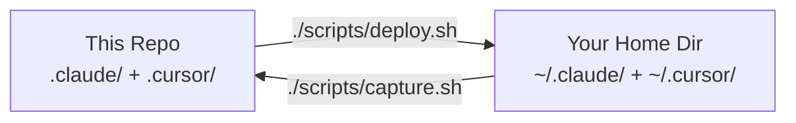

# AI Engineering Dotfiles

[](https://opensource.org/licenses/MIT)
[](https://github.com/ArangoGutierrez/promptsLibrary/actions/workflows/lint.yml)
[](https://github.com/ArangoGutierrez/promptsLibrary/actions/workflows/validate-cursor.yml)

Dotfiles for **Claude Code** and **Cursor IDE** that turn AI-assisted development
into a disciplined engineering practice. You get TDD enforcement, GPG-signed
commits, worktree isolation, and agent-driven workflows — all enforced by hooks
at the toolchain level, not just written down in a convention doc that gets
ignored. Clone, deploy, and every AI session follows the same engineering
standards automatically.

## What This Gives You

| Without This Config | With This Config |
|---------------------|-----------------|
| AI writes code directly on main | Implementation isolated in worktrees |
| No test discipline | TDD enforced — implementation blocked without failing tests |
| Unsigned commits | All commits GPG-signed with DCO signoff |
| Manual code review | Multi-agent quality gates (audit, perf, security) |
| No year validation | Current year enforced in new files |
| No guardrails on dangerous commands | Guardrails on destructive commands (confirm force-push main; block `rm -rf /`) |

## Architecture Overview

This repo is a bare mirror of your Claude Code and Cursor IDE configurations.
`deploy.sh` syncs from the repo to `~/`. `capture.sh` syncs changes made live
back into the repo. `diff.sh` shows drift between the two.



The repo layout mirrors the home directory exactly so rsync can deploy without
path translation. See the [Architecture deep-dive](docs/architecture.md) for the
agents-workbench pattern, worktree isolation model, and hook execution order.

## Quick Start

```bash
git clone https://github.com/ArangoGutierrez/promptsLibrary.git
cd promptsLibrary
./scripts/deploy.sh --dry-run  # preview changes before applying
./scripts/deploy.sh            # deploy with automatic backup
```

The deploy script rsyncs `.claude/` and `.cursor/` to your home directory.
A timestamped backup is created automatically before any files are overwritten.

See [Getting Started](docs/getting-started.md) for prerequisites, verification
steps, and first-session walkthrough.

## What's Included

### Claude Code (`.claude/`)

| Component | Count | Purpose |
|-----------|-------|---------|
| **CLAUDE.md** | 1 | Engineering standards (TDD, worktrees, iteration budgets) |
| **settings.json** | 1 | Permissions, plugin config, environment variables |
| **Hooks** | 6 | inject-date, sign-commits, prevent-push-workbench, enforce-worktree, validate-year, tdd-guard |
| **Policies** | 2 | remote-settings.json, policy-limits.json |
| **.claudeignore** | 1 | Context exclusions for large/irrelevant files |

### Cursor IDE (`.cursor/`)

| Component | Count | Purpose |
|-----------|-------|---------|
| **Agents** | 12 | researcher, auditor, arch-explorer, task-analyzer, perf-critic, api-reviewer, devil-advocate, prototyper, synthesizer, verifier, review-triager, ci-doctor |
| **Rules** | 5 | core, tdd, workbench, go, k8s (.mdc format) |
| **Hooks** | 5 | format, sign-commits, security-gate, task-loop, context-monitor |
| **Commands** | 17 | /architect, /audit, /code, /research, /review-pr, /test, and more |
| **Skills** | 5 | Cursor-native config skills (create-rule, create-skill, etc.) |
| **Schemas** | 3 | JSON schemas for hooks and state validation |

### Key Behaviors Enforced

- **TDD Guard**: Blocks implementation files without corresponding test files
- **Signed Commits**: All commits require `-s -S` (DCO + GPG)
- **Worktree Isolation**: Source code is read-only on `agents-workbench`; implementation happens in `.worktrees/`
- **Year Validation**: New files must use current year in copyright headers
- **Security Gate**: Blocks dangerous commands (`rm -rf /`, force-push to main)

## Documentation

| Document | Description |
|----------|-------------|
| [Getting Started](docs/getting-started.md) | Prerequisites, installation, verification |
| [Architecture](docs/architecture.md) | agents-workbench deep-dive with diagrams |
| [Claude Code](docs/claude-code.md) | Hooks, settings, plugins, policies |
| [Cursor](docs/cursor.md) | Agents, commands, rules, hooks |
| [Deployment](docs/deployment.md) | deploy.sh, capture.sh, diff.sh scripts |
| [Skills & Commands](docs/skills-and-commands.md) | Complete reference |

## Requirements

- **macOS or Linux** (Windows/WSL untested)
- **jq** (for hooks that parse JSON)
- **GPG** (for signed commits)
- **rsync** (for deploy/capture scripts)

## Contributing

1. Fork this repo
2. Edit configs in `.claude/` and `.cursor/` directly, or edit live and run `./scripts/capture.sh`
3. Deploy with `./scripts/deploy.sh`
4. Open a PR against `main`

## License

[MIT](LICENSE)
