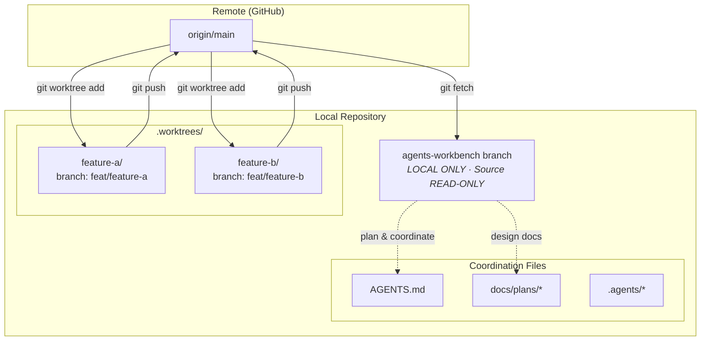

# Architecture: Agents-Workbench Deep-Dive

This document explains the agents-workbench architecture from first principles. It is written for the broader developer community, including people new to Git worktrees and hook-based enforcement.

Cross-references: [Claude Code Configuration](claude-code.md) | [Cursor Configuration](cursor.md) | [Getting Started](getting-started.md)

---

## 1. The Problem

Modern AI coding assistants — Claude Code, Cursor, GitHub Copilot — are powerful. They can write entire features, refactor large codebases, and produce reasonable code from a short prompt. But out of the box, they introduce a specific class of risks that traditional developer workflows were not designed to handle.

### What goes wrong without guardrails

**Edits land directly on main.**
An AI agent running in your working tree will happily write to any file in the repo. There is no concept of "this is the wrong branch" — the agent writes where it is told. Without isolation, features, experiments, and half-finished work all accumulate on whatever branch happens to be checked out.

**No test discipline.**
AI agents optimize for satisfying the prompt. If the prompt says "implement this feature," the agent will write implementation code. It will not spontaneously write a failing test first unless something forces it to. Left to their own devices, AI agents produce implementation-first, test-maybe-later code — exactly the pattern that TDD was designed to eliminate.

**Unsigned commits.**
Without enforcement, AI agents issue plain `git commit` commands. These commits carry no Developer Certificate of Origin (DCO) signoff and no GPG signature. In any project that requires auditability of authorship — open-source with DCO requirements, regulated industries, security-sensitive codebases — this is a compliance problem. It is also philosophically important: as AI-assisted development blurs the line between human and machine authorship, signed commits provide the only mechanical record of who took responsibility for what.

**No isolation between concurrent features.**
AI agents can run in parallel — multiple Claude Code sessions, multiple Cursor agents, all working in the same checkout. Without separate working directories, concurrent agents step on each other's work. One agent's in-progress refactor corrupts another agent's feature branch. The only safe model for concurrency is isolation at the filesystem level.

**Stale years from training data leak into copyright headers.**
AI models have a training cutoff. When writing new files with copyright headers, they frequently insert the year from their training data rather than the actual current year. For any project with license compliance requirements, this creates legally incorrect headers that must be manually audited and corrected after the fact.

### The solution: layered enforcement

This configuration solves these problems with a three-layer architecture:

1. **Isolation via worktrees.** Every feature is developed in its own Git worktree — a separate directory that shares the same `.git` database but has an independent working tree. Agents are confined to their worktree. Concurrent work is physically separated.

2. **Discipline via hooks.** Six Claude Code hooks and five Cursor hooks fire automatically on every relevant action. They enforce signed commits, TDD discipline, branch isolation, year correctness, and protection against dangerous commands. Hooks are not suggestions — they mechanically block non-compliant actions.

3. **Coordination via a read-only workbench branch.** A local-only branch called `agents-workbench` serves as the planning and coordination hub. Source code is read-only on this branch. Agents plan here and implement in worktrees. The workbench is never pushed to any remote.

The rest of this document explains each layer in detail.

---

## 2. Core Concepts

### The `agents-workbench` Branch

The `agents-workbench` branch is a local Git branch that serves as the control tower for all development activity. It has three defining properties:

**It is local-only.** The `prevent-push-workbench.sh` hook mechanically blocks any attempt to push this branch to any remote. It will never appear in your GitHub/GitLab repository. This is intentional: the workbench is ephemeral planning state, not permanent project history. Feature branches are the only thing that gets pushed.

**Source code is read-only.** The `enforce-worktree.sh` hook fires on every Write and Edit operation while on the `agents-workbench` branch. If an agent or developer attempts to edit any source file — anything that is not a coordination file — the hook blocks the operation and explains how to create a worktree instead.

The following files and directories are the only ones writable on the workbench:

- `AGENTS.md` — the coordination hub: active tasks, branch inventory, conventions
- `.agents/*` — agent configuration, plan documents
- `docs/plans/*` — design documents and implementation plans
- `CLAUDE.md` — Claude Code system prompt
- `.cursor/rules/*` — Cursor rules files
- `.cursor/AGENTS.md` — Cursor-specific agent coordination
- `.gitignore`, `.cursorrules`, `.claudeignore` — ignore and rules configs

Everything else — application code, tests, scripts, configuration files for the application itself — is blocked on the workbench. This prevents the most common accident: an AI agent editing source code while on the wrong branch.

**It is the planning hub.** Before any implementation work begins, plans are written to `docs/plans/`, task breakdowns go into `AGENTS.md`, and design decisions are documented. Only after planning is complete does work move into a worktree.

### Git Worktrees

A Git worktree is a separate working directory linked to the same Git repository. The `.git` database is shared — commits, refs, objects — but each worktree has its own independent checkout of a different branch. You can have multiple worktrees open simultaneously, each on a different branch, each with independent changes.

In this architecture, every feature is developed in its own worktree, created in the `.worktrees/` directory (which is gitignored so it does not appear in commits):

```
.worktrees/
├── feature-a/    # branch: feat/feature-a, independent working tree
├── feature-b/    # branch: feat/feature-b, independent working tree
└── bugfix-c/     # branch: fix/bugfix-c, independent working tree
```

Key properties of this layout:

- **Complete isolation.** Changes in `.worktrees/feature-a/` have no effect on `.worktrees/feature-b/`. Agents working on different features cannot interfere with each other.
- **Shared Git database.** All worktrees share the same commit history, refs, and objects. A commit pushed from one worktree is immediately visible in all others.
- **Always branched from the remote ref.** Worktrees are created with `git worktree add` pointing at the remote ref (`origin/main`, `upstream/main`), never at the local branch. This is critical: local main can become stale after force-pushes, rebases, or simple forgetting to pull. The remote ref is always the authoritative state.

### Hook Enforcement

The architecture is not just convention — it is mechanically enforced by shell scripts that run as hooks in Claude Code and Cursor. You cannot violate the architecture without explicitly disabling hooks. This matters because:

- Conventions are forgotten under deadline pressure. "Just this once" becomes the norm.
- AI agents do not know what they do not know. They cannot self-enforce discipline they were not trained to apply.
- Hooks fire automatically, every time, without requiring anyone to remember.

Claude Code hooks fire via the `hooks` section of `.claude/settings.json`. Cursor hooks are configured via `.cursor/hooks.json` and `.cursor/hooks/*` and wired into the Cursor hook system. Both sets of hooks are deployed to the appropriate config locations by `scripts/deploy.sh`.

---

## 3. Architecture Diagram



The diagram shows the information flow:

- The remote is the authoritative source. Worktrees always branch from it.
- The `agents-workbench` branch pulls from the remote (to stay current with the default branch) but never pushes.
- Feature worktrees pull from the remote and push feature branches back to it.
- The workbench coordinates planning but never pushes source code changes.

---

## 4. Lifecycle of a Feature

This section walks through the complete lifecycle of a feature using the agents-workbench workflow, from planning to merge.

### Phase 1: Plan (on `agents-workbench`)

All planning happens on the `agents-workbench` branch before any code is written.

```bash
git checkout agents-workbench
```

On this branch, you (or an AI agent) will:

1. Brainstorm at least three approaches to the problem
2. Write a design document to `docs/plans/YYYY-MM-DD-feature-name-design.md`
3. Choose an approach and document the rationale
4. Break the feature into tasks in `AGENTS.md`

The `enforce-worktree.sh` hook ensures that no source code can be written here. If an agent tries to write a `.go`, `.py`, `.ts`, or any other source file, the hook blocks the operation and prints instructions for creating a worktree. This forces the plan-first discipline.

Example design doc location: `docs/plans/2026-02-20-auth-refresh-design.md`

### Phase 2: Create Worktree (from Remote Ref)

Once planning is complete, create a worktree branched from the remote ref:

```bash
# Detect the right remote (upstream for forks, origin otherwise)
git fetch upstream 2>/dev/null && \
  BASE="upstream/$(git symbolic-ref refs/remotes/upstream/HEAD 2>/dev/null | \
  sed 's@^refs/remotes/upstream/@@' || echo main)" || \
  { git fetch origin && \
    BASE="origin/$(git symbolic-ref refs/remotes/origin/HEAD | \
    sed 's@^refs/remotes/origin/@@')"; }

git worktree add .worktrees/auth-refresh -b feat/auth-refresh "$BASE"
cd .worktrees/auth-refresh
```

**Why branch from the remote ref, not local main?**

Local branches can become stale in several ways:

- Someone force-pushed to main after a rebase. Your local `main` points to the old history.
- You are working in a fork. Your local `main` has diverged from `upstream/main`.
- You simply forgot to `git pull` before starting work.

When you branch from a stale local ref, you build on an outdated foundation. The PR will show unexpected diffs, merge conflicts arise from code that was already merged, and CI may fail against changes already in main. Branching from the remote ref — fetched immediately before worktree creation — eliminates this entire class of problem.

The detection logic handles both fork setups (where `upstream` is the authoritative remote) and direct-clone setups (where `origin` is the authoritative remote).

### Phase 3: TDD Cycle (in Worktree)

All implementation happens inside the worktree. The TDD cycle is enforced mechanically by `tdd-guard.sh`.

**[RED] — Write a Failing Test First**

Before writing any implementation code, write a test that describes the desired behavior:

```bash
# In .worktrees/auth-refresh/
# Write the test first
$EDITOR pkg/auth/refresh_test.go
```

The `tdd-guard.sh` hook watches for writes to implementation files. If you attempt to write `pkg/auth/refresh.go` before any test file has been modified in the current Git session, the hook blocks the write:

```
TDD GUARD: No test file found for implementation file.
File: pkg/auth/refresh.go

Write the failing test FIRST (Red phase), then implement.
Expected test file locations:
  pkg/auth/refresh_test.go
  pkg/auth/refresh.test.go
  pkg/auth/tests/refresh_test.go
```

Run the test to confirm it fails. This is the Red phase. A test that has never failed is a test that has never proven it can catch the bug it is supposed to catch.

**[GREEN] — Write Minimum Code to Pass**

Write the minimum implementation to make the failing test pass. Do not over-engineer. Do not add features not required by the test. The goal is green, not elegant.

```bash
$EDITOR pkg/auth/refresh.go
```

Run the tests again. All tests should now pass. The `tdd-guard.sh` hook allows the implementation write because a test file has been modified in the current session.

**Critical rule: never modify tests and implementation in the same turn.** If your implementation requires changing the test, that means the test was wrong. Stop, reconsider the design, and fix the test in a separate step before continuing with implementation.

**[REFACTOR] — Clean Up After Green**

With tests passing, clean up the implementation: improve naming, extract helpers, reduce duplication, improve error messages. Do not change behavior. Tests must still pass after refactoring.

If the refactor touches more than three files or more than fifty lines of code, checkpoint first: commit the green state before refactoring, so you can always return to a known-good point.

**Tests are contracts.** Never weaken, delete, or modify tests to make implementation fit. If a test is inconvenient, the implementation is wrong, not the test.

### Phase 4: Commit and Push

All commits must be signed. The `sign-commits.sh` hook (for both Claude Code and Cursor) blocks any `git commit` command that does not include both `-s` (DCO signoff) and `-S` (GPG signature):

```bash
git add pkg/auth/refresh.go pkg/auth/refresh_test.go
git commit -s -S -m "feat(auth): implement token refresh with retry logic"
```

If you attempt `git commit` without those flags, the hook blocks and explains:

```
Blocked: All commits must be signed. Add -s (signoff) and -S (GPG signature) flags.
Use: git commit -s -S -m "message"
```

Once commits are in place, push the feature branch and open a pull request:

```bash
git push -u origin feat/auth-refresh
gh pr create --title "feat(auth): implement token refresh with retry logic" \
  --body "$(cat <<'EOF'
## Summary
- Implements token refresh with exponential backoff retry
- Adds circuit breaker to prevent refresh storms
- All paths covered by table-driven tests

## Test plan
- [ ] Unit tests pass: `go test ./pkg/auth/...`
- [ ] Integration test with mock token server
- [ ] Manual test: let token expire, verify transparent refresh
EOF
)"
```

### Phase 5: Cleanup

After the PR is merged, remove the worktree:

```bash
cd /path/to/repo  # back to the main checkout or agents-workbench
git worktree remove .worktrees/auth-refresh
```

If the branch is no longer needed locally:

```bash
git branch -d feat/auth-refresh
```

The `.worktrees/` directory is gitignored, so there is nothing to clean up in version control.

---

## 5. Hook Enforcement Matrix

This table covers all eleven hooks across both Claude Code and Cursor, showing exactly what each one enforces and what it blocks.

| Hook | Tool | Trigger | What It Enforces | What It Blocks |
|------|------|---------|-----------------|----------------|
| `inject-date.sh` | Claude Code | `SessionStart` | Injects current date/year into context at session start | N/A (informational — provides correct year to prevent stale training-data dates) |
| `sign-commits.sh` | Claude Code | `PreToolUse` (Bash) | Requires `-s` (DCO signoff) and `-S` (GPG signature) on all commits | Any `git commit` command missing either flag |
| `prevent-push-workbench.sh` | Claude Code | `PreToolUse` (Bash) | `agents-workbench` branch stays local-only | Pushing `agents-workbench` to any remote, by name or implicitly from that branch |
| `enforce-worktree.sh` | Claude Code | `PreToolUse` (Write, Edit) | Source code is read-only on `agents-workbench` branch | Writing or editing any non-coordination file while on `agents-workbench` |
| `tdd-guard.sh` | Claude Code | `PreToolUse` (Write, Edit) | Test-first discipline: implementation requires a corresponding test | Writing implementation files when no test file has been modified in the current session |
| `validate-year.sh` | Claude Code | `PreToolUse` (Write) | New files must use the current calendar year in copyright/license headers | Creating new files with copyright headers that contain outdated years |
| `format.sh` | Cursor | `afterFileEdit` | Auto-formats files after edit (`gofmt` for Go, `jq` for JSON) | N/A (auto-corrects rather than blocking) |
| `sign-commits.sh` | Cursor | `beforeShellExecution` | Same as Claude Code: requires `-s -S` on all commits | Any `git commit` without both signoff and GPG flags |
| `security-gate.sh` | Cursor | `beforeShellExecution` | Blocks known-dangerous shell commands | `rm -rf /`, `rm -rf ~`, fork bombs, disk writes (`> /dev/sda`, `mkfs`, `dd if=/dev`); warns on force-push to main/master |
| `task-loop.sh` | Cursor | `stop` | Enforces loop iteration limit (default: 5) | Prevents infinite agent loops by stopping execution when the iteration count reaches the limit |
| `context-monitor.sh` | Cursor | `stop` | Context health tracking placeholder | N/A (placeholder implementation — continue by default, extend as needed) |

### Notes on the enforcement model

**Claude Code hooks** use an exit code contract: `exit 0` allows the operation, `exit 2` blocks it and sends stderr to Claude as feedback. This means blocked operations come with a human-readable explanation of why they were blocked and how to fix the situation. Claude reads this feedback and adjusts its behavior accordingly.

**Cursor hooks** use a JSON output contract: `{"continue": true}` allows, `{"continue": false, "error": "..."}` blocks. The `afterFileEdit` hook always continues (it auto-corrects rather than blocking). The `beforeShellExecution` hooks can block with an error or allow with an optional `permission` field that triggers a user confirmation prompt.

**The escape hatch.** The `tdd-guard.sh` hook respects the environment variable `SKIP_TDD_GUARD=1` for exceptional cases (hotfix branches, generated code, scaffold commits where tests cannot meaningfully precede the scaffolding). This should be used sparingly and with intentionality, not as a routine bypass.

---

## 6. Design Decisions and Rationale

Every architectural choice in this system was made deliberately. This section explains the reasoning behind each major decision.

### Why a local-only `agents-workbench` branch?

The workbench branch is planning and coordination state, not project history. If it were pushed to the remote, it would pollute the branch list, show up in CI, and confuse contributors who see a branch called `agents-workbench` with no obvious purpose and no corresponding work. It would also create a footgun: pushing coordination state to the remote suggests it should be reviewed, merged, or maintained as part of the project — none of which is true.

By keeping it local-only (enforced by `prevent-push-workbench.sh`), the architecture makes the workbench's purpose explicit: it is ephemeral scaffolding for the current developer's workflow, not part of the project's permanent record.

### Why branch from the remote ref?

Local branches are snapshots. The remote ref is authoritative. Between the last time you pulled and the time you start a new feature, any number of things can happen: maintainers rebase the default branch, someone force-pushes a squash merge, a CI fix lands. If you branch from stale local `main`, you are building on a foundation that the project has already moved past. Your PR will show diffs that include code already merged, your rebase will be confused, and CI may fail on things unrelated to your change.

The worktree creation command fetches from the remote immediately before creating the worktree. There is no window for staleness. This eliminates an entire class of "why is my PR showing extra commits" debugging sessions.

### Why read-only source on `agents-workbench`?

The most common mistake in a worktree-based workflow is editing the wrong directory. You intend to edit `.worktrees/my-feature/pkg/auth/refresh.go` but you accidentally edit `pkg/auth/refresh.go` in the main checkout (which is on `agents-workbench`). The change looks identical in the editor. You will not notice until you try to commit from the worktree and find the file is unmodified there.

The `enforce-worktree.sh` hook catches this accident at the point of the edit, before any damage is done. It tells you exactly what file you tried to edit and exactly how to create a worktree to edit it in. The agent (or developer) is redirected rather than frustrated.

More broadly, making the workbench read-only for source makes the architecture self-documenting: if you are on `agents-workbench`, you are in planning mode, not implementation mode.

### Why hook enforcement instead of just conventions?

Conventions fail under pressure. When a deadline is approaching and an agent (or developer) needs to just fix this one thing, the convention gets skipped "just this once." Once skipped once, it gets skipped again. Within a few weeks, the convention exists only in documentation that nobody reads.

Hooks fire automatically, without requiring anyone to remember. They encode the architecture as executable policy. You cannot skip them without deliberately disabling them — which is a conscious, auditable decision, not an accident.

This is especially important for AI agents: they have no inherent understanding of your workflow conventions. They will do whatever produces code that satisfies the prompt. Hooks are the mechanism by which workflow discipline is enforced on agents that cannot internalize it through social norms.

### Why TDD hooks?

AI coding agents are prompt-satisfying machines. If the prompt is "implement this feature," they implement the feature. They do not spontaneously write a failing test first. Without `tdd-guard.sh`, an AI agent asked to build a feature will produce implementation-first code every time.

The `tdd-guard.sh` hook makes TDD non-optional for implementation files. The agent is blocked from writing implementation until it has written a test. This is not about distrust of AI — it is about the same discipline that applies to human developers. TDD is valuable because it forces you to think about the interface and behavior before the implementation. Hooks make this discipline apply equally to agents and humans.

### Why signed commits?

Two reasons: auditability and compliance.

**Auditability.** GPG signatures provide cryptographic proof that a specific key holder authorized a specific commit. DCO signoff (`-s`) is the developer's (or agent operator's) assertion that they have the right to submit the code under the project's license. Together, they create a chain of accountability: you can trace every commit to a key holder who took responsibility for it.

**Compliance.** Many open-source projects, especially in the Linux ecosystem, require DCO signoff for legal reasons. Many regulated industries require signed commits as part of their software supply chain requirements. Enforcing this automatically means you never accidentally submit a commit that fails compliance checks, regardless of whether it is written by a human or an AI agent.

As AI-assisted development becomes the norm, the question "who wrote this?" becomes more complex. Signed commits do not answer that question completely, but they do establish who took responsibility for accepting the code. That accountability is worth preserving mechanically.

### Why `.worktrees/` gitignored?

Worktrees are developer-local working directories, not project artifacts. Their existence and naming reflect the current developer's workflow, not the project's history. Committing references to `.worktrees/` would expose local workflow state in the project repository and create noise in the git index for other contributors. Gitignoring the directory keeps the separation between project history and developer tooling clean.
