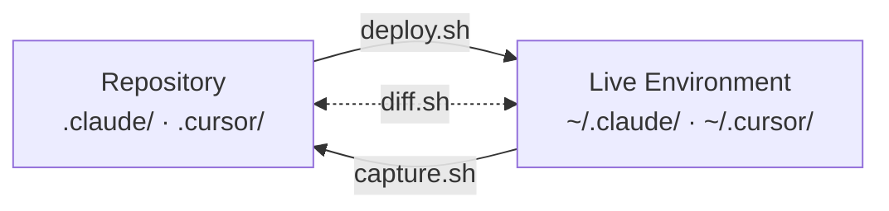

# Deployment Scripts Reference

## Overview

This repository is a bare mirror of `~/.claude/` and `~/.cursor/` — the configuration directories
for Claude Code and Cursor respectively. Three scripts manage synchronization between the repository
and the live environment on a given machine.



The three scripts and their roles:

- `scripts/deploy.sh` — pushes config from the repo into `~/`, with automatic backup and
  post-deploy verification.
- `scripts/capture.sh` — pulls config from `~/` back into the repo so changes made in the live
  environment can be reviewed and committed.
- `scripts/diff.sh` — compares the repo against the live environment without modifying either,
  reporting files that are repo-only, live-only, or differ in content.

**Typical workflows:**

Edit in the live environment first, then bring changes into version control:

```
edit ~/.claude/ or ~/.cursor/  →  capture.sh  →  git diff  →  git add -p  →  commit  →  push
```

Edit in the repo first, then push to the live environment:

```
edit repo  →  deploy.sh --dry-run  →  deploy.sh  →  verify output
```

All three scripts share the same exclude lists (see [Exclude Lists](#exclude-lists)) so that
runtime state, caches, and machine-specific files are never synced in either direction.

---

## deploy.sh

Rsyncs `.claude/` and `.cursor/` from the repository into `~/`. Before overwriting any files,
the script creates a timestamped backup tarball of the existing live directories, so you can
roll back if needed.

After the sync completes, the script runs a verification pass that checks:

- Key files are present (`~/.claude/settings.json`, `~/.claude/CLAUDE.md`,
  `~/.cursor/mcp.json`, `~/.cursor/rules`).
- All hook scripts under `~/.claude/hooks/` and `~/.cursor/hooks/` are executable.
- JSON config files (`settings.json`, `policy-limits.json`, `remote-settings.json`,
  `mcp.json`, `hooks.json`) parse without errors using `python3`.

Verification only runs on a real deploy, not during `--dry-run`.

### Backup behaviour

The backup is created at `~/.config/dotfiles-backup/dotfiles-backup-<YYYYMMDD-HHMMSS>.tar.gz`
and captures exactly the directories that will be overwritten (`.claude/`, `.cursor/`, or both
depending on scope flags). Pass `--force` to skip the backup step.

### Flags

| Flag | Effect |
|------|--------|
| `--dry-run` | Preview changes without applying them |
| `--force` | Skip the automatic backup step |
| `--claude-only` | Deploy only `.claude/` configuration |
| `--cursor-only` | Deploy only `.cursor/` configuration |
| `--no-plugins` | Skip `plugins/` directory from `.claude/` deployment |
| `--delete` | Pass `--delete` to rsync (removes files in `~/` not in repo — use with caution) |

`--claude-only` and `--cursor-only` are mutually exclusive.

### Examples

```bash
./scripts/deploy.sh --dry-run      # see what would change
./scripts/deploy.sh                # full deploy with backup
./scripts/deploy.sh --claude-only  # only update Claude Code config
./scripts/deploy.sh --force        # deploy without creating a backup
./scripts/deploy.sh --delete       # sync exactly — remove live files absent from repo
```

---

## capture.sh

The reverse of deploy: rsyncs `~/.claude/` and `~/.cursor/` from the live environment back into
the repository working tree. Nothing is committed automatically — the intent is to stage and
review changes with `git diff` before deciding what to commit.

### Symlink resolution

capture.sh passes `--copy-links` to rsync. This is important because some files in `~/.cursor/`
(notably command scripts) may be symlinks. `--copy-links` dereferences them, so the repo stores
the actual file content rather than a dangling symlink.

### Flags

| Flag | Effect |
|------|--------|
| `--claude-only` | Capture only `.claude/` |
| `--cursor-only` | Capture only `.cursor/` |

`--claude-only` and `--cursor-only` are mutually exclusive.

### Workflow after capture

```bash
./scripts/capture.sh              # capture both
git diff                          # review what changed
git add -p                        # stage selectively
git commit -s -S -m "config: update settings"
```

---

## diff.sh

Compares the repository config against the live environment and reports any differences, without
modifying either side. This is useful as a pre-deploy sanity check, for CI drift detection, or
to verify that a capture run picked up everything.

### Output categories

Each file that is not identical in both places is reported under one of three labels:

| Label | Meaning |
|-------|---------|
| `REPO ONLY` | File exists in the repo but not in the live environment |
| `CHANGED` | File exists in both places but the contents differ |
| `LIVE ONLY` | File exists in the live environment but not in the repo |

A per-directory summary line shows the count in each category. If everything matches, the
section prints `(in sync)`.

### Exit codes

| Code | Meaning |
|------|---------|
| `0` | Everything in sync |
| `1` | One or more differences found |

### Flags

| Flag | Effect |
|------|--------|
| `--claude-only` | Compare only `.claude/` |
| `--cursor-only` | Compare only `.cursor/` |

### Examples

```bash
./scripts/diff.sh                 # compare everything
./scripts/diff.sh --cursor-only   # just check Cursor config
echo $?                           # 0 = in sync, 1 = differences
```

---

## Exclude Lists

All three scripts use the same exclude lists, so runtime state is consistently ignored regardless
of which direction data is flowing. Files and directories that match these patterns are never
synced, captured, or compared.

### Claude excludes

| Pattern | Reason |
|---------|--------|
| `debug/` | Runtime debug logs |
| `projects/` | Claude project-specific state |
| `teams/`, `tasks/`, `todos/`, `team/` | Runtime team/task state |
| `cache/`, `plugins/cache/` | Downloaded plugin caches |
| `plugins/known_marketplaces.json`, `plugins/marketplaces/` | Marketplace registry cache |
| `file-history/` | Claude file edit history |
| `session-env/`, `shell-snapshots/` | Session-specific environment state |
| `paste-cache/` | Clipboard paste cache |
| `telemetry/` | Telemetry data |
| `backups/` | Local backup archives |
| `ide/` | IDE integration state |
| `history.jsonl` | Conversation history |
| `stats-cache.json` | Usage statistics |
| `settings.local.json` | Machine-specific overrides (not portable) |
| `plans/` | Runtime plan state |
| `commands/` | Runtime commands |
| `docs/` | Documentation (managed separately in repo root) |

### Cursor excludes

| Pattern | Reason |
|---------|--------|
| `extensions/` | Cursor extension state |
| `projects/` | Project-specific Cursor state |
| `ai-tracking/`, `snapshots/` | AI session tracking data |
| `ide_state.json` | Window and editor layout state |
| `argv.json` | Launch arguments |
| `unified_repo_list.json` | Cursor's internal repo registry |
| `worktrees/` | Runtime worktree tracking |
| `blocklist` | Runtime blocklist |
| `.deploy-version` | Deployment versioning marker |
| `docs/` | Documentation (managed separately in repo root) |
| `skills/` | Runtime skill state |
